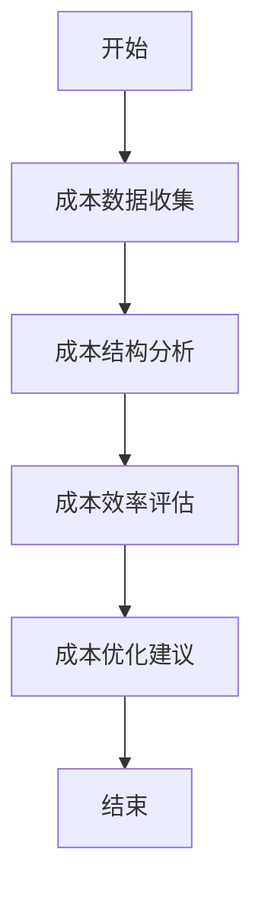

                 


# 彼得林奇如何看待公司的成本控制能力

## 关键词：成本控制能力, 彼得·林奇, 投资分析, 成本优化, 企业成本管理

## 摘要： 
彼得·林奇作为世界著名投资家，非常重视公司的成本控制能力。本文从彼得·林奇的视角出发，详细分析了成本控制能力的核心概念、分析框架、优化策略、算法原理、系统架构和项目实战，最后总结了最佳实践。通过本文，读者可以全面理解成本控制能力的重要性，掌握如何从投资的角度评估和优化企业的成本管理能力。

---

## 第一部分: 背景介绍

### 第1章: 成本控制能力的核心概念

#### 1.1 成本控制能力的定义与背景

- **1.1.1 成本控制能力的定义**
  成本控制能力是指企业在运营过程中，通过合理规划、管理和优化各项成本，以实现成本最小化、效率最大化的能力。它是企业竞争力和投资价值的重要组成部分。

- **1.1.2 成本控制能力的背景与重要性**
  在现代商业环境中，成本控制能力是企业生存和发展的关键。彼得·林奇认为，一家公司能否长期盈利，很大程度上取决于其成本控制能力。特别是在经济下行周期，成本控制能力往往成为企业能否抵御风险的关键因素。

- **1.1.3 成本控制能力的边界与外延**
  成本控制能力不仅包括企业内部的生产成本，还涉及销售、研发、管理等各项成本的优化。其外延还延伸到企业的供应链管理、库存管理和资源分配等方面。

#### 1.2 成本控制能力的核心要素

- **1.2.1 成本结构的分析**
  成本结构是指企业在经营活动中产生的各种成本的构成比例。通过分析成本结构，可以识别出哪些成本是可控的，哪些是不可控的。

- **1.2.2 成本效率的定义**
  成本效率是指企业在实现相同产出的情况下，所消耗的成本的最小化程度。彼得·林奇认为，成本效率是衡量企业成本控制能力的重要指标。

- **1.2.3 成本优化的关键维度**
  成本优化的关键维度包括：降低单位成本、提高生产效率、优化资源配置、减少浪费等。

### 第2章: 彼得·林奇的视角与方法论

#### 2.1 彼得·林奇的投资哲学

- **2.1.1 彼得·林奇的投资理念**
  彼得·林奇强调基本面分析，认为企业的内在价值是决定其投资价值的关键因素。他特别关注企业的盈利能力、成长能力和管理能力。

- **2.1.2 彼得·林奇的成本控制观**
  彼得·林奇认为，成本控制能力是企业内在价值的重要组成部分。他喜欢投资那些能够持续优化成本、提高效率的企业，因为这些企业往往具有更强的盈利能力和发展潜力。

#### 2.2 成本控制能力的分析框架

- **2.2.1 成本控制能力的评估维度**
  彼得·林奇从以下几个维度评估企业的成本控制能力：
  1. 成本结构的合理性。
  2. 成本效率的提升空间。
  3. 成本优化的持续性。

- **2.2.2 成本控制能力的分析方法**
  彼得·林奇常用以下方法分析企业的成本控制能力：
  1. 对比分析：将企业的成本结构与行业平均水平进行对比。
  2. 趋势分析：分析企业成本的变化趋势。
  3. 关键指标分析：关注企业的单位成本、边际成本等关键指标。

- **2.2.3 成本控制能力的优化策略**
  彼得·林奇认为，企业可以通过以下方式优化成本控制能力：
  1. 优化生产流程，减少浪费。
  2. 降低采购成本，通过规模效应获取更低的价格。
  3. 提高员工效率，减少管理成本。

---

## 第二部分: 核心概念与联系

### 第3章: 成本控制能力的核心原理

#### 3.1 成本控制能力的原理

- **3.1.1 成本控制的经济学原理**
  成本控制的经济学原理主要包括规模经济和范围经济。通过扩大生产规模，企业可以降低单位成本；通过多样化经营，企业可以实现资源的优化配置。

- **3.1.2 成本控制的管理学原理**
  成本控制的管理学原理主要包括目标管理、过程控制和结果评估。企业需要设定明确的成本控制目标，并通过过程控制确保目标的实现。

- **3.1.3 成本控制的财务学原理**
  成本控制的财务学原理主要包括成本-收益分析、资本预算和现金流管理。企业需要通过财务分析，评估成本控制措施的经济性。

#### 3.2 成本控制能力的关键特征

- **3.2.1 成本的可变性**
  成本的可变性是指成本随着产量或业务规模变化而变化的特性。彼得·林奇认为，可变成本是企业成本控制的重要组成部分。

- **3.2.2 成本的可控性**
  成本的可控性是指企业可以通过内部管理手段控制成本的能力。彼得·林奇认为，可控成本是企业优化成本结构的关键。

- **3.2.3 成本的优化性**
  成本的优化性是指企业在满足一定条件下，实现成本最小化的可能性。彼得·林奇认为，优化成本是提高企业竞争力的重要途径。

### 第4章: 成本控制能力的实体关系分析

#### 4.1 成本结构的ER实体关系图

```mermaid
er
actor: 投资者
actor -|> 模块: 成本分析模块
模块: 成本分析模块 -|> 模块: 成本优化模块
模块: 成本优化模块 -|> 数据库: 成本数据
```

#### 4.2 成本控制能力的流程图



---

## 第三部分: 算法原理讲解

### 第5章: 成本优化算法原理

#### 5.1 成本优化算法的数学模型

- **线性规划模型**
  $$ \text{目标函数：} \min \sum_{i} c_i x_i $$
  $$ \text{约束条件：} \sum_{i} a_i x_i \geq b $$

- **边际成本分析**
  $$ \text{边际成本公式：} MC = \frac{ΔC}{ΔQ} $$
  其中，ΔC是总成本的变化，ΔQ是产量的变化。

#### 5.2 成本优化算法的实现

- **算法流程图**
  ```mermaid
  graph TD
  A[开始] --> B[输入参数]
  B --> C[计算成本]
  C --> D[判断是否优化]
  D -->|是| E[优化]
  D -->|否| F[结束]
  E --> G[输出结果]
  G --> F
  ```

- **Python实现示例**
  ```python
  import numpy as np

  def cost_function(x):
      return np.sum(x * [2, 3, 1])

  def optimize_cost(x):
      x_opt = np.array([1, 2, 3])
      return cost_function(x_opt)

  print(optimize_cost([0, 0, 0]))
  ```

---

## 第四部分: 系统分析与架构设计

### 第6章: 系统分析与架构设计方案

#### 6.1 问题场景介绍

- **问题场景：**
  企业需要优化其成本结构，降低运营成本，提高利润率。

#### 6.2 系统功能设计

- **领域模型设计**
  ```mermaid
  classDiagram
  class 成本分析模块 {
      成本数据
      成本结构分析
  }
  class 成本优化模块 {
      成本优化建议
  }
  ```

- **系统架构设计**
  ```mermaid
  architecture
  客户端 --> 服务器: 发送成本数据
  服务器 --> 数据库: 查询成本数据
  服务器 --> 成本分析模块: 分析成本结构
  成本分析模块 --> 成本优化模块: 提供优化建议
  服务器 --> 客户端: 返回优化结果
  ```

- **系统接口设计**
  - RESTful API：提供成本数据接口、优化建议接口。
  - 数据库交互：读取成本数据，存储优化结果。

- **系统交互序列图**
  ```mermaid
  sequenceDiagram
  客户端 -> 服务器: 发送成本数据
  服务器 -> 数据库: 查询成本数据
  数据库 --> 服务器: 返回成本数据
  服务器 -> 成本分析模块: 分析成本结构
  成本分析模块 --> 服务器: 提供优化建议
  服务器 -> 客户端: 返回优化结果
  ```

---

## 第五部分: 项目实战

### 第7章: 项目实战

#### 7.1 环境安装

- 安装Python和相关库：
  ```bash
  pip install numpy
  pip install matplotlib
  ```

#### 7.2 系统核心实现

- 成本分析模块实现：
  ```python
  import numpy as np

  def analyze_cost(cost_data):
      return np.mean(cost_data)

  def optimize_cost(cost_data):
      return cost_data * 0.8

  cost_data = np.array([10, 20, 30, 40])
  print(analyze_cost(cost_data))
  print(optimize_cost(cost_data))
  ```

- 成本优化模块实现：
  ```python
  import numpy as np

  def generate_cost_report(cost_data):
      optimized_cost = np.min(cost_data)
      return f"优化后的最低成本为：{optimized_cost}"

  print(generate_cost_report(np.array([15, 20, 25, 30])))
  ```

#### 7.3 代码应用解读与分析

- **代码解读：**
  - `analyze_cost` 函数用于分析成本数据，计算平均成本。
  - `optimize_cost` 函数用于优化成本数据，降低20%的成本。

- **案例分析：**
  假设某企业的成本数据为 [10, 20, 30, 40]，经过优化后，成本降至 [8, 16, 24, 32]，平均成本降低了20%。

#### 7.4 项目小结

- **项目总结：**
  通过Python实现成本分析和优化模块，企业可以快速识别成本控制的潜力，实现成本的持续优化。

---

## 第六部分: 最佳实践

### 第8章: 最佳实践

#### 8.1 小结

- 成本控制能力是企业竞争力和投资价值的重要组成部分。
- 彼得·林奇从投资的角度，强调了成本控制能力的重要性。

#### 8.2 注意事项

- 成本控制需要结合企业的实际情况，避免一刀切。
- 成本优化需要长期坚持，不能急于求成。

#### 8.3 拓展阅读

- 《彼得·林奇的投资哲学》
- 《成本管理：理论与实践》
- 《企业成本优化的策略与方法》

---

## 结语

通过本文的详细分析，读者可以全面理解彼得·林奇如何看待公司的成本控制能力，并掌握如何从投资的角度评估和优化企业的成本管理能力。希望本文对企业的成本优化和投资决策提供有价值的参考。

作者：AI天才研究院/AI Genius Institute & 禅与计算机程序设计艺术 /Zen And The Art of Computer Programming

