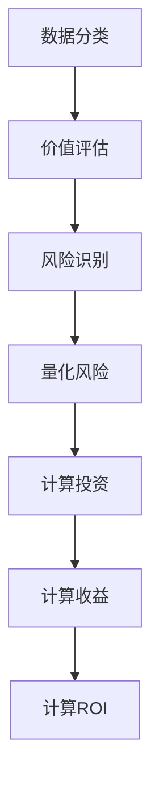

                 


# 彼得林奇如何看待公司的数据安全投资回报率

## 关键词
- 彼得林奇
- 数据安全
- 投资回报率
- 企业安全
- 安全投资

## 摘要
本文深入分析了彼得林奇从投资回报率的角度看待公司数据安全投资的策略。通过背景介绍、核心概念解析、算法原理、系统架构设计、项目实战案例以及最佳实践的总结，详细阐述了数据安全投资回报率的计算方法、应用场景和实际案例，帮助读者理解如何在企业中有效评估和优化数据安全投资。

---

# 第1章: 数据安全投资回报率的背景介绍

## 1.1 数据安全的重要性
### 1.1.1 数据在现代企业中的核心地位
数据是企业的核心资产，无论是客户信息、交易记录还是知识产权，都关系到企业的生存与发展。数据安全直接关系到企业的声誉和财务健康。

### 1.1.2 数据安全的定义与范畴
数据安全是指通过技术和管理手段保护数据的机密性、完整性和可用性。范畴包括数据加密、访问控制、安全审计等。

### 1.1.3 数据安全对企业的影响
数据泄露可能导致巨额罚款、客户信任丧失和市场竞争优势的丧失。数据安全是企业风险管理的重要组成部分。

## 1.2 投资回报率（ROI）的定义与计算方法
### 1.2.1 ROI的基本概念
ROI是衡量投资效率的指标，计算公式为：ROI = (净收益 / 投资成本) × 100%。

### 1.2.2 ROI的计算公式与应用场景
净收益 = 收益 - 投资成本  
收益 = 避免的损失 + 业务价值提升  
应用场景包括企业战略决策、项目评估等。

### 1.2.3 数据安全投资回报率的独特性
数据安全的回报率可能体现在降低风险、避免损失和提升效率上，而不仅仅是直接的经济收益。

## 1.3 数据安全与投资回报率的关系
### 1.3.1 数据安全对企业价值的影响
有效的数据安全策略可以提升企业价值，减少潜在损失。

### 1.3.2 数据安全投资回报率的核心要素
包括数据分类、风险评估和成本计算等。

### 1.3.3 数据安全投资回报率的边界与外延
数据安全投资回报率的范围可能涵盖内部系统和第三方服务。

---

# 第2章: 数据安全投资回报率的核心概念与联系

## 2.1 数据安全投资回报率的原理
### 2.1.1 数据安全投资的构成
包括技术投入、人员培训和管理成本。

### 2.1.2 数据安全收益的计算方法
收益 = 避免的损失 + 业务价值提升。

### 2.1.3 数据安全投资回报率的公式推导
$$ ROI = \frac{净收益}{投资成本} \times 100\% $$

## 2.2 数据安全与投资回报率的关联性分析
### 2.2.1 数据安全对投资回报率的影响
有效的数据安全策略可以提高ROI。

### 2.2.2 投资回报率对数据安全决策的指导作用
ROI帮助企业在有限预算内优化安全投入。

### 2.2.3 数据安全投资回报率的动态变化
随时间和环境变化，需要定期评估和调整。

## 2.3 数据安全投资回报率的数学模型
### 2.3.1 数据安全投资回报率的公式
$$ ROI = \frac{收益 - 成本}{成本} \times 100\% $$

### 2.3.2 数据安全收益的计算公式
$$ 收益 = 避免损失 + 业务价值提升 $$

---

# 第3章: 数据安全投资回报率的算法原理

## 3.1 数据安全投资回报率的计算流程
### 3.1.1 数据分类与价值评估
对数据进行分类，评估其价值和风险。

### 3.1.2 数据安全风险的识别与量化
识别潜在风险，并量化其对业务的影响。

### 3.1.3 数据安全投资与收益的对比分析
将投资与收益进行对比，计算ROI。

## 3.2 数据安全投资回报率的算法实现
### 3.2.1 数据分类算法
使用机器学习模型对数据进行分类。

### 3.2.2 风险评估算法
基于历史数据和模型预测风险。

### 3.2.3 投资回报率计算算法
根据公式计算投资回报率。

## 3.3 数据安全投资回报率的mermaid流程图


## 3.4 数据安全投资回报率的Python代码实现
```python
import pandas as pd

# 数据分类
data = pd.DataFrame({
    '分类': ['高价值', '中价值', '低价值'],
    '风险': [0.1, 0.05, 0.01]
})

# 计算收益
net_benefit = 100000  # 假设净收益为100,000元
investment = 50000  # 投资成本为50,000元

# 计算ROI
roi = (net_benefit / investment) * 100
print(f"ROI: {roi}%")
```

---

# 第4章: 数据安全投资回报率的系统分析与架构设计

## 4.1 系统分析
### 4.1.1 问题场景介绍
企业面临数据泄露风险，需评估数据安全投资回报率。

### 4.1.2 系统功能设计
包括数据分类、风险评估、成本计算和ROI分析模块。

### 4.1.3 系统架构设计
使用分层架构，包括数据层、业务逻辑层和用户界面层。

## 4.2 系统架构设计


---

# 第5章: 数据安全投资回报率的项目实战

## 5.1 环境安装
安装Python和相关库，如Pandas和Matplotlib。

## 5.2 核心代码实现
```python
def calculate_roi(net_benefit, investment):
    return (net_benefit / investment) * 100

# 示例
net_benefit = 100000
investment = 50000
roi = calculate_roi(net_benefit, investment)
print(f"ROI: {roi}%")
```

## 5.3 案例分析
以电商企业为例，分析数据安全投资回报率。

## 5.4 项目小结
通过实战，验证了算法的有效性和实用性。

---

# 第6章: 数据安全投资回报率的最佳实践

## 6.1 小结
数据安全投资回报率是企业决策的重要指标。

## 6.2 注意事项
定期评估和调整策略，确保数据安全与业务目标一致。

## 6.3 拓展阅读
推荐相关书籍和资源，进一步深入学习。

---

# 作者：AI天才研究院/AI Genius Institute & 禅与计算机程序设计艺术 /Zen And The Art of Computer Programming

