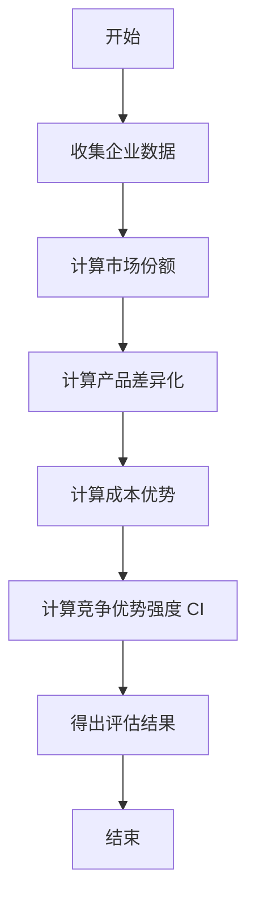
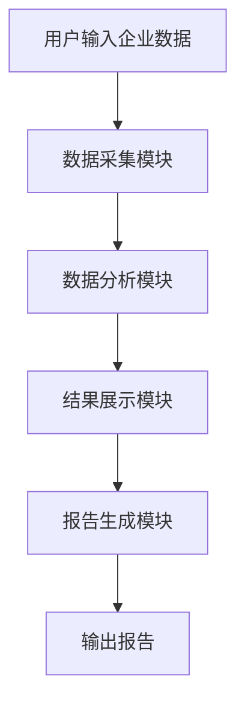
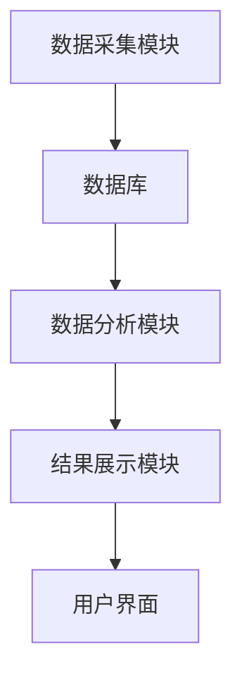
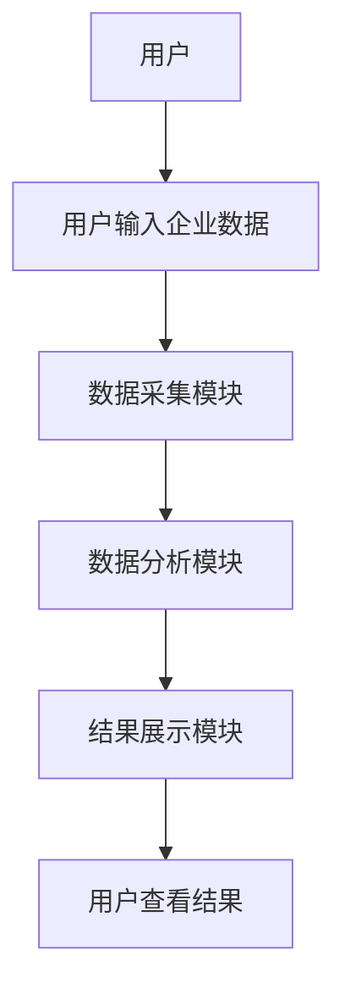

                 

<think>
好，我现在需要帮用户设计一本名为《彼得林奇如何看待公司的竞争策略》的目录大纲。用户希望我作为目录大纲设计大师，根据书名，设计出一本完整且逻辑清晰的目录。

首先，我应该考虑这本书的核心主题是彼得·林奇对竞争策略的看法。彼得·林奇是著名的投资专家，因此这本书可能从投资角度分析公司的竞争策略。我需要确保目录涵盖背景介绍、核心概念、算法原理、系统架构、项目实战以及最佳实践等部分。

接下来，我应该确定目录的结构。通常，书籍分为几个部分，每一部分包含几个章节。用户提供的示例显示，每个部分有5-6章，所以我需要设计至少7章，每章下有多个小节。

第一部分应该是背景介绍，包括竞争策略的基本概念和彼得·林奇的投资理念。这样读者可以了解基本概念和彼得·林奇的背景。然后，核心概念部分需要详细分析竞争优势、市场定位和核心竞争力，可能包括对比分析和图表，如ER图或流程图。

接下来，算法部分可能需要讨论企业竞争优势的评估方法，比如SWOT分析或PEST分析，用mermaid流程图展示步骤。数学模型可能涉及企业价值评估，如市盈率、市净率等，用公式表示。

系统分析部分需要设计一个企业竞争策略分析的系统架构，包括功能模块和架构图。项目实战部分则需要实际案例分析，比如分析微软的竞争策略，从市场定位、产品创新、成本控制等方面展开。

最后，最佳实践部分包括小结、注意事项和拓展阅读，帮助读者巩固所学内容。整个目录需要结构清晰，逻辑连贯，确保涵盖所有必要的知识点。

现在，我需要将这些思考转化为具体的目录结构，确保每一部分都细化到三级目录，并且内容完整。同时，要注意格式的正确性，使用markdown，并且在必要时嵌入mermaid图表和latex公式。

总结一下，我需要设计一个包含背景、核心概念、算法、系统分析、项目实战和最佳实践的目录，每部分详细展开，确保内容全面且结构合理。
</think>

# 彼得林奇如何看待公司的竞争策略

## 关键词：彼得林奇, 竞争策略, 企业分析, 投资理念, 竞争优势

## 摘要：本文深入探讨了彼得·林奇如何从投资和商业分析的角度看待公司的竞争策略。通过分析竞争策略的核心要素、竞争优势的来源以及如何量化评估企业优势，结合数学模型和实际案例，本文提供了全面的见解，帮助读者理解彼得·林奇的竞争策略分析框架。

---

# 第一部分: 竞争策略的基本概念

## 第1章: 竞争策略的定义与背景

### 1.1 竞争策略的核心概念

#### 1.1.1 竞争策略的定义与背景

竞争策略是指企业在市场中通过提供独特的产品或服务，以获得相对于竞争对手的优势。它包括市场定位、产品差异化、成本控制等多个方面。

#### 1.1.2 竞争策略的背景与重要性

在现代商业环境中，竞争策略是企业生存和发展的关键。企业需要通过竞争策略来应对市场变化和竞争对手的挑战。

#### 1.1.3 竞争策略与企业发展的关系

竞争策略直接影响企业的市场份额、盈利能力和发展潜力。有效的竞争策略能够帮助企业在市场中占据优势地位。

### 1.2 彼得·林奇的投资理念概述

#### 1.2.1 彼得·林奇的投资者身份

彼得·林奇是著名的投资专家，他通过长期投资和深入分析企业基本面来寻找投资机会。

#### 1.2.2 彼得·林奇的投资哲学

彼得·林奇强调长期投资、价值发现和对公司基本面的深入分析。他认为，企业的竞争策略是决定其投资价值的重要因素。

#### 1.2.3 彼得·林奇的竞争策略分析框架

彼得·林奇从投资者的角度，分析企业的竞争策略，关注企业的竞争优势、市场定位和盈利能力。

### 1.3 竞争策略的核心要素

#### 1.3.1 市场定位与目标客户

企业需要明确自己的市场定位，找到目标客户，并通过满足客户需求来建立竞争优势。

#### 1.3.2 产品差异化与竞争优势

产品差异化是企业竞争策略的核心。通过提供独特的产品或服务，企业可以在市场中获得竞争优势。

#### 1.3.3 成本控制与盈利能力

成本控制是企业竞争策略的重要组成部分。通过降低生产成本，企业可以提高利润率，增强竞争力。

---

# 第二部分: 竞争策略的核心分析框架

## 第2章: 企业竞争优势的来源

### 2.1 核心竞争力的定义与特征

#### 2.1.1 核心竞争力的定义

核心竞争力是指企业在市场上提供独特价值的能力，通常涉及企业的核心技术、资源和能力。

#### 2.1.2 核心竞争力的特征对比

核心竞争力具有独特性、可持续性和可扩展性等特点，能够为企业提供长期的竞争优势。

#### 2.1.3 核心竞争力与竞争优势的区别

竞争优势是指企业在某一时期内相对于竞争对手的优势，而核心竞争力是企业长期竞争优势的来源。

### 2.2 市场定位与差异化策略

#### 2.2.1 市场定位的定义与步骤

市场定位是企业在目标市场中确定自身位置的过程，包括目标市场选择、竞争对手分析和市场定位策略的制定。

#### 2.2.2 差异化策略的类型

差异化策略包括产品差异化、服务差异化和形象差异化等，帮助企业从竞争对手中脱颖而出。

#### 2.2.3 彼得·林奇视角下的市场定位分析

彼得·林奇认为，市场定位是企业竞争策略的核心，他通过分析企业的市场定位来评估其投资价值。

### 2.3 成本控制与规模经济

#### 2.3.1 成本控制的定义与方法

成本控制是指企业通过优化生产和管理流程，降低生产成本，提高效率。

#### 2.3.2 规模经济的实现途径

规模经济是通过扩大生产规模，降低单位产品的成本，提高竞争力。

#### 2.3.3 彼得·林奇对成本控制的看法

彼得·林奇认为，有效的成本控制是企业长期盈利能力的重要保障，他倾向于投资那些能够持续降低成本的企业。

### 2.4 核心竞争力与企业生命周期的关系

#### 2.4.1 企业生命周期的阶段划分

企业生命周期包括初创期、成长期、成熟期和衰退期，每个阶段的竞争策略不同。

#### 2.4.2 核心竞争力在不同阶段的作用

核心竞争力在企业生命周期中起着关键作用，尤其是在成长期和成熟期，能够帮助企业保持竞争优势。

#### 2.4.3 保持核心竞争力的策略

企业需要不断创新和优化，通过技术升级、市场拓展和管理改进来保持核心竞争力。

---

# 第三部分: 竞争策略的数学模型与算法原理

## 第3章: 竞争优势的量化评估

### 3.1 企业竞争优势的评估指标

#### 3.1.1 市盈率（P/E）

市盈率是衡量企业股票价格与每股收益的比率，反映市场对企业价值的评估。

#### 3.1.2 市净率（P/B）

市净率是衡量企业股票价格与每股净资产的比率，反映企业资产的市场价值。

#### 3.1.3 净资产收益率（ROE）

净资产收益率是衡量企业盈利能力的重要指标，反映企业利用股东资产创造利润的能力。

### 3.2 竞争优势的数学模型

#### 3.2.1 企业价值评估模型

企业价值评估模型是通过对企业未来现金流的折现来评估企业整体价值的数学模型。

$$ EV = \frac{EBIT \times (1 + g)}{WACC - g} $$

其中，EV是企业价值，EBIT是息税前利润，g是增长率，WACC是加权平均资本成本。

#### 3.2.2 竞争优势强度模型

竞争优势强度模型是通过对企业核心竞争力、市场份额和成本优势的综合评估来衡量企业竞争优势强度的模型。

$$ CI = \frac{市场份额 + 产品差异化 + 成本优势}{3} $$

其中，CI是竞争优势强度，市场份额、产品差异化和成本优势分别以百分比形式表示。

### 3.3 竞争优势的算法实现

#### 3.3.1 竞争优势评估的步骤

1. 收集企业数据，包括市场份额、产品差异化和成本优势。
2. 计算市场份额、产品差异化和成本优势的百分比。
3. 计算竞争优势强度（CI）。
4. 分析竞争优势强度，得出评估结果。

#### 3.3.2 算法流程图（使用 mermaid）



---

# 第四部分: 竞争策略的系统分析与架构设计

## 第4章: 企业竞争策略分析系统

### 4.1 系统功能设计

#### 4.1.1 系统功能模块

企业竞争策略分析系统包括数据采集、数据分析、结果展示和报告生成四个功能模块。

#### 4.1.2 系统功能流程图（使用 mermaid）



### 4.2 系统架构设计

#### 4.2.1 系统架构图（使用 mermaid）



#### 4.2.2 系统接口设计

系统接口包括数据输入接口、数据处理接口和结果输出接口。

### 4.3 系统交互设计

#### 4.3.1 系统交互流程图（使用 mermaid）



---

# 第五部分: 项目实战与案例分析

## 第5章: 企业竞争策略分析实战

### 5.1 项目介绍

本项目旨在通过实际案例分析，展示如何应用彼得·林奇的竞争策略分析框架来评估企业的竞争策略。

### 5.2 项目核心实现

#### 5.2.1 竞争优势评估指标

$$ CI = \frac{市场份额 + 产品差异化 + 成本优势}{3} $$

#### 5.2.2 项目核心代码

```python
def calculate_competitive_strength(share, differentiation, cost):
    return (share + differentiation + cost) / 3

# 示例数据
share = 80
differentiation = 70
cost = 60

CI = calculate_competitive_strength(share, differentiation, cost)
print("竞争优势强度 CI =", CI)
```

### 5.3 案例分析

#### 5.3.1 案例背景

以微软公司为例，分析其竞争策略。

#### 5.3.2 市场定位与产品差异化

微软通过提供创新的软件产品和云服务，占据了全球市场的领先地位。

#### 5.3.3 成本控制与盈利能力

微软通过规模经济和高效管理，保持了较高的盈利能力。

### 5.4 实战小结

通过实际案例分析，展示了彼得·林奇的竞争策略分析框架在实际应用中的有效性。

---

# 第六部分: 竞争策略分析的优化与总结

## 第6章: 竞争策略分析的优化

### 6.1 竞争策略分析的改进方向

#### 6.1.1 提高数据分析的准确性

通过引入更多的数据源和更复杂的算法，提高竞争优势评估的准确性。

#### 6.1.2 引入实时数据监测

通过实时监测市场变化和竞争对手动态，及时调整竞争策略。

### 6.2 竞争策略分析的未来趋势

#### 6.2.1 数据驱动的决策

未来的竞争策略分析将更加依赖于大数据和人工智能技术，通过数据驱动的决策提高竞争策略的有效性。

#### 6.2.2 可视化工具的应用

可视化工具将帮助企业更直观地展示竞争策略分析的结果，提高决策效率。

---

# 第七部分: 竞争策略分析的最佳实践

## 第7章: 竞争策略分析的注意事项

### 7.1 竞争策略分析的关键点

#### 7.1.1 理解企业的核心竞争力

准确识别企业核心竞争力是制定有效竞争策略的前提。

#### 7.1.2 关注市场变化

及时关注市场变化和竞争对手动态，灵活调整竞争策略。

### 7.2 竞争策略分析的误区

#### 7.2.1 过度关注短期利益

竞争策略分析应注重长期发展，避免过度关注短期利益。

#### 7.2.2 忽视成本控制

成本控制是企业竞争策略的重要组成部分，忽视成本控制可能导致企业利润下降。

### 7.3 竞争策略分析的小结

有效的竞争策略分析需要综合考虑企业核心竞争力、市场定位和成本控制等多个方面，帮助企业制定科学合理的竞争策略。

---

# 结语

通过本文的探讨，我们深入了解了彼得·林奇如何看待公司的竞争策略。从核心概念到数学模型，从系统设计到项目实战，我们全面分析了竞争策略的各个方面。希望本文能够为读者在竞争策略分析领域提供有价值的见解和指导。

---

# 作者：AI天才研究院/AI Genius Institute & 禅与计算机程序设计艺术 /Zen And The Art of Computer Programming

