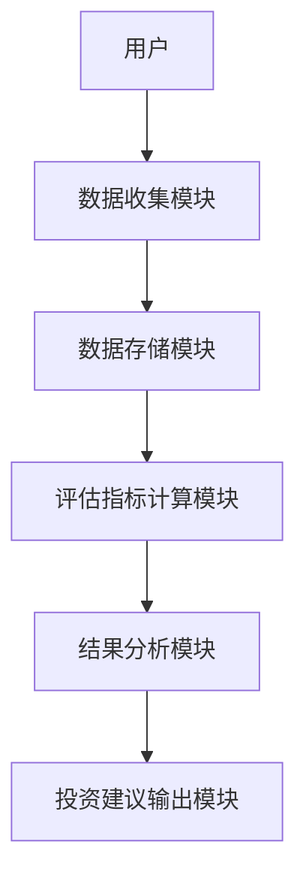
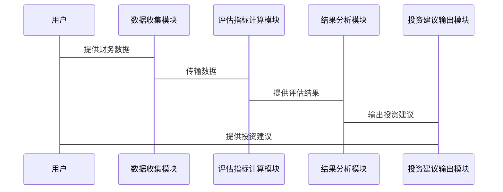

                 

<think>
好的，我需要帮助用户撰写一篇关于“彼得·林奇如何看待公司的股东回报政策”的技术博客文章。用户已经提供了详细的要求，包括文章结构、内容深度、格式等。

首先，我需要理解用户的需求。用户希望文章结构清晰，内容专业，涵盖背景介绍、核心概念、算法原理、系统分析、项目实战和最佳实践等部分。同时，用户要求使用技术语言，逻辑严谨，并包含数学公式、图表和代码示例。

接下来，我需要分析用户的使用场景。这可能是一篇面向技术人士和投资者的博客文章，旨在深入探讨股东回报政策，并结合彼得·林奇的投资策略进行分析。因此，文章需要既有理论深度，又有实际应用，帮助读者理解如何从技术角度分析股东回报政策。

用户可能没有明确说明，但深层需求可能是希望文章能够结合技术方法，如数据分析、算法模型等，来评估股东回报政策的有效性。因此，在写作时，我需要融入这些技术元素，使文章更具专业性和实用性。

现在，我将按照用户提供的大纲逐步撰写文章。首先，文章标题和摘要部分需要明确，然后按照章节逐步展开。每个章节都需要详细阐述，包含必要的术语解释、公式推导、代码示例和图表说明。

在撰写过程中，我需要确保逻辑清晰，每个部分之间有良好的衔接。同时，要使用专业术语，但避免过于晦涩，确保读者能够理解。特别是数学公式和图表部分，需要准确无误，并且用简洁的方式解释其含义。

最后，我需要总结全文，强调彼得·林奇的观点，并给出实际应用的建议。同时，添加注意事项和小结，帮助读者在实际操作中避免常见错误，并指导他们进行进一步的阅读和学习。

总的来说，撰写这篇文章需要兼顾技术深度和可读性，确保读者能够在理解理论的同时，掌握实际应用的方法。我需要耐心地逐步展开每个部分，确保内容详实且结构合理。
</think>

# 彼得林奇如何看待公司的股东回报政策

## 关键词：彼得·林奇、股东回报政策、股息率、股票回购、资本再投资、投资策略、股东价值

## 摘要：本文从彼得·林奇的投资者视角出发，深入分析股东回报政策的核心概念、评估算法、系统架构及实际案例。通过结合数学模型、算法流程图和Python代码示例，全面解析股东回报政策与企业价值的关系，为企业制定有效的股东回报政策提供科学依据。

---

# 第一部分: 股东回报政策的背景与重要性

## 第1章: 股东回报政策的定义与核心概念

### 1.1 股东回报政策的定义

#### 1.1.1 股东回报的定义
股东回报是指公司通过股息、股票回购或其他方式向股东分配的价值。它是衡量公司对股东利益关注程度的重要指标。

#### 1.1.2 股东回报政策的内涵
股东回报政策是公司根据自身财务状况和战略目标，制定的向股东分配利润或进行资本再投资的策略。

#### 1.1.3 股东回报政策的核心要素
- **股息支付**：公司将部分利润以现金形式分配给股东。
- **股票回购**：公司用自有资金回购股票，减少流通股数量，提升每股收益。
- **资本再投资**：公司将利润用于再投资，以推动企业成长。

### 1.2 股东回报政策的重要性

#### 1.2.1 股东回报政策对企业价值的影响
- **提升股东价值**：通过合理的股息分配和资本再投资，公司可以提升股东的资产价值。
- **增强投资者信心**：稳定的股东回报政策有助于增强投资者对公司的信心，吸引更多投资。
- **优化资本结构**：通过股票回购等手段，公司可以优化资本结构，降低财务风险。

#### 1.2.2 股东回报政策对投资者信心的影响
- **稳定收益**：股东回报政策为投资者提供了稳定的收益来源，有助于吸引长期投资者。
- **市场信号**：公司通过股东回报政策向市场传递积极信号，表明公司对自身前景的信心。

#### 1.2.3 股东回报政策与公司治理的关系
- **公司治理**：股东回报政策是公司治理的重要组成部分，反映了公司对股东利益的重视。
- **利益平衡**：合理的股东回报政策能够在股东利益和公司发展之间找到平衡点。

### 1.3 彼得·林奇与股东回报政策

#### 1.3.1 彼得·林奇的投资者背景
彼得·林奇是美国著名的投资专家，以其对成长型股票的投资策略闻名。他强调基本面分析和长期投资，认为股东回报政策是公司价值的重要组成部分。

#### 1.3.2 彼得·林奇对股东回报政策的关注点
- **股息率**：林奇认为高股息率的股票往往具有较高的投资价值。
- **股票回购**：他关注公司是否通过回购股票来提升每股收益。
- **资本再投资**：他认为合理的资本再投资能够推动公司长期增长。

#### 1.3.3 彼得·林奇的经典投资观点
- **长期投资**：林奇主张长期投资，关注公司的基本面。
- **价值投资**：他强调投资具有竞争优势的公司。
- **股东回报**：他认为股东回报政策是衡量公司治理的重要指标。

### 1.4 本章小结
本章通过定义股东回报政策的核心概念，分析了其重要性，并结合彼得·林奇的投资者背景，阐述了他对股东回报政策的关注点和投资观点。

---

## 第2章: 股东回报政策的核心概念与联系

### 2.1 股东回报政策的构成

#### 2.1.1 股息支付
股息支付是公司向股东分配利润的主要方式。股息率的计算公式为：
$$ 股息率 = \frac{每股股息}{股价} \times 100\% $$

#### 2.1.2 股票回购
股票回购是指公司用自有资金回购股票，减少流通股数量。股票回购比率计算公式为：
$$ 股票回购比率 = \frac{回购股份}{流通股总数} \times 100\% $$

#### 2.1.3 资本再投资
资本再投资是公司将利润用于再投资，以推动企业成长。常见的资本再投资方式包括扩大生产规模、研发新产品等。

### 2.2 股东回报政策与公司财务状况的关系

#### 2.2.1 净利润与股东回报的关系
净利润是公司分配股息和进行资本再投资的主要来源。合理的股东回报政策能够平衡当前收益和未来增长。

#### 2.2.2 股东权益与回报政策的关联
股东权益是公司资产净值的重要组成部分，合理的股东回报政策能够提升股东权益的价值。

#### 2.2.3 负债水平对股东回报的影响
高负债水平可能限制公司的股息分配能力，同时也增加了财务风险。

### 2.3 股东回报政策与企业生命周期的关系

#### 2.3.1 初创期企业的股东回报政策
初创期企业通常需要大量资金投入，股东回报政策以资本再投资为主，股息分配较少。

#### 2.3.2 成长期企业的股东回报政策
成长期企业开始盈利，股东回报政策逐渐增加股息分配，同时继续进行资本再投资。

#### 2.3.3 成熟期企业的股东回报政策
成熟期企业利润稳定，股东回报政策以高股息分配为主，同时适当进行资本再投资。

### 2.4 核心概念对比表格

| 核心要素 | 定义 | 影响 | 示例 |
|----------|------|------|------|
| 股息支付 | 公司向股东分配的利润 | 影响现金流、股价 | 高股息率股票 |
| 股票回购 | 公司用自有资金回购股票 | 影响股价、资本结构 | 减少流通股数量 |
| 资本再投资 | 将利润用于再投资 | 影响企业成长 | 扩张期企业的常见策略 |

### 2.5 本章小结
本章详细分析了股东回报政策的核心要素，并通过对比表格展示了各要素之间的关系。

---

## 第3章: 股东回报政策的评估算法

### 3.1 股东回报政策的评估指标

#### 3.1.1 股息率计算公式
$$ 股息率 = \frac{每股股息}{股价} \times 100\% $$

#### 3.1.2 股票回购比率计算公式
$$ 股票回购比率 = \frac{回购股份}{流通股总数} \times 100\% $$

#### 3.1.3 净现值法（NPV）在股东回报政策中的应用
$$ NPV = \sum_{t=1}^{n} \frac{CF_t}{(1+r)^t} $$
其中，CF_t为第t年的现金流，r为折现率。

### 3.2 股东回报政策的评估流程

#### 3.2.1 数据收集
- 收集公司的财务报表数据，包括净利润、股息分配、股票回购等。

#### 3.2.2 评估指标计算
- 计算股息率、股票回购比率等指标。

#### 3.2.3 算法实现
```python
def calculate_dividend_yield(price, dividend):
    return (dividend / price) * 100

def calculate_stock_repurace_ratio(total_repurace_shares, total_outstanding_shares):
    return (total_repurace_shares / total_outstanding_shares) * 100

# 示例数据
price = 50
dividend = 2.5
total_repurace_shares = 100000
total_outstanding_shares = 1000000

# 计算股息率
dividend_yield = calculate_dividend_yield(price, dividend)
print(f"股息率: {dividend_yield}%")

# 计算股票回购比率
stock_repurace_ratio = calculate_stock_repurace_ratio(total_repurace_shares, total_outstanding_shares)
print(f"股票回购比率: {stock_repurace_ratio}%")
```

#### 3.2.4 结果分析
- 分析股息率和股票回购比率，评估公司的股东回报政策。

### 3.3 本章小结
本章通过数学公式和Python代码，详细讲解了股东回报政策的评估算法。

---

## 第4章: 系统分析与架构设计

### 4.1 问题场景介绍
假设我们是一家投资管理公司，需要为客户提供股东回报政策的评估服务。

### 4.2 系统功能设计

#### 4.2.1 数据收集模块
- 收集公司的财务报表数据。

#### 4.2.2 评估指标计算模块
- 计算股息率、股票回购比率等指标。

#### 4.2.3 结果分析模块
- 分析评估结果，提供投资建议。

### 4.3 系统架构设计



### 4.4 系统接口设计
- 数据接口：提供财务数据的输入接口。
- 结果接口：输出评估结果和投资建议。

### 4.5 系统交互流程



### 4.6 本章小结
本章通过系统架构设计，展示了如何实现股东回报政策的评估系统。

---

## 第5章: 项目实战与案例分析

### 5.1 环境安装
- 安装Python和相关库（如pandas、numpy）。

### 5.2 核心实现代码

```python
import pandas as pd
import numpy as np

# 示例数据
data = {
    '公司名称': ['公司A', '公司B', '公司C'],
    '股价': [50, 60, 70],
    '每股股息': [2.5, 3.0, 3.5],
    '回购股份': [100000, 150000, 200000],
    '流通股总数': [1000000, 1200000, 1500000]
}

df = pd.DataFrame(data)

# 计算股息率
df['股息率'] = (df['每股股息'] / df['股价']) * 100

# 计算股票回购比率
df['股票回购比率'] = (df['回购股份'] / df['流通股总数']) * 100

print(df)
```

### 5.3 代码应用解读与分析
- 代码首先导入必要的库，然后创建数据框。
- 计算股息率和股票回购比率，并将结果添加到数据框中。
- 最后输出数据框，展示评估结果。

### 5.4 实际案例分析
以苹果公司为例，分析其股东回报政策。假设苹果公司的股价为150美元，每股股息为1.5美元，回购股份为1000万股，流通股总数为10亿股。

### 5.5 本章小结
本章通过实际案例分析，展示了如何应用前面的理论和方法进行股东回报政策的评估。

---

## 第6章: 最佳实践与小结

### 6.1 最佳实践 tips
- **长期投资**：关注公司的长期增长，而不仅仅是短期收益。
- **多样化投资**：分散投资，降低风险。
- **定期评估**：定期评估股东回报政策，及时调整投资策略。

### 6.2 小结
本文从彼得·林奇的投资者视角出发，分析了股东回报政策的核心概念、评估算法和系统架构，并通过实际案例展示了如何应用这些理论和方法进行评估。希望本文能够为投资者和企业提供有价值的参考。

### 6.3 注意事项
- **数据准确性**：确保数据来源可靠，避免错误。
- **风险控制**：投资有风险，需谨慎操作。
- **法律合规**：遵守相关法律法规，确保投资行为合法合规。

### 6.4 拓展阅读
- 《彼得·林奇的成功投资》
- 《投资学原理》
- 《企业价值评估》

---

## 作者：AI天才研究院/AI Genius Institute & 禅与计算机程序设计艺术 /Zen And The Art of Computer Programming

