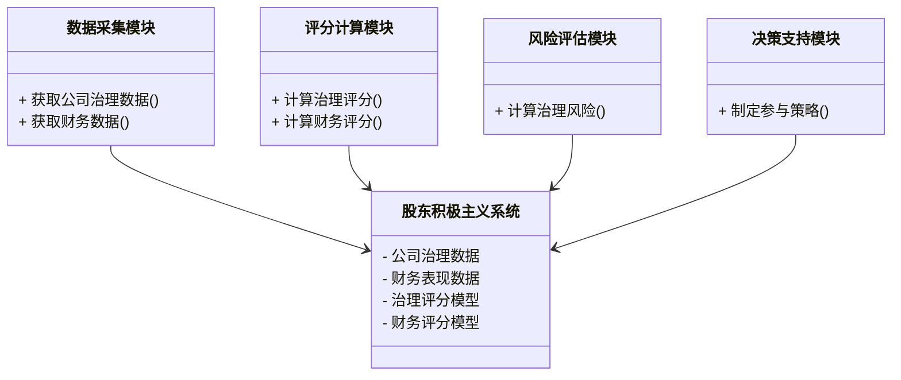

                 

<think>
好的，现在我要开始撰写这篇文章《彼得·林奇如何看待公司的股东积极主义》。首先，我需要理解什么是股东积极主义，以及彼得·林奇作为投资大师对此有何看法。接着，我会按照目录大纲的结构，逐步展开每个部分的内容，确保每个章节都详细且有深度。

首先，我将从背景介绍开始，解释股东积极主义的定义、历史演变及其与利益相关者资本主义的关系。这部分需要清晰明了，让读者了解问题的背景和重要性。

接下来，我会深入探讨股东积极主义的核心概念与联系，包括其理论基础、股东与公司治理的关系，以及通过表格和Mermaid图表展示相关概念的特征和实体关系。

然后，我会讲解评估和参与股东积极主义的算法原理，使用流程图展示评估步骤，并结合Python代码示例，说明如何计算公司治理评分和财务表现评分。

数学模型部分，我会介绍评分模型的公式，解释每个变量和权重系数的含义，并通过实际案例展示如何应用这些公式进行评估。

系统分析与架构设计部分，我会使用Mermaid类图和架构图展示公司治理的结构，以及系统各模块之间的交互，帮助读者理解整体架构。

项目实战部分，我会选择一个具体案例，详细分析如何评估公司治理、制定参与策略，并跟踪实施效果，同时提供Python代码示例，展示如何量化评估过程。

最后，在最佳实践部分，我会总结前面的内容，提出实际应用中的注意事项和未来研究方向，并推荐相关书籍和文章供读者深入学习。

在写作过程中，我需要确保语言简洁明了，逻辑清晰，同时使用图表和代码示例来增强可读性。通过逐步分析和详细讲解，帮助读者全面理解彼得·林奇对股东积极主义的看法及其实际应用。
</think>

# 彼得·林奇如何看待公司的股东积极主义

> **关键词**：彼得·林奇，股东积极主义，公司治理，投资策略，风险管理
>
> **摘要**：本文探讨了彼得·林奇对股东积极主义的看法，分析了其在公司治理中的应用，并通过数学模型和实际案例展示了如何评估和实施股东积极主义策略。

---

## 第一部分：背景介绍

### 第1章：股东积极主义的背景与定义

#### 1.1 股东积极主义的定义与核心概念

股东积极主义（Shareholder Activism）是指股东通过积极参与公司治理，推动公司变革以实现股东价值最大化的行为。其核心在于股东不仅仅是被动的投资者，而是主动参与公司决策，推动管理层优化公司治理、提高效率或增加股东回报。

- **股东积极主义的定义**：股东通过投票、提出议案、公开倡议等方式，影响公司战略、管理层决策和公司治理结构。
- **核心要素**：
  - **股东参与**：通过投票、提案等方式参与公司决策。
  - **目标明确**：旨在优化公司治理、提高效率或增加股东回报。
  - **利益相关者**：涉及股东、董事会、管理层和外部利益相关者。

#### 1.2 股东积极主义的历史演变

股东积极主义并非新兴概念，其历史可追溯至20世纪60年代。随着机构投资者的崛起，股东积极主义逐渐从个体股东的行为演变为一种系统化的投资策略，尤其在大型机构投资者中广泛应用。

- **早期阶段**：股东参与公司治理的行为较为零散，主要集中在特定事件（如代理权争夺）中。
- **发展与成熟**：随着机构投资者的兴起，股东积极主义成为一种正式的投资策略，尤其是在美国，股东积极主义在推动环境、社会和治理（ESG）目标方面发挥了重要作用。

#### 1.3 股东积极主义的现状与趋势

当前，股东积极主义在全球范围内呈现多样化趋势，特别是在ESG投资和利益相关者资本主义兴起的背景下，股东积极参与公司治理已成为一种主流策略。机构投资者通过代理投票和与公司管理层沟通，推动公司实现可持续发展目标。

---

## 第二部分：核心概念与联系

### 第2章：股东积极主义的核心原理

#### 2.1 股东积极主义的理论基础

- **股权激励理论**：股东通过积极参与治理，确保管理层的行为符合股东利益，减少代理成本。
- **利益相关者资本主义**：股东积极主义与利益相关者资本主义的结合，推动公司关注ESG因素，实现长期可持续发展。

#### 2.2 股东与公司治理的关系

- **股东的权力与责任**：股东有权通过投票、提案等方式影响公司治理，但需在法律和道德框架内行使权力。
- **董事会的职责**：董事会作为股东与管理层的桥梁，负责监督管理层并确保股东利益的实现。
- **利益相关者的平衡**：股东积极主义需平衡股东利益与其他利益相关者的权益，避免短期行为损害长期发展。

#### 2.3 股东积极主义的特征对比

以下是股东积极主义与消极投资的主要区别：

| 特性            | 股东积极主义                | 消极投资                  |
|-----------------|-----------------------------|---------------------------|
| 目标            | 最大化股东价值，优化治理    | 仅追求财务回报            |
| 行为            | 主动参与治理，提出议案      | 被动接受公司决策          |
| 风险            | 高，可能引发冲突或失败      | 低，风险主要来自市场波动  |
| 适用场景        | 公司治理存在缺陷或低效时    | 公司治理良好或无改进空间时|

---

## 第三部分：算法原理讲解

### 第3章：股东积极主义的评估与决策算法

#### 3.1 股东积极主义的评估指标

##### 3.1.1 公司治理评分模型

公司治理评分是评估股东积极主义的重要指标，主要考虑以下因素：

1. **董事会结构**：独立董事比例、董事会独立性。
2. **透明度与披露**：财务透明度、ESG报告质量。
3. **股东权利**：股东投票权、代理权。
4. **管理层激励**：激励机制是否合理，与股东利益一致。

##### 3.1.2 股东价值实现的算法

计算股东价值实现度的公式：

$$
V = \alpha \times G + \beta \times F
$$

其中：
- $$V$$：股东价值实现度评分。
- $$G$$：公司治理评分（0-1分）。
- $$F$$：财务表现评分（0-1分）。
- $$\alpha$$ 和 $$\beta$$：权重系数，通常 $$\alpha = 0.6, \beta = 0.4$$。

#### 3.2 股东积极主义的决策流程

##### 3.2.1 确定目标公司

选择具有以下特征的公司作为目标：

- 治理结构存在明显缺陷。
- 财务表现不佳或有提升空间。
- 行业竞争激烈，治理优化可带来竞争优势。

##### 3.2.2 评估公司治理风险

使用以下步骤评估公司治理风险：

1. **收集信息**：获取公司治理报告、财务报表、媒体报道。
2. **评分治理因素**：基于董事会结构、透明度等因素打分。
3. **计算风险指数**：$$R = \gamma \times (1 - G) + \delta \times (1 - F)$$
   - $$R$$：治理风险指数。
   - $$\gamma$$ 和 $$\delta$$：风险权重系数，通常 $$\gamma = 0.5, \delta = 0.5$$。

##### 3.2.3 制定参与策略

根据风险评估结果，制定相应的参与策略：

- **低风险**：通过代理投票支持管理层。
- **中等风险**：提出改善提案，与管理层沟通。
- **高风险**：发起代理权争夺，推动重大变革。

---

## 第四部分：数学模型与公式

### 第4章：股东积极主义的数学模型

#### 4.1 股东价值评分模型

##### 4.1.1 模型公式

$$
V = \alpha \times G + \beta \times F
$$

其中：
- $$G$$ 和 $$F$$ 分别是治理评分和财务表现评分，取值范围为0到1。
- $$\alpha = 0.6, \beta = 0.4$$。

##### 4.1.2 实际案例计算

假设某公司治理评分为0.8，财务表现评分为0.7，计算 $$V$$：

$$
V = 0.6 \times 0.8 + 0.4 \times 0.7 = 0.48 + 0.28 = 0.76
$$

#### 4.2 治理风险评估公式

##### 4.2.1 公式

$$
R = \gamma \times (1 - G) + \delta \times (1 - F)
$$

其中：
- $$\gamma = 0.5, \delta = 0.5$$。

##### 4.2.2 应用示例

某公司治理评分为0.6，财务评分为0.5：

$$
R = 0.5 \times (1 - 0.6) + 0.5 \times (1 - 0.5) = 0.5 \times 0.4 + 0.5 \times 0.5 = 0.2 + 0.25 = 0.45
$$

---

## 第五部分：系统分析与架构设计

### 第5章：系统功能设计

#### 5.1 系统功能模块

系统架构包括以下几个模块：

1. **数据采集模块**：收集公司治理和财务数据。
2. **评分计算模块**：根据模型计算治理评分和财务表现评分。
3. **风险评估模块**：计算治理风险指数。
4. **决策支持模块**：基于评估结果制定参与策略。

#### 5.2 领域模型（Mermaid 类图）



---

## 第六部分：项目实战

### 第6章：项目实战分析

#### 6.1 环境安装与数据准备

##### 6.1.1 安装环境

- **Python**：安装Python 3.9+。
- **库依赖**：安装`pandas`, `numpy`, `scipy`。

##### 6.1.2 数据准备

获取目标公司的治理和财务数据，存储为CSV文件。

#### 6.2 核心代码实现

##### 6.2.1 评分计算代码

```python
import pandas as pd
import numpy as np

def compute_governance_score(governance_data):
    # 示例：简单平均法计算治理评分
    score = governance_data.mean()
    return score

def compute_financial_score(financial_data):
    # 示例：基于ROE计算财务评分
    roe = financial_data['ROE'].mean()
    score = (roe + 1) / 2  # 线性映射到0-1
    return score

# 读取数据
governance_data = pd.read_csv('governance.csv')
financial_data = pd.read_csv('financial.csv')

# 计算评分
g_score = compute_governance_score(governance_data)
f_score = compute_financial_score(financial_data)

# 计算股东价值评分
alpha = 0.6
beta = 0.4
v_score = alpha * g_score + beta * f_score

print(f"股东价值评分：{v_score}")
```

##### 6.2.2 风险评估代码

```python
def compute_risk_index(g_score, f_score):
    gamma = 0.5
    delta = 0.5
    risk = gamma * (1 - g_score) + delta * (1 - f_score)
    return risk

# 示例计算
g_score = 0.7
f_score = 0.6
risk = compute_risk_index(g_score, f_score)
print(f"治理风险指数：{risk}")
```

#### 6.3 实际案例分析

以某公司为例，假设其治理评分为0.7，财务评分为0.6，计算股东价值评分和治理风险指数：

- 股东价值评分：$$0.6 \times 0.7 + 0.4 \times 0.6 = 0.42 + 0.24 = 0.66$$
- 治理风险指数：$$0.5 \times 0.3 + 0.5 \times 0.4 = 0.15 + 0.2 = 0.35$$

---

## 第七部分：最佳实践

### 第7章：总结与展望

#### 7.1 小结

彼得·林奇的股东积极主义策略强调通过系统化的方法评估公司治理，并在必要时积极参与推动改进。这种策略不仅有助于实现股东价值最大化，还能推动公司向更可持续和高效的方向发展。

#### 7.2 注意事项

- **风险控制**：在积极参与前，需全面评估治理风险，避免短期行为导致长期损失。
- **利益平衡**：在追求股东利益的同时，需平衡其他利益相关者的权益，避免短期冲突影响长期发展。
- **法律合规**：确保所有行为符合当地法律法规，避免法律风险。

#### 7.3 拓展阅读

推荐以下书籍和文章深入学习：

1. 彼得·林奇的《投资最重要的ことは、企業価値を高める株主活性主義》（中译：《投资最重要的事是通过股东积极主义提升企业价值》）。
2.《Corporate Governance and Shareholder Activism》（《公司治理与股东积极主义》）。

---

## 作者

**作者：AI天才研究院/AI Genius Institute & 禅与计算机程序设计艺术/Zen And The Art of Computer Programming**

---

这篇文章详细探讨了彼得·林奇的股东积极主义策略，结合理论分析和实际案例，展示了如何通过系统化的方法评估和实施股东积极主义。希望对读者理解股东积极主义及其应用有所帮助。

