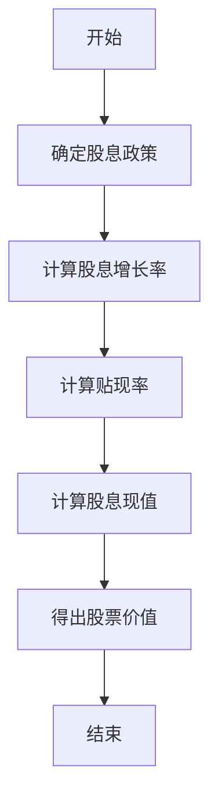
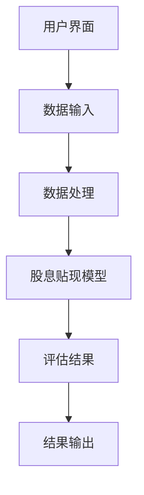

                 

<think>
好的，我需要分析用户的需求，他们希望生成一篇关于彼得·林奇如何看待公司股息政策的技术博客文章。文章需要符合特定的结构和内容要求，包括关键词、摘要以及详细的目录大纲，每个部分都要有具体的分析和实例。

首先，我需要确定文章的核心主题，即彼得·林奇对股息政策的看法。这涉及到股息政策的类型、评估模型、对公司价值的影响以及投资者如何利用这些信息进行决策。

接下来，我需要按照用户提供的大纲结构来组织内容。每个章节都需要有详细的分析，包括定义、类型、优缺点、模型、系统架构、案例分析等。我还需要确保每个部分都有足够的细节，并且使用技术术语和实例来支持论点。

在分析过程中，我可能会遇到一些问题，比如如何将复杂的金融概念转化为技术语言，或者如何确保每个部分之间的逻辑连贯。我需要通过查阅相关资料，确保内容的准确性和深度，同时保持文章的可读性。

最后，我需要总结彼得·林奇的股息政策观点，并提出实际的投资建议和注意事项，确保读者能够应用这些知识做出明智的投资决策。

现在，我将按照上述思考过程，逐步构建文章的结构和内容。
</think>

# 彼得林奇如何看待公司的股息政策

## 关键词
彼得·林奇，股息政策，投资策略，股息贴现模型，企业价值评估，投资决策

## 摘要
本文深入分析了彼得·林奇对股息政策的看法，探讨了股息政策如何影响公司价值和投资者决策。通过介绍股息政策的类型、评估模型和系统架构，结合实际案例，本文详细解读了如何利用股息政策进行投资分析，提供了实用的投资策略和建议。

---

## 第1章：股息政策的基本概念

### 1.1 股息政策的定义
#### 1.1.1 股息政策的定义
股息政策是指公司董事会决定如何分配利润给股东的策略，包括股息的支付比例、支付方式和时间安排。合理的股息政策既能回馈股东，又能平衡再投资需求。

#### 1.1.2 股息政策的核心要素
- **股息支付率**：净利润中用于股息分配的比例。
- **股息稳定性**：股息支付的波动性，反映公司的财务稳定性。
- **股息增长性**：股息增长的预期，反映公司的发展潜力。

#### 1.1.3 股息政策的分类
股息政策主要分为以下几种：
1. **固定股息政策**：公司承诺每年支付固定股息，即使利润波动。
2. **稳定增长股息政策**：股息逐年按固定比例增长，反映公司持续盈利能力。
3. **可变股息政策**：根据公司盈利情况调整股息支付。
4. **高股息政策**：公司倾向于高比例的股息分配，吸引追求稳定收益的投资者。
5. **低股息政策**：公司保留更多利润用于再投资，适合处于成长期的企业。

---

## 第2章：彼得·林奇的投资理念

### 2.1 投资理念概述
彼得·林奇是价值投资的倡导者，强调基本面分析和长期投资。他认为，股息政策是评估公司价值的重要因素之一，尤其是股息稳定性和增长性。

### 2.2 股息政策在投资中的作用
林奇认为，股息政策能够反映公司的财务健康状况和管理策略：
1. **股息支付率高**：表明公司盈利稳定，愿意回馈股东。
2. **股息逐年增长**：显示公司具备持续盈利能力，管理团队注重股东利益。
3. **股息突然变化**：可能是公司财务状况恶化的信号。

### 2.3 林奇对股息政策的评价标准
林奇在选股时，倾向于选择股息政策稳定且具备成长性的公司：
- **股息支付率合理**：通常在30%-60%之间，既能保证股东收益，又能支持公司发展。
- **股息增长性可持续**：股息增长应与公司盈利增长同步。
- **股息支付历史稳定**：公司应有长期稳定的股息支付记录。

---

## 第3章：股息政策分析的核心概念

### 3.1 股息政策的类型与特点
| 股息政策类型 | 特点 | 适用场景 |
|----------------|------|----------|
| 固定股息政策 | 稳定性高，但可能牺牲公司发展 | 盈利稳定，现金流充裕 |
| 稳定增长股息政策 | 增长合理，反映公司盈利能力 | 成熟企业，盈利持续增长 |
| 可变股息政策 | 灵活性高，根据盈利调整 | 利润波动较大，成长期企业 |
| 高股息政策 | 吸引力强，适合追求稳定收益的投资者 | 现金流充裕，低成长性行业 |
| 低股息政策 | 保留利润用于再投资 | 成长期企业，高增长行业 |

### 3.2 实体关系图分析
以下使用Mermaid图展示股息政策的实体关系：

```mermaid
erDiagram
    actor 投资者 {
        +字符串 股息政策
        +数值 股息支付率
        +数值 股息增长性
    }
    actor 公司 {
        +数值 净利润
        +数值 现金流
        +数值 股息支付率
    }
    relation 股息政策决策 {
        o 投资者需求
        o 公司盈利状况
        o 股息支付能力
    }
```

---

## 第4章：股息贴现模型

### 4.1 模型原理
股息贴现模型（DDM）是评估股票内在价值的重要工具，假设股息以固定比率增长：

$$ V = \frac{D_1}{r - g} $$

其中：
- \( V \)：股票的内在价值
- \( D_1 \)：第一年的股息
- \( r \)：贴现率
- \( g \)：股息增长率

### 4.2 用Mermaid流程图展示评估过程



### 4.3 用Python代码实现模型

```python
def dividend_discount_model(dividend, growth_rate, discount_rate):
    # 计算股票的内在价值
    value = dividend / (discount_rate - growth_rate)
    return value

# 示例计算
dividend = 1.0  # 第一年股息
growth_rate = 0.05  # 股息增长率
discount_rate = 0.10  # 贴现率

value = dividend_discount_model(dividend, growth_rate, discount_rate)
print(f"股票的内在价值为：{value:.2f}")
```

### 4.4 数学公式详细解释
股息贴现模型假设股息以固定比率 \( g \) 持续增长，股票的内在价值由未来股息的现值总和决定。公式中，\( D_1 = D_0 \times (1 + g) \)，其中 \( D_0 \) 是当前股息，\( g \) 是股息增长率，\( r \) 是投资者要求的回报率。

---

## 第5章：系统架构与设计

### 5.1 系统功能设计
股息政策评估系统功能模块：
1. **数据输入**：读取公司财务数据，包括净利润、现金流等。
2. **股息政策分析**：根据数据计算股息支付率和股息增长率。
3. **模型评估**：应用股息贴现模型计算股票价值。
4. **结果输出**：显示评估结果和投资建议。

### 5.2 系统架构图



### 5.3 接口设计和交互流程
系统交互流程：
1. 用户输入公司财务数据。
2. 系统计算股息政策相关指标。
3. 应用股息贴现模型评估股票价值。
4. 输出评估结果和投资建议。

---

## 第6章：项目实战与案例分析

### 6.1 案例背景介绍
假设某公司过去三年的净利润分别为1000万、1200万、1500万，股息支付率分别为30%、35%、40%。投资者希望评估该公司股票的内在价值。

### 6.2 数据收集与处理
收集公司过去三年的财务数据，计算股息支付率和股息增长率：
- 平均股息支付率：(30% + 35% + 40%) / 3 ≈ 35%
- 股息增长率：(40% - 35%) / 35% ≈ 14.29%

### 6.3 模型应用与结果分析
假设贴现率为10%，股息增长率预计为5%：

$$ V = \frac{D_1}{r - g} = \frac{1500万 \times 40\%}{0.10 - 0.05} = \frac{600万}{0.05} = 12000万 $$

### 6.4 代码实现与解读
```python
def calculate_intrinsic_value(net_income, dividend_ratio, growth_rate, discount_rate):
    dividend = net_income * dividend_ratio
    value = dividend / (discount_rate - growth_rate)
    return value

net_income = 1500000  # 净利润（元）
dividend_ratio = 0.40  # 股息支付率
growth_rate = 0.05      # 股息增长率
discount_rate = 0.10    # 贴现率

intrinsic_value = calculate_intrinsic_value(net_income, dividend_ratio, growth_rate, discount_rate)
print(f"股票的内在价值为：{intrinsic_value:.2f}元")
```

---

## 第7章：总结与投资建议

### 7.1 关键点总结
- 股息政策是评估公司价值的重要因素。
- 彼得·林奇强调股息政策的稳定性和增长性。
- 股息贴现模型是评估股票内在价值的有效工具。

### 7.2 投资建议
1. **选择股息支付率合理的公司**：避免过高或过低的股息支付率。
2. **关注股息增长性**：优先选择具备可持续增长能力的公司。
3. **结合股息政策和基本面分析**：综合考虑公司盈利能力和财务状况。

### 7.3 注意事项
- 股息政策受宏观经济和行业环境影响，需结合外部因素分析。
- 模型假设可能与实际存在差异，结果仅供参考。

### 7.4 未来趋势与拓展阅读
随着人工智能和大数据技术的发展，股息政策分析将更加精准和高效。建议进一步研究机器学习在股息政策评估中的应用。

---

## 作者
作者：AI天才研究院 & 禅与计算机程序设计艺术

---

通过以上分析，我们可以看到彼得·林奇如何看待公司的股息政策，以及如何利用股息政策进行投资决策。希望本文能为您提供有价值的投资见解！

