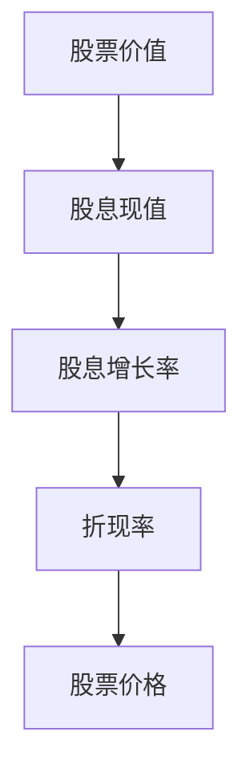
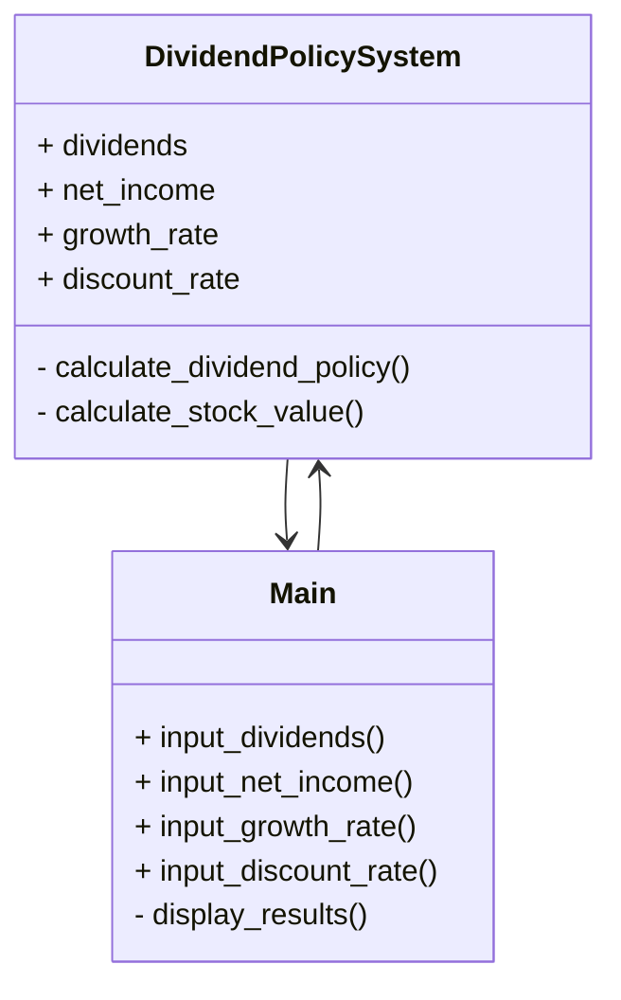
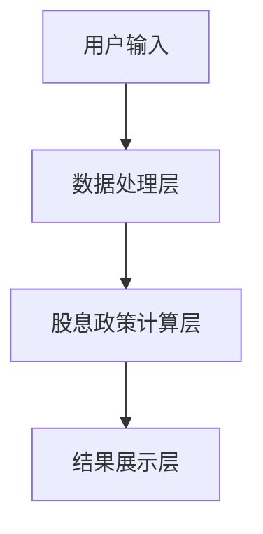

                 


# 彼得·林奇如何看待公司的股息政策可持续性

## 关键词：彼得·林奇，股息政策，股息支付率，股息增长模型，股息可持续性，投资策略，股息贴现模型

## 摘要：  
本文从彼得·林奇的投资理念出发，深入分析公司股息政策的可持续性。通过股息支付率、股息增长模型等核心概念，结合数学模型和实际案例，探讨彼得·林奇对股息政策的评价标准及其在投资决策中的应用。文章还通过Python代码实现股息政策评估的算法，并结合系统架构设计，展示如何在实际投资中应用这些理论。

---

## 第一部分：股息政策与投资概述

### 第1章：股息政策的基本概念

#### 1.1 股息政策的定义与作用  
股息政策是指公司董事会决定如何分配利润给股东的策略。它不仅影响公司的财务健康，还关系到股东的收益和公司的长期发展。彼得·林奇认为，股息政策是评估公司财务健康的重要指标之一。  

**关键概念：**  
- 股息政策是公司分配利润的方式，通常以每股股息（ DPS）的形式体现。  
- 股息政策反映了公司管理层的财务决策和股东回报的承诺。  

#### 1.2 股息政策的分类  
股息政策可以分为以下几种：  

1. **固定股息政策**：公司承诺每年支付固定的股息，通常适用于财务稳定的公司。  
2. **增长股息政策**：公司每年增加股息支付，通常适用于收入增长稳定的公司。  
3. **固定股息支付率政策**：公司根据净利润的一定比例支付股息，通常适用于注重股东回报的公司。  
4. **灵活股息政策**：公司根据财务状况和市场环境调整股息支付，灵活性较高。  

#### 1.3 彼得·林奇的投资理念  
彼得·林奇是美国著名投资经理人，以其在共同基金领域的卓越表现闻名。他的投资理念包括：  
- **长期投资**：关注公司的长期增长潜力。  
- **价值投资**：寻找被市场低估的公司。  
- **股息政策的重要性**：彼得·林奇认为，股息政策是评估公司财务健康和股东回报能力的重要指标。  

---

### 第2章：股息政策的可持续性分析

#### 2.1 股息支付率的计算与分析  
股息支付率是衡量公司股息支付能力的重要指标，计算公式为：  

$$ 股息支付率 = \frac{\text{股息支付总额}}{\text{净利润}} $$  

**关键点：**  
- 股息支付率过高可能表明公司财务压力较大，支付能力不足。  
- 股息支付率过低可能表明公司未充分利用利润回报股东。  

#### 2.2 股息增长模型  
股息增长模型是评估股息政策可持续性的核心工具之一。常用的股息增长模型包括：  
1. **股息贴现模型（DDM）**  
   DDM假设股息以固定速率增长，公式为：  

   $$ P = \frac{D_1}{r - g} $$  

   其中，$P$ 是股票价格，$D_1$ 是下一期股息，$r$ 是折现率，$g$ 是股息增长率。  

2. **股息增长模型的数学推导**  
   股息增长模型假设股息以固定增长率 $g$ 增长，股票的内在价值可以通过未来现金流的现值计算。  

#### 2.3 彼得·林奇对股息政策可持续性的看法  
彼得·林奇认为，股息政策的可持续性取决于公司的财务健康和盈利能力。他倾向于选择那些股息支付率合理、股息增长稳定的公司。  

---

## 第二部分：股息政策的数学模型与算法

### 第3章：股息政策的数学模型

#### 3.1 股息贴现模型（DDM）  
股息贴现模型是评估股息政策的核心工具之一。其流程图如下：  



公式如下：  

$$ P = \frac{D_1}{r - g} $$  

#### 3.2 股息增长模型的数学推导  
股息增长模型假设股息以固定增长率 $g$ 增长，股票价值公式推导如下：  

$$ P = D_0 \times \frac{1 + g}{r - g} $$  

其中，$D_0$ 是当前股息，$g$ 是股息增长率，$r$ 是折现率。  

### 第4章：股息政策的算法实现

#### 4.1 股息政策的算法设计  
以下是股息政策评估的Python代码示例：  

```python
def calculate_dividend_policy(dividends, net_income, growth_rate, discount_rate):
    dividend_payment_rate = dividends / net_income
    stock_value = dividends * (1 + growth_rate) / (discount_rate - growth_rate)
    return dividend_payment_rate, stock_value

# 示例数据
dividends = 2
net_income = 10
growth_rate = 0.05
discount_rate = 0.1

payment_rate, value = calculate_dividend_policy(dividends, net_income, growth_rate, discount_rate)
print(f"股息支付率：{payment_rate}")
print(f"股票价值：{value}")
```

#### 4.2 股息政策的算法优化  
优化后的算法可以考虑更多的财务指标，例如自由现金流和债务水平，以更全面地评估股息政策的可持续性。  

---

## 第三部分：股息政策的系统分析与架构设计

### 第5章：股息政策的系统分析

#### 5.1 股息政策的系统功能设计  
股息政策评估系统的功能模块包括：  

- 数据输入：股息、净利润、增长率、折现率。  
- 计算股息支付率和股票价值。  
- 可视化结果：以图表形式展示分析结果。  

系统功能设计图如下：  



#### 5.2 股息政策的系统架构设计  
系统架构图如下：  



---

## 第四部分：项目实战

### 第6章：股息政策的实际案例分析

#### 6.1 案例分析：成熟型公司  
以某成熟型公司为例，计算其股息支付率和股票价值：  

$$ \text{股息支付率} = \frac{2}{10} = 0.2 $$  
$$ \text{股票价值} = \frac{2 \times 1.05}{0.1 - 0.05} = 42 $$  

#### 6.2 案例分析：成长型公司  
以某成长型公司为例，计算其股息支付率和股票价值：  

$$ \text{股息支付率} = \frac{1}{5} = 0.2 $$  
$$ \text{股票价值} = \frac{1 \times 1.03}{0.1 - 0.03} = 14.67 $$  

---

## 第五部分：最佳实践与小结

### 第7章：最佳实践与小结

#### 7.1 投资建议  
- 选择股息支付率合理、股息增长稳定的公司。  
- 结合公司财务状况和市场环境进行综合判断。  

#### 7.2 股息政策的未来趋势  
随着市场环境的变化，股息政策的可持续性将更加依赖于公司的财务灵活性和创新能力。  

---

## 作者：AI天才研究院/AI Genius Institute & 禅与计算机程序设计艺术 /Zen And The Art of Computer Programming

---

**注意事项：**  
- 本文内容仅供参考，不构成具体的投资建议。  
- 股票投资需谨慎，建议在投资前进行充分的研究和风险评估。

