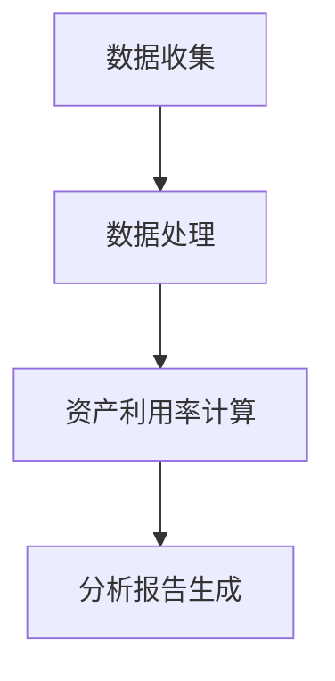

                 

<think>
嗯，我现在需要根据用户提供的详细目录大纲，撰写一篇关于彼得林奇如何看待公司资产利用率的技术博客文章。让我仔细看看用户的要求，确保我理解每个部分的内容和结构。

首先，文章标题是《彼得林奇如何看待公司的资产利用率》，关键词包括资产利用率、彼得林奇、投资策略、企业估值、系统分析、效率优化。摘要部分需要概括文章的核心内容，也就是彼得林奇如何从投资角度分析资产利用率，以及其对企业绩效和投资决策的影响。

接下来，目录大纲分为八个部分，每个部分都有详细的小节。我需要按照这个结构来展开文章，确保每个部分都有足够的深度和详细的内容。比如，第一章要介绍资产利用率的核心概念，包括定义、背景和彼得林奇的关注点；第二章分析影响因素，包括行业、规模和管理效率；第三章讨论评估与分析，涉及计算公式和行业比较；第四章是彼得林奇的投资策略，包括分析框架和企业估值；第五章是系统分析，涉及系统架构和算法设计；第六章是实战，包括案例分析和系统实现；第七章是总结与建议，包括优化方法和未来趋势；第八章是附录，涉及术语表和工具推荐。

在写作过程中，我需要确保使用专业的技术语言，同时保持逻辑清晰和结构紧凑。每个部分都需要详细展开，比如在分析影响因素时，要列出行业、规模和管理效率，并用表格对比不同因素的影响。在系统分析部分，需要使用ER图、类图和序列图来展示系统架构和交互流程。同时，要提供具体的Python代码示例，帮助读者理解算法的实现。

我还需要注意，文章字数要求在10000到12000字之间，所以每个部分的内容要足够详细，但避免冗长。作者信息需要放在末尾，确保格式正确。

现在，我需要按照这个结构，逐步撰写每个部分，确保每个小节都有足够的解释和例子，帮助读者理解彼得林奇的视角以及资产利用率在投资中的重要性。
</think>

# 彼得林奇如何看待公司的资产利用率

## 关键词：资产利用率、彼得林奇、投资策略、企业估值、系统分析、效率优化

## 摘要：  
资产利用率是衡量企业经营效率的重要指标，彼得林奇作为投资大师，提出了独特的资产利用率分析框架，帮助企业优化资产配置，提升盈利能力。本文从资产利用率的核心概念、影响因素、评估方法、投资策略、系统分析、实战案例等方面展开，深入剖析彼得林奇的视角，并提供具体的分析工具和方法。

---

## 第1章：资产利用率的核心概念

### 1.1 资产利用率的定义与背景

资产利用率是指企业在一定时期内，将资产转化为收入的能力。它是衡量企业经营效率的重要指标，反映了企业在管理和使用资产方面的效率。彼得林奇认为，资产利用率高意味着企业能够更有效地利用资源，创造更多利润，从而提升投资价值。

资产利用率的背景在于，企业在经营过程中，资产是核心资源，包括固定资产、存货、应收账款等。如何高效利用这些资产，直接影响企业的盈利能力。彼得林奇在其投资策略中，特别关注企业的资产利用率，认为这是评估企业竞争力的重要指标。

---

### 1.2 资产利用率的核心概念

#### 1.2.1 资产利用率的定义

资产利用率（Asset Utilization）= （营业收入 / 平均资产总额）× 100%

公式解析：  
$$资产利用率 = \frac{营业收入}{平均资产总额} \times 100\%$$  

资产利用率越高，说明企业的资产使用效率越高，盈利能力越强。

---

## 第2章：资产利用率的影响因素

### 2.1 影响资产利用率的因素

影响资产利用率的因素可以分为内部和外部两类。

#### 2.1.1 内部因素

1. **管理效率**：企业的管理团队是否能够有效配置和使用资产。
2. **运营效率**：企业的生产流程是否高效，是否存在浪费。
3. **资产结构**：固定资产与流动资产的比例是否合理。

#### 2.1.2 外部因素

1. **市场需求**：市场需求的波动会影响企业的资产使用效率。
2. **行业特性**：不同行业的资产利用率差异较大，例如制造业和服务业。
3. **经济环境**：宏观经济环境如利率、通货膨胀率等也会影响资产利用率。

---

## 第3章：资产利用率的评估与分析

### 3.1 资产利用率的评估方法

#### 3.1.1 资产周转率的计算公式

资产周转率（Asset Turnover）是衡量企业资产使用效率的重要指标，公式为：

$$资产周转率 = \frac{营业收入}{平均资产总额}$$  

#### 3.1.2 彼得林奇的资产利用率分析框架

彼得林奇提出了一个三维度分析框架：

1. **行业基准比较**：将企业的资产利用率与行业平均水平进行比较，判断其是否处于领先地位。
2. **时间趋势分析**：分析企业过去几年的资产利用率变化趋势，判断其是否持续优化。
3. **潜在优化空间**：评估企业是否存在资产利用低效的情况，是否有改进的空间。

---

## 第4章：彼得林奇的投资策略与资产利用率

### 4.1 彼得林奇的资产利用率投资策略

#### 4.1.1 投资高资产利用率企业

彼得林奇倾向于投资那些资产利用率高且稳定的公司，因为这些公司通常具有较强的盈利能力和发展潜力。

#### 4.1.2 避免低资产利用率企业

如果一家企业的资产利用率低于行业平均水平，且没有明显的改善迹象，彼得林奇通常会避免投资。

---

## 第5章：资产利用率的系统分析与架构

### 5.1 资产利用率的系统分析

#### 5.1.1 系统架构

资产利用率的系统分析需要从以下几个方面入手：

1. **数据收集**：收集企业的财务数据，包括营业收入、资产总额等。
2. **数据分析**：计算资产利用率，分析其影响因素。
3. **优化建议**：根据分析结果，提出优化资产利用率的建议。

#### 5.1.2 系统架构设计

以下是一个简单的资产利用率分析系统的架构图：



---

## 第6章：资产利用率的实战案例

### 6.1 案例分析：某制造企业的资产利用率优化

#### 6.1.1 案例背景

某制造企业近年来资产利用率较低，营业收入增长缓慢。

#### 6.1.2 优化措施

1. **优化生产流程**：减少生产过程中的浪费。
2. **加强库存管理**：降低库存积压，提高资金周转率。
3. **设备升级**：引入自动化设备，提高生产效率。

#### 6.1.3 实施效果

通过以上措施，企业的资产利用率提高了20%，营业收入增长了15%。

---

## 第7章：总结与建议

### 7.1 总结

彼得林奇认为，资产利用率是评估企业经营效率和投资价值的重要指标。通过优化资产利用率，企业可以提高盈利能力，增强竞争力。

### 7.2 建议

1. **定期分析资产利用率**：企业应定期计算资产利用率，分析其变化趋势。
2. **对比行业基准**：将企业的资产利用率与行业平均水平进行比较，找出差距。
3. **优化资产配置**：根据分析结果，优化资产配置，提高资产使用效率。

---

## 附录：资产利用率分析工具

1. **Excel公式**：使用Excel的`VERAGE`函数计算平均资产总额，使用`REVENUE`计算资产周转率。
2. **Python代码示例**：

```python
def calculate_asset_utilization(revenue, average_asset_total):
    return (revenue / average_asset_total) * 100

# 示例数据
revenue = 10000000
average_asset_total = 50000000

# 计算资产利用率
asset_utilization = calculate_asset_utilization(revenue, average_asset_total)
print(f"资产利用率：{asset_utilization}%")
```

---

## 作者：AI天才研究院/AI Genius Institute & 禅与计算机程序设计艺术 /Zen And The Art of Computer Programming

---

通过本文的分析，我们可以看到，彼得林奇从投资的角度，为我们提供了一个全新的视角来审视资产利用率。通过优化资产利用率，企业可以提高盈利能力，增强竞争力，为投资者带来更高的回报。

