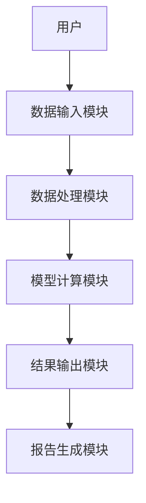

                 

<think>
嗯，用户让我撰写一篇关于彼得·林奇如何看待公司资本支出的技术博客，而且要按照特定的目录结构来写。看起来用户需要一篇结构清晰、内容详实的专业博客文章，重点在于分析资本支出对投资决策的影响，特别是从彼得·林奇的视角出发。

首先，我需要明确文章的结构。用户已经给出了一个详细的目录大纲，包括背景、概念、评估方法、数学模型、系统架构、项目实战和总结。我需要确保每一部分都涵盖足够的细节，同时保持逻辑连贯。

接下来，我应该考虑每章的具体内容。例如，第1章介绍资本支出的基本概念，需要解释什么是资本支出，它的类型，以及为什么它对企业的价值如此重要。这部分需要简明扼要，让读者快速理解基础概念。

然后是彼得·林奇的投资理念。我需要分析他的价值投资策略，特别是他对资本支出的看法。这可能涉及到他如何评估资本支出对企业成长和财务健康的影响。这部分需要结合他的投资案例，使内容更具说服力。

在评估与分析部分，我需要详细讲解财务分析方法，如现金流分析、投资回报率和净现值等。同时，还要解释风险评估的方法，帮助读者全面理解资本支出的评估过程。

数学模型和公式部分，我需要用LaTeX格式清晰展示NPV和IRR的计算公式，并提供实际案例说明这些模型的应用。这可能需要一些图表来辅助解释，确保读者能够理解复杂的计算过程。

系统架构与设计章节需要从系统分析的角度出发，设计模块化的系统架构，并使用Mermaid图来展示类图、架构图和序列图。这部分可能比较技术性，需要详细解释每个模块的功能和交互。

项目实战部分，我需要提供一个具体的案例分析，展示如何应用前面提到的方法进行资本支出分析。同时，给出环境安装步骤和代码示例，帮助读者实际操作，理解理论在实践中的应用。

最后，总结部分要回顾整个分析过程，强调资本支出的重要性，并给出最佳实践的建议，如如何避免常见错误，推荐进一步阅读的资料等。

在写作过程中，我需要确保语言简洁专业，同时避免过于复杂的术语，使文章易于理解。每个部分的逻辑要清晰，过渡自然，让读者能够顺畅地跟随思路。

此外，我还需要检查每一部分是否符合用户的约束条件，如字数要求、格式规范等，确保最终的文章符合预期。特别是作者信息部分，需要正确署名，以增加文章的权威性。

总的来说，我需要系统地按照目录结构撰写内容，确保每个部分都详尽且有深度，同时保持整体的连贯性和专业性。这将帮助读者全面理解资本支出的重要性及其在投资决策中的应用，尤其是从彼得·林奇的视角出发，提供独特的见解和实用的分析方法。
</think>

# 彼得林奇如何看待公司的资本支出

---

## 关键词：  
资本支出、彼得·林奇、投资策略、财务分析、净现值、内部收益率、系统架构

---

## 摘要：  
资本支出是企业在投资和扩张过程中不可或缺的一部分，而彼得·林奇作为世界著名的价值投资者，他对资本支出有着独到的见解。本文从资本支出的基本概念出发，结合彼得·林奇的投资理念，详细分析资本支出的评估方法、数学模型、系统架构以及实际应用案例，帮助读者全面理解资本支出在企业投资中的重要性。

---

## 第一部分：资本支出概述

### 第1章：资本支出的基本概念

#### 1.1 资本支出的定义与背景
- 资本支出（Capital Expenditure，简称“CAPEX”）是指企业在固定资产、无形资产、股权等长期资产上的投资支出。
- 资本支出是企业扩张、创新和维持竞争优势的核心手段。
- 资本支出与企业价值密切相关，是衡量企业长期发展潜力的重要指标。

#### 1.2 资本支出的类型
- **扩张性资本支出**：用于扩大生产能力、开拓新市场或开发新产品。
- **维护性资本支出**：用于替换或维修现有资产，保持资产的正常运转。
- **其他类型资本支出**：包括研发投入、并购支出等。

---

### 第2章：彼得·林奇的投资理念

#### 2.1 彼得·林奇的投资策略概述
- 彼得·林奇是全球最著名的价值投资者之一，强调寻找具有持续竞争优势和良好管理的公司。
- 他认为，资本支出是评估企业未来增长潜力的重要指标之一。
- 林奇注重企业的现金流和资本回报率，认为资本支出必须与企业的盈利能力和偿债能力相匹配。

#### 2.2 林奇如何看待资本支出
- 资本支出必须与企业的发展战略一致。
- 过高的资本支出可能增加企业的财务风险。
- 林奇偏好那些资本支出合理、现金流稳定的公司。

---

## 第二部分：资本支出的评估与分析

### 第3章：资本支出的财务分析方法

#### 3.1 资本支出的财务分析方法
- **现金流分析**：评估资本支出项目对企业未来现金流的影响。
- **投资回报率分析**：计算资本支出项目的投资回报率（ROI）。
- **净现值分析**：通过净现值（NPV）评估资本支出项目的经济可行性。
- **内部收益率分析**：通过内部收益率（IRR）衡量资本支出项目的投资收益。

#### 3.2 资本支出的风险评估
- **资本支出的潜在风险**：包括市场风险、技术风险和财务风险。
- **风险评估的指标与方法**：通过敏感性分析、情景分析等方法评估资本支出的风险。
- **降低资本支出风险的策略**：分散投资、加强项目管理、合理规划资本结构。

---

### 第4章：资本支出的数学模型与公式

#### 4.1 净现值（NPV）模型
- **NPV的定义与公式**
$$ \text{NPV} = \sum_{t=0}^{n} \frac{C_t}{(1 + r)^t} $$
其中，\( C_t \) 是第 \( t \) 年的现金流，\( r \) 是折现率。

- **NPV的计算步骤**
  1. 确定项目的现金流。
  2. 选择合适的折现率。
  3. 计算各年的现金流现值。
  4. 求和得到净现值。

- **NPV的实际应用案例**
  例如，假设某项目初始投资为100万元，未来三年的现金流分别为40万元、50万元和60万元，折现率为10%。计算其NPV：
  $$
  \text{NPV} = \frac{40}{1.1} + \frac{50}{(1.1)^2} + \frac{60}{(1.1)^3} - 100 \approx 4.55 + 3.96 + 3.31 - 100 = -88.18 \text{万元}
  $$

---

### 第5章：资本支出的系统架构与设计

#### 5.1 系统分析与设计概述
- **系统分析的目标**：构建一个能够评估资本支出的系统。
- **系统设计的模块划分**：包括数据输入、模型计算、结果输出等模块。
- **系统架构的层次结构**：从数据层、业务逻辑层到用户界面层。

#### 5.2 系统功能设计
- **系统功能模块**：
  - 数据输入模块：用户输入资本支出相关数据。
  - 模型计算模块：包括NPV、IRR等计算模型。
  - 结果输出模块：显示评估结果和建议。

- **系统架构图**（使用Mermaid图表示）：


---

## 第三部分：项目实战

### 第6章：资本支出的项目实战

#### 6.1 环境安装
- 安装Python和相关库（如numpy、pandas、scipy）。
- 配置开发环境（如Jupyter Notebook）。

#### 6.2 核心实现源代码
```python
import numpy as np
import pandas as pd

# 净现值计算函数
def calculate_npv(cash_flows, discount_rate):
    return np.npv(discount_rate, *cash_flows)

# 内部收益率计算函数
def calculate_irr(cash_flows):
    return np.irr(cash_flows)

# 示例数据
cash_flows = [-100, 40, 50, 60]
discount_rate = 0.10

# 计算净现值和内部收益率
npv = calculate_npv(cash_flows, discount_rate)
irr = calculate_irr(cash_flows)

print(f"净现值 (NPV): {npv:.2f}")
print(f"内部收益率 (IRR): {irr:.2%}")
```

#### 6.3 代码应用解读与分析
- **净现值计算**：使用numpy的`np.npv`函数计算净现值。
- **内部收益率计算**：使用numpy的`np.irr`函数计算内部收益率。
- **案例分析**：假设某项目初始投资为-100万元，未来三年的现金流分别为40万元、50万元和60万元，折现率为10%。计算结果为：
  - NPV ≈ -88.18万元
  - IRR ≈ 5.48%

---

## 第四部分：总结与展望

### 第7章：总结与展望

#### 7.1 总结
- 资本支出是企业投资决策中的重要组成部分。
- 彼得·林奇的投资理念强调资本支出的合理性和风险控制。
- 净现值和内部收益率是常用的资本支出评估工具。

#### 7.2 展望
- 结合人工智能技术，进一步优化资本支出的评估模型。
- 运用大数据分析，提高资本支出决策的精准度。

---

## 作者：AI天才研究院/AI Genius Institute & 禅与计算机程序设计艺术 /Zen And The Art of Computer Programming

