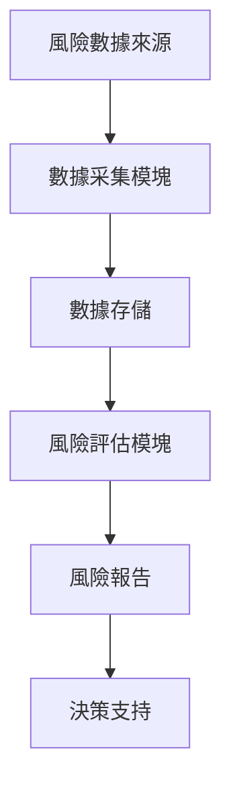
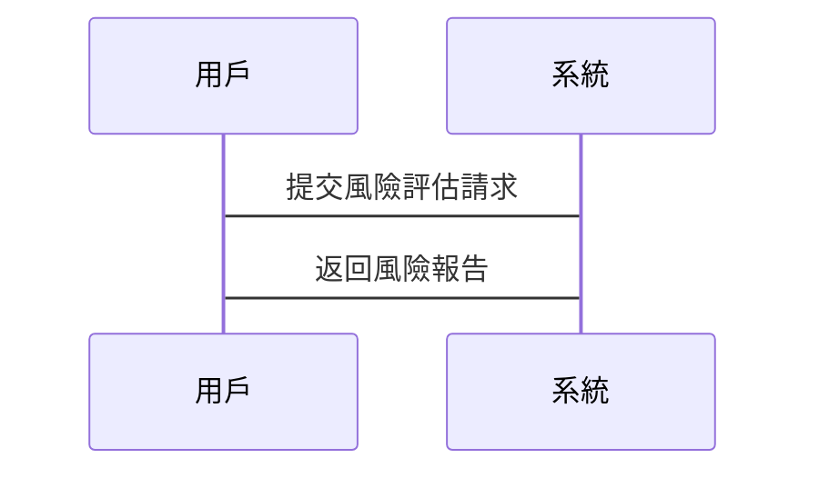

                 


# 彼得林奇如何看待公司的跨国经营风险

## 关键词：
跨国经营风险、彼得·林奇、投资策略、风险管理、企业价值评估、风险模型

## 摘要：
本文从彼得·林奇的投资理念出发，分析他如何看待公司的跨国经营风险。通过结合实际投资案例，探讨跨国经营风险的核心要素、评估方法和管理策略，帮助读者理解如何在跨国经营中规避和降低风险。

---

# 第一部分: 背景介绍与核心概念

## 第1章: 跨国經營風險的背景與定義

### 1.1 跨国經營的基本概念

#### 1.1.1 跨国經營的定義
跨国經營是指企業在多个国家或地區進行市場擴展、生產經營和資源配置的活動。這些活動通常涉及跨文化、跨法律體系和跨經濟環境的挑戰。

#### 1.1.2 跨国經營的核心要素
- 市場進入策略
- 跨國資產配置
- 多元化經營戰略
- 地方法律與稅務 compliance

#### 1.1.3 跨国經營的歷史與發展
跨国經營的歷史可以追溯到殖民時代，但現代跨国經營的興起得益於全球化和技術進步。20世紀後期， multinational corporations (MNCs) 締造了��国經營的黃金時代。

---

### 1.2 跨国經營風險的定義與類型

#### 1.2.1 跨国經營風險的定義
跨国經營風險是指企業在跨越國境進行經營活動時，可能遭遇的各種不確定性因素，這些因素可能影響企業的經營績效和價值創造。

#### 1.2.2 跨国經營風險的主要類型
- 政治風險：政策變化、政局不穩定等。
- 經濟風險：匯率波動、通脹壓力等。
- 法律風險：稅法變化、勞工法規等。
- 管理風險：跨文化團隊協調、本地化管理挑戰。
- 競爭風險：國際市場競爭加劇。

#### 1.2.3 跨国經營風險的特征與影響
- 編碼攻擊性：風險來源多樣化。
- 不可控性：很多風險是由外部因素決定的。
- 高影響度：可能影響企業的整體績效和估值。

---

### 1.3 彼得·林奇投資理念的背景

#### 1.3.1 彼得·林奇的投資風格
彼得·林奇是美國著名共同基金經理人，以價值投資和深入研究企業基本面聞名。他強調企業價值評估和風險管理，投資風格穩健且注重長期績效。

#### 1.3.2 彼得·林奇對風險的理解
林奇認為風險來源於企業的不確定性，特別是企業無法應對外部環境變化的能力。他強調通過基本面分析來識別和控制風險。

#### 1.3.3 彼得·林奇的投資策略與企業價值評估
林奇的核心策略是選擇具有強大競爭優勢、管理團隊穩定且估值合理的企業。他特別注重企業的持續盈利能力，這與跨國經營風險管理的理念不謀而合。

---

## 第2章: 彼得·林奇如何看待風險

### 2.1 彼得·林奇的風險評估方法

#### 2.1.1 彼得·林奇的企業價值評估模型
林奇的企業價值評估模型基於以下幾個核心指標：
- 總市值
- 每股收益（EPS）
- 貸款償還能力
- 管理層素質

公式：
$$
\text{企業價值} = \text{淨利潤} \times \text{市盈率倍數}
$$

#### 2.1.2 彼得·林奇的風險評估指標
- 企業盈利能力
- 財務槓桿
- 管理層穩定性
- 企業競爭優勢

#### 2.1.3 彼得·林奇的風險管理策略
林奇強調分散風險，避免將所有資金投入單一市場或行業。他提倡全球化分散投資，以降低區域性風險。

---

### 2.2 彼得·林奇的投資案例分析

#### 2.2.1 成功案例：可口可樂的投資故事
林奇長期持有可口可樂的股票，這得益於可口可樂的全球品牌影響力和穩定的盈利能力。他將可口可樂視為具有強大護城河的企業。

#### 2.2.2 失敗案例：西猯基金的教訓
西猯基金的崩盤教訓讓林奇明白，即便是在看似安全的市場中，也需要仔細評估管理風險和系統性風險。

#### 2.2.3 其他經典案例分析
- 麥當勞：國際化戰略的成功
- IBM：從硬體到服務的轉型風險

---

### 2.3 彼得·林奇風險評估模型的應用

#### 2.3.1 模型的結構與原理
林奇的風險評估模型基於企業基本面分析，強調企業的持續盈利能力、管理團隊素質和市場競爭力。

#### 2.3.2 模型的實踐應用
- 通過基本面分析評估企業的風險暴露程度。
- 根據市場環境調整風險敞口。

#### 2.3.3 模型的優勢與局限性
- 優勢：基於企業基本面，具有實用性。
- 局限性：忽略了宏觀經濟環境的不確定性。

---

## 第3章: 跨国經營風險的核心要素

### 3.1 跨国經營的主要風險來源

#### 3.1.1 政治風險
- 政府政策變化
- 贸易壁壟
- 政治局勢不穩定

#### 3.1.2 經濟風險
- 經濟蕭條
- 汇率波動
- 通脹壓力

#### 3.1.3 法律風險
- 稅法變化
- 知識產權保護
- 勞工法規

#### 3.1.4 管理風險
- 跨文化管理挑戰
- 地方保護主義
- 本地化戰略執行難度

#### 3.1.5 競争風險
- 國際市場競爭加劇
- 本地企業的強烈競爭
- 行業結構變化

---

### 3.2 跨国經營風險的評估框架

#### 3.2.1 風險評估的步驟與方法
- 识别風險來源
- 評估風險影響程度
- 計算風險暴露程度
- 制定風險管理策略

#### 3.2.2 風險評估的關鍵指標
- 風險價值（Risk Value）
- 風險影響度（Impact）
- 風險概率（Probability）

#### 3.2.3 風險評估的工具與技術
- 風險評估矩陣
- 情景分析法
- 蒙特卡洛模擬

---

### 3.3 彼得·林奇風險評估模型的應用

#### 3.3.1 模型的結構與原理
林奇的模型基於企業基本面分析，強調企業的持續盈利能力、管理團隊素質和市場競爭力。

#### 3.3.2 模型的實踐應用
- 通過基本面分析評估企業的風險暴露程度。
- 根據市場環境調整風險敞口。

#### 3.3.3 模型的優勢與局限性
- 優勢：基於企業基本面，具有實用性。
- 局限性：忽略了宏觀經濟環境的不確定性。

---

# 第二部分: 核心概念與風險管理策略

## 第4章: 跨国經營風險的系統分析

### 4.1 跨国經營風險的系統結構

#### 4.1.1 系統模型的建立
- 系統邊界
- 系統要素
- 系統目標

#### 4.1.2 系統模型的分析方法
- 事后分析
- 事前預測

#### 4.1.3 系統模型的實例分析
- 某 multinational corporation 的風險管理系統

---

### 4.2 跨国經營風險的影響鏈路

#### 4.2.1 風險因素的相互作用
- 正向影響
- 反向影響

#### 4.2.2 風險影響的傳播機制
- 颫度影響
- 階段影響

#### 4.2.3 颮險鏈路的數學模型
$$
R_i = \sum_{j=1}^{n} w_j \cdot R_j
$$
其中，$R_i$ 表示第i個風險的影響程度，$w_j$ 表示第j個風險的權重，$R_j$ 表示第j個風險的影響程度。

---

## 第5章: 跨国經營風險的數學模型與算法

### 5.1 颢險評估的數學模型

#### 5.1.1 線性回歸模型
$$
y = \beta_0 + \beta_1 x_1 + \beta_2 x_2 + \ldots + \beta_k x_k + \epsilon
$$
其中，$y$ 表示風險影響程度，$x_i$ 表示風險因素，$\beta_i$ 表示回歸係數，$\epsilon$ 表示誤差項。

#### 5.1.2 聚類分析模型
- K-means聚類
- 層次聚類

#### 5.1.3 神經網絡模型
- 多層神經網絡
- 風險評估網絡

---

### 5.2 算法原理與實現

#### 5.2.1 算法原理的詳細解説
- 線性回歸原理
- 聚類分析原理
- 神經網絡原理

#### 5.2.2 算法實現的Python代碼
```python
import pandas as pd
from sklearn.linear_model import LinearRegression
from sklearn.metrics import mean_squared_error

# 載入數據
data = pd.read_csv('risk_data.csv')

# 分割自變量和應變量
X = data[['factor1', 'factor2']]
y = data['risk_impact']

# 建立模型
model = LinearRegression()
model.fit(X, y)

# 評估模型
y_pred = model.predict(X)
mse = mean_squared_error(y, y_pred)
print(f'Mean Squared Error: {mse}')
```

#### 5.2.3 算法的優化與改進
- 引入 regularization
- 增加模型深度
- 調整模型超參數

---

### 5.3 算法的實踐

#### 5.3.1 算法的實踐步驟
- 數據預處理
- 模型訓練
- 模型評估
- 模型應用

#### 5.3.2 算法的應用場景
- 跨国經營風險的定量評估
- 競争風險的預測
- 政治風險的早期 warning

---

## 第6章: 跨国經營風險的系統架構與實現

### 6.1 系統架構設計

#### 6.1.1 系統功能設計
- 風險數據采集
- 颽險評估與分析
- 颱險報告與決策支持

#### 6.1.2 系統架構圖


#### 6.1.3 系統接口設計
- RESTful API
- 数据庫接口
- 前端接口

---

### 6.2 系統交互設計

#### 6.2.1 系統交互流程


#### 6.2.2 系統功能實現
- 数据采集模塊
- 資料庫管理
- 颤險評估算法
- 报告生成工具

---

## 第7章: 課案分析與經驗總結

### 7.1 課案分析

#### 7.1.1 課案背景
- 某 multinational corporation 的風險管理挑戰

#### 7.1.2 課案實施
- 颸險評估模型的選擇
- 模型參數的設置
- 模型的訓練與調試

#### 7.1.3 課案結果
- 模型的準確性
- 模型的穩定性
- 模型的可解釋性

---

### 7.2 經驗總結

#### 7.2.1 最佳實踐
- 颫險評估模型的選擇
- 颸險管理策略的制定
- 颁險模型的持續優化

#### 7.2.2 注意事項
- 避免過度依賴模型
- 保持模型的時效性
- 關注外部環境變化

---

## 第8章: 最佳實踐與未來展望

### 8.1 最佳實踐 tips

#### 8.1.1 颫險評估的常見錯誤
- 忽略模型的局限性
- 過度依賴歷史數據
- 未能及時更新模型

#### 8.1.2 颫險管理的關鍵點
- 颫險分散
- 颫險對衝
- 颫險Monitoring

---

### 8.2 小結

#### 8.2.1 文章核心內容總結
本文從彼得·林奇的投資理念出發，探討了��国經營風險的核心要素、評估方法和管理策略，並結合實踐案例進行了詳細分析。

#### 8.2.2 文章的啟發與展望
未來的研究可以進一步探討如何將人工智慧技術應用於風險評估，並結合宏觀經濟指標進行更加精準的風險預測。

---

## 作者：
作者：AI天才研究院/AI Genius Institute & 禪與计算机程序设计艺术 /Zen And The Art of Computer Programming

