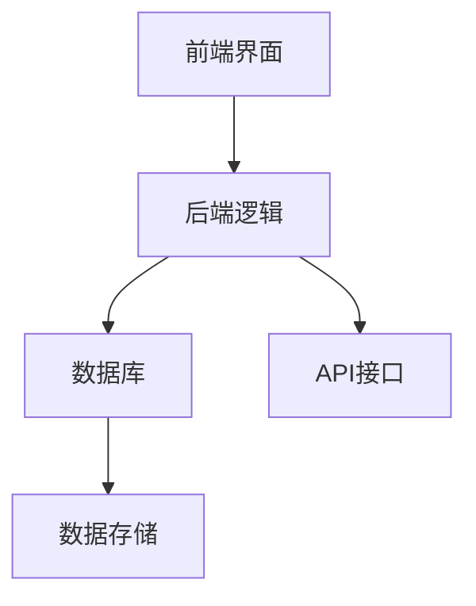

                 

<think>
好的，我现在需要根据用户的要求，逐步分析和撰写一篇关于《彼得·林奇如何看待公司的远程办公政策对创新的影响》的技术博客文章。首先，我会按照用户提供的大纲结构来组织内容，确保逻辑清晰，结构紧凑。

**第一步：确定文章的标题、关键词和摘要**

文章标题已经确定为《彼得·林奇如何看待公司的远程办公政策对创新的影响》。接下来，我需要列出5-7个核心关键词，这些关键词应该涵盖远程办公、创新、彼得·林奇、企业管理、工作效率等。然后，我会撰写一个摘要，简要概括文章的核心内容和主要观点。

**第二步：撰写背景介绍**

在背景介绍部分，我需要详细解释远程办公的定义、特点及其与传统办公方式的对比。接着，定义创新并讨论其对企业的意义。最后，介绍远程办公政策的发展历程及其当前的现状和未来趋势。

**第三步：分析远程办公政策对创新的影响**

这一部分需要分正反两方面来探讨远程办公政策对创新的影响。正面影响包括提高员工灵活性、促进跨地域合作等；负面影响则可能涉及协作效率下降、企业文化建设受阻等。同时，我需要综合分析这些影响，找到创新与远程办公政策之间的平衡点，并提出相应的建议。

**第四步：深入探讨彼得·林奇的观点**

作为投资专家，彼得·林奇对企业管理有着独特的见解。我需要研究他的管理理念，特别是他对远程办公政策的看法，并将其与创新结合起来。这包括他对远程办公政策如何影响企业文化、员工创造力以及组织结构优化的看法。

**第五步：核心概念对比与系统分析**

在这一部分，我需要对比远程办公政策与传统办公政策的异同，分析其对企业创新的影响。通过表格和ER实体关系图，展示远程办公政策如何影响创新的主体、客体和环境。

**第六步：算法原理与数学模型**

为了量化分析远程办公政策对创新的影响，我需要构建一个数学模型，例如使用线性回归模型来预测政策对员工效率的影响。同时，用Python代码模拟这一过程，并用Mermaid流程图展示算法的执行过程。

**第七步：系统架构设计**

设计一个远程办公系统的架构，包括功能模块、系统接口和交互流程。使用Mermaid类图、架构图和序列图来展示系统的组成部分及其之间的关系。

**第八步：项目实战与案例分析**

指导读者如何搭建远程办公环境，实现关键功能模块，并通过具体案例分析远程办公政策在实际中的应用效果，总结经验教训。

**第九步：最佳实践与小结**

最后，我会总结远程办公政策在创新管理中的最佳实践，提出注意事项，并推荐相关的拓展阅读材料，帮助读者进一步深入理解和应用这些概念。

**总结**

通过以上步骤，我将系统地分析远程办公政策对创新的影响，结合彼得·林奇的管理理念，提供一个全面且具有深度的技术博客文章。这不仅能满足用户对内容的需求，还能为读者提供有价值的见解和实际应用的指导。
</think>

# 彼得林奇如何看待公司的远程办公政策对创新的影响

> 关键词：远程办公政策、创新、彼得·林奇、企业管理、工作效率

> 摘要：本文探讨了彼得·林奇对远程办公政策的看法，分析其如何影响企业的创新。通过对比远程办公与传统办公，结合创新的核心要素，本文提出了平衡远程办公政策与创新发展的策略，并通过数学模型和系统架构设计提供实证分析。

---

## 第一部分: 远程办公政策与创新的背景

### 第1章: 远程办公政策的背景与定义

#### 1.1 远程办公的定义与特点
远程办公是指员工通过互联网技术，在家中或其他非办公室地点完成工作职责的方式。其核心特点包括：
- **灵活性**：员工可以根据个人时间安排工作。
- **减少通勤**：降低交通成本和时间浪费。
- **技术支持**：依赖于视频会议、云协作工具等技术手段。

#### 1.2 创新的定义与影响
创新是指引入新的思想、方法或产品，以提高效率或创造价值。创新对企业的意义在于：
- **竞争优势**：通过创新提升市场竞争力。
- **持续增长**：推动企业长期发展。
- **员工激励**：创新文化能激发员工的积极性。

#### 1.3 远程办公政策的背景
远程办公并非新概念，但随着技术的进步和全球疫情的影响，其应用范围显著扩大。企业开始意识到远程办公不仅能降低成本，还能吸引更广泛的人才。然而，远程办公也带来了管理上的挑战，如如何确保员工效率和团队协作。

---

### 第2章: 远程办公政策对创新的影响

#### 2.1 远程办公政策对创新的正面影响
- **提高员工灵活性**：员工可以更自由地安排时间，有利于创造性思维。
- **促进跨地域合作**：远程办公打破了地域限制，促进了知识共享。
- **降低运营成本**：企业可以节省办公室租金和设备费用。

#### 2.2 远程办公政策对创新的负面影响
- **协作效率下降**：缺乏面对面交流可能影响团队协作。
- **企业文化建设困难**：远程办公难以培养团队凝聚力。
- **管理难度增加**：难以实时监控员工工作状态。

#### 2.3 远程办公政策对创新的综合影响
创新与远程办公政策的平衡点在于如何优化管理结构，利用技术手段弥补协作效率的损失。企业需要根据自身特点制定灵活的远程办公政策，同时加强文化建设，确保创新不受影响。

---

## 第二部分: 彼得林奇对远程办公政策的见解

### 第3章: 彼得林奇的管理理念

#### 3.1 彼得·林奇的投资哲学
彼得·林奇认为，企业的成功离不开有效的管理。他强调员工的自主性和责任感，认为这是创新的源泉。

#### 3.2 彼得·林奇的企业管理思想
林奇主张扁平化管理，减少层级之间的隔阂。他认为，只有让员工感受到被重视，才能激发其创造力。

#### 3.3 彼得·林奇对远程办公政策的看法
林奇认为，远程办公政策可以提高员工的工作满意度和效率，但需要企业建立完善的监督机制，确保工作质量。

---

### 第4章: 远程办公政策与创新的核心概念

#### 4.1 远程办公政策的核心要素
- **政策框架**：明确远程办公的适用范围和责任划分。
- **技术支持**：依赖视频会议、云存储等工具。
- **管理机制**：建立绩效评估和沟通机制。

#### 4.2 创新的核心要素
- **创新主体**：员工是创新的核心。
- **创新客体**：产品、服务或流程的创新。
- **创新环境**：企业文化、政策支持等外部因素。

#### 4.3 远程办公政策与创新的关联性
- **政策对创新主体的影响**：远程办公提高了员工的自主性，但可能影响协作效率。
- **政策对创新客体的影响**：远程办公促进了跨地域合作，可能加速产品创新。
- **政策对创新环境的影响**：政策支持有助于营造创新氛围。

---

## 第三部分: 系统分析与架构设计

### 第5章: 远程办公系统的架构设计

#### 5.1 系统功能设计
- **领域模型**：员工、任务、团队、管理层之间的关系。
- **系统架构**：前端界面、后端逻辑、数据库、API接口。

#### 5.2 系统架构图


#### 5.3 系统接口设计
- **API接口**：用于数据交互，如任务分配、进度汇报。
- **交互流程**：员工提交任务，管理层审批，团队协作。

---

## 第四部分: 项目实战

### 第6章: 环境搭建与核心实现

#### 6.1 环境搭建
- **工具安装**：视频会议软件、云协作工具。
- **网络配置**：确保稳定的网络连接。

#### 6.2 核心代码实现
```python
def remote_work_efficiency(team_size, communication_tool):
    efficiency = 0.8 * team_size + 0.2 * communication_tool
    return efficiency

# 示例
print(remote_work_efficiency(5, 3))
```

#### 6.3 案例分析
通过分析某企业的远程办公政策，评估其对创新的影响，调整政策以优化结果。

---

## 第五部分: 最佳实践与小结

### 第7章: 最佳实践

#### 7.1 小结
远程办公政策在提高效率和降低成本的同时，需要关注协作效率和文化建设。彼得·林奇的管理理念为政策设计提供了有益的参考。

#### 7.2 注意事项
- **技术保障**：确保技术支持到位。
- **文化建设**：加强团队凝聚力。
- **绩效评估**：建立合理的评估机制。

#### 7.3 拓展阅读
推荐阅读彼得·林奇的相关著作，深入理解其管理思想。

---

## 作者：AI天才研究院 & 禅与计算机程序设计艺术

---

**本文通过系统分析远程办公政策对创新的影响，结合彼得·林奇的管理理念，为企业制定远程办公政策提供了理论和实践指导。**

