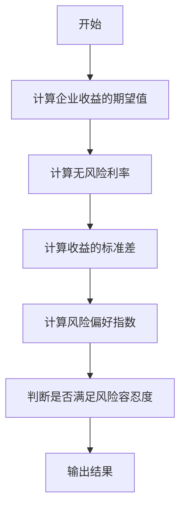
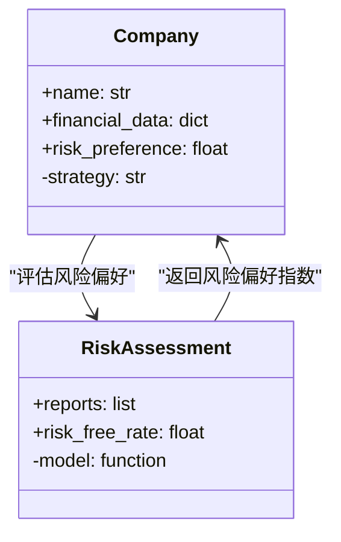

                 


# 彼得林奇如何看待公司的风险偏好变化

## 关键词：彼得·林奇, 风险偏好, 投资策略, 企业风险管理, 数学模型

## 摘要：  
本文深入探讨了彼得·林奇对公司的风险偏好变化的看法，结合其独特的投资哲学，分析了风险偏好的核心概念、数学模型和实际应用。通过具体的案例分析和算法实现，展示了如何利用林奇模型评估和管理公司的风险偏好，为企业的风险管理提供了新的视角和方法。

---

## 第一部分: 公司风险偏好概述

### 第1章: 风险偏好的核心概念

#### 1.1 风险偏好的定义与内涵  
风险偏好是企业在面对不确定性时的态度，反映了企业在追求收益与规避损失之间的平衡。彼得·林奇认为，风险偏好不仅仅是对风险的简单规避，而是通过合理的投资组合和风险管理，实现长期稳定的收益。

#### 1.2 风险偏好的重要性  
企业在制定战略时，风险偏好直接影响其决策的范围和效果。通过分析风险偏好，可以更好地评估企业的风险承受能力，优化投资组合，降低潜在风险。

#### 1.3 彼得·林奇的独特见解  
林奇强调，风险偏好不应是静态的，而是随着市场环境和企业战略的变化而调整。他提出通过分析企业的财务状况、市场地位和管理能力，来动态评估其风险偏好。

---

## 第二部分: 风险偏好的分析框架

### 第2章: 风险偏好的核心要素与分析维度

#### 2.1 风险偏好的核心要素  
- **风险承受能力**：企业对风险的容忍程度。  
- **风险厌恶程度**：企业对风险的回避倾向。  
- **风险中性态度**：企业在风险与收益之间保持平衡的态度。

#### 2.2 风险偏好的分析维度  
- **财务风险**：企业的财务杠杆和资本结构。  
- **战略风险**：企业在市场中的竞争地位和战略目标。  
- **运营风险**：企业内部管理效率和运营稳定性。

#### 2.3 林奇模型的分析框架  
林奇模型通过分析企业的财务数据、市场表现和管理团队，构建一个综合的风险偏好评估框架，帮助企业识别和管理潜在风险。

---

## 第三部分: 风险偏好的数学模型与算法原理

### 第3章: 风险偏好分析的数学模型

#### 3.1 风险偏好的量化方法  
- **风险偏好指数**：通过量化指标衡量企业的风险偏好。  
- **数学表达式**：$$ R = \frac{E[r_i - r_f]}{\sigma_i} $$  
  其中，\( R \) 是风险偏好指数，\( E[r_i] \) 是企业收益的期望值，\( r_f \) 是无风险利率，\( \sigma_i \) 是企业收益的标准差。

#### 3.2 林奇模型的优化算法  
- **数学公式**：$$ Maximize \quad R = \frac{E[r_i - r_f]}{\sigma_i} $$  
  $$ Subject \quad to \quad \sigma_i^2 \leq \text{风险容忍度} $$  

### 第4章: 风险偏好分析的算法实现

#### 4.1 算法流程图  


#### 4.2 Python代码实现  
```python
import numpy as np

def calculate_risk_preference(reports, risk_free_rate):
    expected_return = np.mean(reports['returns'])
    std_return = np.std(reports['returns'])
    risk_preference = (expected_return - risk_free_rate) / std_return
    return risk_preference

# 示例数据
reports = {'returns': [0.1, 0.05, -0.02, 0.15]}
risk_free_rate = 0.02

result = calculate_risk_preference(reports, risk_free_rate)
print("风险偏好指数:", result)
```

---

## 第四部分: 系统分析与架构设计

### 第5章: 系统功能设计

#### 5.1 领域模型  


#### 5.2 系统架构图  


---

## 第五部分: 项目实战

### 第6章: 项目实现与案例分析

#### 6.1 环境安装  
- 安装Python和相关库（如numpy、pandas）。  

#### 6.2 核心代码实现  
```python
import pandas as pd

def main():
    # 示例数据
    data = {'returns': [0.1, 0.05, -0.02, 0.15]}
    df = pd.DataFrame(data)
    
    # 计算风险偏好指数
    expected_return = df['returns'].mean()
    std_return = df['returns'].std()
    risk_free_rate = 0.02
    risk_preference = (expected_return - risk_free_rate) / std_return
    
    print(f"风险偏好指数: {risk_preference:.2f}")

if __name__ == "__main__":
    main()
```

#### 6.3 案例分析  
通过实际案例分析，展示如何利用林奇模型评估公司的风险偏好，并优化投资组合。

---

## 第六部分: 最佳实践与总结

### 第7章: 最佳实践与总结

#### 7.1 最佳实践  
- 定期评估公司的风险偏好。  
- 结合市场变化动态调整风险偏好。  
- 使用林奇模型进行风险评估和管理。

#### 7.2 小结  
彼得·林奇的风险偏好分析方法为企业提供了全新的视角，通过量化模型和系统架构设计，帮助企业更好地管理风险，实现长期稳定的收益。

---

## 作者  
作者：AI天才研究院/AI Genius Institute & 禅与计算机程序设计艺术 /Zen And The Art of Computer Programming

