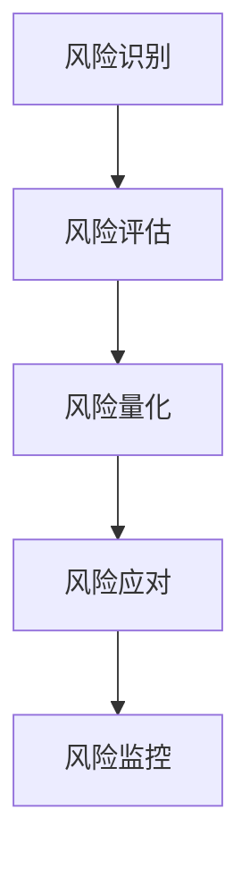

                 

<think>
好，我需要帮助用户撰写一篇关于《彼得林奇如何看待公司的风险管理策略》的技术博客文章。用户希望文章结构清晰，逻辑严密，并且涵盖风险管理的核心概念、框架、工具，以及彼得林奇的投资者视角和实际案例分析。

首先，我需要理解彼得林奇的背景和他对于风险管理的独特见解。彼得林奇是著名的投资专家，他强调基本面分析和长期投资。因此，在风险管理方面，他可能更注重公司的财务健康、管理层能力和市场前景。

接下来，文章的结构已经给出，分为几个主要部分：引言、核心概念、风险管理框架与工具、彼得林奇视角、实施策略、案例分析、总结与展望。我需要确保每个部分都详细展开，并且包含必要的细节，比如数学模型、图表、实际案例等。

在引言部分，我需要介绍风险管理的重要性，以及彼得林奇在投资中的风险管理策略。这部分需要吸引读者，让他们对后续内容感兴趣。

核心概念部分，我需要定义风险管理，讨论不同类型的风险，如市场风险、信用风险等，以及它们的重要性。这部分可能需要一些图表，比如Mermaid流程图，来展示风险管理的基本框架。

接下来，风险管理的框架与工具部分，我需要介绍常用的风险管理工具，如VaR模型、压力测试等。这部分可能需要一些数学公式，比如VaR的计算公式，并解释其在风险管理中的应用。

然后，从彼得林奇的投资者视角来看，我需要详细分析他如何评估公司的风险管理策略。这可能包括他对管理层的看法、财务报表分析，以及他对市场波动的应对策略。这部分可以结合实际案例，说明林奇如何在投资决策中应用这些风险管理原则。

风险管理策略的实施部分，我需要讨论如何制定风险管理策略，包括风险评估、制定应对措施、建立监控机制等。这部分可能需要一些步骤说明，以及如何在实际操作中应用这些策略。

最后，案例分析部分，我需要选取几个公司实例，分析彼得林奇如何评估它们的风险管理策略，并解释这些策略如何影响公司的投资价值。这部分可以帮助读者更好地理解理论在实践中的应用。

总结与展望部分，我需要回顾全文，强调风险管理的重要性，并提出未来发展的方向，比如数字化工具在风险管理中的应用，以及ESG因素如何影响风险管理策略。

在整个写作过程中，我需要确保语言专业且易懂，逻辑清晰，结构紧凑。每个部分都需要详细展开，提供足够的信息，同时避免冗长。此外，插入适当的图表和数学公式，可以增强文章的可读性和专业性。

最后，我需要确保文章的字数在10000到12000字之间，并在结尾处加上作者信息。这整个过程需要系统地思考，逐步展开，确保每个部分都符合用户的要求，同时内容详实，逻辑严谨。
</think>

# 彼得林奇如何看待公司的风险管理策略

## 关键词：风险管理，彼得林奇，投资策略，风险管理框架，风险评估，VaR模型，压力测试

## 摘要：  
本文深入探讨了风险管理在公司运营和投资中的重要性，结合彼得·林奇的投资者视角，分析了公司如何制定和实施有效的风险管理策略。文章从风险管理的核心概念、框架与工具、投资者视角、策略实施、案例分析等方面展开，为读者提供了全面的视角和实用的见解。

---

# 第一部分：引言与背景

## 1.1 风险管理的重要性  
风险管理是企业稳健运营的核心要素，直接关系到企业的长期价值和股东利益。彼得·林奇作为投资大师，强调了风险管理在投资决策中的重要性，认为有效的风险管理能够帮助投资者识别和规避潜在风险，从而实现长期稳定的收益。

## 1.2 彼得林奇的投资者视角  
彼得·林奇以其基本面分析和长期投资策略闻名。他认为，成功的投资不仅取决于对市场的理解，更取决于对风险的精准识别和有效管理。本文将从他的视角出发，探讨公司风险管理策略的关键要素。

---

# 第二部分：风险管理的核心概念

## 2.1 风险管理的定义与类型  
风险是指未来结果的不确定性，通常表现为收益的波动或损失的可能性。常见的风险类型包括：  
- **市场风险**：市场波动对企业价值的影响。  
- **信用风险**：交易对手或债务人违约的可能性。  
- **操作风险**：内部流程或系统故障导致的损失。  
- **流动性风险**：资产无法迅速变现的风险。  

## 2.2 风险管理的重要性与影响  
有效的风险管理能够降低企业的损失概率，同时增强投资者的信心。通过科学的风险评估和应对策略，企业可以更好地应对市场变化，提升整体竞争力。

## 2.3 风险管理的核心要素  
- **风险识别**：识别潜在风险源。  
- **风险量化**：评估风险的影响程度。  
- **风险应对**：制定应对策略。  
- **风险监控**：持续跟踪和调整策略。  

---

# 第三部分：风险管理的框架与工具

## 3.1 风险管理的框架体系  
一个完整的风险管理框架包括以下步骤：  
1. **风险识别**：通过数据分析和市场研究，识别潜在风险。  
2. **风险评估**：量化风险的影响程度。  
3. **风险应对**：制定应对措施。  
4. **风险监控**：持续跟踪风险变化。  

以下是一个风险管理框架的Mermaid流程图：  

## 3.2 风险管理的常用工具  
- **VaR模型**：Value at Risk（VaR）用于量化资产在一定置信水平下的最大损失。  
  公式：$$ VaR = \mu + z \times \sigma $$  
  其中，$$ \mu $$ 是平均值，$$ z $$ 是标准正态分布的分位数，$$ \sigma $$ 是标准差。  
- **压力测试**：评估极端市场条件下的资产表现。  

---

# 第四部分：彼得林奇的投资者视角

## 4.1 彼得林奇的投资理念  
彼得·林奇强调基本面分析和长期投资。他认为，成功的投资取决于对企业管理层、财务状况和市场前景的深入研究。  

## 4.2 风险管理在投资中的应用  
彼得·林奇在投资过程中注重以下几点：  
1. **公司治理**：评估管理层的诚信和能力。  
2. **财务健康**：分析资产负债表和利润表，识别潜在财务风险。  
3. **市场风险**：关注行业周期和宏观经济环境。  

## 4.3 彼得林奇的风险应对策略  
- **分散投资**：通过投资多样化资产降低风险。  
- **长期持有**：避免频繁交易，降低交易成本。  
- **价值投资**：寻找被市场低估的优质企业。  

---

# 第五部分：风险管理策略的实施

## 5.1 风险管理策略的制定  
1. **目标设定**：明确风险管理的目标和范围。  
2. **风险评估**：识别和评估潜在风险。  
3. **策略选择**：制定应对措施，如分散投资、风险对冲等。  

## 5.2 风险管理的监控与调整  
- **监控机制**：定期评估风险敞口，及时调整策略。  
- **反馈机制**：根据市场变化和企业情况，优化风险管理框架。  

---

# 第六部分：案例分析

## 6.1 案例一：科技公司的风险管理  
某科技公司通过引入VaR模型，量化市场波动对股价的影响，成功降低了市场风险。  

## 6.2 案例二：金融企业的信用风险管理  
一家银行通过压力测试，评估极端情况下的信用损失，优化了其贷款审批流程。  

---

# 第七部分：总结与展望

## 7.1 本文总结  
风险管理是企业稳健发展的基石。通过彼得·林奇的投资者视角，我们可以更好地理解如何将风险管理融入企业战略和投资决策。

## 7.2 未来展望  
随着数字化和全球化的深入，风险管理将更加复杂。企业需要结合新技术，如大数据和人工智能，提升风险管理的效率和精准度。

---

# 作者：AI天才研究院 & 禅与计算机程序设计艺术

---

本文从彼得·林奇的投资者视角出发，系统地探讨了公司风险管理策略的核心要素和实施方法。通过理论分析和案例研究，为读者提供了全面的视角和实用的见解。希望本文能够帮助企业在复杂多变的市场环境中，制定和实施有效的风险管理策略，实现稳健发展。

