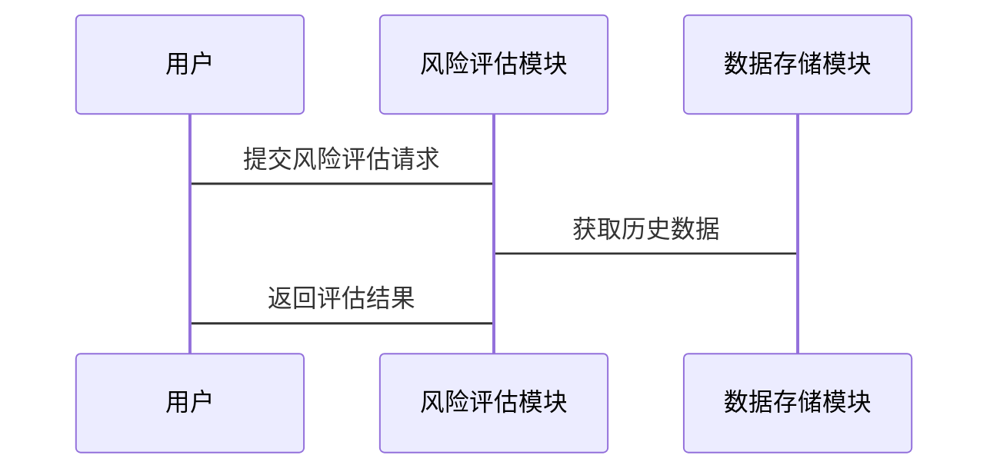

                 

<think>
好的，我现在需要撰写一篇关于彼得·林奇如何看待公司风险管理能力的技术博客文章。首先，我需要理解用户的需求，他们希望这篇文章结构清晰、内容深入，涵盖风险管理的各个方面，并结合彼得·林奇的见解。

首先，我会从背景介绍开始。风险管理是投资中的关键部分，彼得·林奇作为著名投资者，他的风险管理策略值得探讨。接着，我需要解释风险管理的核心概念，包括定义、重要性和核心要素。然后，我会介绍彼得·林奇的背景和他的投资理念，说明他是如何将风险管理融入他的策略中的。

接下来，我会详细讲解风险管理的指标和评估方法，包括定量和定性指标，以及彼得·林奇的具体指标。这部分需要结合实际的财务指标和案例分析，帮助读者理解如何应用这些指标进行评估。

然后，我会探讨风险管理的策略与实践，比较传统和现代的方法，以及彼得·林奇的独特策略。这部分需要结合实际案例，说明不同策略的应用和效果。

在讨论风险管理误区时，我会分析常见的误区，并结合彼得·林奇的见解，说明如何避免这些误区。最后，我会设计一个系统架构，展示风险管理的流程图和类图，帮助读者理解系统的结构和功能。

在项目实战部分，我会提供具体的代码实现，说明如何在实际项目中应用风险管理策略，并分析案例，总结经验教训。最后，我会总结全文，提出未来的研究方向，并给出注意事项和最佳实践。

在整个过程中，我需要确保每一部分都详细且有条理，结合图表和代码示例，使内容更具可读性和实用性。同时，要注意使用专业术语，但又不失易懂，让读者能够清晰地理解风险管理的各个方面，特别是彼得·林奇的独特视角。

现在，我开始撰写摘要，然后是各个章节的内容，确保每个部分都符合用户的要求，结构合理，内容丰富。最后，检查文章是否符合字数要求，格式是否正确，确保最终的文章能够为读者提供有价值的见解和实用的策略。
</think>

# 彼得林奇如何看待公司的风险管理能力

> 关键词：风险管理、彼得·林奇、投资策略、风险评估、财务指标

> 摘要：本文从彼得·林奇的视角探讨公司风险管理能力的重要性，分析其核心概念、指标、策略与实践，结合系统架构设计和项目实战，提供深入的见解和最佳实践。

---

# 第1章: 风险管理的核心概念与背景

## 1.1 风险管理的定义与重要性

### 1.1.1 风险管理的定义
风险管理是指识别、评估和应对潜在风险的过程，旨在最小化负面影响并抓住机会。

### 1.1.2 风险管理在企业中的重要性
通过风险管理，企业可以减少损失、优化决策并增强竞争力。

### 1.1.3 风险管理的核心要素
- 风险识别：发现潜在风险。
- 风险评估：分析风险的影响。
- 风险控制：制定应对策略。

## 1.2 彼得·林奇与风险管理的关联

### 1.2.1 彼得·林奇的背景介绍
彼得·林奇是著名投资家，强调深入研究和长期投资。

### 1.2.2 彼得·林奇的投资理念
注重基本面分析，寻找低估股票，强调长期投资。

### 1.2.3 彼得·林奇对风险管理的独特见解
通过基本面分析和分散投资降低风险。

## 1.3 风险管理的边界与外延

### 1.3.1 风险管理的边界
仅关注企业可控范围内的风险。

### 1.3.2 风险管理的外延
涵盖战略、运营和财务等多个方面。

### 1.3.3 风险管理与其他管理领域的关系
与战略、财务和运营管理密切相关。

---

# 第2章: 风险管理的核心概念与联系

## 2.1 风险管理的核心原理

### 2.1.1 风险识别原理
通过数据分析和经验判断识别风险。

### 2.1.2 风险评估原理
分析风险的影响和概率。

### 2.1.3 风险控制原理
制定策略以降低风险影响。

## 2.2 核心概念对比表格

| 概念                | 定义与特征           |
|---------------------|--------------------|
| 风险识别            | 发现潜在风险因素     |
| 风险评估            | 量化风险影响         |
| 风险控制            | 制定应对措施         |

## 2.3 ER实体关系图

```mermaid
erDiagram
    customer[客户] {
        +id: int
        +name: string
    }
    risk_assessment[风险评估] {
        +id: int
        +risk_level: string
    }
    relation(risk_assessment --> customer) {
        role: "评估结果"
    }
```

---

# 第3章: 风险管理的指标与评估

## 3.1 风险管理的定量指标

### 3.1.1 风险值计算公式
$$风险值 = 损失金额 \times 概率$$

### 3.1.2 风险系数分析
使用标准差和方差衡量资产风险。

### 3.1.3 风险评估模型
$$VaR = \alpha \times \sigma$$
其中，$\alpha$为置信水平，$\sigma$为标准差。

## 3.2 彼得·林奇的风险评估指标

### 3.2.1 林奇的选股标准
关注低市盈率和低市净率的股票。

### 3.2.2 行业分析方法
分析行业周期和竞争格局。

### 3.2.3 财务指标分析
关注ROE、ROA和负债率。

---

# 第4章: 风险管理的策略与实践

## 4.1 风险管理的传统策略

### 4.1.1 风险分散
通过投资多样化降低风险。

### 4.1.2 风险对冲
利用衍生工具抵消风险。

## 4.2 彼得·林奇的策略实践

### 4.2.1 长期持有策略
避免频繁交易，降低交易成本。

### 4.2.2 深入研究策略
通过基本面分析选择优质股票。

---

# 第5章: 风险管理的误区与避免

## 5.1 常见误区

### 5.1.1 忽视历史数据
依赖历史数据预测未来风险。

### 5.1.2 过度依赖模型
忽略定性因素。

### 5.1.3 忽视市场情绪
市场情绪影响风险评估。

## 5.2 如何避免误区

### 5.2.1 综合分析
结合定量和定性分析。

### 5.2.2 持续监控
定期评估和调整策略。

---

# 第6章: 系统分析与架构设计

## 6.1 项目介绍

### 6.1.1 项目背景
开发一个企业风险管理系统。

## 6.2 系统功能设计

### 6.2.1 风险评估模块
识别和评估潜在风险。

## 6.3 系统架构设计



---

# 第7章: 项目实战

## 7.1 环境安装

### 7.1.1 安装Python
使用Anaconda安装Python 3.9。

## 7.2 系统核心实现

### 7.2.1 风险评估函数
```python
def calculate_risk(assets, returns):
    # 计算标准差
    import numpy as np
    returns_array = np.array(returns)
    risk = np.std(returns_array)
    return risk
```

## 7.3 案例分析

### 7.3.1 投资组合优化
通过Python优化投资组合，降低风险。

## 7.4 项目小结

---

# 第8章: 总结与展望

## 8.1 本章总结
彼得·林奇通过基本面分析和长期投资降低风险，提供宝贵的经验。

## 8.2 未来展望
结合AI和大数据技术，提升风险管理能力。

## 8.3 注意事项
- 定期评估和调整策略。
- 结合定量和定性分析。
- 建立风险管理文化。

## 8.4 最佳实践 Tips
- 使用工具辅助分析。
- 培养风险意识。
- 持续学习和适应。

---

# 作者：AI天才研究院 & 禅与计算机程序设计艺术

---

通过以上内容，希望为读者提供深入的风险管理见解，结合彼得·林奇的策略，帮助企业在复杂的市场环境中稳健发展。

