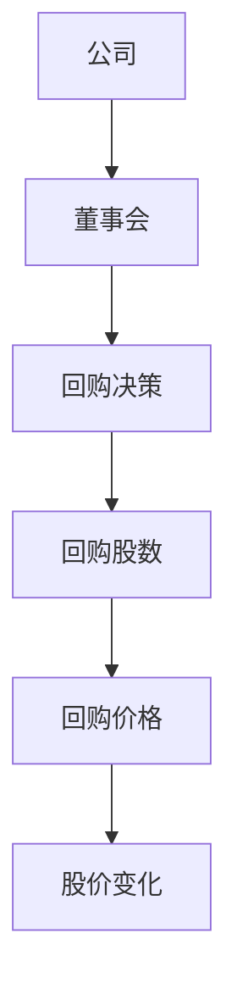

                 


# 彼得林奇如何看待股票回购

---

## 关键词：股票回购、彼得·林奇、投资策略、股东价值、市场反应

---

## 摘要：本文深入分析了彼得·林奇对股票回购的看法，探讨了股票回购的定义、类型及其对股价的影响，结合彼得·林奇的投资理念，提出了如何在实际投资中运用回购策略的建议。通过数学模型和案例分析，帮助投资者更好地理解股票回购的价值与风险。

---

## 第一部分: 股票回购的背景与概念

### 第1章: 股票回购的基本概念

#### 1.1 股票回购的定义与背景

股票回购是指公司用自有资金从市场上回购本公司股票的行为。这一过程通常通过公开市场操作或私下协商完成。股票回购的背景可以追溯到19世纪末，随着股份公司制度的兴起，回购作为一种资本运作工具逐渐被广泛采用。20世纪80年代，股票回购在美国市场变得尤为常见，尤其是在彼得·林奇等投资经理的推动下，回购成为提升股东价值的重要手段之一。

#### 1.2 股票回购的动机与目的

公司进行股票回购的动机多种多样，主要包括：

1. **提高股东价值**：通过减少流通股数量，提升每股收益（EPS），从而推高股价。
2. **防御性回购**：为了避免公司被恶意收购或防止股价过度波动。
3. **信号传递理论**：回购被视为公司对其股价被低估的信号，可能提振市场信心。
4. **公司治理因素**：优化股权结构，激励管理层。

#### 1.3 股票回购的类型与方式

股票回购主要有以下几种类型：

1. **固定价格回购**：公司以固定价格从市场上回购股票，通常在股价被低估时进行。
2. **股价敏感回购**：回购价格随市场股价波动而调整。
3. **公开市场回购**：公司通过公开市场直接回购股票。
4. **私人洽购**：公司与特定投资者私下协商回购股票。

---

### 第2章: 股票回购对股价的影响

#### 2.1 股票回购的直接影响

股票回购直接影响股价的因素包括：

1. **股票供给减少**：回购减少市场上的流通股数量，可能导致股价上涨。
2. **市场资本结构变化**：回购可能导致公司负债减少，资产结构优化。
3. **股东权益变化**：回购会影响公司的股东权益，包括股本、资本公积等。

#### 2.2 股票回购的间接影响

回购的间接影响包括：

1. **市场情绪变化**：回购可能提升市场对公司的信心。
2. **行业竞争格局影响**：行业内的回购行为可能改变竞争态势。
3. **投资者信心提升**：回购被视为公司对其未来前景的看好。

#### 2.3 股票回购的市场反应分析

市场对回购的反应因多种因素而异：

1. **短期市场反应**：回购消息公布后，股价可能迅速上涨。
2. **长期市场反应**：回购的效果取决于公司的长期表现。
3. **不同市场环境下的反应差异**：牛市和熊市中的回购效果可能截然不同。

---

## 第二部分: 彼得·林奇的股票回购策略

### 第3章: 彼得·林奇的投资理念与股票回购

#### 3.1 彼得·林奇的投资风格概述

彼得·林奇以其独特的投资理念闻名，他强调：

1. **价值投资与成长投资的结合**：寻找基本面良好且具有成长性的公司。
2. **中小盘股的投资偏好**：倾向于投资那些市值较小但潜力大的公司。
3. **长期投资与股东价值最大化**：注重公司的长期发展和股东价值的提升。

#### 3.2 彼得·林奇对股票回购的看法

彼得·林奇认为，股票回购是公司管理团队对公司未来前景有信心的表现。他强调：

1. **股票回购的潜在价值**：回购可以提升每股收益，优化资本结构。
2. **股票回购的风险与挑战**：公司必须确保有足够的现金流支持回购，同时避免过度回购导致的资金链紧张。
3. **股票回购与公司治理的关系**：回购有助于优化股权结构，激励管理层。

---

### 第4章: 彼得·林奇分析股票回购的框架

#### 4.1 股票回购的数学模型与公式

股票回购对股价的影响可以用以下公式简化：

$$ \text{新股价} = \frac{\text{公司总价值}}{\text{流通股数量 - 回购股数}} $$

假设某公司总价值为$V$，流通股数量为$N$，回购股数为$R$，则回购后的股价为：

$$ \text{新股价} = \frac{V}{N - R} $$

#### 4.2 股票回购的算法原理

以下是股票回购的算法步骤：

1. **确定回购条件**：公司现金流充裕，股价被低估。
2. **计算回购股数**：根据公司资本预算和股价，确定回购股数。
3. **执行回购**：通过公开市场或私下协商完成回购。
4. **更新股价**：回购后计算新股价，评估市场反应。

以下是一个简单的Python代码示例，模拟回购对股价的影响：

```python
def calculate回购后的股价(V, N, R):
    return V / (N - R)

V = 100000000  # 公司总价值（美元）
N = 1000000     # 流通股数量
R = 100000      # 回购股数

回购后的股价 = calculate回购后的股价(V, N, R)
print(f"回购后的股价为: ${回购后的股价:.2f}")
```

#### 4.3 股票回购的系统架构

以下是股票回购的系统架构图：



---

## 第三部分: 股票回购的实战与总结

### 第5章: 股票回购的实战分析

#### 5.1 回购案例分析

假设某公司总价值为$100000000，流通股数量为$1000000，回购股数为$100000。根据公式：

$$ \text{回购后的股价} = \frac{100000000}{1000000 - 100000} = 111.11 $$

回购前股价为$100，回购后股价为$111.11，提升了11.11%。

#### 5.2 回购的注意事项

1. **现金流充足**：公司必须有足够的现金流支持回购。
2. **股价合理**：回购应在股价被低估时进行。
3. **长期关注**：回购后需关注公司基本面变化。

---

## 结语

彼得·林奇认为，股票回购是公司管理团队对公司未来前景有信心的表现。通过合理运用回购策略，投资者可以有效提升股东价值，优化公司资本结构。然而，回购也存在一定的风险，投资者需谨慎分析公司基本面和市场环境。

---

## 作者

作者：AI天才研究院/AI Genius Institute  
联系邮箱：contact@ai-genius.com  
文章版权归作者所有，转载请注明出处。

---

**全文完。**

