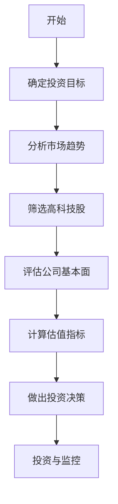

                 


# 彼得林奇如何看待高科技股投资

## 关键词：
- 彼得林奇
- 高科技股
- 投资策略
- 市场分析
- 选股标准

## 摘要：
本文深入探讨了投资大师彼得·林奇对高科技股投资的独特见解。通过分析他的投资策略、选股标准和市场分析方法，结合具体案例，为读者提供实用的投资指导。

---

## 第一部分：投资概述

### 第1章：投资的基本概念

#### 1.1 投资的定义与分类
- **投资的定义**：指将资金投入某个项目或资产，期望在未来获得收益的行为。
- **高科技股的定义**：指科技公司发行的股票，涵盖互联网、人工智能、生物技术等领域。
- **高科技股的特点**：高增长潜力、高波动性、高风险高回报。

#### 1.2 高科技股的重要性
- **行业趋势**：科技行业是推动经济增长的核心，高科技股在股市中占据重要地位。
- **投资机会**：技术创新带来持续增长，投资者可通过投资高科技股分享收益。
- **风险与收益**：高科技股波动大，但长期回报潜力巨大。

---

## 第二部分：彼得林奇的投资策略

### 第2章：彼得林奇的投资理念

#### 2.1 彼得林奇的投资哲学
- **长期投资**：避免短期波动，关注公司长期价值。
- **价值投资**：寻找被市场低估的公司，长期持有。
- **分散投资**：降低风险，避免过度集中。

#### 2.2 彼得林奇的市场分析方法
- **市场周期**：识别市场的牛熊周期，抓住投资机会。
- **行业趋势**：关注行业发展方向，选择朝阳产业。
- **公司基本面**：分析财务报表，评估公司盈利能力。

### 第3章：彼得林奇的选股标准

#### 3.1 高科技股的选股指标
- **市盈率（P/E）**：衡量股票价格与盈利能力的关系。
  $$市盈率 = \frac{股票价格}{每股收益}$$
- **市净率（P/B）**：评估股票价格与账面价值的比率。
  $$市净率 = \frac{股票价格}{每股净资产}$$
- **营收增长率**：反映公司收入增长速度。
  $$营收增长率 = \frac{本年营收增长}{上年营收} \times 100\%$$

#### 3.2 公司竞争力评估
- **技术优势**：公司是否拥有独特的技术或专利。
- **市场地位**：公司是否为行业领导者，市场份额如何。
- **管理团队**：管理层的经验和能力是否可靠。

---

## 第三部分：投资模型与数学分析

### 第4章：彼得林奇的投资模型

#### 4.1 投资模型的构建
- **模型定义**：通过量化指标筛选投资标的。
- **核心指标**：市盈率、市净率、营收增长率等。
- **决策逻辑**：结合定量和定性分析，做出投资决策。

#### 4.2 投资模型的数学公式
- **市盈率计算**：
  $$市盈率 = \frac{股票价格}{每股收益}$$
- **市净率计算**：
  $$市净率 = \frac{股票价格}{每股净资产}$$
- **营收增长率计算**：
  $$营收增长率 = \frac{本年营收增长}{上年营收} \times 100\%$$

### 第5章：案例分析与流程图

#### 5.1 投资流程图


---

## 第四部分：系统分析与架构设计

### 第6章：系统分析

#### 6.1 问题场景介绍
- **投资决策**：如何选择合适的高科技股。
- **系统目标**：构建一个基于彼得林奇策略的投资决策支持系统。

#### 6.2 系统架构设计
- **功能模块**：
  - 数据采集：获取公司财务数据和市场信息。
  - 指标计算：计算市盈率、市净率等指标。
  - 模型评估：应用彼得林奇的选股标准进行评估。
  - 投资建议：生成投资建议报告。

#### 6.3 系统架构图


---

## 第五部分：项目实战

### 第7章：项目实战

#### 7.1 环境安装
- **工具选择**：使用Python进行数据处理，利用pandas和numpy库。
- **数据来源**：从Yahoo Finance获取股票数据。

#### 7.2 核心实现
```python
import pandas as pd
import numpy as np

# 示例代码：计算市盈率和市净率
def calculate_metrics(ticker):
    # 获取数据
    data = pd.DataFrame({'ticker': ticker})
    # 假设我们已经获取了每股收益和每股净资产
    eps = 2.5  # 示例数据
    book_value = 10.0  # 示例数据
    # 计算市盈率和市净率
    pe = data['股票价格'] / eps
    pb = data['股票价格'] / book_value
    return pe, pb

# 应用示例
ticker = 'AAPL'
pe, pb = calculate_metrics(ticker)
print(f"市盈率：{pe}, 市净率：{pb}")
```

---

## 第六部分：总结与建议

### 第8章：总结与建议

#### 8.1 总结
- 彼得林奇的投资策略强调长期价值和基本面分析。
- 高科技股投资需要结合定量和定性分析，选择具有强大技术优势和良好财务状况的公司。

#### 8.2 投资建议
- **分散投资**：避免将所有资金投入单一股票。
- **持续学习**：关注行业动态和技术发展。
- **长期持有**：耐心持有优质股票，避免频繁交易。

#### 8.3 注意事项
- **风险管理**：设定止损点，控制投资风险。
- **市场波动**：高科技股波动较大，需做好心理准备。
- **数据验证**：确保数据来源可靠，避免误判。

#### 8.4 拓展阅读
- 建议阅读彼得·林奇的书籍，深入理解他的投资理念。
- 关注行业报告和技术分析，提升投资决策能力。

---

## 作者：AI天才研究院/AI Genius Institute & 禅与计算机程序设计艺术 /Zen And The Art of Computer Programming

---

本文通过详细分析彼得·林奇的投资策略，结合实际案例和数学模型，为投资者提供了实用的高科技股投资指南。希望读者能从中获得启发，做出明智的投资决策。

