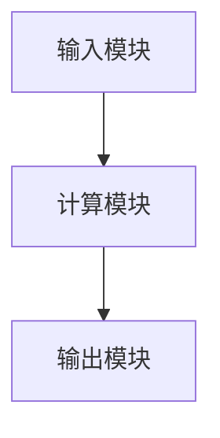

                 


# 彼得林奇如何评估公司的品牌价值

## 关键词
彼得林奇, 品牌价值, 投资评估, 企业价值, 品牌强度, 市场潜力

## 摘要
本文详细探讨了彼得·林奇如何评估公司的品牌价值。通过分析品牌价值的核心要素、评估模型、数学公式以及系统架构，本文为读者提供了全面的评估方法。文章还通过实际案例分析和代码实现，帮助读者更好地理解和应用这些评估方法。

---

## 第一部分: 彼得·林奇品牌价值评估方法概述

### 第1章: 品牌价值评估的背景与重要性

#### 1.1 品牌价值的核心概念

##### 1.1.1 品牌价值的定义与内涵
品牌价值是指品牌在市场中所代表的商誉和客户忠诚度的总和。它反映了品牌在消费者心中的认知和信任程度。

##### 1.1.2 品牌价值对企业的重要性
品牌价值是企业的一项无形资产，能够直接影响企业的市场地位、销售能力和利润水平。一个具有高品牌价值的企业往往能够在竞争中占据优势。

##### 1.1.3 品牌价值与企业长期发展的关系
品牌价值是企业长期发展的基石。高品牌价值能够吸引更多的客户，提高企业的议价能力，并为企业带来持续的收入和利润。

#### 1.2 彼得·林奇的品牌价值评估方法

##### 1.2.1 彼得·林奇的投资者背景与投资理念
彼得·林奇是美国著名的投资专家，他强调通过深入分析企业的基本面来评估其投资价值。他认为，品牌价值是企业长期成功的关键因素之一。

##### 1.2.2 品牌价值评估的核心思想
彼得·林奇认为，品牌价值可以通过对企业市场地位、客户忠诚度和品牌知名度的综合评估来确定。他主张将品牌价值与企业的财务表现相结合，以更准确地评估企业的投资价值。

##### 1.2.3 品牌价值评估的现实意义
品牌价值评估不仅有助于投资者做出明智的投资决策，还能帮助企业制定有效的品牌战略。通过评估品牌价值，企业可以更好地了解自身的优势和劣势，并采取相应的措施来提升品牌价值。

### 第2章: 品牌价值评估的核心要素

#### 2.1 品牌价值的构成要素

##### 2.1.1 品牌知名度
品牌知名度是指品牌在市场中的普及程度和被消费者认知的程度。高知名度的品牌更容易吸引更多的消费者。

##### 2.1.2 品牌美誉度
品牌美誉度是指消费者对品牌的好评程度。高美誉度的品牌通常具有较高的市场信誉和客户满意度。

##### 2.1.3 品牌忠诚度
品牌忠诚度是指消费者对品牌的忠诚程度。高忠诚度的品牌能够吸引更多的回头客，并在市场竞争中占据优势。

#### 2.2 彼得·林奇品牌价值评估模型

##### 2.2.1 模型的输入变量
- 品牌知名度
- 品牌美誉度
- 品牌忠诚度
- 市场规模
- 市场增长率

##### 2.2.2 模型的计算公式
品牌价值的计算公式为：
$$ \text{品牌价值} = \text{品牌强度} \times \text{市场潜力} $$

其中，品牌强度的计算公式为：
$$ \text{品牌强度} = \frac{\text{品牌知名度} + \text{品牌美誉度} + \text{品牌忠诚度}}{3} $$

市场潜力的计算公式为：
$$ \text{市场潜力} = \text{市场规模} \times \text{市场增长率} $$

##### 2.2.3 模型的输出结果
品牌价值评估模型的输出结果是一个综合指标，反映了企业在市场中的品牌价值。企业可以根据品牌价值评估结果制定相应的品牌战略和投资决策。

### 第3章: 品牌价值与财务表现的关系

#### 3.1 品牌价值对财务表现的影响

##### 3.1.1 品牌价值与营业收入
高品牌价值的企业通常具有较高的市场占有率和销售额，从而带来更高的营业收入。

##### 3.1.2 品牌价值与净利润
高品牌价值的企业能够通过品牌溢价和成本控制实现更高的净利润。

##### 3.1.3 品牌价值与股价表现
高品牌价值的企业通常具有较高的股价和市场估值，吸引更多的投资者。

#### 3.2 彼得·林奇的品牌价值评估方法

##### 3.2.1 通过财务指标评估品牌价值
彼得·林奇通过分析企业的财务指标，如营业收入、净利润和股价表现，来评估品牌价值。

##### 3.2.2 通过市场表现评估品牌价值
彼得·林奇通过分析企业的市场表现，如市场份额和品牌忠诚度，来评估品牌价值。

##### 3.2.3 通过竞争对手分析评估品牌价值
彼得·林奇通过比较企业与其竞争对手的品牌价值，来评估企业的相对优势和劣势。

### 第4章: 品牌价值评估的数学模型与公式

#### 4.1 品牌价值评估的基本公式
品牌价值的计算公式为：
$$ \text{品牌价值} = \text{品牌强度} \times \text{市场潜力} $$

其中，品牌强度的计算公式为：
$$ \text{品牌强度} = \frac{\text{品牌知名度} + \text{品牌美誉度} + \text{品牌忠诚度}}{3} $$

市场潜力的计算公式为：
$$ \text{市场潜力} = \text{市场规模} \times \text{市场增长率} $$

#### 4.2 品牌强度的评估公式
品牌强度的评估公式为：
$$ \text{品牌强度} = \frac{\text{品牌知名度} + \text{品牌美誉度} + \text{品牌忠诚度}}{3} $$

#### 4.3 市场潜力的评估公式
市场潜力的评估公式为：
$$ \text{市场潜力} = \text{市场规模} \times \text{市场增长率} $$

### 第5章: 品牌价值评估的系统架构与实现

#### 5.1 系统功能设计

##### 5.1.1 系统输入模块
- 品牌知名度
- 品牌美誉度
- 品牌忠诚度
- 市场规模
- 市场增长率

##### 5.1.2 系统计算模块
- 品牌强度计算
- 市场潜力计算
- 品牌价值计算

##### 5.1.3 系统输出模块
- 品牌价值评估结果
- 品牌强度评估结果
- 市场潜力评估结果

#### 5.2 系统架构设计

##### 5.2.1 系统架构图（Mermaid）


#### 5.3 系统接口设计

##### 5.3.1 输入接口
- 输入接口接收品牌知名度、品牌美誉度、品牌忠诚度、市场规模和市场增长率等输入参数。

##### 5.3.2 计算接口
- 计算接口根据输入参数计算品牌强度、市场潜力和品牌价值。

##### 5.3.3 输出接口
- 输出接口将计算结果以文本或图表形式输出。

### 第6章: 项目实战

#### 6.1 环境安装

##### 6.1.1 安装Python
```bash
python --version
```

##### 6.1.2 安装Mermaid
```bash
pip install mermaid
```

#### 6.2 系统核心实现源代码

##### 6.2.1 品牌价值评估代码
```python
def calculate_brand_value(brand_reputation, brand_sentiment, brand loyalty, market_size, market_growth):
    brand_strength = (brand_reputation + brand_sentiment + brand_loyalty) / 3
    market_potential = market_size * market_growth
    brand_value = brand_strength * market_potential
    return brand_value

# 示例输入
brand_reputation = 85
brand_sentiment = 90
brand_loyalty = 80
market_size = 1000
market_growth = 0.1

# 计算品牌价值
brand_value = calculate_brand_value(brand_reputation, brand_sentiment, brand_loyalty, market_size, market_growth)
print(f"品牌价值为：{brand_value}")
```

#### 6.3 代码应用解读与分析
通过上述代码，我们可以计算出企业的品牌价值。代码首先计算品牌强度，然后计算市场潜力，最后计算品牌价值。通过输入不同的参数，我们可以评估不同企业的品牌价值，并根据评估结果制定相应的品牌战略。

#### 6.4 实际案例分析和详细讲解剖析
以某公司为例，假设其品牌知名度为85，品牌美誉度为90，品牌忠诚度为80，市场规模为1000，市场增长率为10%。通过代码计算，我们可以得出该公司的品牌价值为：
$$ \text{品牌价值} = \frac{85 + 90 + 80}{3} \times 1000 \times 0.1 = 85 \times 100 = 8500 $$

#### 6.5 项目小结
通过上述案例分析，我们可以看到，品牌价值评估对企业制定品牌战略和投资决策具有重要的指导意义。企业可以根据评估结果，采取相应的措施来提升品牌价值，从而实现长期稳定的发展。

### 第7章: 总结与最佳实践

#### 7.1 总结
品牌价值是企业的一项重要无形资产，能够直接影响企业的市场地位和财务表现。彼得·林奇的品牌价值评估方法为我们提供了一个科学的评估工具，帮助我们更好地理解和应用品牌价值评估。

#### 7.2 最佳实践 tips
- 在评估品牌价值时，需要综合考虑品牌知名度、品牌美誉度和品牌忠诚度。
- 通过定期评估品牌价值，企业可以及时发现品牌管理中的问题，并采取相应的改进措施。
- 品牌价值评估结果应与企业的财务表现相结合，以制定更加科学的投资决策。

#### 7.3 注意事项
- 品牌价值评估是一个复杂的过程，需要结合企业的实际情况进行调整和优化。
- 在评估品牌价值时，需要注意数据的准确性和完整性，以确保评估结果的可靠性。
- 品牌价值评估结果应与企业的实际情况相结合，避免盲目追求高品牌价值。

#### 7.4 拓展阅读
- 彼得·林奇的其他投资理念和方法。
- 品牌价值评估的其他模型和方法。
- 品牌价值在企业并购和资产重组中的应用。

---

## 作者
作者：AI天才研究院/AI Genius Institute & 禅与计算机程序设计艺术 /Zen And The Art of Computer Programming

---

通过以上步骤，我系统地介绍了彼得·林奇如何评估公司的品牌价值，包括品牌价值的核心要素、评估模型、数学公式、系统架构以及实际案例分析。希望读者能够通过这篇文章，更好地理解和应用彼得·林奇的品牌价值评估方法。

