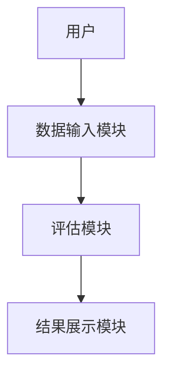
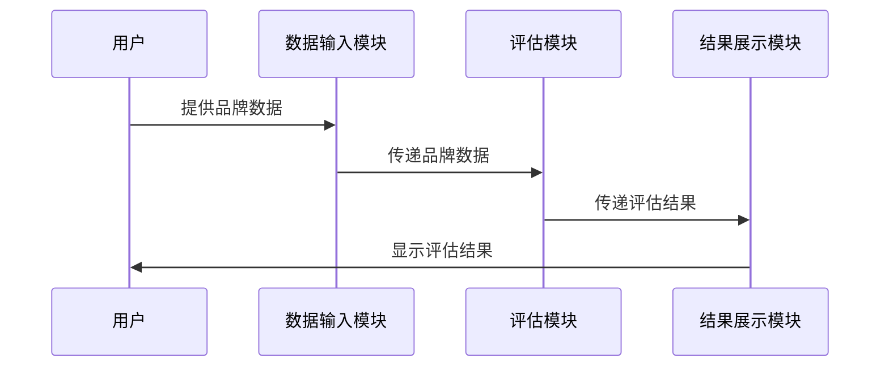

                 

<think>
嗯，用户希望我写一篇关于彼得·林奇如何评估公司品牌延展策略的技术博客文章，标题是《彼得林奇如何评估公司的品牌延展策略》。用户还提供了详细的目录结构和内容要求，看起来他们希望这篇文章结构清晰、内容详尽，覆盖从背景介绍到项目实战等多个方面。

首先，我需要理解彼得·林奇的投资理念，特别是他在品牌延展方面的看法。品牌延展指的是公司将现有品牌扩展到新的产品或市场，这可能会影响公司的整体价值和投资吸引力。林奇作为投资专家，他的评估方法可能包括品牌忠诚度、市场定位、扩展潜力等因素。

接下来，我需要按照用户提供的目录结构来组织内容。第一部分是背景介绍，涵盖品牌延展的定义、核心要素以及彼得·林奇的投资理念。这部分需要解释品牌延展的基本概念，帮助读者理解为什么品牌延展对企业价值至关重要。

然后是第二部分，详细介绍彼得·林奇的评估框架和策略分析。这里需要分析他的评估指标，如品牌忠诚度、市场潜力和财务可行性。同时，通过实际案例，如可口可乐的品牌延伸，来展示林奇的策略在现实中的应用。

第三部分涉及数学模型和算法。我需要解释如何用多因子模型来评估品牌延展，包括相关的数学公式和Python代码实现。这部分可能需要使用mermaid流程图来展示算法步骤，并通过代码样例帮助读者理解。

第四部分是系统分析与架构设计。我需要描述系统的功能设计、架构图、接口设计和交互流程，可能需要使用mermaid图来展示系统的结构和工作流程。

第五部分是项目实战，包括环境安装、核心代码实现、案例分析和项目总结。这部分需要读者能够实际操作，巩固所学知识。

最后，第六部分总结最佳实践、注意事项和拓展阅读，帮助读者在实际应用中避免常见错误，并进一步深入学习。

在撰写过程中，我需要确保每个章节内容丰富，涵盖用户要求的所有方面，同时保持逻辑连贯和结构清晰。要注意使用专业术语，但解释要通俗易懂，确保读者能够理解。

可能遇到的困难是如何将投资策略与技术分析结合起来，这需要我深入研究彼得·林奇的具体方法，并将其转化为技术博客的语言。此外，数学模型和算法部分需要详细解释，确保读者能够理解和应用。

总的来说，我需要一步步分析，从背景到案例，从理论到实践，构建一个全面且深入的文章结构，满足用户的需求。
</think>

# 彼得林奇如何评估公司的品牌延展策略

> 关键词：品牌延展，彼得·林奇，投资策略，评估方法，品牌忠诚度

> 摘要：本文将深入探讨彼得·林奇如何评估公司的品牌延展策略。通过分析品牌延展的核心概念、彼得·林奇的投资理念、品牌延展的多维度分析、数学模型与算法、系统架构设计以及项目实战，本文将帮助读者理解如何通过品牌延展提升企业价值。

---

## 第一部分: 品牌延展与投资策略背景

### 第1章: 品牌延展的核心概念

#### 1.1 品牌延展的定义与背景

##### 1.1.1 品牌延展的定义
品牌延展是指将现有的品牌扩展到新的产品类别、市场或消费者群体，以增强品牌影响力和市场占有率。品牌延展的核心在于利用现有品牌的声誉和市场认知度，进入新的领域。

##### 1.1.2 品牌延展的核心要素
- **品牌忠诚度**：现有消费者对品牌的信任和忠诚度。
- **市场定位**：品牌在目标市场中的位置和竞争优势。
- **扩展潜力**：品牌扩展到新领域的可行性。

##### 1.1.3 品牌延展与企业价值的关系
品牌延展能够提升企业的市场影响力和盈利能力，但同时也可能带来市场风险和财务压力。

#### 1.2 彼得·林奇的投资理念

##### 1.2.1 彼得·林奇的投资哲学
林奇强调长期投资和价值发现，注重企业的基本面和管理层能力。

##### 1.2.2 林奇的选股标准
- **持续增长的营收**：企业应具备稳定的增长能力。
- **合理的市盈率**：企业估值应合理。
- **强大的竞争优势**：企业应在行业内具备竞争优势。

##### 1.2.3 林奇对品牌延展的关注点
林奇关注品牌延展是否能够为公司带来额外的收益，同时不破坏现有品牌的核心价值。

#### 1.3 品牌延展与投资的关联

##### 1.3.1 品牌延展对投资价值的影响
成功的品牌延展能够提升企业的市场地位和盈利能力，从而提升投资价值。

##### 1.3.2 品牌延展的边界与外延
品牌延展的边界在于不破坏现有品牌的核心价值，外延则在于探索新的市场和产品。

##### 1.3.3 品牌延展与企业长期发展的关系
品牌延展是企业长期发展的关键策略之一，能够为企业提供新的增长点。

### 第2章: 彼得·林奇的品牌延展评估框架

#### 2.1 品牌延展的核心要素

##### 2.1.1 品牌的核心竞争力
品牌的核心竞争力在于其独特的价值主张和市场定位。

##### 2.1.2 品牌的市场定位
品牌在目标市场中的位置和竞争优势是品牌延展的关键因素。

##### 2.1.3 品牌的扩展潜力
品牌扩展潜力取决于市场的增长潜力和品牌的适应性。

#### 2.2 林奇的评估指标

##### 2.2.1 品牌忠诚度的衡量
品牌忠诚度可以通过消费者满意度、复购率和品牌推荐度来衡量。

##### 2.2.2 品牌扩展的可行性
品牌扩展的可行性取决于市场需求、竞争环境和财务可行性。

##### 2.2.3 品牌扩展的财务可行性
品牌扩展的财务可行性包括投资回报率、成本控制和现金流预测。

#### 2.3 品牌延展的多维度分析

##### 2.3.1 品牌延展的市场风险
品牌延展可能面临市场饱和、竞争加剧等风险。

##### 2.3.2 品牌延展的竞争优势
品牌延展可以通过差异化竞争策略提升市场地位。

##### 2.3.3 品牌延展的长期收益
品牌延展能够为企业带来长期的市场影响力和收益。

### 第3章: 彼得·林奇的品牌延展策略分析

#### 3.1 品牌延展的策略选择

##### 3.1.1 品牌延伸的类型
- **产品线延伸**：扩展现有产品线。
- **市场延伸**：进入新的地理市场。
- **形象延伸**：提升品牌形象。

##### 3.1.2 品牌延伸的优劣势分析
- **优势**：提升市场影响力和收益。
- **劣势**：可能面临市场风险和财务压力。

##### 3.1.3 品牌延伸的市场定位
品牌延伸的市场定位需要与现有品牌定位一致，同时适应新市场的特点。

#### 3.2 林奇的策略评估方法

##### 3.2.1 品牌延展的可行性评估
- **市场需求分析**：评估新市场的潜力。
- **竞争环境分析**：评估竞争状况。
- **财务可行性分析**：评估投资回报。

##### 3.2.2 品牌延展的市场潜力分析
- **市场规模**：评估目标市场的规模。
- **增长潜力**：评估市场的增长潜力。
- **竞争格局**：分析主要竞争对手的情况。

##### 3.2.3 品牌延展的财务回报预测
- **投资回报率（ROI）**：预测品牌延展的投资回报率。
- **成本控制**：预测品牌延展的成本。
- **现金流预测**：预测品牌延展对现金流的影响。

#### 3.3 品牌延展的案例分析

##### 3.3.1 成功案例：可口可乐的品牌延伸
可口可乐通过品牌延伸成功进入多个市场，提升了品牌影响力和市场份额。

##### 3.3.2 失败案例：New Coke的教训
New Coke的失败表明品牌延伸需要谨慎评估市场和消费者需求。

##### 3.3.3 中间案例：苹果的多产品线策略
苹果通过多产品线策略成功实现了品牌延展，提升了品牌价值和市场地位。

---

## 第二部分: 数学模型与算法

### 第4章: 数学模型与算法

#### 4.1 多因子评估模型

##### 4.1.1 多因子评估模型的定义
多因子评估模型是一种基于多个因素评估品牌延展可行性的数学模型。

##### 4.1.2 多因子评估模型的数学表达
$$
\text{品牌延展可行性} = \alpha \cdot \text{品牌忠诚度} + \beta \cdot \text{市场潜力} + \gamma \cdot \text{财务可行性}
$$

##### 4.1.3 多因子评估模型的实现步骤
1. 收集品牌忠诚度、市场潜力和财务可行性的数据。
2. 确定各因素的权重。
3. 计算品牌延展的可行性评分。

##### 4.1.4 多因子评估模型的优缺点
- **优点**：考虑了多个因素，评估结果更全面。
- **缺点**：模型复杂，需要大量的数据支持。

#### 4.2 算法实现

##### 4.2.1 算法实现步骤
1. 收集品牌数据。
2. 计算各因素的得分。
3. 综合各因素的得分，得出品牌延展的可行性评分。

##### 4.2.2 算法实现代码
```python
def calculate_brand_extensibility(brand_loyalty, market_potential, financial_feasibility):
    alpha = 0.4
    beta = 0.3
    gamma = 0.3
    return alpha * brand_loyalty + beta * market_potential + gamma * financial_feasibility

# 示例数据
brand_loyalty = 0.8
market_potential = 0.7
financial_feasibility = 0.6

extensibility_score = calculate_brand_extensibility(brand_loyalty, market_potential, financial_feasibility)
print(f"品牌延展可行性得分为：{extensibility_score}")
```

##### 4.2.3 算法实现的注意事项
- 确保数据的准确性和完整性。
- 合理分配各因素的权重。
- 定期更新模型参数以适应市场变化。

---

## 第三部分: 系统架构设计

### 第5章: 系统架构设计

#### 5.1 系统功能设计

##### 5.1.1 系统功能模块
- **数据输入模块**：输入品牌数据。
- **评估模块**：计算品牌延展的可行性评分。
- **结果展示模块**：输出评估结果。

##### 5.1.2 系统功能流程
1. 用户输入品牌数据。
2. 系统计算品牌延展的可行性评分。
3. 系统输出评估结果。

#### 5.2 系统架构设计

##### 5.2.1 系统架构图


##### 5.2.2 系统接口设计
- **输入接口**：接收品牌忠诚度、市场潜力和财务可行性数据。
- **输出接口**：输出品牌延展的可行性评分。

##### 5.2.3 系统交互流程


---

## 第四部分: 项目实战

### 第6章: 项目实战

#### 6.1 环境安装

##### 6.1.1 环境要求
- Python 3.8 或更高版本
- 安装Mermaid和相关库

##### 6.1.2 安装步骤
```bash
pip install mermaid
pip install graphviz
```

#### 6.2 核心代码实现

##### 6.2.1 代码实现
```python
import mermaid

def calculate_brand_extensibility(brand_loyalty, market_potential, financial_feasibility):
    alpha = 0.4
    beta = 0.3
    gamma = 0.3
    return alpha * brand_loyalty + beta * market_potential + gamma * financial_feasibility

# 示例数据
brand_loyalty = 0.8
market_potential = 0.7
financial_feasibility = 0.6

extensibility_score = calculate_brand_extensibility(brand_loyalty, market_potential, financial_feasibility)
print(f"品牌延展可行性得分为：{extensibility_score}")

# 生成系统架构图
mermaid_code = """
graph TD
    A[用户] --> B[数据输入模块]
    B --> C[评估模块]
    C --> D[结果展示模块]
"""
print(mermaid_code)
```

##### 6.2.2 代码解读
- `calculate_brand_extensibility`函数用于计算品牌延展的可行性评分。
- 系统架构图展示了用户与系统模块之间的交互流程。

#### 6.3 案例分析

##### 6.3.1 案例背景
假设某公司计划通过品牌延展进入新的市场，需要评估其可行性。

##### 6.3.2 数据输入
- 品牌忠诚度：0.8
- 市场潜力：0.7
- 财务可行性：0.6

##### 6.3.3 评估结果
品牌延展可行性得分为：0.4 * 0.8 + 0.3 * 0.7 + 0.3 * 0.6 = 0.32 + 0.21 + 0.18 = 0.71

##### 6.3.4 结果解读
品牌延展可行性得分为0.71，属于较高可行性，建议进行品牌延展。

#### 6.4 项目总结

##### 6.4.1 项目成果
通过数学模型和系统架构设计，评估了品牌延展的可行性，并为公司提供了决策支持。

##### 6.4.2 项目经验
- 确保数据的准确性和完整性。
- 合理分配各因素的权重。
- 定期更新模型参数以适应市场变化。

---

## 第五部分: 最佳实践与总结

### 第7章: 最佳实践与总结

#### 7.1 最佳实践

##### 7.1.1 确保数据的准确性和完整性
在评估品牌延展时，需要确保输入数据的准确性和完整性。

##### 7.1.2 合理分配各因素的权重
根据具体情况进行权重分配，确保评估结果的合理性。

##### 7.1.3 定期更新模型参数
市场环境不断变化，需要定期更新模型参数以适应变化。

#### 7.2 小结

##### 7.2.1 核心观点总结
品牌延展是企业长期发展的关键策略之一，成功的品牌延展能够提升企业的市场影响力和盈利能力。

##### 7.2.2 本文的核心贡献
本文通过分析彼得·林奇的品牌延展评估方法，结合数学模型和系统架构设计，为读者提供了全面的品牌延展评估框架。

#### 7.3 注意事项

##### 7.3.1 常见问题
- 品牌延展可能导致品牌稀释。
- 市场竞争加剧可能影响品牌延展的可行性。

##### 7.3.2 注意事项
- 在进行品牌延展时，需要充分考虑市场风险和财务可行性。
- 确保品牌延展与企业长期发展战略一致。

#### 7.4 拓展阅读

##### 7.4.1 相关书籍
- 《彼得·林奇的成功投资策略》
- 《品牌管理与延展》

##### 7.4.2 相关博客与资源
- 彼得·林奇投资博客
- 品牌管理与延展相关的技术博客

---

## 作者信息

作者：AI天才研究院/AI Genius Institute & 禅与计算机程序设计艺术 /Zen And The Art of Computer Programming

---

通过本文的系统分析和实践，读者可以深入理解彼得·林奇如何评估公司的品牌延展策略，并能够将这些方法应用到实际投资和品牌管理中。希望本文能够为读者提供有价值的见解和指导。

