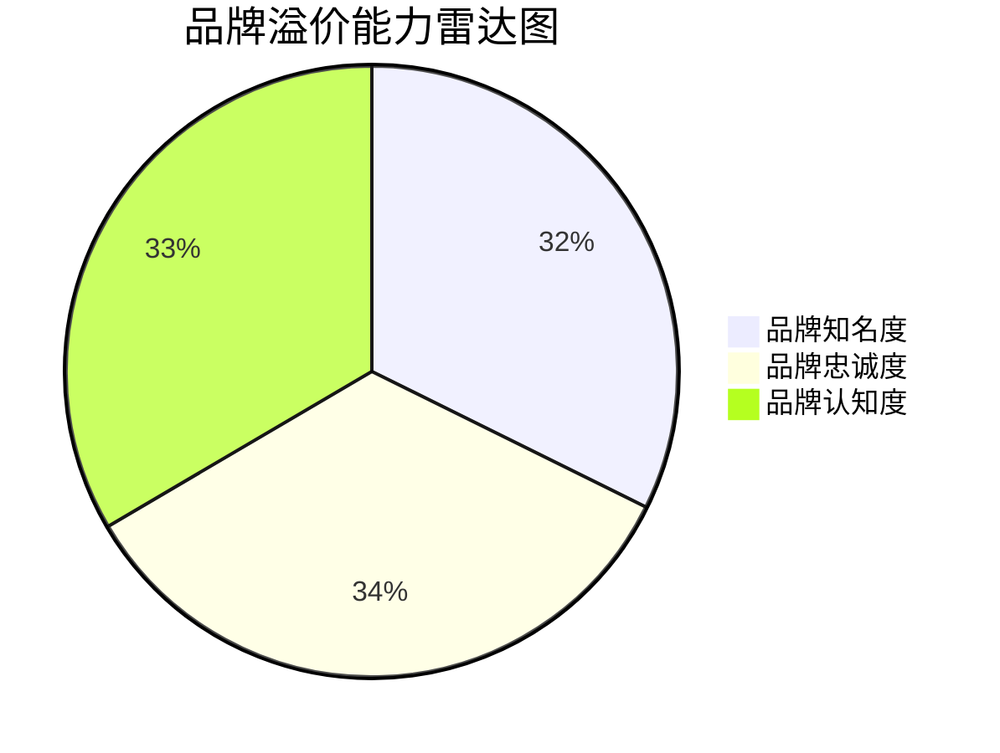
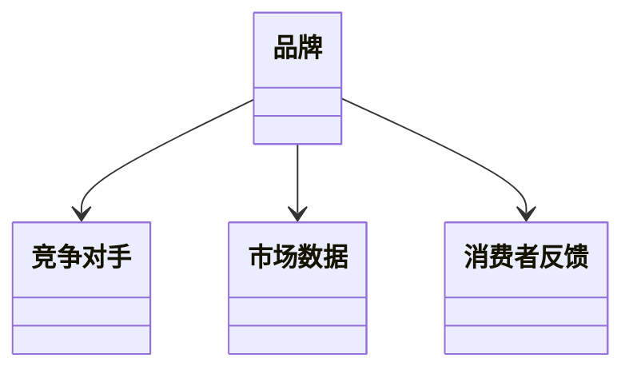
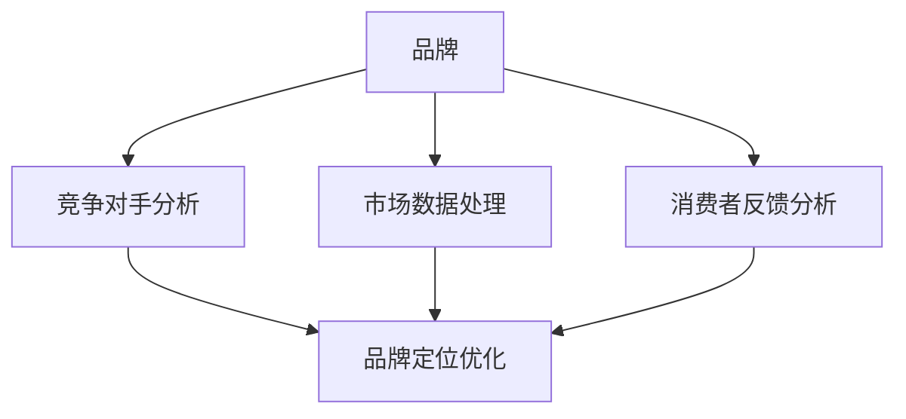
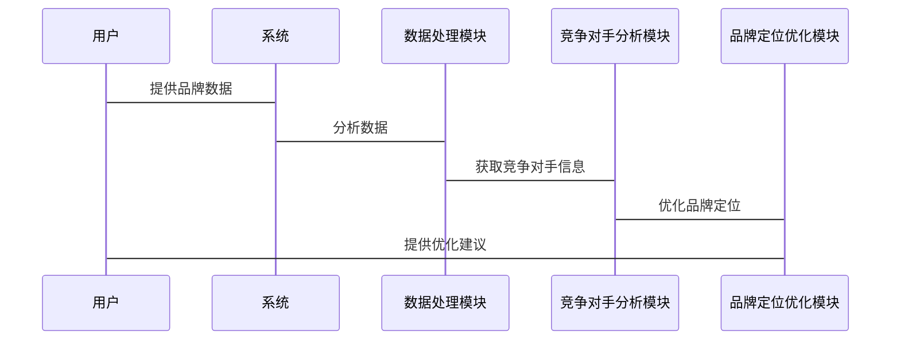

                 


# 彼得林奇如何评估公司的品牌溢价能力

> 关键词：品牌溢价能力，彼得·林奇，品牌评估，投资策略，品牌价值

> 摘要：本文详细探讨了彼得·林奇如何评估公司的品牌溢价能力。通过分析品牌溢价能力的核心概念、评估方法和实际案例，本文为读者提供了深入的理论支持和实践指导。文章结合技术语言和逻辑推理，帮助读者理解品牌溢价能力的重要性，并掌握如何通过彼得·林奇的方法来提升品牌价值。

---

## 第1章: 品牌溢价能力的核心概念

### 1.1 品牌溢价能力的定义与背景

#### 1.1.1 品牌溢价能力的定义
品牌溢价能力是指品牌在市场中能够通过其独特性、知名度和消费者认知，实现高于同类产品或服务的价格的能力。这种能力反映了品牌在消费者心中的价值和信任度。

#### 1.1.2 品牌溢价能力的背景与重要性
在全球化竞争日益激烈的市场中，品牌溢价能力成为企业核心竞争力的重要组成部分。通过品牌溢价，企业可以实现更高的利润率和市场占有率。彼得·林奇作为投资界的传奇人物，他将品牌溢价能力作为评估企业价值的重要指标之一。

#### 1.1.3 品牌溢价能力与企业价值的关系
品牌溢价能力直接影响企业的收入和利润。一个具有强大品牌溢价能力的企业能够在市场中定价更高，吸引更多的消费者，从而创造更大的企业价值。

### 1.2 彼得·林奇与品牌溢价能力评估

#### 1.2.1 彼得·林奇的投资者背景
彼得·林奇是美国著名投资经理人，以其在富达基金的卓越表现闻名。他的投资哲学注重基本面分析和长期价值挖掘，品牌溢价能力是他评估企业的重要维度之一。

#### 1.2.2 林奇的品牌溢价能力评估方法
林奇认为，品牌溢价能力是企业竞争优势的体现。他通过分析品牌的市场定位、消费者忠诚度和竞争对手的定价策略，评估品牌的溢价潜力。

#### 1.2.3 林奇评估方法的创新与实践
林奇将品牌溢价能力与企业财务指标相结合，提出了一套独特的评估体系。这种方法不仅帮助他在投资中取得了巨大成功，也为现代品牌管理提供了重要启示。

---

## 第2章: 品牌溢价能力的核心要素

### 2.1 品牌溢价能力的构成要素

#### 2.1.1 品牌知名度
品牌知名度是品牌溢价能力的基础。知名度高的品牌更容易获得消费者的信任和选择。

#### 2.1.2 品牌忠诚度
品牌忠诚度反映了消费者对品牌的长期支持和偏好，是品牌溢价能力的重要保障。

#### 2.1.3 品牌认知度
品牌认知度是指消费者对品牌特点和优势的认知程度。高认知度的品牌更容易实现溢价定价。

### 2.2 彼得·林奇评估模型的核心要素

#### 2.2.1 市场定位
林奇认为，明确的市场定位是品牌溢价的基础。品牌需要在目标市场中占据独特的地位。

#### 2.2.2 竞争对手分析
通过分析竞争对手的定价策略和市场表现，林奇能够识别品牌的溢价潜力。

#### 2.2.3 品牌差异化能力
品牌差异化能力是实现溢价的关键。林奇关注品牌是否能够通过创新和独特性在竞争中脱颖而出。

---

## 第3章: 品牌溢价能力的评估框架

### 3.1 林奇评估框架的逻辑结构

#### 3.1.1 数据收集与整理
林奇的评估方法首先需要收集企业的市场数据，包括销售数据、消费者反馈和竞争对手信息。

#### 3.1.2 数据分析与建模
通过对数据的分析，林奇构建了品牌溢价能力的评估模型，用于量化品牌的溢价潜力。

#### 3.1.3 结果验证与优化
林奇通过历史数据验证模型的准确性，并根据市场变化不断优化评估框架。

### 3.2 林奇评估框架的数学模型

#### 3.2.1 品牌溢价能力指数计算公式
$$ \text{品牌溢价能力指数} = \frac{\text{品牌附加价值}}{\text{产品基础价值}} $$

#### 3.2.2 品牌溢价能力回归模型
$$ Y = \beta_0 + \beta_1 X_1 + \beta_2 X_2 + \epsilon $$

### 3.3 林奇评估框架的可视化工具

#### 3.3.1 品牌溢价能力雷达图


#### 3.3.2 品牌溢价能力趋势图
```mermaid
lineChart
    title 品牌溢价能力趋势
    x: 年份
    y: 溢价能力指数
    data
    | 2018 | 75 |
    | 2019 | 80 |
    | 2020 | 85 |
    | 2021 | 90 |
```

---

## 第4章: 品牌溢价能力的定量评估方法

### 4.1 定量评估的核心指标

#### 4.1.1 品牌溢价率
品牌溢价率是品牌实际售价与成本的差额占成本的比例。

#### 4.1.2 品牌贡献度
品牌贡献度反映了品牌对总收入的贡献比例。

#### 4.1.3 品牌忠诚度指数
品牌忠诚度指数通过消费者复购率和推荐率来衡量。

### 4.2 林奇评估方法的数学模型

#### 4.2.1 品牌溢价能力回归模型
$$ Y = \beta_0 + \beta_1 X_1 + \beta_2 X_2 + \epsilon $$

#### 4.2.2 品牌溢价能力指数计算公式
$$ \text{品牌溢价能力指数} = \frac{\text{品牌附加价值}}{\text{产品基础价值}} $$

### 4.3 定量评估的实施步骤

#### 4.3.1 数据收集与整理
收集品牌相关的市场数据，包括销售数据、消费者反馈和竞争对手信息。

#### 4.3.2 数据分析与建模
使用统计方法和回归分析构建品牌溢价能力的评估模型。

#### 4.3.3 结果验证与优化
通过历史数据验证模型的准确性，并根据市场变化优化评估框架。

---

## 第5章: 品牌溢价能力的系统分析与架构设计

### 5.1 问题场景介绍

#### 5.1.1 品牌溢价能力的系统化评估需求
企业需要通过系统化的方法评估品牌溢价能力，以制定有效的品牌战略。

#### 5.1.2 林奇评估方法的系统化应用
通过系统化的架构设计，林奇评估方法可以更好地应用于实际品牌管理中。

### 5.2 系统功能设计

#### 5.2.1 领域模型设计


#### 5.2.2 系统架构设计


### 5.3 系统接口设计

#### 5.3.1 数据输入接口
```python
def input_data():
    return {
        '品牌': 'BrandX',
        '竞争对手': ['Competitor1', 'Competitor2'],
        '市场数据': {'sales': 1000, 'cost': 500},
        '消费者反馈': {'满意度': 85, '推荐率': 70}
    }
```

#### 5.3.2 数据输出接口
```python
def output_result():
    return {
        '品牌溢价能力指数': 1.2,
        '品牌定位优化建议': '专注于高端市场',
        '竞争对手分析': ['Competitor1', 'Competitor2']
    }
```

### 5.4 系统交互设计

#### 5.4.1 交互流程


---

## 第6章: 项目实战

### 6.1 实际案例分析

#### 6.1.1 苹果公司的品牌溢价能力评估
通过林奇的评估方法，分析苹果公司的品牌溢价能力，包括其品牌知名度、忠诚度和认知度。

#### 6.1.2 可口可乐的品牌溢价能力优化
基于林奇的评估框架，提出优化可口可乐品牌溢价能力的具体策略。

### 6.2 代码实现与解读

#### 6.2.1 品牌溢价能力指数计算
```python
def calculate_brand_premium(brand_value, product_cost):
    return brand_value / product_cost

# 示例数据
brand_value = 1200
product_cost = 1000
premium_index = calculate_brand_premium(brand_value, product_cost)
print(f"品牌溢价能力指数: {premium_index}")
```

#### 6.2.2 品牌定位优化
```python
def optimize_brand定位(competitors, market_share):
    return f"建议定位为：{competitors[0]}的{市场占有率}%市场"

competitors = ['Coke', 'Pepsi']
市场占有率 = 30
优化建议 = optimize_brand定位(competitors, 市场占有率)
print(优化建议)
```

### 6.3 案例分析与解读

#### 6.3.1 苹果公司的品牌溢价能力
通过计算苹果的品牌溢价能力指数，发现其品牌溢价能力远高于行业平均水平，体现了其强大的品牌竞争力。

#### 6.3.2 可口可乐的品牌优化策略
通过分析竞争对手和市场数据，提出可口可乐应进一步强化其品牌差异化能力，以提升品牌溢价能力。

---

## 第7章: 总结与展望

### 7.1 总结

#### 7.1.1 品牌溢价能力的核心价值
品牌溢价能力是企业核心竞争力的重要组成部分，直接影响企业的市场表现和盈利能力。

#### 7.1.2 彼得·林奇评估方法的实践价值
林奇的评估方法为品牌管理和投资决策提供了重要的理论支持和实践指导。

### 7.2 未来展望

#### 7.2.1 数字化与智能化趋势
随着大数据和人工智能技术的发展，品牌溢价能力的评估将更加精准和高效。

#### 7.2.2 技术创新与品牌价值
未来，技术创新将成为品牌溢价能力的重要驱动力，企业需要通过持续创新提升品牌价值。

---

## 结语

彼得·林奇的品牌溢价能力评估方法为我们提供了一个全新的视角，帮助我们更好地理解品牌价值与市场表现的关系。通过系统化的方法和实践案例，我们能够更有效地提升品牌溢价能力，为企业创造更大的价值。

---

## 作者

作者：AI天才研究院/AI Genius Institute & 禅与计算机程序设计艺术 /Zen And The Art of Computer Programming

