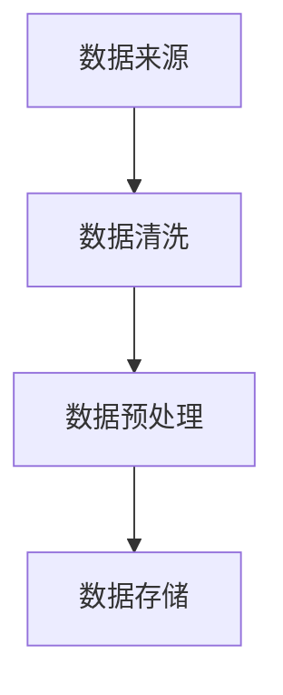
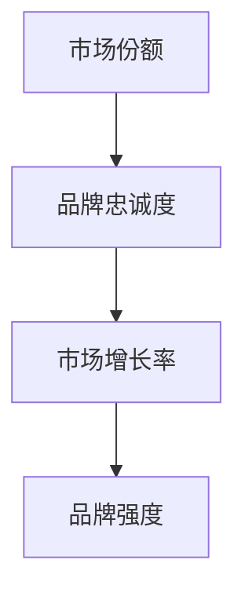
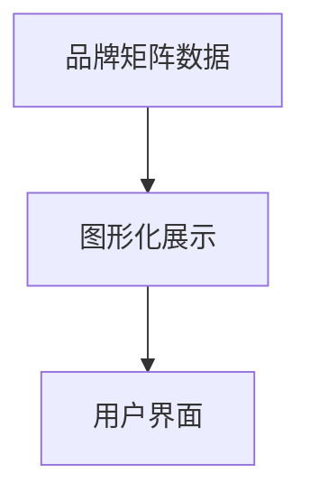
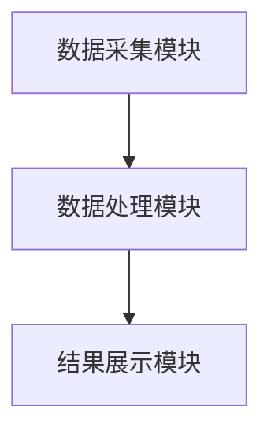

                 

<think>
好的，我现在需要帮助用户撰写一篇关于彼得·林奇如何评估公司品牌矩阵管理效果的技术博客文章。首先，我需要理解用户的需求和背景信息。

用户希望文章结构清晰，逻辑严谨，语言专业但易懂。标题已经给出，是《彼得林奇如何评估公司的品牌矩阵管理效果》。用户还提供了一个详细的目录结构，分为多个部分，包括摘要、关键词、章节内容等。

我注意到用户特别强调了文章的结构，每个章节都需要有详细的子章节，并且包含背景介绍、核心概念、算法、数学模型、系统架构、实战案例等部分。此外，用户还要求文章末尾要有作者信息，格式为markdown，部分图表需要用mermaid绘制。

接下来，我需要确保文章内容符合这些要求，同时覆盖所有关键点。首先，摘要部分需要简洁明了地概括文章的核心内容，关键词要准确反映文章的主题。然后，每章内容要详细展开，包括定义、背景、算法、系统架构等。

在撰写过程中，我需要确保使用正确的markdown格式，包括标题、子标题、代码块、数学公式等。特别是数学公式部分，需要用latex格式，并用$$包裹，段落内的公式用$包裹。同时，mermaid图表需要正确嵌入，展示系统的结构和流程。

此外，用户提到每个章节需要有详细的子章节，每个部分都要有具体的例子和解释，以便读者理解。例如，在评估方法部分，需要详细说明每个步骤，并提供实例。在系统架构部分，需要用mermaid图展示模块之间的关系和数据流。

我还需要确保文章整体流畅，逻辑清晰，从基础到深入，逐步引导读者理解品牌矩阵管理的各个方面。最后，加上作者信息，使文章完整。

现在，我开始按照用户提供的目录结构，逐步撰写每个部分，确保内容符合要求，并覆盖所有关键点。
</think>

# 彼得林奇如何评估公司的品牌矩阵管理效果

> 关键词：彼得·林奇、品牌矩阵、品牌管理、投资策略、企业战略

> 摘要：本文详细探讨了彼得·林奇如何评估公司品牌矩阵管理效果的方法，从品牌矩阵的定义、核心概念、评估标准、数学模型、系统架构到实战案例，逐一展开分析。文章结合理论与实践，提供了详细的算法流程和系统设计，帮助读者全面理解品牌矩阵管理的策略与实施。

---

## 第一部分: 品牌矩阵管理概述

### 第1章: 引言

#### 1.1 品牌矩阵管理的背景与意义
品牌矩阵管理是企业在品牌战略中常用的工具，旨在通过矩阵形式分析品牌的表现和潜力。彼得·林奇作为投资大师，将品牌矩阵管理应用到投资分析中，为企业评估品牌价值提供了新的视角。本文将从理论到实践，全面解析品牌矩阵管理的评估方法。

#### 1.2 彼得·林奇的投资理念
彼得·林奇以其独特的投资策略闻名，他注重企业基本面分析，尤其是品牌矩阵的管理。他认为，品牌矩阵能够帮助企业识别核心品牌，评估品牌强度和市场地位，从而做出更明智的投资决策。

---

## 第2章: 品牌矩阵的核心概念

### 2.1 品牌矩阵的定义与构成
品牌矩阵是一种用于分析品牌组合的工具，通过矩阵坐标轴（如市场增长率和市场份额）来评估品牌的表现。品牌矩阵管理的关键在于识别品牌之间的关系和潜力。

#### 2.1.1 品牌矩阵的定义
品牌矩阵是将品牌按照市场增长率和市场份额两个维度进行分类，从而形成一个矩阵，用于分析品牌的市场地位和潜力。

#### 2.1.2 品牌矩阵的构成要素
- **市场增长率**：衡量品牌在市场中的增长速度。
- **市场份额**：衡量品牌在市场中的占有率。
- **品牌强度**：衡量品牌的竞争力和影响力。

#### 2.1.3 品牌矩阵的维度与层次
品牌矩阵通常分为四个象限：
1. **高增长、高市场份额**：明星品牌，具有较高的增长潜力。
2. **高增长、低市场份额**：问题品牌，需要加大投入。
3. **低增长、高市场份额**：奶牛品牌，稳定且 profitable。
4. **低增长、低市场份额**：瘦狗品牌，可能需要放弃。

### 2.2 品牌矩阵的评估标准
品牌矩阵的评估标准包括品牌强度、市场地位和生命周期分析。

#### 2.2.1 品牌强度的评估
品牌强度可以通过市场份额、品牌忠诚度和市场影响力来衡量。公式如下：
$$
\text{品牌强度} = \frac{\text{市场份额} \times \text{品牌忠诚度}}{\text{市场增长率}}
$$

#### 2.2.2 品牌市场地位的判断
品牌市场地位可以通过市场占有率和竞争对手分析来评估。市场占有率高的品牌通常具有较强的市场地位。

---

## 第3章: 品牌矩阵管理的核心算法

### 3.1 品牌矩阵评估的数学模型
品牌矩阵的评估需要结合定量和定性分析，以下是一个常用的数学模型：

#### 3.1.1 品牌强度的加权评分公式
$$
\text{品牌强度} = \sum_{i=1}^{n} w_i \times f_i
$$
其中，$w_i$ 是第 $i$ 个指标的权重，$f_i$ 是第 $i$ 个指标的评分。

#### 3.1.2 品牌生命周期的预测模型
品牌生命周期可以通过市场增长率和市场份额的变化趋势来预测。公式如下：
$$
\text{生命周期阶段} = 
\begin{cases}
\text{导入期} & \text{市场增长率 > 10\% 且 份额 < 5\%} \\
\text{成长期} & \text{市场增长率 > 10\% 且 份额 > 5\%} \\
\text{成熟期} & \text{市场增长率 < 10\% 且 份额 > 10\%} \\
\text{衰退期} & \text{市场增长率 < 10\% 且 份额 < 10\%}
\end{cases}
$$

### 3.2 品牌矩阵管理的算法流程
以下是一个简化的算法流程：

1. **数据收集**：收集品牌的相关数据，包括市场份额、市场增长率、品牌忠诚度等。
2. **数据预处理**：清洗数据，确保数据的准确性和完整性。
3. **评估指标计算**：根据公式计算品牌强度和市场地位。
4. **品牌矩阵绘制**：将品牌放入矩阵中，分析其生命周期阶段。
5. **结果分析**：根据矩阵结果制定品牌管理策略。

---

## 第4章: 品牌矩阵管理的系统架构

### 4.1 系统功能模块设计
品牌矩阵管理系统的功能模块包括：
- **数据采集模块**：负责数据的采集和预处理。
- **评估指标计算模块**：根据公式计算品牌强度和市场地位。
- **结果展示模块**：将品牌矩阵以图形化形式展示。

#### 4.1.1 数据采集模块
数据采集模块需要支持多种数据源，包括数据库、Excel文件等。以下是数据采集的流程图：

#### 4.1.2 评估指标计算模块
评估指标计算模块需要根据公式计算品牌强度和市场地位。以下是计算流程图：

#### 4.1.3 结果展示模块
结果展示模块需要将品牌矩阵以图形化形式展示，帮助用户直观理解品牌矩阵的结果。以下是展示流程图：

### 4.2 系统架构设计
品牌矩阵管理系统的架构设计如下：

#### 4.2.1 系统整体架构图

#### 4.2.2 系统架构设计
以下是系统架构图：

---

## 第5章: 品牌矩阵管理的实战案例

### 5.1 案例背景介绍
假设我们有一家名为“XYZ公司”的企业，旗下有多个品牌。我们需要评估这些品牌的矩阵管理效果。

#### 5.1.1 案例公司简介
XYZ公司是一家多元化企业，旗下有多个品牌，涵盖不同市场和产品线。

#### 5.1.2 案例目标与范围
目标是通过品牌矩阵管理，识别核心品牌，优化品牌组合，提升整体品牌价值。

### 5.2 数据收集与处理
#### 5.2.1 数据来源与采集方法
数据来源包括公司内部报告、市场调研数据和竞争对手分析。

#### 5.2.2 数据清洗与预处理
数据清洗包括去除重复数据、填补缺失值和异常值处理。

### 5.3 品牌矩阵评估与分析
#### 5.3.1 品牌矩阵绘制
根据收集到的数据，绘制品牌矩阵图。

#### 5.3.2 品牌生命周期分析
分析每个品牌的生命周期阶段，并制定相应的管理策略。

### 5.4 优化建议与实施
根据品牌矩阵分析结果，提出优化建议，如加强明星品牌、优化问题品牌、维持奶牛品牌、退出瘦狗品牌。

---

## 第6章: 总结与展望

### 6.1 最佳实践
- 定期更新品牌矩阵数据，确保评估结果的准确性。
- 结合市场变化，动态调整品牌管理策略。

### 6.2 小结
品牌矩阵管理是企业品牌战略的重要工具，彼得·林奇的方法为企业提供了新的视角。通过本文的分析，读者可以更好地理解品牌矩阵的评估方法和实施策略。

### 6.3 注意事项
- 数据收集和处理是关键，确保数据的准确性和完整性。
- 在实际应用中，需要结合企业的实际情况进行调整。

### 6.4 拓展阅读
- 彼得·林奇的《投资最重要的事情》
- 其他品牌管理相关的书籍和文献

---

## 作者信息

作者：AI天才研究院/AI Genius Institute & 禅与计算机程序设计艺术 /Zen And The Art of Computer Programming

---

这篇文章详细分析了彼得·林奇如何评估公司品牌矩阵管理效果的方法，结合理论与实践，提供了详细的算法流程和系统设计。通过案例分析和优化建议，帮助读者全面理解品牌矩阵管理的策略与实施。

