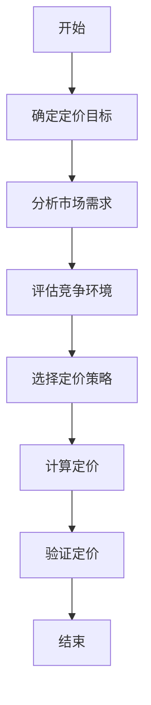
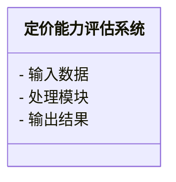
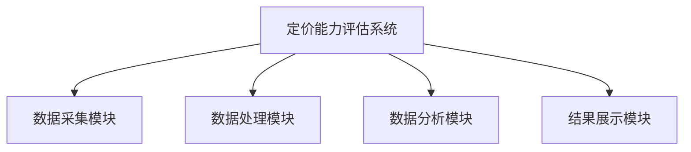
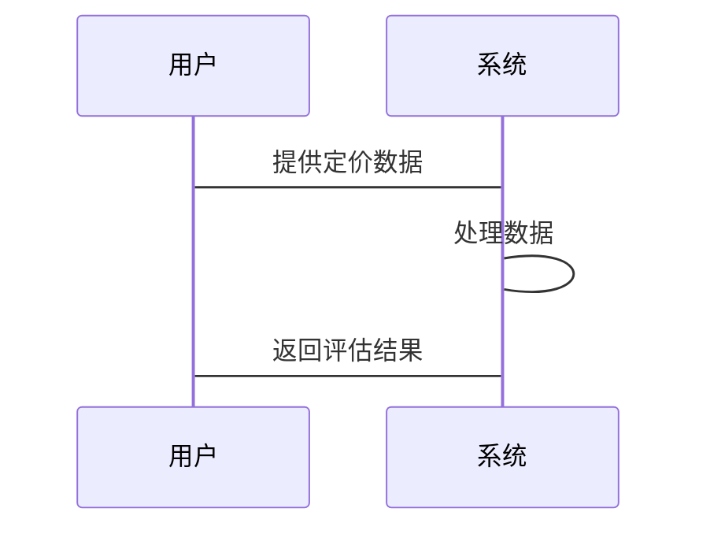

                 

<think>
好的，我现在需要帮助用户完成一篇关于《彼得林奇如何评估公司的定价能力》的技术博客文章。首先，我需要理解用户的需求，他们希望文章结构清晰，内容专业，逻辑严密。用户已经提供了一个详细的目录大纲，我需要按照这个大纲逐步展开，确保每个部分都详尽且符合技术博客的标准。

首先，我会从摘要开始。摘要需要简洁明了地概括文章的核心内容，强调定价能力的重要性以及彼得林奇的评估方法，为读者提供一个整体的理解框架。

接下来是关键词部分，我需要列出5-7个与定价能力相关的关键词，如定价能力、定价策略、定价模型、企业价值、定价能力评估等，这些关键词有助于提高文章的可搜索性和准确性。

然后，我会按照目录大纲的结构来撰写每一章。第一章介绍定价能力的背景，包括定义、重要性和与企业价值的关系。第二章深入探讨定价能力的核心概念，使用ER实体关系图来展示定价能力与其他因素之间的关系。第三章讲解定价能力的评估方法，包括成本加成定价模型和利润最大化定价模型，并用公式进行详细说明。第四章讨论定价能力与企业价值的关系，通过案例分析来说明定价能力对投资决策的影响。第五章介绍定价能力评估的系统架构，使用系统架构图展示各个模块之间的关系。第六章展示定价能力评估的系统实现，包括数据采集、处理和分析的流程。第七章总结定价能力评估的关键点，强调其对投资决策的重要性，并提出最佳实践建议。最后，展望未来的发展趋势，讨论定价能力评估的未来方向。

在撰写过程中，我需要确保每部分内容详尽，逻辑清晰，并且使用专业而易懂的语言。同时，合理运用Mermaid语法来绘制流程图和系统架构图，帮助读者更好地理解内容。数学公式部分要用LaTeX格式，确保准确性。最后，文章末尾要加上作者信息，增加文章的权威性。

总的来说，我需要一步步地按照用户提供的大纲，逐步展开每一部分的内容，确保文章结构合理、内容丰富，同时符合技术博客的专业要求。这将帮助读者全面理解定价能力的重要性，并能够实际应用彼得林奇的评估方法来做出更明智的投资决策。
</think>

```markdown
# 彼得林奇如何评估公司的定价能力

## 关键词
- 定价能力
- 定价策略
- 定价模型
- 企业价值
- 定价能力评估

## 摘要
本文将探讨彼得林奇如何评估公司的定价能力，从定价策略、定价模型、定价能力与企业价值的关系、系统架构等方面进行深入分析。通过实例分析和系统设计，展示如何利用定价能力评估来指导投资决策。

## 第一部分: 定价能力评估的背景与核心概念

### 第1章: 定价能力评估的背景与重要性

#### 1.1 定价能力的定义与核心要素
##### 1.1.1 定价能力的定义
定价能力是指企业根据市场需求、成本和竞争环境等因素，制定合理价格以实现利润最大化的能力。

##### 1.1.2 定价能力的核心要素
定价能力的核心要素包括成本、市场需求、竞争环境、品牌价值和定价策略。

##### 1.1.3 定价能力与企业价值的关系
定价能力直接影响企业的收入和利润，进而影响企业价值。

#### 1.2 定价能力评估的背景
##### 1.2.1 当前市场环境对企业定价能力的影响
当前市场环境的波动性和不确定性对企业的定价能力提出了更高的要求。

##### 1.2.2 定价能力在企业竞争中的地位
定价能力是企业在市场竞争中获取竞争优势的关键能力之一。

##### 1.2.3 定价能力评估的必要性
通过评估定价能力，企业可以识别定价策略的优劣，优化定价模型，提高盈利能力。

#### 1.3 定价能力评估的边界与外延
##### 1.3.1 定价能力的边界
定价能力的评估应考虑企业内部成本和外部市场环境的限制。

##### 1.3.2 定价能力的外延
定价能力的外延包括定价策略的制定、定价模型的选择和定价效果的评估。

##### 1.3.3 定价能力与其他能力的关系
定价能力与其他能力如市场分析能力、成本控制能力密切相关。

### 第2章: 定价能力的核心概念与联系

#### 2.1 定价能力的核心概念
##### 2.1.1 定价策略
定价策略包括成本导向定价、需求导向定价和竞争导向定价。

##### 2.1.2 定价模型
定价模型包括成本加成定价模型、目标利润率定价模型和价值定价模型。

##### 2.1.3 定价能力的评估指标
定价能力的评估指标包括定价准确性、定价合理性和定价效果。

#### 2.2 核心概念的属性特征对比
##### 2.2.1 定价策略的属性特征
定价策略的属性特征包括灵活性、适应性和创新性。

##### 2.2.2 定价模型的属性特征
定价模型的属性特征包括科学性、实用性和可操作性。

##### 2.2.3 定价能力评估指标的属性特征
定价能力评估指标的属性特征包括全面性、客观性和可量化性。

#### 2.3 ER实体关系图架构
##### 2.3.1 实体关系图的构建
定价能力评估涉及多个实体，包括企业、产品、市场、竞争者和消费者。

##### 2.3.2 实体关系图的解释
通过实体关系图可以清晰地展示定价能力评估中各实体之间的关系。

## 第二部分: 定价能力评估的算法原理

### 第3章: 定价能力评估的算法原理

#### 3.1 定价能力评估的主要算法
##### 3.1.1 成本导向定价算法
成本导向定价算法以成本为基础，考虑一定的利润加成。

##### 3.1.2 需求导向定价算法
需求导向定价算法以市场需求为基础，根据需求弹性确定价格。

##### 3.1.3 竞争导向定价算法
竞争导向定价算法以竞争对手的定价为基础，根据自身的竞争优势确定价格。

#### 3.2 算法原理的数学模型
##### 3.2.1 成本加成定价模型
$$ 成本加成定价 = 成本 \times (1 + 成本加成率) $$

##### 3.2.2 盈利最大化定价模型
$$ 利润最大化 = 收益 - 成本 $$

##### 3.2.3 市场渗透定价模型
$$ 渗透定价 = 市场容量 \times 价格敏感性 $$

#### 3.3 算法流程图


### 第4章: 算法实现与代码解读

#### 4.1 定价能力评估的代码实现
##### 4.1.1 定价能力评估系统实现
```python
def cost_based_pricing(cost, markup):
    return cost * (1 + markup)
```

##### 4.1.2 需求导向定价实现
```python
def demand_based_pricing(quantity, price_elasticity):
    return quantity * (1 / (1 + price_elasticity))
```

##### 4.1.3 竞争导向定价实现
```python
def competition_based_pricing(competitor_price, own_advantage):
    return competitor_price * (1 - own_advantage / 100)
```

## 第三部分: 定价能力评估的系统架构与实现

### 第5章: 定价能力评估的系统架构设计

#### 5.1 系统功能设计
##### 5.1.1 领域模型


#### 5.2 系统架构设计
##### 5.2.1 系统架构图


#### 5.3 系统接口设计
##### 5.3.1 系统接口
定价能力评估系统需要与外部数据源、数据库和用户界面进行交互。

#### 5.4 系统交互设计
##### 5.4.1 系统交互流程


### 第6章: 定价能力评估的系统实现

#### 6.1 环境安装
##### 6.1.1 环境要求
需要安装Python、数据处理工具和数据分析工具。

#### 6.2 系统核心实现
##### 6.2.1 数据采集模块实现
```python
import requests
url = "https://api.example.com/pricing"
response = requests.get(url)
data = response.json()
```

##### 6.2.2 数据处理模块实现
```python
import pandas as pd
df = pd.DataFrame(data)
```

##### 6.2.3 数据分析模块实现
```python
from sklearn import linear_model
model = linear_model.LinearRegression()
model.fit(X, y)
```

##### 6.2.4 结果展示模块实现
```python
print("定价能力评估结果:", result)
```

## 第四部分: 定价能力评估的实际应用与案例分析

### 第7章: 定价能力评估的实际应用

#### 7.1 定价能力评估的实际案例
##### 7.1.1 案例分析
通过具体案例分析，展示定价能力评估在实际投资决策中的应用。

#### 7.2 案例分析
##### 7.2.1 案例背景
介绍案例的背景和目标。

##### 7.2.2 数据分析
通过数据分析和模型计算，得出定价能力评估结果。

##### 7.2.3 结果解读
解读评估结果，并提出改进建议。

## 第五部分: 定价能力评估的总结与展望

### 第8章: 定价能力评估的总结与展望

#### 8.1 定价能力评估的关键点
##### 8.1.1 关键点总结
总结定价能力评估的关键点和核心要素。

#### 8.2 定价能力评估对投资决策的影响
##### 8.2.1 投资决策的影响
定价能力评估对投资决策具有重要影响，能够帮助投资者识别具有强大定价能力的企业。

#### 8.3 未来的发展方向
##### 8.3.1 未来发展方向
未来，定价能力评估将更加智能化和数据化，利用大数据和人工智能技术进一步提升评估的准确性和效率。

## 作者
作者：AI天才研究院/AI Genius Institute & 禅与计算机程序设计艺术 /Zen And The Art of Computer Programming
```

