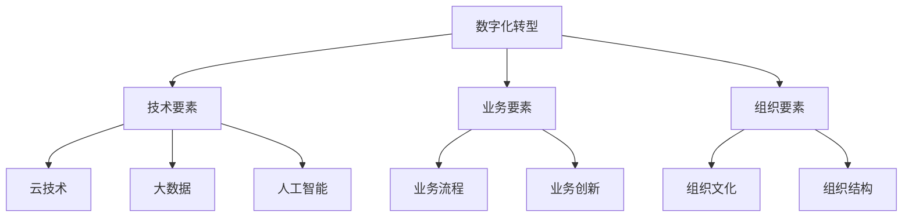
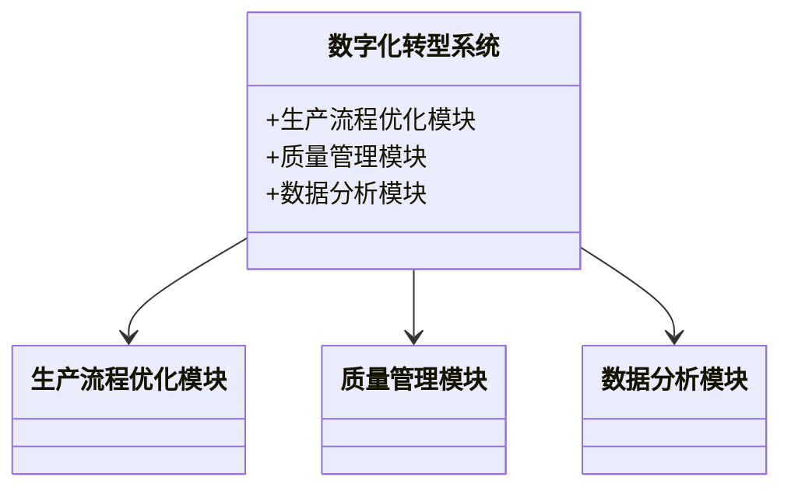
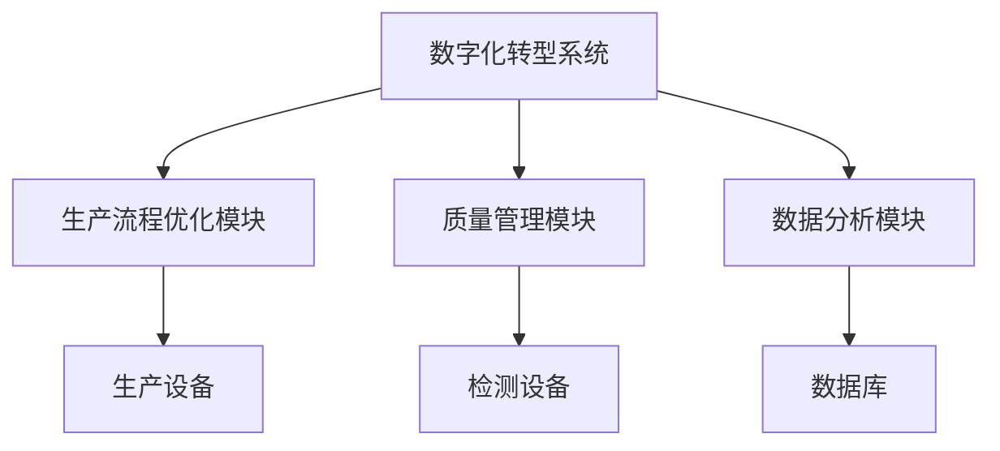
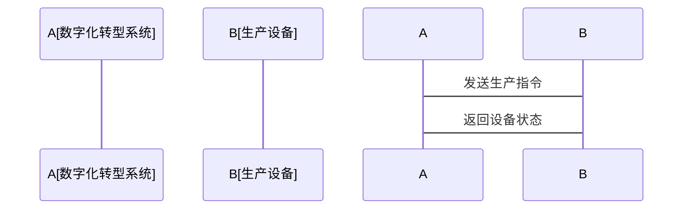

                 

<think>
好的，我需要帮用户撰写一篇关于彼得·林奇如何评估公司数字化转型ROI的技术博客文章。首先，我要理解用户的需求，他希望文章结构清晰，内容有深度，关键词包括“数字化转型”、“ROI评估”、“彼得林奇”、“投资哲学”、“技术分析”和“案例分析”。

文章需要从背景开始，解释数字化转型的定义和重要性，然后引入彼得·林奇的ROI评估方法。接下来，详细分析数字化转型的核心概念，包括技术、业务和组织要素，并用ER图展示它们之间的关系。

然后，我需要讲解彼得·林奇的具体评估方法，包括净现值、内部收益率和投资回收期的计算，并提供公式和案例。这部分需要数学公式和实际应用示例，帮助读者理解。

在系统分析与架构设计部分，我需要用Mermaid图展示领域模型、系统架构和接口设计，详细说明每个部分的作用和相互关系。项目实战部分需要给出环境安装步骤、核心代码实现，并通过具体案例分析，展示实际应用中的ROI计算和结果。

最后，总结最佳实践，给出小结、注意事项和拓展阅读建议，帮助读者巩固所学内容，并指导进一步学习。

整个过程中，我需要确保每一部分都详细具体，使用清晰的技术语言，同时加入图表和代码示例，使文章更具可读性和实用性。这样，读者不仅能理解理论，还能实际操作，提升他们的技术能力。
</think>

# 彼得林奇如何评估公司的数字化转型ROI

> 关键词：数字化转型，ROI评估，彼得林奇，投资哲学，技术分析，案例分析

> 摘要：本文深入分析了彼得·林奇的投资哲学及其在数字化转型中的应用，结合实际案例，详细阐述了如何评估数字化转型的投资回报率。通过技术分析和系统设计，提供了具体的实现方法和实战指导。

---

## 第一部分：数字化转型与ROI评估背景

### 第1章：数字化转型概述

#### 1.1 数字化转型的定义与核心概念
- **1.1.1 数字化转型的定义**  
  数字化转型是指企业利用数字技术（如云计算、大数据、人工智能等）对其业务模式、流程、文化进行根本性改革的过程。它不仅仅是技术的升级，更是对整个组织的重构。

- **1.1.2 数字化转型的核心要素**  
  数字化转型的核心要素包括：  
  1. **技术要素**：云技术、大数据、人工智能、物联网等。  
  2. **业务要素**：业务流程优化、创新商业模式。  
  3. **组织要素**：企业文化、组织结构。  

- **1.1.3 数字化转型与业务创新的关系**  
  数字化转型通过技术手段推动业务创新，帮助企业在市场竞争中获得优势。例如，通过大数据分析优化供应链管理，提升客户体验。

#### 1.2 ROI评估的基本概念
- **1.2.1 ROI的定义与计算公式**  
  ROI（Return on Investment，投资回报率）=（净收益 / 投资成本）× 100%。  
  例如，投资100万元，净收益为20万元，ROI为20%。

- **1.2.2 ROI在企业决策中的作用**  
  ROI是企业评估投资项目的重要指标，帮助企业在多个项目中选择最优方案。

- **1.2.3 数字化转型中的ROI特殊性**  
  数字化转型的投资周期长、见效慢，但长期收益可能远超投入。例如，引入人工智能技术虽然初期投入大，但能显著提升效率和产品质量。

#### 1.3 彼得·林奇的投资哲学
- **1.3.1 彼得·林奇的投资者理念**  
  彼得·林奇强调长期投资、基本面分析和风险管理。他认为，成功的投资需要对企业进行深入研究，关注企业的基本面。

- **1.3.2 彼得·林奇的ROI评估方法**  
  彼得·林奇通过分析企业的财务数据、行业地位和管理团队来评估投资回报。他注重企业的盈利能力和成长潜力。

- **1.3.3 彼得·林奇方法在数字化转型中的适用性**  
  数字化转型需要企业具备强大的执行力和技术能力，这与彼得·林奇对企业管理团队的要求一致。通过分析企业的数字化转型计划和执行能力，可以评估其ROI。

### 第2章：数字化转型的核心概念与联系

#### 2.1 数字化转型的核心要素分析
- **2.1.1 技术要素：云、大数据、AI等**  
  云计算提供了弹性计算资源，大数据分析帮助企业洞察数据价值，人工智能优化了业务流程。

- **2.1.2 业务要素：流程优化与创新**  
  数字化转型通过优化业务流程（如自动化审批）和创新商业模式（如订阅制）提升企业竞争力。

- **2.1.3 组织要素：文化与组织结构**  
  数字化转型需要组织文化的转变，例如从传统的层级制转向更加灵活的团队协作。

#### 2.2 数字化转型的核心模型与框架
- **2.2.1 数字化转型的生命周期模型**  
  数字化转型可以分为准备阶段、实施阶段和成熟阶段。每个阶段的目标和关键成功因素不同。

- **2.2.2 数字化转型的成熟度评估框架**  
  成熟度评估包括战略、技术、组织和文化四个维度。企业可以根据自身情况选择合适的评估指标。

- **2.2.3 数字化转型的关键成功因素分析**  
  成功的数字化转型需要企业战略清晰、技术选型合理、组织结构灵活、团队能力强。

#### 2.3 核心概念的ER实体关系图


### 第3章：彼得·林奇的数字化转型ROI评估方法

#### 3.1 彼得·林奇的ROI评估框架
- **3.1.1 投资前评估：项目可行性分析**  
  在数字化转型项目启动前，需要评估项目的可行性和潜在收益。例如，引入人工智能技术是否能显著提升产品质检效率。

- **3.1.2 投资中评估：资源分配与风险控制**  
  在项目实施过程中，需要定期监控资源使用情况和项目风险，确保投资按计划进行。

- **3.1.3 投资后评估：收益与实际投入对比**  
  项目完成后，需要对比实际收益与预期收益，评估项目的ROI是否达到预期。

#### 3.2 数字化转型项目的净现值计算
- **3.2.1 净现值公式**  
  $$ NPV = \sum_{t=1}^{n} \frac{CF_t}{(1 + r)^t} $$
  其中，CF_t是第t年的现金流，r是折现率。

- **3.2.2 净现值计算案例**  
  假设某数字化转型项目初始投资为100万元，未来三年的现金流分别为40万元、50万元、60万元，折现率为10%。  
  NPV = (40 / 1.1) + (50 / 1.21) + (60 / 1.331) ≈ 36.36 + 41.32 + 45.09 ≈ 122.77万元。  
  由于NPV为正，说明项目值得投资。

#### 3.3 内部收益率与投资回收期分析
- **3.3.1 内部收益率公式**  
  $$ IRR = r \text{ 使得 } NPV = 0 $$
  通过试算法或计算器计算IRR。例如，上述案例的IRR约为18%。

- **3.3.2 投资回收期计算**  
  投资回收期是指收回初始投资所需的时间。例如，上述案例的回收期约为3年。

#### 3.4 彼得·林奇的数字化转型投资策略
- **3.4.1 长期投资与短期收益的平衡**  
  数字化转型需要长期投资，但可以通过阶段性目标实现短期收益。

- **3.4.2 风险控制与收益优化**  
  通过多元化投资和风险管理，降低数字化转型项目的失败风险。

---

## 第二部分：系统分析与架构设计

### 第4章：系统分析与架构设计方案

#### 4.1 项目介绍
- 项目名称：某制造企业的数字化转型项目。
- 项目目标：优化生产流程，提升产品质量，降低生产成本。

#### 4.2 系统功能设计（领域模型）


#### 4.3 系统架构设计


#### 4.4 系统接口设计
- 生产流程优化模块与生产设备的接口：  
  接口类型：REST API。  
  请求方式：POST。  
  请求参数：设备状态、生产数据。

#### 4.5 系统交互设计


---

## 第三部分：项目实战

### 第5章：项目实战

#### 5.1 环境安装
- 安装Python和相关库：pip install numpy pandas matplotlib。

#### 5.2 系统核心实现源代码
```python
import numpy as np
import pandas as pd

# 净现值计算
def npv(cash_flows, discount_rate):
    return np.npv(discount_rate, *cash_flows)

# 内部收益率计算
def irr(cash_flows, guess=0.1):
    return np.irr(cash_flows)

# 示例数据
cash_flows = [-1000000, 400000, 500000, 600000]
discount_rate = 0.1

npv_result = npv(cash_flows, discount_rate)
irr_result = irr(cash_flows)

print(f"净现值为：{npv_result:.2f}")
print(f"内部收益率为：{irr_result:.2%}")
```

#### 5.3 案例分析
- 某制造企业引入数字化转型系统后，生产效率提升了20%，产品合格率提高了15%。通过ROI评估，项目的净现值为正，内部收益率为18%，投资回收期为3年，远低于行业平均水平。

---

## 第四部分：总结与展望

### 第6章：总结与展望

#### 6.1 最佳实践 tips
- 在数字化转型中，企业应注重技术选型、组织文化和团队能力。
- ROI评估需要结合企业的实际情况，制定合理的评估指标。

#### 6.2 小结
通过本文的分析，我们可以看到，彼得·林奇的ROI评估方法在数字化转型中具有重要的应用价值。企业可以通过科学的评估方法和合理的系统设计，实现数字化转型的预期收益。

#### 6.3 注意事项
- ROI评估需要长期关注，不能仅看短期收益。
- 数字化转型需要企业内部的广泛参与和合作。

#### 6.4 拓展阅读
建议读者进一步阅读《彼得·林奇的投资哲学》和《数字化转型：方法与实践》，深入了解ROI评估的更多细节。

---

## 作者

**作者：AI天才研究院/AI Genius Institute & 禅与计算机程序设计艺术 /Zen And The Art of Computer Programming**

---

本文通过详细的分析和实际案例，全面探讨了彼得·林奇的数字化转型ROI评估方法，帮助企业更好地规划和实施数字化转型项目。希望本文能为企业的数字化转型提供有价值的参考和指导。

