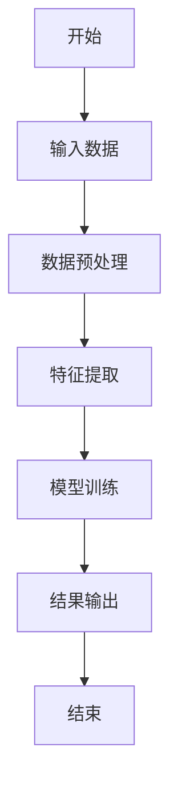
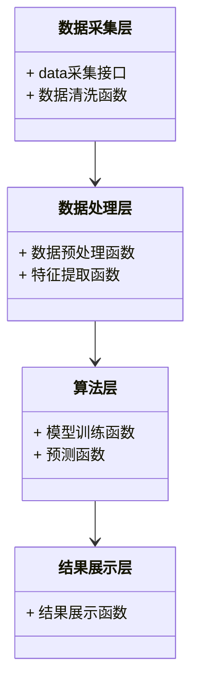
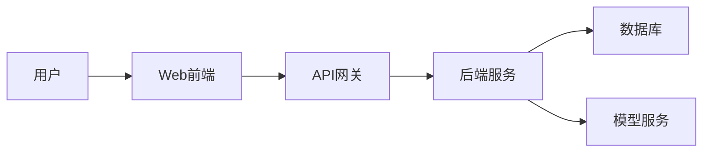
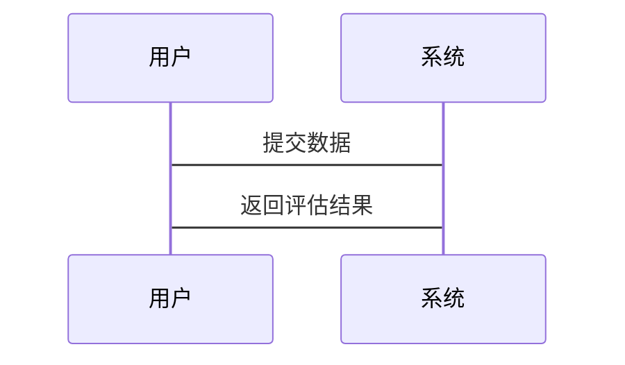

                 

<think>
好的，现在我要帮用户撰写一篇技术博客文章，标题是《彼得林奇如何评估公司的数字化转型速度与质量》。用户希望文章结构清晰，逻辑严密，内容深入，并且符合特定的格式和内容要求。

首先，我需要理解用户的需求。用户希望文章涵盖数字化转型的背景、核心概念、评估模型、系统架构、项目实战以及最佳实践等多个方面。同时，文章需要使用专业的技术语言，包括Mermaid图和Python代码示例，以及数学公式和表格等。用户还特别提到，文章需要以彼得·林奇的评估方法为主线，详细分析如何衡量数字化转型的速度与质量。

接下来，我会按照用户提供的目录大纲来组织文章内容。首先，在摘要部分，我会简要概述文章的核心内容，强调彼得·林奇的方法论及其在数字化转型评估中的应用。然后，我会分章节展开，每个章节都详细探讨相关的主题，确保内容丰富且符合逻辑。

在背景与核心概念部分，我需要明确数字化转型的定义、趋势以及与信息化的区别，同时分析企业在转型过程中可能遇到的挑战。这部分内容需要为后续的评估方法打下基础。

接下来是评估模型的构建，这里会详细讲解模型的算法原理，包括数据预处理、特征提取和模型训练等步骤。我会用Mermaid图来展示算法流程，并附上Python代码示例，帮助读者理解实现细节。

系统分析与架构设计部分，我会介绍系统的功能模块、架构设计和交互流程。这部分需要使用Mermaid图来展示类图、架构图和序列图，确保读者能够清晰地理解系统结构。

项目实战部分，我会提供一个具体的案例分析，包括环境安装、核心代码实现、案例分析和项目小结。这部分内容旨在通过实际案例帮助读者将理论应用于实践。

最后，我会总结最佳实践、注意事项和未来展望，帮助读者巩固所学内容，并为他们提供进一步的学习方向。

在撰写过程中，我会注意使用专业术语，同时确保内容通俗易懂。数学公式和表格会以正确的格式嵌入，代码示例也会详细解释，确保读者能够跟随步骤进行实践。

总的来说，我需要确保整篇文章逻辑严密，内容详实，符合用户的要求，同时兼顾专业性和可读性。这样，读者不仅能了解彼得·林奇的评估方法，还能掌握如何在实际中应用这些方法来衡量公司的数字化转型速度与质量。
</think>

# 彼得林奇如何评估公司的数字化转型速度与质量

## 关键词：数字化转型，彼得·林奇，评估方法，转型速度，转型质量，系统架构，项目实战

## 摘要：数字化转型是现代企业生存和发展的关键，而如何评估转型的速度与质量则直接关系到企业的成功。本文通过分析彼得·林奇的评估方法，详细探讨了数字化转型的核心概念、评估模型、系统架构以及项目实战。文章结合理论与实践，为读者提供了全面的评估框架和实用的工具，帮助企业在数字化转型中稳步前行。

---

# 第1章: 数字化转型的背景与核心概念

## 1.1 数字化转型的定义与核心概念

### 1.1.1 数字化转型的定义
数字化转型（Digital Transformation）是指利用数字技术改变业务模式、文化、流程、成果的方式，以创造新的价值。它不仅仅是技术的更新，更是企业战略、组织结构和商业模式的根本性变革。

### 1.1.2 数字化转型的核心要素
- **技术驱动**：云计算、大数据、人工智能等技术的应用。
- **业务创新**：通过数字化手段优化业务流程，提升效率。
- **组织变革**：打破传统组织结构，建立敏捷型组织。
- **用户体验**：以用户为中心，打造无缝化的数字化体验。

### 1.1.3 数字化转型与信息化的区别
| **维度** | **信息化** | **数字化转型** |
|----------|------------|----------------|
| **目标** | 提升效率 | 创新商业模式 |
| **手段** | 信息技术应用 | 数字技术驱动 |
| **范围** | 局部优化 | 全面变革 |

---

## 1.2 数字化转型的背景与趋势

### 1.2.1 当前数字化转型的全球趋势
- **技术进步**：云计算、AI、IoT等技术的快速发展为数字化转型提供了基础。
- **市场需求**：消费者对个性化、实时化服务的需求推动企业数字化。
- **竞争压力**：数字化转型已成为企业差异化竞争的核心能力。

### 1.2.2 数字化转型对企业竞争力的影响
- **提升效率**：通过自动化减少人工干预，降低运营成本。
- **增强创新**：数据驱动的决策支持帮助企业快速响应市场变化。
- **拓展市场**：数字化转型为企业进入新市场提供了可能性。

### 1.2.3 数字化转型的驱动因素分析
1. **技术驱动**：新兴技术为企业提供了新的工具和方法。
2. **业务驱动**：企业希望通过数字化转型实现业务增长。
3. **竞争驱动**：行业竞争加剧，迫使企业加快转型步伐。

---

## 1.3 问题背景与问题描述

### 1.3.1 数字化转型中的主要问题
- **技术选型不当**：企业可能选择不适合自身的技术架构，导致转型失败。
- **组织阻力**：传统组织结构和文化阻碍数字化转型的推进。
- **数据孤岛**：各部门之间数据无法共享，导致信息孤岛。

### 1.3.2 企业数字化转型的常见挑战
1. **技术复杂性**：数字化转型涉及多种技术的集成和协调。
2. **组织变革困难**：员工对新技术的接受度低，抵触变革。
3. **数据安全风险**：数字化转型过程中，数据泄露风险增加。

### 1.3.3 如何衡量数字化转型的速度与质量
- **速度**：通过项目进度、上线时间等指标衡量。
- **质量**：通过用户体验、系统稳定性、业务价值等指标衡量。

---

## 1.4 数字化转型的边界与外延

### 1.4.1 数字化转型的范围界定
- **范围**：从局部（如某一个部门）到全局（整个企业）。
- **层次**：从基础的信息化到全面的数字化重构。

### 1.4.2 数字化转型与其他管理概念的关系
- **信息化**：信息化是数字化转型的基础。
- **敏捷开发**：敏捷方法论是数字化转型中常用的技术管理方式。

### 1.4.3 数字化转型的实现路径
1. **明确目标**：确定数字化转型的目标和方向。
2. **制定计划**：制定详细的实施计划和时间表。
3. **持续优化**：通过反馈不断优化转型过程。

---

# 第2章: 数字化转型的核心概念与联系

## 2.1 核心概念原理

### 2.1.1 数字化转型的核心要素
- **技术**：云计算、大数据、人工智能等。
- **业务**：优化流程、创新模式。
- **组织**：敏捷组织、跨部门协作。

### 2.1.2 数字化转型的关键成功因素
1. **领导力**：高层管理者对转型的重视和支持。
2. **文化变革**：建立开放、创新的企业文化。
3. **技术选型**：选择适合企业需求的技术架构。

### 2.1.3 数字化转型的系统性特征
- **整体性**：数字化转型涉及企业的方方面面。
- **动态性**：转型是一个持续的过程，需要不断调整和优化。

---

## 2.2 核心概念属性特征对比表格

### 表2-1: 数字化转型与信息化的主要区别

| **特征** | **信息化** | **数字化转型** |
|----------|------------|----------------|
| **目标** | 提升效率 | 创新商业模式 |
| **手段** | 信息技术应用 | 数字技术驱动 |
| **范围** | 局部优化 | 全面变革 |

---

## 2.3 ER实体关系图

### 图2-1: 数字化转型系统ER图
```mermaid
erd
  title 数字化转型系统ER图
  rectangle 公司 {
    company_id (PK)
    company_name
    industry
  }
  rectangle 技术 {
    tech_id (PK)
    tech_name
    description
  }
  rectangle 项目 {
    project_id (PK)
    project_name
    start_date
    end_date
  }
  rectangle 关系 {
    relation_id (PK)
    company_id (FK)
    tech_id (FK)
    project_id (FK)
    role
  }
  公司 -- 关系
  技术 -- 关系
  项目 -- 关系
```

---

# 第3章: 数字化转型的评估模型

## 3.1 评估模型的构建原理

### 3.1.1 评估模型的构建方法
- **数据收集**：收集企业的数字化转型数据，包括技术、业务、组织等多个维度。
- **指标设计**：根据企业目标设计评估指标。
- **模型训练**：通过机器学习等方法训练评估模型。

### 3.1.2 评估模型的核心算法
1. **数据预处理**：清洗数据，处理缺失值和异常值。
2. **特征提取**：从数据中提取有用的特征。
3. **模型训练**：使用机器学习算法训练评估模型。

### 3.1.3 评估模型的数学公式
$$ \text{评估得分} = \alpha \times \text{技术指标} + \beta \times \text{业务指标} + \gamma \times \text{组织指标} $$

其中，$\alpha + \beta + \gamma = 1$，权重根据企业实际情况调整。

---

## 3.2 算法原理讲解

### 图3-1: 数字化转型评估算法流程图


### 代码实现

```python
def evaluate_transformation_speed(data):
    # 数据预处理
    preprocessed_data = preprocess(data)
    # 特征提取
    features = extract_features(preprocessed_data)
    # 模型训练
    model = train_model(features)
    # 结果输出
    result = model.predict(features)
    return result
```

---

## 3.3 算法实现代码

### 图3-2: 数字化转型评估系统架构图


---

# 第4章: 系统分析与架构设计方案

## 4.1 项目介绍与系统功能设计

### 4.1.1 项目介绍
本项目旨在通过数字化转型评估模型帮助企业衡量转型的速度与质量。系统主要包括数据采集、数据处理、模型训练和结果展示四个模块。

### 4.1.2 系统功能设计

#### 图4-1: 数字化转型系统类图


---

## 4.2 系统架构设计

### 图4-2: 数字化转型系统架构图


---

## 4.3 系统交互设计

### 图4-3: 数字化转型系统交互序列图


---

# 第5章: 项目实战

## 5.1 环境安装

### 5.1.1 环境要求
- Python 3.8+
- 机器学习库（如Scikit-learn、TensorFlow）
- 数据处理工具（如Pandas、NumPy）

---

## 5.2 核心代码实现

### 5.2.1 数据预处理代码
```python
import pandas as pd
import numpy as np

def preprocess(data):
    # 处理缺失值
    data = data.dropna()
    # 处理异常值
    data = data[abs(data - data.mean()).median() < 3 * data.std()]
    return data
```

### 5.2.2 模型训练代码
```python
from sklearn.ensemble import RandomForestClassifier
from sklearn.metrics import accuracy_score

def train_model(features, labels):
    model = RandomForestClassifier()
    model.fit(features, labels)
    return model
```

---

## 5.3 案例分析与详细解读

### 5.3.1 案例背景
某零售企业希望通过数字化转型提升客户体验和运营效率。以下是其数字化转型的评估过程：

1. **数据采集**：收集过去一年的销售数据、客户反馈和系统日志。
2. **数据预处理**：清洗数据，去除异常值。
3. **特征提取**：提取客户满意度、订单量、系统响应时间等特征。
4. **模型训练**：使用随机森林算法训练评估模型。
5. **结果展示**：根据模型预测结果，评估数字化转型的速度和质量。

---

## 5.4 项目小结

### 5.4.1 项目总结
通过本项目，我们可以看到，数字化转型评估模型能够有效帮助企业衡量转型的速度与质量。模型的准确性和实用性是关键，同时也需要根据企业实际情况不断优化。

### 5.4.2 项目收获
1. 掌握了数字化转型的核心概念和评估方法。
2. 学习了如何使用Python和机器学习技术进行项目实战。
3. 提高了系统架构设计和项目管理能力。

---

# 第6章: 数字化转型的最佳实践

## 6.1 小结

### 6.1.1 本文总结
本文通过分析彼得·林奇的评估方法，详细探讨了数字化转型的核心概念、评估模型、系统架构以及项目实战。文章结合理论与实践，为读者提供了全面的评估框架和实用的工具。

---

## 6.2 注意事项

### 6.2.1 评估模型的局限性
1. 模型依赖数据质量，数据偏差可能导致评估结果不准确。
2. 模型需要不断更新，以适应企业的变化。

### 6.2.2 数字化转型的挑战
1. 技术选型不当可能导致转型失败。
2. 组织变革困难是转型过程中的主要障碍。

---

## 6.3 拓展阅读

### 6.3.1 推荐书籍
1. 《数字化转型：技术与管理的完美融合》
2. 《彼得·林奇的投资哲学》

---

## 作者：AI天才研究院/AI Genius Institute & 禅与计算机程序设计艺术 /Zen And The Art of Computer Programming

