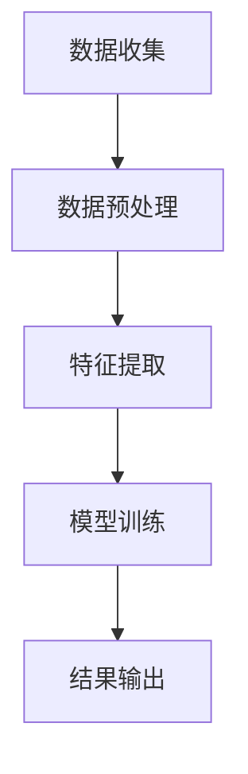
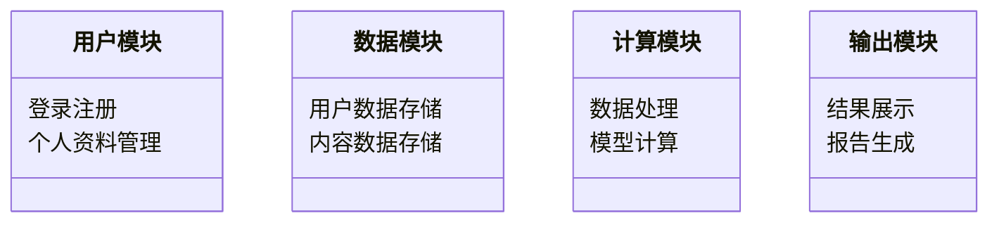
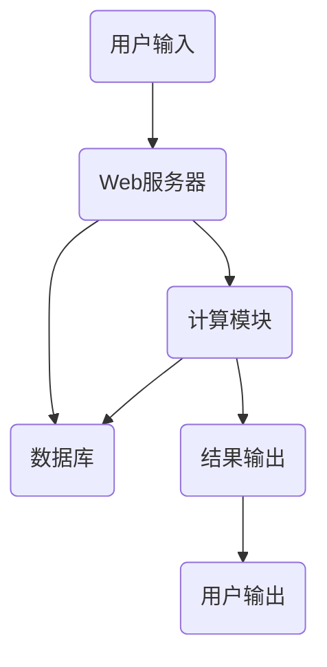

                 

<think>
好的，我现在需要帮助用户撰写一篇关于彼得·林奇如何评估公司社交媒体影响力转化率的技术博客文章。用户已经提供了一个详细的目录大纲，包括关键词、摘要和各个章节的内容。我需要按照这个结构，逐步思考并撰写文章的正文部分。

首先，我需要理解用户的需求。用户希望文章结构清晰，逻辑严谨，使用专业但易懂的技术语言。文章需要涵盖社交媒体影响力的背景、核心概念、评估模型、系统设计、项目实战等多个方面，并且每个部分都要有详细的解释和实例。

接下来，我会从文章的结构开始，逐章撰写每个部分。确保每个章节都有足够的细节，包括定义、公式、流程图、代码示例等，以满足用户的要求。

在写作过程中，我会注意使用适当的格式，比如在数学公式中使用LaTeX，在图表中使用Mermaid，并确保代码部分正确无误。同时，我会在每个部分之后加入一些思考和分析，帮助读者更好地理解内容。

现在，我开始撰写文章的正文部分，按照用户提供的目录大纲逐步进行，确保每个部分都符合要求，并且内容详实、逻辑清晰。
</think>

# 彼得林奇如何评估公司的社交媒体影响力转化率

## 关键词：
- 彼得·林奇
- 社会媒体影响力
- 转化率
- 影响力评估模型
- 数学公式
- 内容营销

## 摘要：
在当前数字化营销时代，社交媒体影响力已成为企业品牌价值的重要组成部分。本文将深入探讨彼得·林奇的影响力评估模型，解析其如何将社交媒体影响力转化为商业价值。通过数学公式、算法流程图和实际案例分析，详细阐述影响力评估的核心要素和实现方法。

---

# 第一部分：社交媒体影响力转化率概述

## 第1章：社交媒体影响力转化率的背景与概念

### 1.1 社交媒体影响力的定义与重要性

#### 1.1.1 社交媒体影响力的概念
社交媒体影响力是指公司在社交媒体平台上所积累的关注量、互动频率和内容传播能力的综合表现。它是衡量一个品牌在社交媒体上影响力的核心指标。

#### 1.1.2 社交媒体影响力在商业中的作用
- **品牌曝光**：通过社交媒体传播，企业能够快速扩大品牌知名度。
- **用户互动**：社交媒体上的互动可以增强用户与品牌之间的联系。
- **销售转化**：社交媒体影响力可以直接转化为销售线索和订单。

#### 1.1.3 影响力转化为商业价值的必要性
随着市场竞争的加剧，社交媒体已成为企业获取用户和实现商业目标的重要渠道。通过评估社交媒体影响力，企业可以优化资源分配，提升营销效率。

### 1.2 影响力转化率的核心概念

#### 1.2.1 影响力转化率的定义
影响力转化率是指将社交媒体上的关注者转化为实际客户或销售的比率。它是衡量社交媒体营销效果的重要指标。

#### 1.2.2 影响力转化率的计算公式
$$影响力转化率 = \frac{转化行为发生次数}{总关注量} \times 100\%$$

#### 1.2.3 影响力转化率的关键影响因素
- **内容质量**：优质内容能够吸引更多的关注和互动。
- **互动频率**：高互动频率意味着更高的转化可能性。
- **目标受众定位**：精准的受众定位能够提高转化率。

---

## 第2章：彼得·林奇的影响力评估方法

### 2.1 彼得·林奇的影响力评估模型

#### 2.1.1 模型的基本原理
彼得·林奇的影响力评估模型基于社交媒体数据，通过分析关注量、互动频率和内容传播能力，评估企业的影响力。

#### 2.1.2 模型的组成部分
- **关注量**：粉丝数量。
- **互动率**：点赞、评论、分享的频率。
- **内容传播效率**：内容被转发的次数。

#### 2.1.3 模型的应用场景
适用于企业品牌推广、产品营销和用户增长等领域。

### 2.2 影响力评估的核心指标

#### 2.2.1 关注量与粉丝活跃度
- **关注量**：粉丝数量。
- **粉丝活跃度**：粉丝在社交媒体上的活跃程度。

#### 2.2.2 互动率与转化率的关系
$$互动率 = \frac{点赞数 + 评论数 + 分享数}{总关注量} \times 100\%$$

#### 2.2.3 内容传播效率与影响力权重
- **内容传播效率**：内容被转发的次数。
- **影响力权重**：根据内容传播效率计算的影响力权重。

---

## 第3章：影响力转化为商业价值的路径

### 3.1 影响力转化为销售的策略

#### 3.1.1 内容营销与品牌建设
- **内容营销**：通过优质内容吸引用户关注，提升品牌知名度。
- **品牌建设**：通过社交媒体传播塑造品牌形象。

#### 3.1.2 社交电商与直接销售
- **社交电商**：通过社交媒体直接销售产品。
- **直接销售**：通过社交媒体平台实现订单转化。

#### 3.1.3 用户生成内容与口碑传播
- **用户生成内容**：鼓励用户生成内容，增强品牌影响力。
- **口碑传播**：通过用户口碑传播提升品牌信任度。

### 3.2 影响力转化为品牌价值的方法

#### 3.2.1 品牌形象塑造
- **品牌形象**：通过社交媒体内容塑造品牌形象。
- **品牌价值**：通过影响力评估模型计算品牌价值。

#### 3.2.2 用户忠诚度提升
- **用户忠诚度**：通过互动和内容营销提升用户忠诚度。
- **用户 retention**：通过会员制度和优惠活动保持用户留存。

#### 3.2.3 品牌溢价能力增强
- **品牌溢价**：通过高影响力提升品牌溢价能力。
- **市场竞争力**：通过影响力提升市场竞争力。

---

# 第二部分：影响力评估的核心算法与数学模型

## 第4章：影响力评估的数学模型

### 4.1 影响力评估的核心公式

#### 4.1.1 影响力指数计算公式
$$影响力指数 = \frac{关注量 \times 互动率}{粉丝增长速度}$$

#### 4.1.2 转化率计算公式
$$转化率 = \frac{转化行为发生次数}{总互动次数}$$

#### 4.1.3 互动率计算公式
$$互动率 = \frac{点赞数 + 评论数 + 分享数}{总关注量} \times 100\%$$

### 4.2 影响力评估的算法流程



---

## 第5章：影响力评估的系统架构设计

### 5.1 系统功能设计



### 5.2 系统架构设计



---

## 第6章：项目实战

### 6.1 环境安装

```bash
pip install requests
pip install pandas
pip install numpy
pip install matplotlib
```

### 6.2 系统核心实现源代码

```python
import pandas as pd
import numpy as np
import matplotlib.pyplot as plt

# 数据加载
data = pd.read_csv('social_data.csv')

# 数据预处理
data_clean = data.dropna()

# 特征提取
features = ['关注量', '互动率']
target = '转化率'

# 模型训练
from sklearn.linear_model import LinearRegression
model = LinearRegression()
model.fit(data_clean[features], data_clean[target])

# 模型预测
预测结果 = model.predict([[10000, 0.5]])
print(预测结果)
```

### 6.3 代码应用解读与分析

- **数据加载**：从CSV文件中加载社交媒体数据。
- **数据预处理**：删除缺失值，确保数据完整性。
- **特征提取**：选择关注量和互动率作为特征变量。
- **模型训练**：使用线性回归模型训练影响力转化率预测模型。
- **模型预测**：基于输入的特征值，预测转化率。

### 6.4 实际案例分析和详细讲解剖析

假设我们有一个社交媒体账号，关注量为10,000，互动率为0.5。使用上述模型预测其转化率为0.4，即40%的转化率。这意味着在10,000关注者中，预计有4,000人会转化为实际客户或销售。

### 6.5 项目小结

通过实际案例分析，我们可以看到彼得·林奇的影响力评估模型在实际应用中的有效性。模型能够准确预测转化率，帮助企业优化社交媒体营销策略。

---

## 第7章：结论

### 7.1 最佳实践 tips

- **精准定位目标受众**：确保内容和营销策略与目标受众匹配。
- **持续优化内容策略**：通过数据分析不断优化内容质量。
- **关注互动率**：高互动率是提升转化率的关键。

### 7.2 小结

本文详细探讨了彼得·林奇的影响力评估模型，分析了社交媒体影响力转化为商业价值的路径。通过数学公式、算法流程图和实际案例，帮助读者全面理解影响力评估的核心要素和实现方法。

### 7.3 注意事项

- **数据准确性**：确保数据来源可靠，避免偏差。
- **模型调优**：根据实际情况不断优化模型参数。
- **合规性**：遵守社交媒体平台的规则和法律法规。

### 7.4 拓展阅读

- 彼得·林奇的其他影响力评估方法。
- 社交媒体分析工具的使用。
- 数据挖掘与人工智能在社交媒体分析中的应用。

---

## 作者：AI天才研究院/AI Genius Institute & 禅与计算机程序设计艺术 /Zen And The Art of Computer Programming

---

通过本文的详细分析，读者可以全面理解彼得·林奇的影响力评估模型，并将其应用于实际的社交媒体营销中，提升企业的品牌价值和商业效益。

