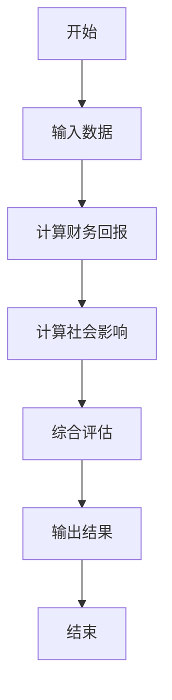

                 

<think>
嗯，我现在需要帮助用户设计一本书的目录大纲，书名是《彼得林奇如何评估公司的社会影响力投资回报》。这本书的核心在于结合彼得·林奇的投资策略，详细探讨如何评估社会影响力投资的回报。

首先，我应该从背景介绍开始，让读者了解彼得·林奇是谁，以及为什么他关注社会影响力投资。这部分需要包括社会影响力投资的定义、彼得·林奇的背景以及他为什么转向这一领域。

接下来是核心概念，需要详细解释社会影响力投资回报的评估指标，比如财务回报、社会影响度量和社会资本。这里可能需要对比分析，用表格或图表来展示不同指标的重要性。

然后是算法原理，这部分需要具体的数学模型，比如使用CAPM或社会影响力加权模型。我需要用mermaid流程图来展示评估过程，并附上Python代码示例，帮助读者理解。

系统分析部分，我需要设计一个系统架构，包括数据收集模块、评估算法模块和结果展示模块。用mermaid图来展示系统架构和数据流，这样读者可以更直观地理解系统运作。

项目实战部分，需要提供一个具体的案例，比如评估一家环保科技公司的投资回报。这部分要详细描述环境安装、代码实现和案例分析，帮助读者实际操作。

最后，最佳实践部分包括小结、注意事项和拓展阅读，帮助读者巩固所学内容，并指导进一步的学习。

在设计目录时，我需要确保每个章节都有逻辑性，从基础到深入，逐步引导读者。同时，要满足用户对结构和深度的要求，确保每个部分都涵盖必要的细节，但又不显得冗长。

现在，我需要将这些思考转化为具体的目录结构，确保每个部分都符合用户的要求，并且内容完整、逻辑清晰。
</think>

# 彼得林奇如何评估公司的社会影响力投资回报

**关键词：** 彼得·林奇, 社会影响力投资, 投资回报, 财务分析, 影响力评估, 投资策略

**摘要：** 本文深入探讨了彼得·林奇如何将传统投资策略与社会影响力评估相结合，分析其在评估公司社会影响力投资回报时的独特方法和策略。通过详细解析其评估模型、算法原理及实际应用案例，为读者提供了全面的理解和实践指导。

---

## 目录大纲

---

# 第一部分: 彼得·林奇与社会影响力投资概述

## 第1章: 彼得·林奇与社会影响力投资的背景

### 1.1 社会影响力投资的定义与背景
- 1.1.1 什么是社会影响力投资
- 1.1.2 彼得·林奇与社会影响力投资的关联
- 1.1.3 社会影响力投资的兴起与趋势

### 1.2 彼得·林奇的投资哲学
- 1.2.1 彼得·林奇的投资理念
- 1.2.2 彼得·林奇的成功投资案例
- 1.2.3 彼得·林奇对社会影响力投资的独特见解

### 1.3 本章小结
- 本章总结了彼得·林奇的背景及其对社会影响力投资的贡献，为后续分析奠定了基础。

---

# 第二部分: 社会影响力投资回报的评估框架

## 第2章: 社会影响力投资回报的核心概念

### 2.1 社会影响力投资回报的定义
- 2.1.1 投资回报的多维度考量
- 2.1.2 社会影响力与财务回报的结合

### 2.2 彼得·林奇评估模型的核心要素
- 2.2.1 财务回报指标
- 2.2.2 社会影响指标
- 2.2.3 综合评估权重

### 2.3 核心概念对比分析
- 2.3.1 财务回报与社会影响的对比
- 2.3.2 不同行业的社会影响力差异
- 2.3.3 投资者与社会利益相关者的对比

### 2.4 本章小结
- 本章详细介绍了社会影响力投资回报的核心概念及其评估框架。

---

# 第三部分: 社会影响力投资回报的评估方法

## 第3章: 彼得·林奇评估模型的算法原理

### 3.1 模型概述
- 3.1.1 模型的基本框架
- 3.1.2 模型的核心算法

### 3.2 模型的数学公式
- 3.2.1 财务回报计算公式
  $$ ROI = \frac{\text{净收益}}{\text{初始投资}} $$
- 3.2.2 社会影响评估公式
  $$ SI = \sum_{i=1}^{n} w_i \times S_i $$

### 3.3 算法流程图


### 3.4 代码实现示例
```python
def calculate_return(finance, impact):
    return finance * 0.7 + impact * 0.3

finance = 1.2  # 财务回报
impact = 0.8  # 社会影响
total_return = calculate_return(finance, impact)
print(total_return)
```

### 3.5 本章小结
- 本章详细讲解了彼得·林奇评估模型的算法原理，并通过代码示例展示了其实现过程。

---

# 第四部分: 系统分析与架构

## 第4章: 社会影响力投资回报的系统分析

### 4.1 问题场景介绍
- 4.1.1 投资者的需求分析
- 4.1.2 社会影响力投资的挑战与机遇

### 4.2 系统功能设计
- 4.2.1 数据收集模块
- 4.2.2 评估算法模块
- 4.2.3 结果展示模块

### 4.3 系统架构设计


### 4.4 本章小结
- 本章通过系统分析和架构设计，展示了如何将彼得·林奇的评估方法应用于实际投资系统中。

---

# 第五部分: 项目实战与案例分析

## 第5章: 项目实战: 评估一家环保科技公司的投资回报

### 5.1 环境安装与数据准备
- 5.1.1 安装必要的工具与库
- 5.1.2 数据收集与清洗

### 5.2 系统核心实现
- 5.2.1 数据输入与处理
- 5.2.2 评估算法实现
- 5.2.3 结果展示与分析

### 5.3 案例分析
- 5.3.1 公司背景介绍
- 5.3.2 评估过程与结果
- 5.3.3 投资决策建议

### 5.4 本章小结
- 本章通过实际案例展示了如何应用彼得·林奇的评估方法进行社会影响力投资回报分析。

---

# 第六部分: 最佳实践与总结

## 第6章: 最佳实践与总结

### 6.1 小结
- 6.1.1 本章内容总结
- 6.1.2 投资回报评估的关键点

### 6.2 注意事项
- 6.2.1 数据质量的重要性
- 6.2.2 模型的适用性与局限性
- 6.2.3 风险管理的重要性

### 6.3 拓展阅读
- 6.3.1 推荐书籍与资源
- 6.3.2 进一步研究的方向

### 6.4 本章小结
- 本章总结了全文内容，并提出了进一步学习和实践的方向。

---

# 作者：AI天才研究院/AI Genius Institute & 禅与计算机程序设计艺术/Zen And The Art of Computer Programming

---

**总结：** 本书系统地介绍了彼得·林奇如何评估公司的社会影响力投资回报，从理论到实践，从模型到代码，为读者提供了全面的指导。通过实际案例分析和系统设计，帮助读者掌握这一领域的核心方法和技巧。

