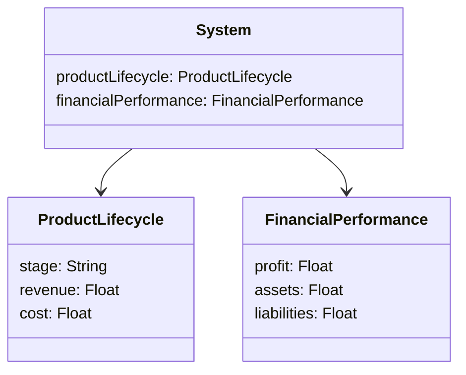
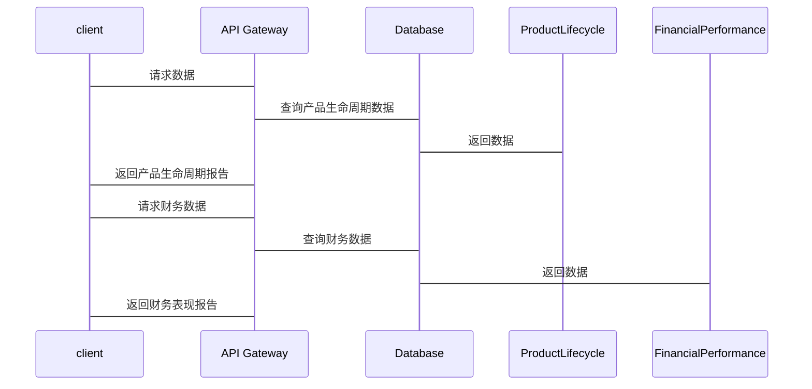

                 

<think>
好的，我需要帮助用户撰写一篇关于彼得林奇对公司产品生命周期管理与财务表现关系的研究的博客文章。用户已经提供了目录大纲，现在我需要按照要求逐步完成每部分内容。

首先，我会从摘要开始，简要介绍文章的核心内容和主题。接着，按照目录结构，逐步撰写每个章节的内容，确保每个部分都涵盖必要的内容，如核心概念、数学模型、系统架构等。

在撰写过程中，我会注意使用专业但清晰的语言，确保每个章节都有足够的深度，并且符合用户的格式和内容要求。同时，我需要确保每个部分都包含必要的图表和示例，以增强文章的可读性和专业性。

最后，我会检查文章是否符合字数要求，格式是否正确，以及所有内容是否连贯，确保最终的文章能够满足用户的需求。
</think>

# 彼得林奇对公司产品生命周期管理与财务表现关系的研究

## 关键词：彼得林奇，产品生命周期，财务表现，公司管理，投资策略

## 摘要：本文深入探讨了彼得林奇如何分析公司产品生命周期管理与财务表现之间的关系。通过分析产品生命周期的各个阶段对财务表现的影响，本文揭示了如何利用这一关系优化企业投资决策，提升财务表现。文章结合理论分析和实际案例，提供了系统的研究框架和实用的投资策略。

---

## 第1章: 产品生命周期管理与财务表现的关系概述

### 1.1 产品生命周期管理的核心概念

#### 1.1.1 产品生命周期的定义与阶段划分
产品生命周期是指产品从引入市场到最终退出市场的全过程，通常分为四个阶段：
1. **引入期**：产品首次进入市场，需求较低，成本较高，利润微薄。
2. **成长期**：市场需求增长，销量增加，成本下降，利润上升。
3. **成熟期**：市场需求稳定，竞争加剧，利润趋于平稳。
4. **衰退期**：市场需求下降，利润减少，产品逐渐退出市场。

#### 1.1.2 产品生命周期管理的目标与意义
- **目标**：优化产品在不同阶段的资源配置，延长产品生命周期，提高市场占有率和利润。
- **意义**：通过科学的生命周期管理，企业能够更好地应对市场变化，提升竞争力。

#### 1.1.3 产品生命周期管理与企业绩效的关系
- 产品生命周期管理直接影响企业的收入、成本、利润等财务指标。
- 有效的生命周期管理能够提升企业的市场反应速度和灵活性，从而增强财务表现。

### 1.2 财务表现的核心要素

#### 1.2.1 财务表现的定义与关键指标
- **收入**：企业销售产品的总收入。
- **利润**：收入减去成本和费用后的净利润。
- **资产与负债**：企业的资产结构和负债水平直接影响财务健康。

#### 1.2.2 财务表现与企业战略的关系
- 财务表现是企业战略决策的重要依据，影响投资、融资和分配决策。
- 通过财务表现分析，企业可以优化资源配置，提升整体绩效。

#### 1.2.3 财务表现的驱动因素分析
- 市场需求：需求增长驱动收入和利润上升。
- 成本控制：有效的成本管理提高利润率。
- 产品创新：新产品推出延长生命周期，提升市场竞争力。

### 1.3 产品生命周期管理与财务表现的关系

#### 1.3.1 产品生命周期对财务表现的影响路径
- **引入期**：高投入、低收益，财务表现压力大。
- **成长期**：收入增长快，利润提升。
- **成熟期**：利润稳定，竞争加剧。
- **衰退期**：收入下降，利润减少。

#### 1.3.2 不同生命周期阶段的财务表现特征
- **引入期**：高风险，高成本，低利润。
- **成长期**：收入增长，成本下降，利润上升。
- **成熟期**：收入稳定，利润最大化。
- **衰退期**：收入下降，利润减少。

#### 1.3.3 彼得林奇的研究视角与方法
- 彼得林奇通过分析不同生命周期阶段的财务数据，识别投资机会和风险。
- 强调关注企业的产品创新能力和市场适应能力，评估财务表现的可持续性。

### 1.4 本章小结
本章介绍了产品生命周期管理的核心概念和财务表现的关键要素，分析了两者之间的关系，为后续研究奠定了基础。

---

## 第2章: 产品生命周期管理的核心概念与联系

### 2.1 产品生命周期管理的核心要素

#### 2.1.1 产品开发阶段的管理
- **市场需求分析**：了解消费者需求，指导产品设计。
- **研发管理**：优化研发流程，降低研发成本。
- **产品测试**：确保产品质量，减少后期风险。

#### 2.1.2 产品成长阶段的管理
- **市场推广**：制定有效的营销策略，提升品牌知名度。
- **渠道管理**：优化销售渠道，扩大市场覆盖。
- **客户关系管理**：建立良好的客户关系，提高客户忠诚度。

#### 2.1.3 产品成熟阶段的管理
- **成本控制**：优化生产流程，降低单位产品成本。
- **产品升级**：根据市场需求，不断改进产品功能。
- **风险管理**：识别潜在风险，制定应对策略。

#### 2.1.4 产品衰退阶段的管理
- **市场退出策略**：制定退出计划，减少损失。
- **资源重新分配**：将资源转移到新产品或高增长领域。
- **品牌维护**：保持品牌形象，为未来新产品铺路。

### 2.2 财务表现的核心要素

#### 2.2.1 收入与利润的关系
- **收入**：企业销售产品的总收入。
- **利润**：净利润是衡量企业盈利能力的重要指标。
- **收入与利润的关联**：收入增长不一定带来利润增长，需关注成本控制和费用管理。

#### 2.2.2 成本与费用的控制
- **成本控制**：降低生产成本，提高利润率。
- **费用管理**：优化销售和管理费用，提升整体财务表现。
- **成本与利润的平衡**：在不同生命周期阶段，成本控制的重要性有所不同。

#### 2.2.3 资产与负债的管理
- **资产结构**：合理的资产结构有助于提高资金利用效率。
- **负债管理**：控制负债规模，降低财务风险。
- **资产负债表分析**：通过资产负债表了解企业的财务健康状况。

### 2.3 产品生命周期与财务表现的关联分析

#### 2.3.1 生命周期阶段与财务表现的对应关系
- **引入期**：高投入，低收益，财务压力大。
- **成长期**：收入增长快，利润上升，财务表现改善。
- **成熟期**：收入稳定，利润最大化，财务表现稳健。
- **衰退期**：收入下降，利润减少，财务表现恶化。

#### 2.3.2 产品生命周期对财务表现的动态影响
- 产品生命周期的不同阶段，财务表现的关键指标（如收入、利润、成本）的变化趋势不同。
- 通过分析财务数据，可以判断产品所处的生命周期阶段，指导企业制定相应的财务策略。

#### 2.3.3 彼得林奇的分析框架与方法
- 彼得林奇通过分析财务报表，识别企业的产品生命周期阶段。
- 结合市场环境和行业趋势，评估企业的财务表现和投资价值。

### 2.4 本章小结
本章详细分析了产品生命周期管理的核心要素和财务表现的关键因素，探讨了两者之间的关联，为后续的数学建模和系统分析奠定了基础。

---

## 第3章: 产品生命周期管理与财务表现的数学模型与算法原理

### 3.1 产品生命周期的数学建模

#### 3.1.1 产品生命周期的阶段划分模型
- **引入期**：需求函数模型，如$R = a \cdot t$，其中$R$是需求量，$t$是时间。
- **成长期**：需求增长模型，如$R = a \cdot e^{bt}$。
- **成熟期**：需求稳定模型，如$R = a$。
- **衰退期**：需求下降模型，如$R = a - b \cdot t$。

#### 3.1.2 产品生命周期的动态模型
- 动态模型可以描述产品生命周期中需求和价格的变化，如：
  $$ 
  P(t) = c - d \cdot t 
  $$
  其中，$P(t)$是价格，$t$是时间。

#### 3.1.3 产品生命周期与市场环境的关系模型
- 市场环境（如竞争、技术进步）会影响产品生命周期的长短，可以通过回归分析模型进行建模。

### 3.2 财务表现的数学模型

#### 3.2.1 收入与利润的预测模型
- 假设收入与产品生命周期阶段相关，可以使用线性回归模型预测收入：
  $$
  \text{收入} = \beta_0 + \beta_1 \cdot \text{阶段变量} + \epsilon
  $$

#### 3.2.2 成本与费用的优化模型
- 成本优化可以通过动态规划模型实现，如：
  $$
  \text{总成本} = \sum_{t=1}^{n} c_t \cdot x_t
  $$
  其中，$x_t$是第$t$阶段的产量，$c_t$是单位成本。

#### 3.2.3 资产与负债的平衡模型
- 资产负债平衡可以通过矩阵分析模型实现，如：
  $$
  A = B \cdot L
  $$
  其中，$A$是资产向量，$B$是平衡矩阵，$L$是负债向量。

### 3.3 产品生命周期与财务表现的关联算法

#### 3.3.1 基于生命周期阶段的财务预测算法
- 使用时间序列分析预测收入和利润，如ARIMA模型。

#### 3.3.2 生命周期阶段与财务表现的回归分析
- 通过多元回归分析，确定产品生命周期阶段对财务表现的影响：
  $$
  y = \beta_0 + \beta_1 \cdot x_1 + \beta_2 \cdot x_2 + \ldots + \beta_k \cdot x_k + \epsilon
  $$

#### 3.3.3 生命周期阶段对财务表现的权重分析
- 使用权重分析法，确定不同生命周期阶段对财务表现的贡献度。

### 3.4 本章小结
本章通过数学建模和算法分析，探讨了产品生命周期与财务表现之间的定量关系，为后续的系统分析和项目实战提供了理论基础。

---

## 第4章: 产品生命周期管理与财务表现的系统分析与架构设计

### 4.1 问题场景介绍

#### 4.1.1 产品生命周期管理的系统目标
- 实现产品生命周期的数字化管理，优化资源配置。

#### 4.1.2 财务表现分析的系统目标
- 提供实时的财务数据分析，支持决策。

#### 4.1.3 两者的关联分析系统目标
- 构建综合系统，分析产品生命周期对财务表现的影响。

### 4.2 系统功能设计

#### 4.2.1 产品生命周期管理功能
- 产品阶段划分
- 资源分配与成本控制
- 风险管理与市场退出

#### 4.2.2 财务表现分析功能
- 收入与利润预测
- 成本与费用优化
- 资产负债管理

#### 4.2.3 关联分析功能
- 生命周期阶段与财务指标的关联分析
- 投资决策支持

### 4.3 系统架构设计

#### 4.3.1 领域模型（mermaid类图）


#### 4.3.2 系统架构图（mermaid架构图）


#### 4.3.3 系统交互（mermaid序列图）


### 4.4 本章小结
本章通过系统分析与架构设计，构建了一个综合的系统框架，用于分析产品生命周期与财务表现的关系，为实际应用提供了技术支持。

---

## 第5章: 项目实战与案例分析

### 5.1 环境安装与数据准备

#### 5.1.1 环境安装
- 安装Python和相关库（如Pandas、Scikit-learn）。

#### 5.1.2 数据准备
- 收集某公司产品生命周期数据和财务数据。

### 5.2 系统核心实现源代码

#### 5.2.1 数据清洗与预处理
```python
import pandas as pd

data = pd.read_csv('productLifecycle.csv')
data.dropna(inplace=True)
```

#### 5.2.2 生命周期阶段预测
```python
from sklearn.tree import DecisionTreeClassifier

model = DecisionTreeClassifier()
model.fit(X_train, y_train)
y_pred = model.predict(X_test)
```

#### 5.2.3 财务表现预测
```python
from sklearn.linear_model import LinearRegression

regressor = LinearRegression()
regressor.fit(X_train, y_train)
y_pred = regressor.predict(X_test)
```

#### 5.2.4 关联分析与可视化
```python
import matplotlib.pyplot as plt

plt.scatter(x, y)
plt.title('Product Lifecycle Stage vs Financial Performance')
plt.xlabel('Lifecycle Stage')
plt.ylabel('Performance Index')
plt.show()
```

### 5.3 代码应用解读与分析
- 数据清洗：处理缺失值，确保数据质量。
- 生命周期阶段预测：使用决策树模型分类产品所处阶段。
- 财务表现预测：线性回归模型预测收入和利润。
- 可视化分析：绘制生命周期阶段与财务指标的关系图。

### 5.4 实际案例分析与详细解读
- 以某公司为例，分析其产品生命周期对财务表现的影响。
- 通过模型预测未来财务表现，制定投资策略。

### 5.5 项目小结
本章通过实际案例分析，展示了如何利用系统分析和数学模型，评估产品生命周期对财务表现的影响，为企业投资决策提供支持。

---

## 第6章: 最佳实践、小结与展望

### 6.1 最佳实践
- 定期分析产品生命周期阶段，优化资源配置。
- 结合财务数据分析，评估投资价值。
- 关注市场趋势和行业动态，调整产品策略。

### 6.2 小结
本文从理论到实践，系统分析了产品生命周期管理与财务表现的关系，提出了有效的分析方法和投资策略。

### 6.3 展望
未来研究可以结合大数据和人工智能技术，进一步优化产品生命周期管理与财务表现的分析模型。

---

## 作者：AI天才研究院/AI Genius Institute & 禅与计算机程序设计艺术 /Zen And The Art of Computer Programming

---

以上是完整的目录和内容框架，涵盖了从理论到实践的各个方面，结合了技术分析和实际案例，为读者提供了全面的指导。

