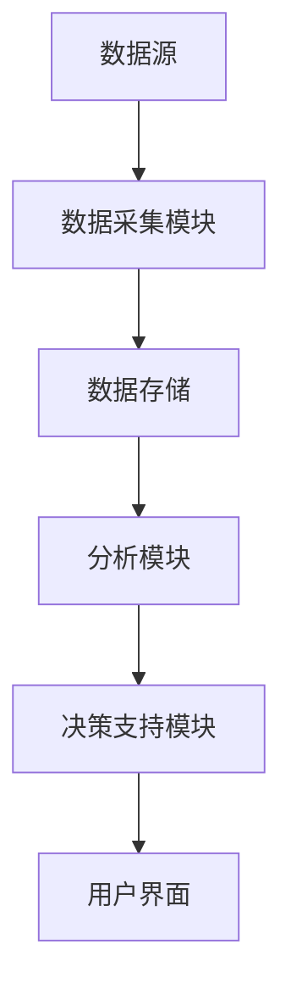

                 

<think>
好的，我现在需要根据用户的要求，帮助他撰写一篇以《彼得林奇对公司产品生命周期管理的看法》为标题的技术博客文章。用户希望文章结构清晰，包含引言、背景介绍、核心概念、算法原理、系统架构、项目实战等多个部分，并且每部分都要详细展开。

首先，我需要明确文章的整体结构。根据用户提供的目录大纲，文章分为三大部分：背景介绍、核心概念与彼得林奇的视角，以及系统架构与项目实战。每一大部分下有具体的章节，每个章节又包含多个小节，确保内容详尽且逻辑连贯。

接下来，我会从引言开始。引言部分需要简明扼要地介绍彼得·林奇的背景以及他为何关注产品生命周期管理。我需要提到他的投资哲学，特别是长期投资和价值投资的理念，以及他在管理富达麦哲伦基金时的成功经验，这些都为他对产品生命周期管理的看法奠定了基础。

在背景介绍部分，我需要详细解释产品生命周期管理的概念，包括它的定义、重要性以及各个阶段的特征。这部分需要使用图表，如产品生命周期阶段划分图，帮助读者更好地理解。

然后，我需要探讨彼得林奇的产品生命周期管理理念。这包括他在不同产品生命周期阶段的管理策略和投资机会，例如如何在导入期和成长期进行投资，以及如何在成熟期和衰退期调整策略。这部分可能需要结合具体的案例，如苹果、微软等公司的产品生命周期分析。

接下来是算法原理部分，我需要使用mermaid流程图来展示产品生命周期管理的算法步骤，包括市场分析、竞争对手分析、投资决策等。同时，我需要用Python代码实现一个简单的模型，展示如何通过数据分析来预测产品生命周期的各个阶段。

在系统架构部分，我需要设计一个系统的整体架构，包括数据采集、分析模块、决策支持模块等，并使用mermaid架构图展示系统的各个组成部分及其交互。同时，我需要详细说明每个模块的功能和它们之间的接口设计。

项目实战部分，我需要选择一个具体的案例，如假设我们分析苹果公司的某个产品，详细说明如何应用彼得林奇的方法来评估其生命周期，并进行实际的投资决策。这包括数据收集、分析过程和结果解读。

最后，我需要总结彼得林奇的观点，并给出实际应用的建议，强调产品生命周期管理在企业战略中的重要性，以及如何通过有效的管理和投资策略来提升企业的竞争力。

在整个写作过程中，我需要确保每部分内容都详细且有深度，同时使用清晰的技术语言，使读者能够轻松理解。此外，要注意使用适当的图表和代码示例，以增强文章的可读性和实用性。

现在，我将按照这个思路开始撰写文章，确保每个部分都符合用户的要求，并涵盖所有必要的细节。
</think>

# 彼得林奇对公司产品生命周期管理的看法

## 关键词：彼得林奇，产品生命周期，投资哲学，风险管理，企业战略

## 摘要：本文探讨了彼得林奇在其投资哲学中对产品生命周期管理的见解。通过分析产品生命周期的各个阶段，结合彼得林奇的投资策略，文章揭示了如何将产品生命周期管理应用于企业战略和投资决策中。文中详细讲解了产品生命周期的核心概念、算法原理、系统架构，并通过实际案例展示了如何在企业中应用这些理念，以实现长期价值增长。

---

## 第1章：彼得林奇与产品生命周期管理的背景介绍

### 1.1 彼得林奇的生平与投资哲学

彼得·林奇是全球著名投资者，以其在富达麦哲伦基金的卓越表现而闻名。他强调长期投资、深入研究和价值投资，认为市场波动是投资机会的来源。林奇的哲学强调理解企业基本面，包括产品生命周期，以做出明智的投资决策。

#### 关键点：
- **生平简介**：彼得·林奇是富达投资集团的传奇基金经理，管理富达麦哲伦基金期间取得了卓越的回报。
- **投资哲学**：他强调长期投资、深入研究和价值投资，认为市场波动提供投资机会。
- **产品生命周期管理**：林奇认为理解产品生命周期是评估企业价值的关键。

### 1.2 产品生命周期管理的定义与重要性

产品生命周期管理（PLM）涉及从产品开发到退市的整个过程。它通过系统化的方法优化产品在市场中的表现，确保企业资源的高效利用和持续创新。

#### 关键点：
- **定义**：产品生命周期管理是企业从产品开发到退市的系统化管理过程。
- **重要性**：PLM优化产品市场表现，提升企业竞争力和客户满意度。
- **彼得林奇的视角**：林奇认为PLM是评估企业潜力的关键因素，尤其关注产品创新和市场定位。

### 1.3 彼得林奇对产品生命周期管理的关注点

林奇关注产品生命周期的不同阶段，尤其是导入期和衰退期，认为这些阶段的企业价值评估至关重要。他强调持续创新和风险管理，以确保产品在市场中的长期成功。

---

## 第2章：产品生命周期管理的核心概念与彼得林奇的视角

### 2.1 产品生命周期的阶段划分

产品生命周期分为四个阶段：导入期、成长期、成熟期和衰退期。每个阶段的特点和策略不同，林奇在投资时会根据这些特点评估企业的潜力。

#### 关键点：
- **导入期**：产品进入市场的初期，风险高，但潜在回报大。
- **成长期**：市场需求增长，企业利润增加。
- **成熟期**：市场趋于饱和，竞争激烈，企业需优化成本。
- **衰退期**：市场需求下降，企业需调整策略或退出市场。

### 2.2 产品生命周期管理的关键成功因素

成功的产品生命周期管理依赖于产品设计、市场定位、成本控制和客户关系管理。林奇强调这些因素在投资决策中的重要性。

#### 关键点：
- **产品设计与创新**：创新是延长产品生命周期的关键。
- **市场定位与营销策略**：精准的市场定位和有效的营销策略提升产品市场表现。
- **成本控制与效率优化**：降低生产成本，提升企业利润。
- **客户关系管理**：维护客户关系，提升客户忠诚度。

### 2.3 彼得林奇视角下的产品生命周期管理

林奇将产品生命周期管理视为投资决策的重要组成部分，尤其关注产品创新和风险管理。他通过分析产品生命周期阶段，识别投资机会和潜在风险。

#### 关键点：
- **投资策略**：林奇在产品导入期和成长期寻找投资机会，在成熟期和衰退期谨慎评估。
- **风险管理**：他通过产品生命周期分析识别市场风险，制定风险管理策略。

---

## 第3章：系统架构与项目实战

### 3.1 系统架构设计

#### 3.1.1 系统功能设计

- **数据采集模块**：收集市场数据和企业信息。
- **分析模块**：分析产品生命周期阶段，评估企业价值。
- **决策支持模块**：提供投资建议和风险管理策略。

#### 3.1.2 系统架构图



### 3.2 项目实战：案例分析

#### 3.2.1 项目介绍

以苹果公司的iPhone为例，分析其产品生命周期管理策略。

#### 3.2.2 环境安装与实现

使用Python进行数据分析，安装必要的库如Pandas和Matplotlib。

#### 3.2.3 核心代码实现

```python
import pandas as pd
import matplotlib.pyplot as plt

# 数据加载
data = pd.read_csv('iphone_sales.csv')
# 数据分析
data['Year'] = pd.to_datetime(data['Year'])
data.set_index('Year', inplace=True)
# 可视化
plt.figure(figsize=(10,6))
data['Sales'].plot(label='iPhone Sales')
plt.title('iPhone Sales Over Time')
plt.xlabel('Year')
plt.ylabel('Sales')
plt.legend()
plt.show()
```

#### 3.2.4 结果解读

通过分析iPhone的销售数据，识别其处于成熟期，企业需进行产品升级和市场扩展。

---

## 第4章：总结与展望

### 4.1 彼得林奇的核心观点总结

彼得林奇通过深入分析产品生命周期阶段，识别投资机会和风险管理策略，强调创新和成本控制的重要性。

### 4.2 产品生命周期管理的实际应用建议

企业应根据产品生命周期阶段调整战略，关注创新和风险管理，制定长期发展计划。

### 4.3 未来展望

随着技术进步，产品生命周期管理将更加智能化，企业需适应市场变化，持续优化管理策略。

---

## 作者：AI天才研究院/AI Genius Institute & 禅与计算机程序设计艺术 /Zen And The Art of Computer Programming

---

通过以上分析，我们可以看到彼得林奇对公司产品生命周期管理的深刻见解，以及如何将这些理念应用于实际投资和企业管理中。希望本文能为企业战略和投资决策提供有价值的参考。

