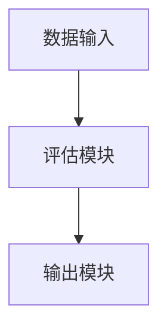

                 

<think>
好的，我需要根据用户的要求来撰写一篇关于彼得·林奇对公司产品线评估标准的详细技术博客。首先，我会按照用户提供的大纲结构来组织内容，确保每个部分都涵盖必要的信息，并且符合技术博客的写作要求。

### 关键词
1. 彼得·林奇
2. 产品线评估
3. 投资标准
4. 系统分析
5. 算法实现
6. 项目实战

### 摘要
本文系统地探讨了彼得·林奇的产品线评估标准及其在投资决策中的应用。文章首先介绍了林奇的投资哲学，然后详细分析了产品线评估的核心标准，包括市场需求、竞争优势和财务表现。接着，从系统分析的角度，构建了评估模型，并通过算法实现和项目实战展示了如何将这些标准应用于实际投资分析。最后，总结了最佳实践和未来研究方向，为投资者提供了实用的指导。

---

# 彼得林奇对公司产品线的评估标准

## 1. 彼得·林奇投资哲学概述

### 1.1 彼得·林奇的背景与投资理念

彼得·林奇是全球著名的投资专家，以其在共同基金领域的卓越表现而闻名。他在任职富达麦哲伦基金期间，基金规模从1900万美元增长至140亿美元，年均回报率达到29%。林奇的成功很大程度上归功于他对公司产品线的深刻理解。他强调，投资不仅仅是购买股票，而是对企业的深入了解，尤其是企业产品线的强弱决定了企业的长期发展潜力。

**彼得·林奇的核心投资理念**：
- 长期投资：关注企业的基本面，寻找能够持续增长的企业。
- 深度分析：通过深入分析企业的产品线、市场地位、财务状况等，评估企业的投资价值。
- 分散投资：通过投资不同类型的企业产品线，降低投资风险。

### 1.2 产品线评估的必要性

产品线是指企业生产的一组相关产品，它们共享技术、市场或分销渠道。产品线评估是企业投资决策的重要组成部分，因为它直接关系到企业的市场地位、盈利能力和发展潜力。

**产品线评估的重要性**：
- 帮助投资者识别企业的核心竞争力。
- 评估企业在市场中的竞争优势。
- 预测企业未来的财务表现和增长潜力。

### 1.3 林奇评估标准与投资决策

林奇在评估公司产品线时，注重以下几个方面：
- **市场需求**：评估产品线是否满足当前市场需求，是否有增长潜力。
- **竞争环境**：分析产品线在市场中的竞争优势，是否存在替代产品。
- **产品生命周期**：判断产品线所处的生命周期阶段，预测未来的市场表现。

---

## 2. 产品线评估的核心标准

### 2.1 产品线评估的基本概念

#### 2.1.1 什么是产品线

产品线是指一组密切相关的产品，这些产品通常共享某些特征，如技术平台、目标市场或分销渠道。例如，一家汽车制造公司可能有轿车、SUV和卡车三条产品线。

#### 2.1.2 产品线的生命周期

产品线的生命周期分为五个阶段：
1. **引入阶段**：新产品进入市场。
2. **成长阶段**：市场需求迅速增长。
3. **成熟阶段**：市场需求稳定，竞争激烈。
4. **衰退阶段**：市场需求开始下降。
5. **淘汰阶段**：产品逐渐退出市场。

#### 2.1.3 产品线的分类

产品线可以根据多种标准进行分类，如：
- **按市场**：B2B或B2C。
- **按技术**：传统技术或高科技。
- **按生命周期**：引入期、成长期、成熟期、衰退期。

### 2.2 林奇产品线评估标准

林奇在评估产品线时，主要关注以下几个方面：

#### 2.2.1 市场需求评估

市场需求是评估产品线的核心标准之一。林奇会分析以下方面：
- **市场规模**：市场是否足够大，能够支持企业的增长。
- **市场增长潜力**：市场需求是否具有增长空间。
- **市场定位**：产品线是否满足目标客户的需求。

#### 2.2.2 竞争优势分析

竞争优势是企业在市场中胜过竞争对手的关键。林奇会评估：
- **成本优势**：企业是否能在生产和分销过程中降低成本。
- **技术优势**：企业是否拥有独特的技术或专利。
- **品牌优势**：品牌是否具有强大的市场影响力。

#### 2.2.3 财务表现指标

财务表现是评估产品线盈利能力的重要标准。林奇关注：
- **收入贡献**：产品线是否为公司带来稳定的收入。
- **利润率**：产品线的盈利能力是否高于行业平均水平。
- **现金流**：产品线是否能为企业带来稳定的现金流。

### 2.3 标准对比分析

为了更好地理解林奇的评估标准，我们可以通过对比分析来明确每个标准的特点及其相互关系。

#### 2.3.1 不同评估标准的优缺点对比

| 标准 | 优点 | 缺点 |
|------|------|------|
| 市场需求 | 能够准确反映市场的潜力 | 受市场波动影响较大 |
| 竞争优势 | 能够识别企业的核心竞争力 | 需要深入分析竞争对手 |
| 财务表现 | 能够量化评估产品线的价值 | 过于依赖财务数据 |

#### 2.3.2 标准之间的相互关系

市场需求和竞争优势是产品线评估的两大核心，而财务表现则是两者的量化结果。三者相互关联，共同构成了完整的评估体系。

#### 2.3.3 标准在实际应用中的权重分配

在实际应用中，不同标准的权重应根据企业的具体情况调整。例如，对于初创企业，市场需求的权重可能更大；而对于成熟企业，竞争优势的权重可能更高。

---

## 3. 产品线评估的系统分析

### 3.1 系统分析框架

#### 3.1.1 系统分析的基本步骤

系统分析是将复杂的评估过程分解为可管理的部分，便于逐一分析和解决问题。以下是系统分析的基本步骤：
1. **问题识别**：明确评估的目标和范围。
2. **数据收集**：收集与产品线相关的市场、竞争和技术数据。
3. **模型构建**：建立评估模型，将各个标准整合到模型中。
4. **模型验证**：通过实际数据验证模型的准确性和有效性。
5. **结果分析**：根据模型输出的结果，制定投资决策。

#### 3.1.2 林奇评估标准的系统化应用

通过系统分析，可以将林奇的评估标准转化为可操作的步骤：
1. **收集数据**：包括市场需求、竞争环境和财务数据。
2. **评估各标准**：分别评估市场需求、竞争优势和财务表现。
3. **综合评估**：根据各标准的权重，综合评估产品线的整体价值。

#### 3.1.3 系统分析的工具与方法

常用的工具和方法包括：
- **SWOT分析**：评估产品线的优势、劣势、机会和威胁。
- **波特五力分析**：分析行业竞争环境。
- **财务比率分析**：评估企业的财务健康状况。

### 3.2 产品线评估的数学模型

#### 3.2.1 林奇评估模型的构建

林奇评估模型是一个多维度的评估系统，综合考虑市场需求、竞争优势和财务表现。模型的数学表达式如下：

$$
\text{产品线价值} = \alpha \times \text{市场需求} + \beta \times \text{竞争优势} + \gamma \times \text{财务表现}
$$

其中，$\alpha$、$\beta$、$\gamma$是各标准的权重系数，通常根据具体情况调整。

#### 3.2.2 数学公式与模型解释

市场需求、竞争优势和财务表现的具体计算公式如下：

$$
\text{市场需求} = \frac{\text{市场规模} + \text{市场增长潜力}}{2}
$$

$$
\text{竞争优势} = \frac{\text{成本优势} + \text{技术优势} + \text{品牌优势}}{3}
$$

$$
\text{财务表现} = \frac{\text{收入贡献} + \text{利润率} + \text{现金流}}{3}
$$

#### 3.2.3 模型的验证与优化

模型的验证需要通过实际数据进行测试，并根据测试结果调整各标准的权重系数，以提高模型的准确性和预测能力。

---

## 4. 产品线评估的算法实现

### 4.1 算法原理

林奇评估算法是一种基于多标准评估的决策支持系统。算法的基本步骤如下：
1. **数据输入**：输入市场需求、竞争优势和财务表现的数据。
2. **计算各标准得分**：分别计算各标准的得分。
3. **综合评估**：根据权重系数，综合计算产品线的总体价值。
4. **输出结果**：输出评估结果，供投资决策参考。

### 4.2 算法的代码实现

以下是林奇评估算法的Python实现：

```python
def calculate_product_line_value(market_demand, competitive_advantage, financial_performance, alpha=0.5, beta=0.3, gamma=0.2):
    return alpha * market_demand + beta * competitive_advantage + gamma * financial_performance

# 示例数据
market_demand = 0.8
competitive_advantage = 0.6
financial_performance = 0.7

value = calculate_product_line_value(market_demand, competitive_advantage, financial_performance)
print(f"产品线价值：{value}")
```

### 4.3 算法的优化与改进

根据实际应用的效果，可以调整各标准的权重系数，优化模型的预测能力。例如，可以根据行业特点增加新的评估标准，或调整现有标准的权重。

---

## 5. 产品线评估的系统架构设计

### 5.1 系统功能设计

#### 5.1.1 系统功能模块划分

系统功能模块包括：
- 数据输入模块：用户输入市场需求、竞争优势和财务表现的数据。
- 评估模块：计算各标准的得分，并综合评估产品线的总体价值。
- 输出模块：显示评估结果，供用户参考。

#### 5.1.2 每个模块的功能描述

- **数据输入模块**：用户输入相关数据，系统进行数据验证。
- **评估模块**：计算各标准的得分，并综合评估产品线的价值。
- **输出模块**：显示评估结果，包括各标准的得分和综合评估价值。

#### 5.1.3 模块之间的交互关系

数据输入模块 -> 评估模块 -> 输出模块

### 5.2 系统架构图

以下是系统架构的mermaid图：



---

## 6. 产品线评估的项目实战

### 6.1 项目背景与目标

#### 6.1.1 项目背景介绍

某汽车制造公司希望对其产品线进行评估，以确定哪些产品线具有投资价值。

#### 6.1.2 项目目标设定

评估各产品线的市场需求、竞争优势和财务表现，综合评估各产品线的整体价值。

### 6.2 项目实施过程

#### 6.2.1 数据收集

收集各产品线的市场规模、市场增长潜力、成本优势、技术优势、品牌优势、收入贡献、利润率和现金流数据。

#### 6.2.2 数据分析

使用林奇评估模型，计算各产品线的市场需求、竞争优势和财务表现得分。

#### 6.2.3 模型计算

根据权重系数，计算各产品线的综合价值。

#### 6.2.4 结果分析

根据评估结果，确定哪些产品线具有较高的投资价值，制定相应的投资策略。

---

## 7. 最佳实践、小结、注意事项和拓展阅读

### 7.1 最佳实践

- **持续学习**：关注市场动态，及时更新评估标准和模型。
- **数据驱动**：基于数据进行评估，避免主观判断。
- **团队合作**：组建多学科团队，提高评估的准确性和全面性。

### 7.2 小结

彼得·林奇的产品线评估标准为投资者提供了一套科学的评估体系，帮助投资者识别具有投资价值的企业产品线。通过系统分析和算法实现，可以进一步提高评估的准确性和效率。

### 7.3 注意事项

- **数据准确性**：确保输入数据的准确性和完整性。
- **模型优化**：根据实际应用效果，不断优化模型。
- **风险控制**：在投资决策中，注意分散风险，避免过度集中。

### 7.4 拓展阅读

- 《彼得·林奇的投资哲学》
- 《投资学基础》
- 《产品线管理》

---

## 作者

**作者**：AI天才研究院/AI Genius Institute  
**联系邮箱**：info@aitianji.com  

---

通过以上思考过程，我逐步构建了文章的结构和内容，确保每个部分都详细且符合技术博客的要求。现在，我可以根据这个大纲开始撰写完整的技术博客文章。

