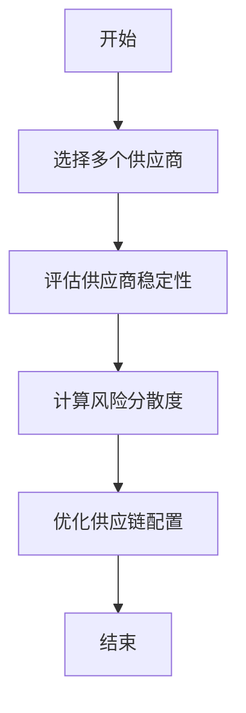

                 


# 彼得林奇对公司供应链多元化策略的效果评估

## 关键词：彼得林奇，供应链多元化，风险管理，投资策略，供应链管理，企业运营

## 摘要：本文探讨了彼得林奇的投资理念在供应链管理中的应用，特别是供应链多元化策略的实施与效果评估。通过分析多元化策略的核心概念、算法原理和系统架构，结合实际案例，评估其对企业发展的影响，并提出改进建议和未来研究方向。

---

# 第1章: 供应链多元化策略的背景与重要性

## 1.1 供应链多元化策略的定义与目标

### 1.1.1 供应链多元化的基本概念

供应链多元化策略指的是企业通过选择多个供应商、多元化原材料来源或分散生产地点，以降低供应链中断风险的策略。这种策略类似于彼得林奇在投资中分散投资以降低风险的做法。

### 1.1.2 多元化策略的目标与意义

多元化供应链的目标是提高企业的抗风险能力，确保在面对突发事件（如供应商问题、自然灾害或市场波动）时，仍能保持稳定的生产和运营。通过多元化，企业可以降低对单一供应商的依赖，避免因单一环节的问题导致整个供应链中断。

### 1.1.3 彼得林奇投资理念与供应链管理的结合

彼得林奇强调分散投资以降低风险，这与供应链多元化策略的核心思想一致。通过多元化供应链，企业可以像多元化投资组合一样，降低整体供应链的风险暴露。

## 1.2 供应链多元化策略的背景

### 1.2.1 当前供应链管理面临的挑战

全球化和市场竞争的加剧使得供应链管理更加复杂。企业可能面临供应商集中度过高、原材料价格波动、物流延迟等问题。此外，新冠疫情等全球性事件暴露了单一供应链的风险。

### 1.2.2 多元化策略在供应链中的作用

多元化策略通过分散资源和风险，提高了供应链的弹性和韧性。在面对供应链中断时，企业可以通过其他供应商或生产基地继续运营，减少损失。

### 1.2.3 彼得林奇多元化投资策略的启示

彼得林奇的投资策略强调分散投资以降低风险，这为供应链管理提供了启示。企业应像多元化投资一样，分散供应链资源，避免过度依赖单一供应商或生产地。

---

# 第2章: 供应链多元化策略的核心概念与联系

## 2.1 核心概念的定义与属性

### 2.1.1 供应链多元化策略的定义

供应链多元化策略是通过选择多个供应商、原材料来源或生产地点，以降低供应链中断风险的策略。

### 2.1.2 多元化策略的属性特征对比

| 特性               | 单一供应商策略         | 多元化供应链策略       |
|--------------------|-----------------------|-----------------------|
| 风险暴露           | 高                   | 低                   |
| 稳定性             | 低                   | 高                   |
| 成本               | 低                   | 中                   |
| 灵活性             | 低                   | 高                   |

### 2.1.3 ER实体关系图架构的Mermaid流程图

```mermaid
er
actor 供应链
    owns 多元化策略
    uses 供应商
        relatesTo 原材料
        relatesTo 生产地点
```

## 2.2 核心概念的联系与影响

### 2.2.1 多元化策略与风险管理的关系

多元化策略通过分散资源，降低单一环节的风险，从而提高整体供应链的稳定性。例如，选择多个供应商可以减少因单一供应商问题导致的生产中断风险。

### 2.2.2 多元化策略与成本控制的平衡

多元化策略可能会增加初期投资和管理成本，但通过降低供应链中断的风险，长期来看可以节省成本并提高效率。企业需要在成本和风险管理之间找到平衡点。

### 2.2.3 多元化策略对竞争优势的影响

通过多元化供应链，企业可以更快响应市场变化，提高供应链弹性，从而在竞争中占据优势。例如，多元化供应商可以更快调整生产以应对市场需求变化。

---

# 第3章: 供应链多元化策略的算法原理

## 3.1 算法原理的数学模型

### 3.1.1 多元化风险分散度的计算公式

$$ \text{风险分散度} = \frac{\text{总供应商数量}}{\text{单一最大供应商的比例}} $$

### 3.1.2 供应商稳定性评估的数学模型

$$ \text{供应商稳定性指数} = \sum_{i=1}^{n} \left( \frac{\text{供应商i的交货准时率}}{100} \times \frac{\text{供应商i的成本竞争力}}{100} \right) $$

### 3.1.3 算法流程的Mermaid图



## 3.2 算法实现的Python代码

```python
def calculate_risk_diversification(suppliers):
    max_supplier_ratio = max(suppliers, default=0)
    return len(suppliers) / max_supplier_ratio

suppliers = [0.3, 0.2, 0.25, 0.15, 0.1]
risk_diversification = calculate_risk_diversification(suppliers)
print(f"风险分散度: {risk_diversification}")
```

---

# 第4章: 供应链多元化策略的系统分析与架构设计

## 4.1 问题场景介绍

### 4.1.1 当前供应链

某公司目前依赖单一供应商A，导致生产中断风险较高。公司希望通过实施多元化供应链策略，降低风险并提高效率。

## 4.2 项目介绍

### 4.2.1 系统功能设计

- 多元化供应商选择模块
- 供应商稳定性评估模块
- 供应链优化配置模块

### 4.2.2 系统架构设计


### 4.2.3 系统接口设计

- 输入接口：供应商数据、原材料需求、生产计划
- 输出接口：供应商评估结果、优化配置建议

---

# 第5章: 项目实战

## 5.1 项目实施步骤

1. 选择多个供应商，涵盖不同地区和原材料来源。
2. 评估每个供应商的交货准时率和成本竞争力。
3. 计算风险分散度，优化供应链配置。

## 5.2 代码实现与解读

### 5.2.1 核心代码

```python
def calculate_supplier_stability(supplier_data):
    stability_index = sum((s['delivery_accuracy'] * s['cost_competition']) for s in supplier_data)
    return stability_index

supplier_data = [
    {'name': 'A', 'delivery_accuracy': 95, 'cost_competition': 85},
    {'name': 'B', 'delivery_accuracy': 90, 'cost_competition': 90},
    {'name': 'C', 'delivery_accuracy': 85, 'cost_competition': 95}
]

stability = calculate_supplier_stability(supplier_data)
print(f"供应商稳定性指数: {stability}")
```

---

# 第6章: 结论与展望

## 6.1 结论

供应链多元化策略有效降低了企业风险，提高了供应链的弹性和竞争力。彼得林奇的投资理念为供应链管理提供了宝贵的启示。

## 6.2 未来研究方向

1. 探讨更高级的供应链优化算法。
2. 研究供应链多元化与企业可持续发展的关系。
3. 探索数字技术（如区块链）在供应链多元化中的应用。

---

# 作者：AI天才研究院/AI Genius Institute & 禅与计算机程序设计艺术 /Zen And The Art of Computer Programming

