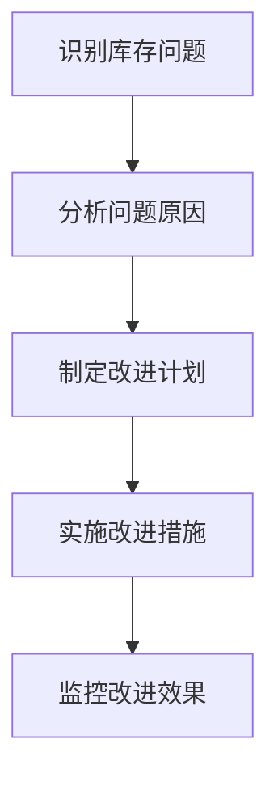
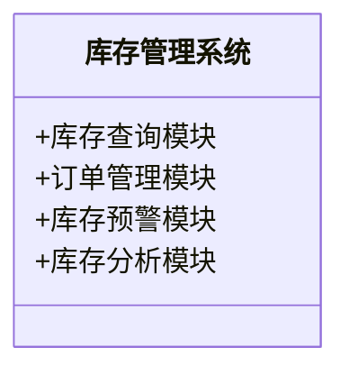
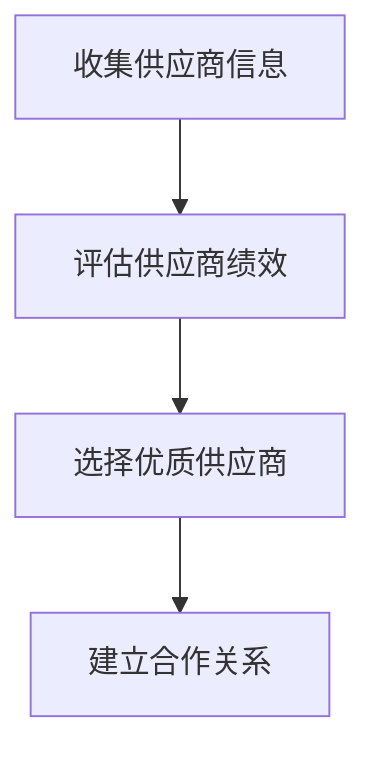
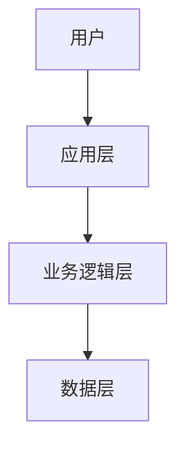

                 

<think>
嗯，用户需要我写一篇关于彼得·林奇对公司供应链管理分析的技术博客。首先，我得理解彼得·林奇的背景，他是投资专家，所以从投资视角分析供应链管理会更深入。接下来，我要考虑博客的结构，确保逻辑清晰，内容全面。

用户已经给出了目录大纲，我需要按照这个大纲来组织内容。首先是摘要，然后是各个章节。每个章节都要详细，比如供应链管理的背景、彼得·林奇的分析框架、优化策略等等。

在写作时，我要用专业但易懂的语言，加入数学模型和图表，比如库存管理的EOQ模型，用LaTeX公式表示。同时，系统架构部分需要用Mermaid图来展示，这样更直观。

我还需要确保每个小节都有足够的细节，比如优化算法的流程图，实际案例分析，以及项目实战的代码示例。最后，加上总结和最佳实践，帮助读者更好地应用所学内容。

整体上，博客需要结合理论和实践，提供有价值的见解，帮助读者理解供应链管理的重要性以及如何优化它。
</think>

# 彼得林奇对公司供应链管理的分析

## 关键词：彼得·林奇，供应链管理，库存优化，供应商管理，需求预测，系统架构

## 摘要：本文从彼得·林奇的投资视角出发，分析了供应链管理的核心概念、优化策略和系统架构。通过库存管理、供应商管理、需求预测等方面，结合数学模型和系统设计，提供了供应链管理的深度分析和实践指导。

---

## 第一部分：供应链管理的背景与核心概念

### 第1章：供应链管理的定义与核心要素

#### 1.1 供应链管理的定义
供应链管理（Supply Chain Management，SCM）是指在企业内外部资源之间，通过协调和优化资源配置，以满足客户需求的一系列管理活动。其核心目标是实现从原材料采购到最终产品交付的高效协同，降低运营成本，提高客户满意度。

供应链管理的外延包括供应商、制造商、分销商、零售商和客户等多方参与，其管理范围涉及物流、库存、生产计划、采购和需求预测等多个环节。

#### 1.2 供应链管理的核心要素
供应链管理的核心要素包括：
1. **供应商管理**：选择和评估供应商，建立长期合作关系。
2. **库存管理**：优化库存水平，降低存储成本。
3. **物流管理**：确保产品高效流通，减少运输成本。
4. **生产计划**：协调生产和供应链各环节，确保按时交付。
5. **需求预测**：基于市场数据预测需求，优化生产计划。

#### 1.3 供应链管理的行业背景
随着全球化和市场竞争的加剧，供应链管理已成为企业竞争力的重要组成部分。企业通过优化供应链管理，可以显著降低成本，提高运营效率，增强市场响应能力。

---

## 第二部分：彼得·林奇的供应链管理分析框架

### 第2章：彼得·林奇的供应链管理投资视角

#### 2.1 彼得·林奇的投资理念与供应链管理
彼得·林奇认为，供应链管理是企业投资决策中的关键因素。他强调，一个企业能否在供应链管理中实现高效协同，直接关系到其市场竞争力和投资价值。

#### 2.2 彼得·林奇的供应链管理分析方法
彼得·林奇提出了以下供应链管理的分析框架：
1. **财务指标分析**：通过库存周转率、应收账款周转率等指标评估供应链管理效率。
2. **风险评估模型**：分析供应链中的潜在风险，如供应商集中度风险、物流中断风险等。
3. **优化建议**：基于分析结果，提出供应链优化的具体建议，如引入自动化技术、优化库存管理等。

#### 2.3 彼得·林奇对供应链管理的影响
彼得·林奇的供应链管理理论为企业提供了全新的视角。他通过投资案例分析，展示了如何通过优化供应链管理提升企业价值。

---

## 第三部分：供应链管理的优化策略

### 第3章：供应链库存管理优化

#### 3.1 库存管理的基本原理
库存管理的目标是在满足客户需求的前提下，降低库存成本。库存管理的核心是平衡库存持有成本和缺货成本。

#### 3.2 库存管理的优化算法
库存管理的优化算法包括经济批量模型（Economic Order Quantity，EOQ）和持续改进算法。

**经济批量模型（EOQ）公式**：
$$ EOQ = \sqrt{\frac{2DS}{H} } $$
其中，D为年需求量，S为订单成本，H为单位库存持有成本。

**持续改进算法流程图**：


#### 3.3 库存管理的系统设计
库存管理系统的功能模块包括库存查询、订单管理、库存预警和库存分析。系统的架构设计如下：


### 第4章：供应链供应商管理优化

#### 4.1 供应商管理的基本原理
供应商管理的目标是选择优质供应商，建立稳定的合作关系。供应商管理的核心是评估供应商的绩效，并通过持续优化提升供应链整体效率。

#### 4.2 供应商管理的优化算法
供应商选择模型基于以下指标：
- 交货及时性
- 产品质量
- 价格竞争力
- 售后服务

供应商选择模型的流程图：


---

## 第四部分：系统分析与架构设计方案

### 第4章：供应链系统架构设计

#### 4.1 问题场景介绍
假设某制造企业希望优化其供应链管理，需要构建一个集成化的供应链管理系统。

#### 4.2 系统功能设计
系统功能模块包括：
1. 供应商管理模块
2. 库存管理模块
3. 生产计划模块
4. 物流管理模块
5. 需求预测模块

#### 4.3 系统架构设计
供应链管理系统架构如下：


---

## 第五部分：项目实战

### 第5章：供应链管理系统的实现

#### 5.1 环境安装
需要安装以下工具：
- Python 3.x
- Jupyter Notebook
- Mermaid CLI

#### 5.2 核心代码实现
以下是一个库存管理系统的Python代码示例：
```python
import math

def calculate EOQ(D, S, H):
    return math.sqrt((2 * D * S) / H)

D = 10000  # 年需求量
S = 100    # 订单成本
H = 0.2    # 单位库存持有成本

EOQ = calculate EOQ(D, S, H)
print(f"经济批量为：{EOQ}")
```

#### 5.3 案例分析
以某制造企业为例，分析其供应链管理的优化过程，包括库存优化、供应商选择和需求预测。

---

## 第六部分：总结与展望

### 6.1 总结
本文从彼得·林奇的投资视角，分析了供应链管理的核心概念、优化策略和系统架构。通过数学模型和系统设计，提供了供应链管理的深度分析和实践指导。

### 6.2 展望
未来，随着人工智能和大数据技术的发展，供应链管理将更加智能化和数据驱动。企业需要不断优化供应链管理，以应对市场变化和客户需求。

---

## 最佳实践 Tips

- **小结**：供应链管理是企业竞争力的重要组成部分，优化供应链管理可以显著降低成本，提高运营效率。
- **注意事项**：在实际应用中，企业应结合自身特点，选择适合的供应链管理优化策略。
- **拓展阅读**：推荐阅读《供应链管理：战略、规划与实施》等书籍，深入学习供应链管理的理论与实践。

---

## 作者：AI天才研究院 & 禅与计算机程序设计艺术

---

以上是《彼得林奇对公司供应链管理的分析》的完整目录大纲和文章内容，希望对您有所帮助！

