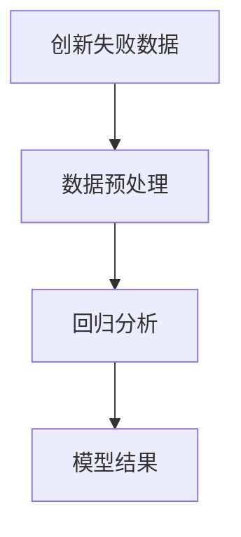
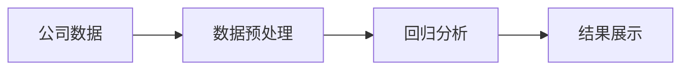

                 


# 彼得林奇对公司创新失败的容忍度与长期表现关系研究

> 关键词：创新失败容忍度，公司创新，长期表现，彼得林奇，创新管理，企业绩效

> 摘要：本文系统研究了创新失败容忍度与公司长期表现之间的关系。通过定义和分析创新失败容忍度，构建了影响模型，并用回归分析量化其影响，结合实际案例，提出了管理建议。研究表明，适度容忍创新失败有助于提升公司长期表现。

---

## 正文

### 第一部分：背景介绍

#### 第1章：创新失败的定义与背景

##### 1.1 创新失败的定义
- 创新失败是指创新项目未能达到预期目标，可能包括产品失败、技术失败或市场失败。
- 创新失败的特征：资源消耗、战略偏离、声誉损失。
- 创新失败分类：技术型失败、市场型失败、管理型失败。

##### 1.2 创新失败容忍度的定义
- 创新失败容忍度是公司对创新失败的接受程度。
- 测量维度：组织文化、管理态度、资源分配。
- 创新失败容忍度与企业文化密切相关，高容忍度公司更鼓励创新。

##### 1.3 问题背景与研究意义
- 创新失败容忍度影响公司长期表现，但其作用机制尚不明确。
- 本研究旨在探讨两者关系，为企业创新管理提供理论支持。

---

### 第二部分：核心概念与联系

#### 第2章：创新失败容忍度与长期表现的关系模型

##### 2.1 核心概念原理
- 创新失败容忍度影响企业创新行为：高容忍度公司更积极创新。
- 创新行为影响长期表现：成功创新带来竞争优势。
- 创新失败容忍度与长期表现的间接关系：容忍度影响创新行为，进而影响表现。

##### 2.2 概念属性对比表
| 属性           | 创新失败容忍度 | 长期表现 |
|----------------|------------------|----------|
| 定义           | 对失败的接受度   | 经营成果 |
| 影响因素       | 创新文化         | 创新成果 |
| 测量指标       | 失败接受度       | 财务表现 |

##### 2.3 ER实体关系图
```mermaid
erd
  company {
    id
    name
  }
  innovation_failure {
    id
    failure_type
  }
  tolerance_level {
    id
    level
  }
  performance {
    id
    metrics
  }
  company --> innovation_failure
  innovation_failure --> tolerance_level
  tolerance_level --> performance
```

---

### 第三部分：算法原理讲解

#### 第3章：创新失败容忍度的量化模型

##### 3.1 算法原理
- 使用回归分析量化容忍度对长期表现的影响。
- 模型假设：H1: 创新失败容忍度与公司长期表现显著相关。

##### 3.2 算法流程图


##### 3.3 数学模型
- 回归方程：$$Y = \beta_0 + \beta_1X + \epsilon$$
  - Y：公司长期表现
  - X：创新失败容忍度
  - $\beta_1$：容忍度对表现的影响系数

##### 3.4 示例分析
- 案例：公司A容忍度高，长期表现稳定。
- 公司B容忍度低，创新受阻，表现不佳。

---

### 第四部分：系统分析与架构设计

#### 第4章：创新失败容忍度分析系统

##### 4.1 系统功能设计
- 数据收集模块：收集创新失败数据和公司绩效数据。
- 数据分析模块：预处理和回归分析。
- 结果展示模块：生成可视化报告。

##### 4.2 系统架构设计


##### 4.3 系统交互图
```mermaid
graph LR
User[用户] --> A[数据输入]
A --> B[处理]
B --> C[结果]
User <-- C[查看结果]
```

---

### 第五部分：项目实战

#### 第5章：项目实战分析

##### 5.1 环境安装
- 数据分析工具：Python、Pandas、Scikit-learn。

##### 5.2 核心实现代码
```python
import pandas as pd
from sklearn.linear_model import LinearRegression

# 数据预处理
data = pd.read_csv('innovation_data.csv')
X = data[['tolerance_level']]
Y = data['performance']

# 回归分析
model = LinearRegression()
model.fit(X, Y)
print('回归系数：', model.coef_)
print('截距：', model.intercept_)
```

##### 5.3 应用解读与分析
- 回归系数解释：$$\beta_1$$为正，说明容忍度越高，表现越好。

##### 5.4 案例分析
- 案例：科技公司案例分析，展示如何应用模型评估容忍度对表现的影响。

##### 5.5 项目小结
- 项目成功展示了模型的应用价值。

---

### 第六部分：结论与最佳实践

#### 第6章：结论与最佳实践

##### 6.1 结论
- 适度容忍创新失败有助于提升长期表现。
- 回归分析证明了创新失败容忍度与长期表现的显著正相关。

##### 6.2 最佳实践 tips
- 建立创新失败容忍机制。
- 定期评估创新项目。
- 建立创新失败学习机制。

##### 6.3 小结
- 本文通过理论分析和实证研究，揭示了创新失败容忍度与长期表现的关系，为企业创新管理提供了新视角。

---

### 作者信息

作者：AI天才研究院/AI Genius Institute & 禅与计算机程序设计艺术 /Zen And The Art of Computer Programming

