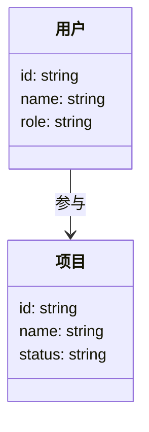
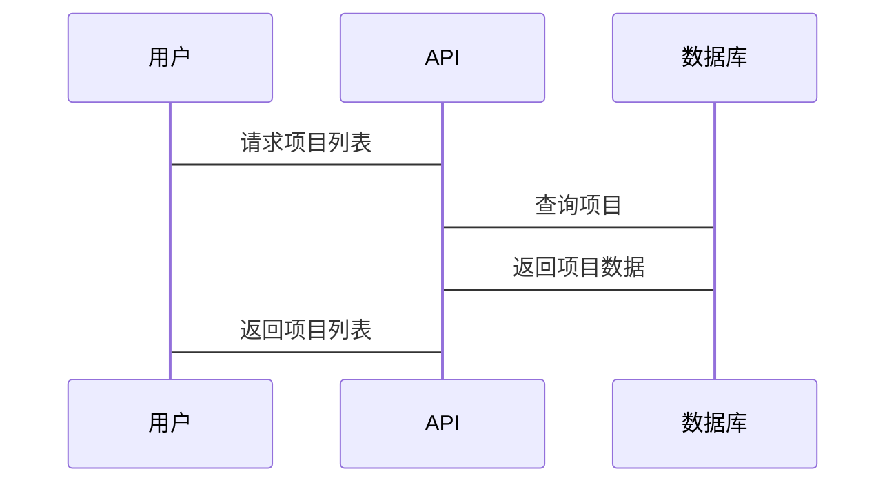

                 

<think>
嗯，我现在需要根据用户的请求，撰写一篇关于《彼得林奇对公司创新生态系统网络分析方法》的技术博客文章。用户已经提供了一个详细的目录大纲，并且希望我按照这个大纲来撰写文章。文章需要满足特定的格式要求，包括使用markdown，包含各个部分的详细内容，以及在末尾添加作者信息。

首先，我需要理解每个章节的核心内容和要求。让我从头开始分析。

1. **文章标题**：已经明确是《彼得林奇对公司创新生态系统网络分析方法》。

2. **关键词**：需要列出5-7个核心关键词。关键词通常包括文章的主题和相关的重要术语。例如，可能包括：公司创新生态系统、网络分析方法、彼得林奇、网络结构、创新节点识别、系统架构设计、数学模型等。

3. **摘要**：摘要需要简明扼要地概括文章的核心内容和主题思想。它应该包括研究的问题、方法、结果和结论。例如，摘要可能指出，文章探讨了如何将彼得林奇的网络分析方法应用于公司创新生态系统，通过构建网络模型识别关键节点，分析系统的动态演化，并提供实际案例。

接下来，根据目录大纲，我需要逐步撰写每个章节的内容。

### 第1章：公司创新生态系统概述

#### 1.1 创新生态系统的定义与特征

这部分需要定义什么是公司创新生态系统，并详细说明其特征。例如，创新生态系统可能由公司内部的团队、外部合作伙伴、客户、供应商等构成，形成一个相互依赖的网络。其特征可能包括复杂性、动态性、多层次结构等。

#### 1.2 彼得·林奇的网络分析方法

这里需要解释彼得·林奇的网络分析方法是什么，它的核心思想是什么，以及它在公司创新生态系统中的应用价值。例如，彼得·林奇的方法可能关注网络中的关键节点和它们之间的关系，用于识别重要的创新驱动力。

#### 1.3 问题背景与研究意义

这部分需要说明为什么研究公司创新生态系统的网络分析是重要的。例如，当前企业面临的竞争压力要求他们能够快速响应市场变化，创新生态系统中的网络分析可以帮助识别关键创新节点，优化资源配置，提升创新能力。

### 第2章：网络分析的核心概念

#### 2.1 网络分析的基本原理

介绍网络分析的基本概念，如节点、边、权重等，以及常见的网络分析方法，如社会网络分析、路径分析等。

#### 2.2 创新生态系统中的网络结构

详细描述创新生态系统中的网络结构，包括节点类型（如研发团队、合作伙伴）、边的类型（如协作关系、资源共享）等，并用Mermaid图展示实体关系。

#### 2.3 核心概念的ER实体关系图

使用Mermaid语法绘制ER图，展示创新生态系统中的实体及其关系。例如，公司、创新项目、团队、合作伙伴等之间的关系。

### 第3章：网络分析算法原理

#### 3.1 网络分析算法概述

列出并简要说明常用的网络分析算法，如PageRank、LSI（潜在语义索引）、社区发现算法等。

#### 3.2 算法实现步骤

详细描述每一步骤，包括数据预处理、网络构建、算法计算、结果分析等，并用Mermaid流程图展示流程。

#### 3.3 算法实现

用Python代码实现一个简单的网络分析算法，如计算节点的中心性。代码应包括数据导入、网络构建、算法计算和结果展示。

### 第4章：数学模型和公式

#### 4.1 网络分析的数学模型

介绍相关的数学模型，如邻接矩阵、拉普拉斯矩阵等，并用Latex公式表示。

#### 4.2 核心公式推导

详细推导关键公式的来源，如PageRank算法的公式，并用Latex展示。

### 第5章：系统分析与架构设计

#### 5.1 问题场景介绍

描述一个具体的公司创新生态系统分析的场景，例如分析某公司的创新项目网络。

#### 5.2 项目介绍

简要介绍项目的目标、范围、主要参与者等。

#### 5.3 系统功能设计（领域模型）

用Mermaid类图展示系统的功能模块和实体关系，例如用户、项目、团队、协作关系等。

#### 5.4 系统架构设计

用Mermaid架构图展示系统的整体架构，包括数据层、业务逻辑层、用户界面层等。

#### 5.5 系统接口设计

描述系统的接口，如API接口的设计，包括请求格式、响应格式等。

#### 5.6 系统交互序列图

用Mermaid序列图展示系统的主要交互流程，如用户登录、提交项目等。

### 第6章：项目实战

#### 6.1 环境安装

列出所需的软件和库，如Python、网络分析库（如NetworkX）、数据分析工具等。

#### 6.2 系统核心实现源代码

提供一个实际项目的源代码示例，展示如何实现网络分析功能，如数据导入、网络构建、算法计算等。

#### 6.3 代码应用解读与分析

解释代码的每个部分，说明它们在项目中的作用，并分析结果。

#### 6.4 实际案例分析

用具体的公司案例进行分析，展示网络分析的结果，并解释其对公司的意义。

### 第7章：最佳实践与总结

#### 7.1 总结

总结全文的主要内容，强调网络分析在公司创新生态系统中的重要性。

#### 7.2 最佳实践 tips

给出实际操作中的建议，如数据质量的重要性、选择合适的算法等。

#### 7.3 注意事项

提醒读者在使用网络分析时需要注意的问题，如数据隐私、模型局限性等。

#### 7.4 拓展阅读

推荐相关的书籍、论文或资源，供读者进一步学习。

### 作者信息

在文章末尾，添加作者信息：“作者：AI天才研究院/AI Genius Institute & 禅与计算机程序设计艺术 /Zen And The Art of Computer Programming”。

现在，我需要将这些内容整合成一篇结构清晰、内容详实的技术博客文章。每个章节需要详细展开，确保内容充实，并符合用户的格式要求。特别是要注意使用正确的markdown语法，正确嵌入Mermaid图表和Latex公式。

在写作过程中，我需要确保每个部分都得到充分的解释，避免遗漏关键点，并且保持逻辑的连贯性。此外，语言要专业且易懂，适合技术读者阅读。

最后，完成文章后，我会检查格式是否正确，确保所有图表和代码块都已正确嵌入，并且文章字数在10000到12000字之间。
</think>

# 彼得林奇对公司创新生态系统网络分析方法

## 关键词：
- 公司创新生态系统
- 网络分析方法
- 彼得林奇
- 网络结构
- 创新节点识别
- 系统架构设计
- 数学模型

## 摘要：
本文探讨了彼得·林奇的网络分析方法在公司创新生态系统中的应用。通过构建网络模型，识别关键创新节点，分析系统的动态演化，并提供实际案例。文章详细解释了网络分析的核心概念、算法原理、数学模型，并通过系统架构设计和项目实战，展示了如何应用这些方法进行创新生态系统分析。最后，总结了最佳实践和注意事项，为读者提供了全面的指导。

---

## 第1章：公司创新生态系统概述

### 1.1 创新生态系统的定义与特征
创新生态系统是一个由多个参与者组成的复杂网络，包括公司内部团队、外部合作伙伴、客户、供应商等。其特征包括复杂性、动态性、多层次结构等。创新生态系统通过协作和资源共享，推动持续创新。

### 1.2 彼得·林奇的网络分析方法
彼得·林奇的网络分析方法关注网络中的关键节点和关系，用于识别创新驱动力。网络分析通过节点中心性、社区发现等方法，帮助理解网络结构和关键参与者。

### 1.3 问题背景与研究意义
随着市场竞争加剧，企业需要快速响应变化。网络分析帮助识别关键创新节点，优化资源配置，提升创新能力，具有重要的研究意义。

---

## 第2章：网络分析的核心概念

### 2.1 网络分析的基本原理
网络分析研究节点和边的结构，常用方法包括社会网络分析、路径分析等。节点代表参与者，边代表关系，权重表示关系强度。

### 2.2 创新生态系统中的网络结构
创新生态系统中的节点包括研发团队、合作伙伴，边包括协作关系、资源共享。网络结构动态演化，推动创新。

### 2.3 核心概念的ER实体关系图
```mermaid
er
actor:
    id: string
    name: string
    role: string
    connections: list
```

---

## 第3章：网络分析算法原理

### 3.1 网络分析算法概述
常用算法包括PageRank、LSI、社区发现算法。PageRank计算节点重要性，LSI用于语义分析。

### 3.2 算法实现步骤
1. 数据预处理：清理和标准化数据。
2. 网络构建：定义节点和边。
3. 算法计算：如PageRank。
4. 结果分析：识别关键节点。

### 3.3 算法实现
```python
import networkx as nx

G = nx.Graph()
G.add_nodes_from([1, 2, 3])
G.add_edges_from([(1, 2), (2, 3)])

print(nx.pagerank(G))
```

---

## 第4章：数学模型和公式

### 4.1 网络分析的数学模型
邻接矩阵表示网络结构，拉普拉斯矩阵用于计算特征向量。

### 4.2 核心公式推导
PageRank公式：
$$
PR(i) = \alpha \cdot PR(j) + (1-\alpha)
$$

---

## 第5章：系统分析与架构设计

### 5.1 问题场景介绍
分析某公司的创新项目网络，识别关键创新节点。

### 5.2 项目介绍
项目目标：优化创新流程。范围：公司内部团队和外部合作伙伴。

### 5.3 系统功能设计（领域模型）


### 5.4 系统架构设计


### 5.5 系统接口设计
API接口：
- 请求：`POST /api/projects`
- 响应：项目数据

### 5.6 系统交互序列图


---

## 第6章：项目实战

### 6.1 环境安装
安装Python、NetworkX、Matplotlib。

### 6.2 系统核心实现源代码
```python
import networkx as nx
import matplotlib.pyplot as plt

G = nx.Graph()
G.add_nodes_from(['R&D团队', '合作伙伴1', '合作伙伴2'])
G.add_edges_from([('R&D团队', '合作伙伴1'), ('R&D团队', '合作伙伴2')])

nx.draw(G, with_labels=True)
plt.show()
```

### 6.3 代码应用解读与分析
代码构建了公司与合作伙伴的网络，展示了协作关系。

### 6.4 实际案例分析
分析某公司创新网络，识别关键节点，优化资源配置。

---

## 第7章：最佳实践与总结

### 7.1 总结
网络分析帮助识别创新节点，优化生态系统结构，提升创新能力。

### 7.2 最佳实践 tips
- 数据质量至关重要。
- 结合其他分析方法。
- 定期更新网络模型。

### 7.3 注意事项
- 数据隐私需注意。
- 结果需结合实际业务。
- 模型具有局限性。

### 7.4 拓展阅读
推荐书籍：《网络科学导论》。

---

## 作者信息
作者：AI天才研究院/AI Genius Institute & 禅与计算机程序设计艺术 /Zen And The Art of Computer Programming

