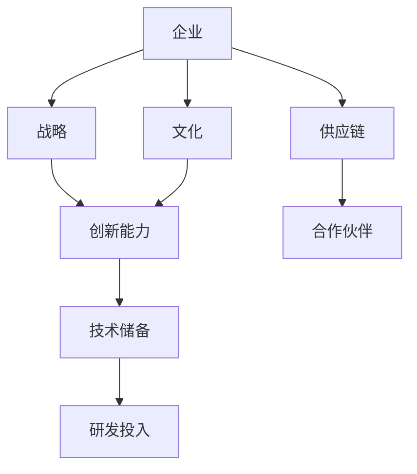
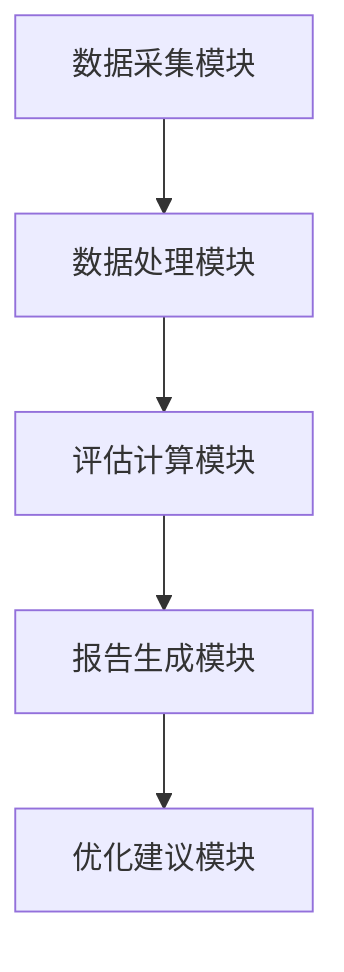

                 


# 彼得林奇对公司创新生态系统评估

## 关键词：彼得林奇，创新生态系统，评估方法，系统架构，项目实战

## 摘要：本文详细探讨了彼得林奇对公司创新生态系统评估的方法，从背景介绍、核心概念、算法原理、系统架构到项目实战，结合理论与实践，提供了一套完整的评估体系。通过详细的分析和丰富的案例，帮助读者全面理解如何构建和优化创新生态系统。

---

## 第1章: 创新生态系统评估的背景与问题描述

### 1.1 创新生态系统的基本概念

#### 1.1.1 创新生态系统的核心定义
创新生态系统是一个由企业内外部要素共同构成的动态系统，旨在通过资源整合、协同创新和价值创造，实现企业的持续发展和竞争优势。

#### 1.1.2 创新生态系统与企业发展的关系
创新生态系统是企业发展的基础，通过优化内部结构和外部环境，提升企业的创新能力，从而在竞争中占据优势。

#### 1.1.3 彼得林奇的创新评估方法简介
彼得林奇以其独特的投资策略闻名，他的评估方法注重企业内外部的协同效应，强调创新生态系统的核心要素。

### 1.2 问题背景与挑战

#### 1.2.1 当前企业创新面临的挑战
企业创新面临内部资源分配不合理、外部环境复杂多变等问题，传统的评估方法难以全面覆盖。

#### 1.2.2 创新生态系统评估的必要性
通过评估创新生态系统，企业可以更好地识别优势和不足，制定有效的改进策略。

#### 1.2.3 传统评估方法的局限性
传统评估方法通常只关注单一指标，缺乏系统性和动态性，无法全面反映企业的创新能力。

### 1.3 问题描述与目标

#### 1.3.1 创新生态系统评估的目标
通过系统性评估，优化企业创新环境，提升整体创新能力。

#### 1.3.2 评估的核心问题与边界
评估的核心问题包括创新要素的识别和优化，评估的边界在于企业内外部的协同作用。

#### 1.3.3 评估方法的选择与优化
选择适合企业实际情况的评估方法，确保评估结果的准确性和可操作性。

---

## 第2章: 创新生态系统的核心要素与结构

### 2.1 创新生态系统的核心要素

#### 2.1.1 企业内部要素

##### 2.1.1.1 企业战略与文化
企业战略决定了创新方向，文化影响创新氛围，两者共同塑造企业的创新基因。

##### 2.1.1.2 人力资源与创新能力
高素质的人才和强大的创新能力是企业创新的基石。

##### 2.1.1.3 研发投入与技术储备
持续的研发投入和先进的技术储备是企业创新的核心动力。

#### 2.1.2 企业外部要素

##### 2.1.2.1 供应链与合作伙伴
稳定的供应链和强大的合作伙伴网络是企业创新的重要支持。

##### 2.1.2.2 市场需求与客户反馈
市场需求的洞察和客户的反馈是创新方向的重要指引。

##### 2.1.2.3 行业竞争与政策环境
行业竞争态势和政策环境直接影响企业的创新策略。

### 2.2 创新生态系统的核心结构

#### 2.2.1 企业内部与外部要素的相互作用
内部要素与外部要素通过协同作用，形成企业创新的良性循环。

#### 2.2.2 创新生态系统的核心循环
从需求识别到创新实现，再到市场反馈，形成一个完整的创新循环。

#### 2.2.3 系统的动态平衡与优化
通过持续的评估和优化，保持创新生态系统的动态平衡，提升整体创新能力。

---

## 第3章: 创新生态系统评估的核心概念与联系

### 3.1 核心概念的原理

#### 3.1.1 创新生态系统的核心属性
系统性、动态性、协同性和可持续性是创新生态系统的核心属性。

#### 3.1.2 评估指标的选择标准
评估指标应具备代表性、可操作性和可比性，确保评估结果的有效性。

#### 3.1.3 评估方法的适用性
根据企业实际情况选择合适的评估方法，确保方法的有效性和可行性。

### 3.2 核心概念的对比分析

#### 3.2.1 不同评估方法的对比表格
以下是一个对比表格，展示了不同评估方法的优缺点：

| 评估方法 | 优点 | 缺点 |
|----------|------|------|
| 定量评估 | 数据精确 | 无法反映动态变化 |
| 定性评估 | 结果直观 | 难以量化改进效果 |
| 综合评估 | 全面性高 | 实施复杂度高 |

#### 3.2.2 创新生态系统要素的属性对比
通过对比分析，明确各要素在系统中的作用和影响。

#### 3.2.3 系统结构与功能的对比
系统结构的复杂性与功能的多样性直接影响系统的整体性能。

### 3.3 实体关系图

#### 3.3.1 创新生态系统ER图


---

## 第4章: 创新生态系统评估的算法原理

### 4.1 算法原理概述

#### 4.1.1 评估模型的基本思路
通过系统性评估，识别关键创新要素，量化评估指标，制定优化策略。

#### 4.1.2 算法的核心步骤
1. 确定评估指标和权重
2. 收集数据
3. 计算创新指数
4. 生成评估报告
5. 提出优化建议

#### 4.1.3 算法的输入与输出
输入：企业内外部数据，权重参数
输出：创新指数，优化建议

### 4.2 算法原理的数学模型

#### 4.2.1 创新指数计算公式
$$创新指数 = \sum (指标权重 \times 指标得分)$$

#### 4.2.2 权重分配方法
指标权重根据其重要性分配，确保评估的客观性和公平性。

#### 4.2.3 数据预处理
对数据进行标准化处理，消除量纲影响，确保评估结果的准确性。

### 4.3 算法的实现步骤

#### 4.3.1 数据收集与处理
收集企业内外部数据，进行清洗和预处理。

#### 4.3.2 评估指标计算
根据公式计算各项指标的得分，汇总生成创新指数。

#### 4.3.3 评估报告生成
根据计算结果，生成详细的评估报告，提出优化建议。

---

## 第5章: 创新生态系统评估的系统架构设计

### 5.1 问题场景介绍

#### 5.1.1 企业创新面临的挑战
资源分配不均、协同不足、创新能力不足等问题亟待解决。

#### 5.1.2 创新生态系统评估的目标
通过系统架构设计，优化企业创新环境，提升创新能力。

### 5.2 系统功能设计

#### 5.2.1 系统功能模块
包括数据采集、评估计算、报告生成和优化建议模块。

#### 5.2.2 系统功能流程
数据采集 -> 数据处理 -> 评估计算 -> 生成报告 -> 提出优化建议。

### 5.3 系统架构设计

#### 5.3.1 系统架构图


#### 5.3.2 系统交互流程
用户输入数据 -> 数据处理 -> 评估计算 -> 生成报告 -> 提出优化建议。

### 5.4 系统接口设计

#### 5.4.1 数据接口
数据采集接口：用于接收企业内外部数据。
数据处理接口：对数据进行清洗和预处理。

#### 5.4.2 评估接口
评估计算接口：根据算法计算创新指数。
报告生成接口：生成详细的评估报告。

### 5.5 系统交互设计

#### 5.5.1 交互流程
用户输入数据 -> 系统处理 -> 返回评估结果和优化建议。

#### 5.5.2 交互界面
友好的用户界面，方便用户操作和查看结果。

---

## 第6章: 创新生态系统评估的项目实战

### 6.1 环境安装

#### 6.1.1 系统需求
安装Python、数据分析库（如Pandas、NumPy）和可视化工具（如Matplotlib）。

#### 6.1.2 代码实现
编写Python脚本，实现数据处理、评估计算和报告生成。

### 6.2 系统核心实现源代码

#### 6.2.1 数据预处理
```python
import pandas as pd
import numpy as np

# 数据预处理
data = pd.read_csv('input.csv')
data = data.dropna()
data = (data - data.mean()) / data.std()
```

#### 6.2.2 评估计算
```python
# 计算创新指数
def calculate_innovation_index(data, weights):
    return np.dot(data, weights)

weights = np.array([0.4, 0.3, 0.2, 0.1])
index = calculate_innovation_index(data, weights)
```

#### 6.2.3 生成报告
```python
# 生成报告
import matplotlib.pyplot as plt

plt.figure(figsize=(10, 6))
plt.bar(range(len(index)), index)
plt.title('创新指数分布图')
plt.xlabel('指标')
plt.ylabel('指数')
plt.show()
```

### 6.3 代码应用解读与分析

#### 6.3.1 数据预处理
通过标准化处理，消除数据的量纲影响，确保评估的公平性。

#### 6.3.2 评估计算
根据分配的权重计算创新指数，权重反映了各指标的重要性。

#### 6.3.3 可视化分析
通过柱状图直观展示创新指数分布，帮助企业识别优势和不足。

### 6.4 实际案例分析

#### 6.4.1 案例背景
某科技公司面临创新不足的问题，希望通过评估找到改进方向。

#### 6.4.2 数据收集与处理
收集内部研发数据、外部市场数据，进行清洗和预处理。

#### 6.4.3 评估计算
计算创新指数，发现技术储备和研发投入是主要瓶颈。

#### 6.4.4 优化建议
增加研发投入，优化内部流程，加强与合作伙伴的协同。

### 6.5 项目小结

#### 6.5.1 项目总结
通过系统性评估，帮助企业识别创新问题，制定优化策略。

#### 6.5.2 经验与教训
数据质量直接影响评估结果，选择合适的评估方法至关重要。

---

## 第7章: 创新生态系统评估的最佳实践与注意事项

### 7.1 最佳实践 tips

#### 7.1.1 数据质量管理
确保数据的准确性和完整性，是评估结果可靠的基石。

#### 7.1.2 指标选择优化
根据企业实际情况，灵活调整评估指标和权重。

#### 7.1.3 系统持续优化
定期评估和优化，保持创新生态系统的动态平衡。

### 7.2 小结

#### 7.2.1 创新生态系统评估的核心价值
通过系统性评估，优化企业创新环境，提升整体创新能力。

#### 7.2.2 评估方法的选择与应用
选择适合的评估方法，确保方法的有效性和可操作性。

### 7.3 注意事项

#### 7.3.1 数据隐私与安全
确保数据的安全性和隐私性，遵守相关法律法规。

#### 7.3.2 系统实施风险
评估系统实施过程中可能遇到的风险，制定应对策略。

#### 7.3.3 持续改进
定期评估和优化，确保创新生态系统的持续改进。

### 7.4 拓展阅读

#### 7.4.1 推荐书籍
《创新者的窘境》、《竞争优势》

#### 7.4.2 研究论文
建议阅读相关领域的最新研究论文，了解行业动态。

---

## 作者：AI天才研究院/AI Genius Institute & 禅与计算机程序设计艺术 /Zen And The Art of Computer Programming

---

这篇文章全面探讨了彼得林奇对公司创新生态系统评估的方法，从背景介绍到系统架构设计，再到项目实战，结合理论与实践，提供了详细的分析和指导。通过丰富的案例和深入的解释，帮助读者全面理解如何构建和优化创新生态系统。

