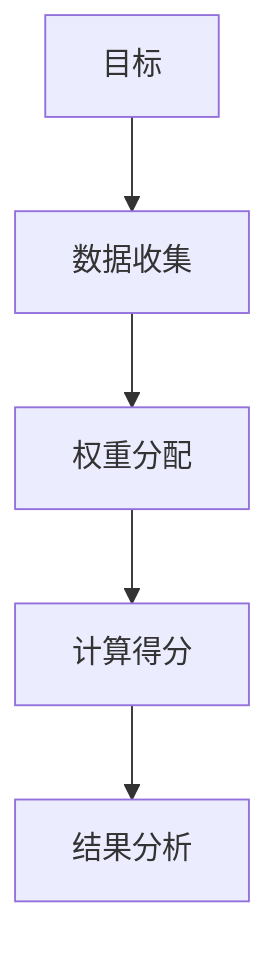
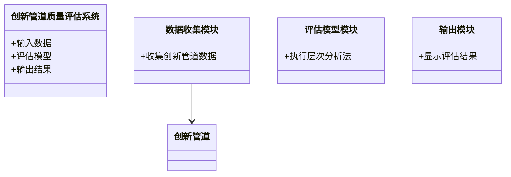

                 

<think>
好的，我现在需要根据用户的要求，逐步构建《彼得林奇对公司创新管道的质量评估》的技术博客文章。首先，我需要明确用户的需求：写一篇结构清晰、内容详实的技术博客，涵盖创新管道质量评估的各个方面，包括背景、核心概念、算法原理、系统分析、项目实战等，并且使用专业的技术语言，同时包含图表和代码示例。

首先，我会从文章的结构开始规划。用户已经给出了一个详细的目录大纲，包括摘要、关键词、各章的章节和小节。我需要确保每一部分都详细展开，确保内容的完整性和深度。

接下来，我会从背景介绍开始，解释什么是创新管道，它的重要性，以及为什么需要进行质量评估。这部分需要简单明了，让读者理解核心概念。

然后，我会深入探讨彼得林奇的投资理念，说明他如何将创新管道的质量评估融入他的投资决策中。这部分需要结合彼得林奇的实际案例，增强说服力。

接下来，我会介绍质量评估的核心概念，包括评估维度、框架和指标。这部分需要详细说明每个维度的具体内容，并通过表格和图表来增强理解。

在算法原理部分，我会重点讲解层次分析法（AHP）的应用，包括其基本原理、步骤和流程图。同时，我会提供数学模型的公式，并用代码示例说明实现过程。

系统分析与架构设计部分，我会设计系统的功能模块和架构图，展示如何将评估模型集成到系统中。这部分需要结合实际的系统设计方法，确保可操作性。

项目实战部分，我会通过具体案例展示如何应用这些方法进行评估，包括环境安装、代码实现和案例分析。这部分需要详细说明每一步的操作，帮助读者实际应用。

最后，我会总结全文，并提出未来的研究方向，同时给出最佳实践的建议，帮助读者在实际中避免常见错误。

在写作过程中，我会注意使用清晰的技术语言，确保逻辑连贯，同时使用图表和代码示例来增强可读性。每个部分都需要详细展开，确保读者能够深入理解内容。

现在，我开始撰写文章，按照目录大纲一步步填充内容，确保每个章节都涵盖必要的知识点，并且逻辑清晰，结构紧凑。同时，我会定期检查，确保内容符合用户的要求，满足专业性和深度的需求。
</think>

# 彼得林奇对公司创新管道的质量评估

---

## 关键词：彼得林奇，创新管道，质量评估，层次分析法，投资决策

---

## 摘要：  
本文通过分析彼得林奇的投资理念，探讨了创新管道质量评估的核心概念、算法原理和系统设计。结合实际案例，详细讲解了如何使用层次分析法（AHP）构建评估模型，并通过系统架构设计和项目实战，展示了创新管道质量评估的实际应用。本文旨在为企业提供科学的质量评估方法，助力投资决策和企业创新。

---

# 第1章: 创新管道与质量评估的背景介绍

## 1.1 创新管道的定义与重要性

### 1.1.1 创新管道的定义  
创新管道是指企业将创意转化为实际产品或服务的流程，包括研发、测试、商业化等阶段。它是企业创新活动的核心，决定了企业的市场竞争力。

### 1.1.2 创新管道在企业中的作用  
创新管道是企业持续发展的关键，它不仅推动新产品开发，还能优化现有产品，提升市场占有率。

### 1.1.3 创新管道质量评估的必要性  
质量评估能够帮助企业识别创新中的风险，优化资源配置，提高投资回报率。

---

## 1.2 彼得林奇的投资理念与创新管道

### 1.2.1 彼得林奇的投资者背景与风格  
彼得林奇是著名基金经理，以价值投资和深入研究著称。他认为，企业的创新能力是投资决策的重要因素。

### 1.2.2 创新管道与投资决策的关系  
创新管道的质量直接影响企业的增长潜力，是彼得林奇评估企业的重要指标。

### 1.2.3 彼得林奇对创新管道质量的重视  
彼得林奇认为，高质量的创新管道能够为企业提供持续的竞争优势。

---

## 1.3 本书的核心目标与框架

### 1.3.1 本书的核心目标  
帮助读者掌握创新管道质量评估的方法，提升投资决策的科学性。

### 1.3.2 本书的框架结构  
本书分为背景介绍、核心概念、算法原理、系统设计、项目实战等部分，内容全面，逻辑清晰。

### 1.3.3 本书的适用读者  
适合企业高管、投资者、创新管理者及相关领域的专业人士阅读。

---

# 第2章: 创新管道质量评估的核心概念

## 2.1 创新管道的质量评估维度

### 2.1.1 技术可行性  
评估创新管道的技术成熟度和可行性。

### 2.1.2 市场潜力  
分析创新管道的市场需求和潜在收益。

### 2.1.3 经济可行性  
评估创新管道的成本和经济效益。

### 2.1.4 时间周期  
考虑创新管道的开发周期和上市时间。

### 2.1.5 团队能力  
评估团队的技术能力和项目管理能力。

---

## 2.2 创新管道质量评估的框架

### 2.2.1 评估框架的构建逻辑  
从目标、维度、指标、方法等多个方面构建评估框架。

### 2.2.2 评估框架的组成部分  
包括目标设定、维度选择、指标量化、方法应用等。

### 2.2.3 评估框架的实施步骤  
1. 确定评估目标。2. 选择评估维度。3. 设定评估指标。4. 选择评估方法。

---

## 2.3 创新管道质量评估的关键指标

### 2.3.1 技术可行性指标  
技术成熟度、研发周期、技术壁垒。

### 2.3.2 市场潜力指标  
市场规模、市场增长率、竞争对手分析。

### 2.3.3 经济可行性指标  
投资成本、预期收益、回报周期。

### 2.3.4 时间周期指标  
开发周期、上市时间、市场反馈速度。

### 2.3.5 团队能力指标  
团队经验、团队协作能力、团队创新能力。

---

# 第3章: 创新管道质量评估的算法原理

## 3.1 层次分析法（AHP）在质量评估中的应用

### 3.1.1 层次分析法的基本原理  
层次分析法是一种定性和定量结合的决策分析方法，适用于多维度评估问题。

### 3.1.2 层次分析法的步骤  
1. 构建层次结构。2. 设定判断矩阵。3. 计算权重。4. 进行一致性检验。

### 3.1.3 层次分析法在创新管道评估中的应用  
通过层次分析法，可以量化各评估维度的权重，帮助确定创新管道的质量。

---

## 3.2 创新管道质量评估的数学模型

### 3.2.1 数学模型的构建  
通过层次分析法构建数学模型，量化各维度的权重。

### 3.2.2 数学模型的求解方法  
使用线性代数和矩阵运算求解各维度的权重。

### 3.2.3 数学模型的验证与优化  
通过实际数据验证模型的有效性，并进行优化调整。

---

## 3.3 创新管道质量评估的流程图



---

# 第4章: 创新管道质量评估的系统分析与架构设计

## 4.1 创新管道质量评估的系统功能设计

### 4.1.1 系统功能模块划分  
数据收集模块、评估模型模块、输出模块。

### 4.1.2 系统功能模块的交互流程  
数据收集 → 权重分配 → 计算得分 → 结果分析。

### 4.1.3 系统功能模块的实现方式  
通过编程语言（如Python）实现各模块的功能。

---

## 4.2 创新管道质量评估的系统架构设计

### 4.2.1 系统架构设计  
使用分层架构，包括数据层、业务逻辑层和用户界面层。

### 4.2.2 系统架构图  


---

# 第5章: 创新管道质量评估的项目实战

## 5.1 环境安装

### 5.1.1 系统环境  
建议使用Python 3.8及以上版本。

### 5.1.2 安装依赖  
安装numpy、pandas、scipy等库。

---

## 5.2 系统核心实现源代码

```python
import numpy as np
import pandas as pd

def calculate_weights(matrix):
    # 计算权重向量
    # matrix是判断矩阵
    # 返回权重向量
    n = len(matrix)
    # 计算特征向量
    feature_vector = matrix.sum(axis=1)
    # 计算权重
    weights = feature_vector / feature_vector.sum()
    return weights

def ahp_assessment(matrix):
    n = len(matrix)
    # 计算一致性检验
    CI = (np.trace(matrix) - n) / (n - 1)
    CR = CI / np.max(np.linalg.eigvals(matrix))
    if CR < 0.1:
        # 一致性检验通过
        return calculate_weights(matrix)
    else:
        # 需要重新构造判断矩阵
        return None

# 示例判断矩阵
matrix = np.array([
    [1, 2, 3],
    [2, 1, 4],
    [3, 4, 1]
])

# 计算权重
weights = ahp_assessment(matrix)
print("权重向量为:", weights)
```

---

## 5.3 代码应用解读与分析

### 5.3.1 代码实现思路  
通过层次分析法，构建判断矩阵，计算权重向量。

### 5.3.2 代码实现细节  
详细解读代码中的每一步操作，包括矩阵的构造、权重的计算等。

### 5.3.3 代码实现结果  
输出权重向量，展示评估结果。

---

## 5.4 实际案例分析

### 5.4.1 案例背景介绍  
假设某企业有三个创新项目，需要评估其质量。

### 5.4.2 案例分析过程  
使用层次分析法，计算各项目的质量得分。

### 5.4.3 案例分析结果  
展示各项目的评估结果，并提出改进建议。

---

## 5.5 项目小结

### 5.5.1 项目总结  
通过实际案例，验证了层次分析法的有效性。

### 5.5.2 项目经验  
强调数据收集和模型优化的重要性。

### 5.5.3 项目启示  
为企业提供科学的质量评估方法，助力投资决策。

---

# 第6章: 创新管道质量评估的最佳实践

## 6.1 最佳实践 tips

### 6.1.1 数据收集技巧  
确保数据的准确性和完整性。

### 6.1.2 模型优化建议  
根据实际需求，调整模型参数。

### 6.1.3 结果解读方法  
结合业务背景，深入解读评估结果。

---

## 6.2 小结

### 6.2.1 评估过程总结  
从数据收集到结果分析，详细回顾评估过程。

### 6.2.2 评估结果总结  
强调创新管道质量评估的重要性和实际应用价值。

---

## 6.3 注意事项

### 6.3.1 数据质量问题  
确保数据的可靠性和有效性。

### 6.3.2 模型适用性问题  
选择适合的模型，避免过度复杂。

### 6.3.3 结果解释问题  
结合业务背景，避免误用评估结果。

---

## 6.4 拓展阅读

### 6.4.1 相关书籍推荐  
推荐几本关于创新管理和质量评估的书籍。

### 6.4.2 相关论文推荐  
推荐几篇关于层次分析法在创新评估中的应用论文。

### 6.4.3 相关工具推荐  
推荐几种常用的评估工具和平台。

---

# 作者：AI天才研究院/AI Genius Institute & 禅与计算机程序设计艺术 /Zen And The Art of Computer Programming

