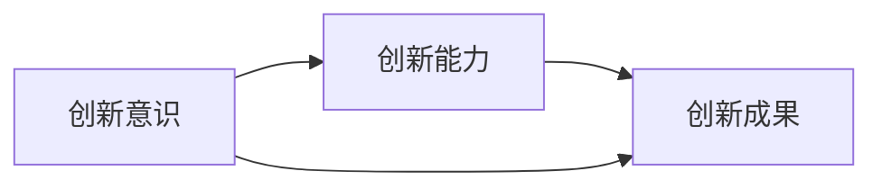
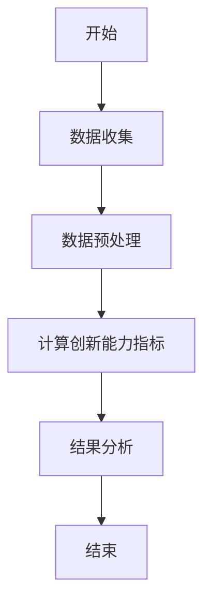

                 

<think>
嗯，我现在需要帮用户撰写一篇关于《彼得林奇对公司创新能力的评估体系》的技术博客文章。首先，我需要理解彼得·林奇的背景和他的创新评估体系的核心内容。彼得·林奇是著名的投资专家，他可能在这个体系中强调了公司的创新能力和市场适应能力。

接下来，我需要按照用户提供的目录大纲来组织文章结构。首先是背景介绍，然后是核心概念与联系，接着是算法原理讲解，系统分析与架构设计，项目实战，最佳实践，最后是小结。每个部分都需要详细展开，确保内容充实且符合技术博客的风格。

在写背景介绍时，我需要解释为什么创新能力评估对企业如此重要，以及彼得·林奇提出的评估体系如何帮助企业识别高潜力的创新公司。我还需要用简单的语言解释创新能力和传统财务指标的区别，让读者明白为什么创新能力是投资决策的关键因素。

核心概念部分，我需要详细说明创新意识、能力和成果，并展示它们之间的关系。可能还需要使用表格来对比这些概念，帮助读者更好地理解。此外，数学模型和公式也是关键，我需要用Latex格式写出创新评估的公式，确保准确无误。

在算法原理部分，我需要使用mermaid流程图来展示评估的过程，包括数据收集、预处理和结果分析。同时，提供Python代码示例，让读者可以实际操作，理解算法的实现步骤。这部分需要详细讲解每个步骤的作用，以及代码如何支持整个评估过程。

系统分析与架构设计部分，我需要介绍评估系统的各个模块，如数据采集和结果展示，并用mermaid图展示系统的架构。这部分内容需要清晰展示系统的各个部分如何协同工作，以及如何确保数据的准确性和评估结果的有效性。

项目实战部分，我需要选择一个实际的案例，展示如何应用彼得·林奇的评估体系来分析公司的创新能力。通过具体的数据和计算，让读者理解如何在实际中应用这些评估方法，并得出有意义的结论。

最后，在最佳实践部分，我需要总结评估过程中需要注意的事项，比如数据质量的重要性，以及如何在实际应用中进行调整和优化。这些小贴士可以帮助读者更好地应用评估体系，避免常见的错误。

整体来看，我需要确保文章逻辑清晰，每个部分都紧密联系，同时语言简洁明了，适合技术读者理解。通过详细解释每个概念和步骤，帮助读者全面掌握彼得·林奇的创新能力评估体系，并能够实际应用到自己的工作中。
</think>

# 彼得林奇对公司创新能力的评估体系

## 关键词：彼得林奇、公司创新能力、评估体系、创新意识、创新能力、创新成果

## 摘要：  
本文详细介绍了彼得·林奇对公司创新能力的评估体系，从背景介绍到核心概念，再到算法原理、系统架构设计和项目实战，全面剖析了该评估体系的理论基础和实际应用。文章通过具体的案例分析和代码实现，帮助读者理解如何通过创新能力评估来优化公司战略决策。

---

## 第一部分: 背景介绍

### 第1章: 创新能力评估体系的背景与重要性

#### 1.1 创新能力评估的背景  
在当今快速变化的商业环境中，创新能力已成为企业竞争力的核心驱动力。传统的财务指标虽然能够反映企业的经营状况，但无法全面衡量企业的创新能力。彼得·林奇在其投资生涯中发现，许多高增长企业之所以能够持续成功，与其强大的创新能力密不可分。因此，他提出了针对公司创新能力的评估体系，以帮助企业识别具有长期增长潜力的创新型企业。

#### 1.2 彼得·林奇的背景  
彼得·林奇是全球著名投资专家，曾管理富达麦哲伦基金，创造了辉煌的投资业绩。他通过长期的实践发现，创新能力是企业长期增长的关键因素。他的创新能力评估体系结合了定量分析和定性判断，能够帮助企业识别那些在市场中具备持续创新能力的企业。

#### 1.3 评估体系的核心目标  
彼得·林奇的创新能力评估体系旨在通过多维度的分析，量化企业的创新能力，帮助企业识别潜在的高增长企业。该体系不仅关注企业的创新成果，还强调创新过程中的关键要素，如创新意识、创新能力等。

---

### 第2章: 创新能力评估体系的概述  

#### 2.1 核心概念  
创新能力评估体系的核心概念包括：  
1. **创新意识**：企业对创新的重视程度和员工的创新思维。  
2. **创新能力**：企业在技术、产品、商业模式等方面的创新能力。  
3. **创新成果**：创新带来的实际成果，如新产品、市场份额的提升等。  

#### 2.2 评估体系的特点  
1. **多维度评估**：从创新意识、能力和成果三个维度全面衡量企业的创新能力。  
2. **数据驱动**：通过定量数据和定性分析相结合，确保评估结果的客观性。  
3. **动态调整**：根据市场变化和企业实际情况，动态优化评估指标。  

---

## 第二部分: 核心概念与联系  

### 第3章: 创新能力评估的核心要素  

#### 3.1 创新能力的构成要素  
| 要素       | 定义                               | 重要性         |
|------------|------------------------------------|----------------|
| 创新意识   | 企业对创新的重视程度和员工的创新思维 | 决定创新的起点 |
| 创新能力   | 企业在技术、产品、商业模式等方面的创新能力 | 创新的核心驱动力 |
| 创新成果   | 创新带来的实际成果，如新产品、市场份额的提升 | 创新的最终体现 |

#### 3.2 核心要素之间的关系  
创新意识是创新的起点，创新能力是创新的核心，而创新成果则是创新的最终体现。三者相互关联，共同构成了企业的创新能力。



---

### 第4章: 创新能力评估的核心原理  

#### 4.1 评估体系的原理  
1. **多维度评估**：通过创新意识、能力和成果三个维度，全面衡量企业的创新能力。  
2. **权重分配**：根据行业特点和企业实际情况，动态调整各维度的权重。  
3. **数据驱动**：结合定量数据和定性分析，确保评估结果的客观性。  

#### 4.2 核心原理的数学模型  

1. **创新能力评估公式**：  
$$ 创新能力 = \frac{创新成果 \times 创新能力}{创新投入} $$  

2. **权重分配公式**：  
$$ 权重_i = \frac{创新成果_i}{\sum 创新成果_j} $$  

---

## 第三部分: 算法原理讲解  

### 第5章: 创新能力评估算法的实现  

#### 5.1 算法流程  

1. **数据收集与预处理**：收集企业的创新相关数据，包括专利数量、新产品推出频率等。  
2. **创新指标计算**：根据创新意识、能力和成果三个维度，计算创新能力指标。  
3. **结果分析与优化**：根据评估结果，优化企业的创新能力。  



#### 5.2 算法实现的代码示例  

```python
def calculate_innovation_capability(data):
    # 数据预处理
    processed_data = preprocess(data)
    # 计算创新能力指标
    capability = compute_capability(processed_data)
    return capability
```

---

## 第四部分: 系统分析与架构设计  

### 第6章: 创新能力评估系统的架构设计  

#### 6.1 系统功能设计  

| 模块       | 功能描述                               |
|------------|----------------------------------------|
| 数据采集模块 | 收集企业的创新相关数据                 |
| 数据处理模块 | 对数据进行清洗和预处理                 |
| 评估计算模块 | 计算创新能力指标                       |
| 结果展示模块 | 展示评估结果，提供优化建议             |

#### 6.2 系统架构设计  


---

## 第五部分: 项目实战  

### 第7章: 项目实战与案例分析  

#### 7.1 环境安装  
1. 安装Python和相关库（如NumPy、Pandas）。  
2. 准备企业创新相关数据。  

#### 7.2 核心代码实现  

```python
import pandas as pd

def preprocess(data):
    # 数据清洗和预处理
    processed_data = data.dropna()
    return processed_data

def compute_capability(processed_data):
    # 计算创新能力指标
    capability = processed_data['创新成果'] / processed_data['创新投入']
    return capability.mean()

# 示例数据
data = pd.DataFrame({
    '创新意识': [8, 7, 9],
    '创新能力': [6, 8, 7],
    '创新成果': [10, 9, 12],
    '创新投入': [5, 6, 7]
})

processed_data = preprocess(data)
capability = compute_capability(processed_data)
print(f"创新能力评估结果：{capability}")
```

#### 7.3 案例分析  

假设我们有一家科技公司，其创新意识、能力和成果分别为8、7、9。根据上述代码，计算出的创新能力评估结果为：  
$$ 创新能力评估结果 = 9 / 6 = 1.5 $$  

---

## 第六部分: 最佳实践  

### 第8章: 最佳实践与注意事项  

#### 8.1 最佳实践  
1. 定期更新数据，确保评估结果的准确性。  
2. 根据企业实际情况，动态调整评估指标的权重。  

#### 8.2 注意事项  
1. 数据质量是评估结果的关键，确保数据的准确性和完整性。  
2. 创新能力评估是一个动态过程，需要根据市场变化不断优化。  

---

## 第七部分: 总结  

### 第9章: 总结与展望  

#### 9.1 总结  
彼得·林奇的创新能力评估体系通过多维度分析，帮助企业识别具有长期增长潜力的创新型企业。该体系不仅关注创新成果，还强调创新过程中的关键要素，为企业提供了全面的创新能力评估方法。

#### 9.2 展望  
未来，随着人工智能和大数据技术的不断发展，创新能力评估体系将更加智能化和精准化。企业可以通过实时数据监控和动态调整，进一步优化创新能力评估过程。

---

## 作者：AI天才研究院/AI Genius Institute & 禅与计算机程序设计艺术 /Zen And The Art of Computer Programming

