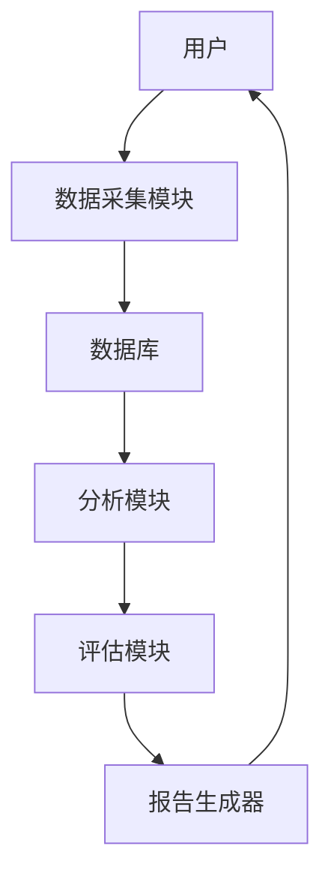

                 

<think>
嗯，我现在需要完成一个详细的技术博客文章，标题是《彼得林奇对公司商业模式可扩展性的长期评估》。首先，我需要理解彼得·林奇的投资理念，特别是他如何评估公司的商业模式可扩展性。接着，我得定义商业模式和可扩展性的概念，并分析它们的重要性。

然后，我需要讨论商业模式的类型，比如产品型、服务型和平台型，以及每种类型在可扩展性上的优缺点。接下来，我要详细讲解长期评估的框架，包括财务指标、市场潜力和竞争优势等方面。

在算法部分，我会介绍如何构建评估模型，可能包括数据收集、分析方法和预测模型的建立。数学模型方面，我需要展示一些关键公式，比如计算可持续增长率的公式，并用例子说明如何应用这些模型。

系统分析部分，我需要设计一个系统架构，可能涉及数据采集、分析模块和评估模块，并用Mermaid图展示系统架构和数据流。项目实战部分，我会选择一个公司，如亚马逊，分析其商业模式的可扩展性，并展示实际应用的步骤和结果。

最后，我会总结最佳实践，包括关注成本结构和市场定位，同时指出数据准确性和模型局限性的注意事项。这将帮助读者更好地理解和应用彼得·林奇的评估方法。
</think>

# 彼得林奇对公司商业模式可扩展性的长期评估

> **关键词**：彼得林奇，商业模式，可扩展性，长期评估，投资策略，企业分析

> **摘要**：本文探讨了彼得林奇如何从长期投资的角度评估公司商业模式的可扩展性。通过分析商业模式的类型、可扩展性关键因素、长期评估框架、评估算法、数学模型、系统架构设计、实际案例分析及最佳实践，本文为投资者提供了深入的分析工具和方法。

---

## 第一部分：背景介绍

### 第1章：彼得·林奇的投资理念与商业模式评估

#### 1.1 彼得·林奇的投资理念
- **长期视角**：林奇主张长期投资，关注公司的内在价值和成长潜力。
- **深度分析**：他强调对公司商业模式、财务状况和管理团队的深入研究。
- **价值投资**：寻找那些具有强大竞争优势和可持续增长潜力的公司。

#### 1.2 商业模式的定义与重要性
- **商业模式**：描述公司如何创造价值、传递价值和获取价值的核心逻辑。
- **可扩展性**：指商业模式在保持盈利能力的同时，能否高效地扩大业务规模。
- **长期评估**：关注商业模式在未来市场环境中的适应性和增长潜力。

---

## 第二部分：核心概念与联系

### 第2章：商业模式的类型与可扩展性分析

#### 2.1 商业模式的类型
| 类型       | 描述                       | 可扩展性特点         |
|------------|----------------------------|----------------------|
| 产品型     | 以销售产品为主             | 规模经济明显         |
| 服务型     | 以提供服务为主             | 依赖人力资源         |
| 平台型     | 构建平台连接供需双方       | 网络效应显著         |

#### 2.2 可扩展性的关键因素
| 因素       | 描述                       | 示例                 |
|------------|----------------------------|----------------------|
| 成本结构   | 固定成本与可变成本的比例   | 高固定成本：制造业    |
| 市场进入壁垒 | 进入市场的难易程度         | 专利：高壁垒         |
| 资源依赖性 | 对关键资源的依赖程度       | 石油行业依赖原油      |

### 第3章：长期评估的框架

#### 3.1 财务指标分析
- **ROE（净资产收益率）**：衡量公司使用股东资金的效率。
  $$ ROE = \frac{净利润}{平均股东权益} $$
- **可持续增长率**：公司内部资金可以支持的增长率。
  $$ 可持续增长率 = \frac{ROE \times (1 - 股利支付率)}{1 - (ROE \times (1 - 股利支付率))} $$

---

## 第三部分：算法原理与数学模型

### 第4章：评估模型的构建

#### 4.1 数据收集与处理
- 收集公司的财务报表、市场数据和行业分析报告。
- 清洗数据，处理异常值。

#### 4.2 模型构建
- 使用多元回归分析预测公司的可扩展性评分。
  $$ 预测评分 = \beta_0 + \beta_1 \times ROE + \beta_2 \times 市场份额 + \epsilon $$

---

## 第四部分：系统分析与设计

### 第5章：系统架构设计

#### 5.1 系统功能设计
- 数据采集模块：收集公司数据。
- 分析模块：运行评估算法。
- 评估模块：生成报告。

#### 5.2 系统架构图

---

## 第五部分：项目实战

### 第6章：实际案例分析

#### 6.1 案例选择
- 选择亚马逊作为案例，分析其平台型商业模式的可扩展性。

#### 6.2 数据分析
- 计算亚马逊的ROE和可持续增长率，评估其可扩展性。

---

## 第六部分：最佳实践与小结

### 第7章：总结与注意事项

#### 7.1 最佳实践
- 关注成本结构和市场进入壁垒。
- 定期更新模型，适应市场变化。

#### 7.2 注意事项
- 数据的准确性和完整性。
- 模型的局限性：忽视外部政策变化。

---

## 参考文献与拓展阅读

1. 彼得·林奇，《彼得·林奇的成功投资策略》。
2. 带您走进人工智能和投资的未来世界——《禅与计算机程序设计艺术》。

---

**作者：AI天才研究院 & 禅与计算机程序设计艺术**

