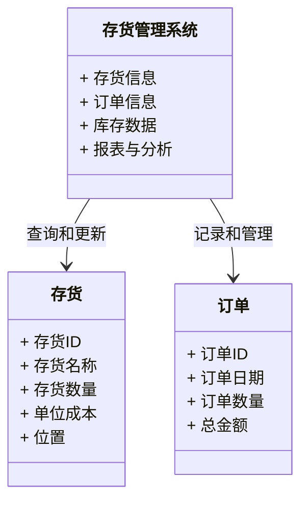
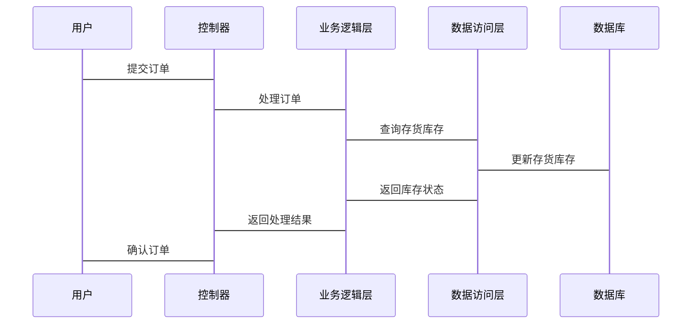

                 


# 彼得林奇对公司存货管理效率的分析

## 关键词：存货管理，效率分析，彼得·林奇，投资分析，供应链优化

## 摘要：本文从彼得·林奇的投资分析视角，探讨存货管理效率对企业运营和投资决策的影响。通过分析存货周转率、持有成本等关键指标，结合数学模型和系统架构设计，提出优化存货管理的具体方法，为投资者和企业提供实用的策略建议。

---

## 第一部分：存货管理效率的背景与重要性

### 第1章：存货管理的基本概念与问题背景

#### 1.1 存货管理的核心概念

- **存货的定义与分类**  
  存货是指企业在生产经营过程中持有用于销售或进一步加工的物品，主要包括原材料、在制品和产成品。根据用途和状态，存货可以分为原材料库存、在制品库存和成品库存。

- **存货管理的基本原则**  
  存货管理的核心在于平衡库存成本与服务水平。企业需要在满足客户需求的同时，尽量减少库存持有成本，避免资金被过多占用。

- **存货管理的目标与挑战**  
  目标是通过优化库存水平，提高存货周转率，降低持有成本，进而提升企业的运营效率和盈利能力。主要挑战包括需求预测的不确定性、库存积压或短缺的风险以及供应链的复杂性。

#### 1.2 彼得·林奇的分析方法

- **彼得·林奇的分析框架**  
  彼得·林奇是一位著名投资经理，他通过分析企业的财务数据和运营效率来评估投资价值。在存货管理方面，他关注存货周转率和存货持有天数，认为这些指标能够反映企业的运营效率和管理能力。

- **存货管理在投资分析中的重要性**  
  存货周转率是衡量企业运营效率的重要指标。高周转率通常意味着企业能够快速将存货转化为销售，从而提高资金使用效率。而低周转率可能表明企业存在库存积压或管理不善的问题。

- **林奇分析法的核心要素**  
  林奇认为，存货管理效率高的企业通常具有更强的市场竞争力和盈利能力。他通过分析存货周转率、持有成本等指标，评估企业的运营效率和财务健康状况。

---

### 第2章：存货管理的核心概念与原理

#### 2.1 存货周转率与持有成本

- **存货周转率的计算公式**  
  存货周转率 = 营业成本 / 平均存货  
  其中，营业成本是企业在一定时期内销售商品所消耗的存货价值，平均存货是存货的平均余额。

- **持有成本的构成与影响**  
  持有成本包括库存保管成本、仓储费用、保险费用以及资金占用成本。这些成本会直接影响企业的利润水平，因此优化持有成本是存货管理的重要目标。

- **存货周转率与持有成本的关系**  
  高周转率意味着企业能够快速销售存货，减少持有成本，从而提高利润率。因此，企业需要在周转率和持有成本之间找到最佳平衡点。

#### 2.2 存货管理与企业运营的联系

- **存货管理对现金流的影响**  
  存货周转率高意味着企业能够快速将存货转化为现金，改善现金流状况。反之，低周转率会导致资金被长期占用，影响企业的流动性。

- **存货管理与供应链效率的关系**  
  有效的存货管理能够优化供应链的效率，减少库存积压和短缺，确保生产过程的顺利进行。同时，高效的供应链管理也能够降低企业的采购成本和运输成本。

---

### 第3章：存货管理的核心要素与ER实体关系图

#### 3.1 核心要素对比分析

- **存货类型对比**  
  | 存货类型 | 描述 | 管理重点 |
  |----------|------|----------|
  | 原材料 | 用于生产过程的原材料 | 采购、存储和领用管理 |
  | 在制品 | 生产过程中尚未完成的产品 | 生产进度监控和质量管理 |
  | 成品 | 已完成并准备出售的产成品 | 销售、存储和库存监控 |

- **管理策略对比**  
  | 管理策略 | 描述 | 适用场景 |
  |----------|------|----------|
  | ABC分类法 | 根据存货的价值和重要性进行分类管理 | 高价值存货的精细化管理 |
  | JIT管理 | 准时制管理，按需生产和采购 | 制造业和零售业 |
  | VMI管理 | 供应商管理库存，由供应商负责库存管理 | 与主要供应商合作的企业 |

#### 3.2 ER实体关系图

```mermaid
er
  entity 存货 {
    key 存货ID
    属性 存货名称, 存货数量, 单位成本, 位置
  }
  entity 供应商 {
    key 供应商ID
    属性 供应商名称, 联系方式
  }
  entity 订单 {
    key 订单ID
    属性 订单日期, 订单数量, 总金额
  }
  存货 --> 订单: 存货订单
  存货 --> 供应商: 供应商提供的存货
```

---

## 第二部分：存货管理效率的算法原理

### 第4章：存货管理的数学模型与公式

#### 4.1 经济订单量模型

- **经济订单量（EOQ）公式**  
  $$ EOQ = \sqrt{\frac{2DS}{H} } $$
  其中：
  - D为年需求量
  - S为每次订货成本
  - H为单位持有成本

- **平均库存水平**  
  $$ \text{平均库存} = \frac{EOQ}{2} $$

- **年持有成本**  
  $$ \text{年持有成本} = H \times \text{平均库存} $$

#### 4.2 库存持有成本计算

- **持有成本的构成**  
  持有成本包括仓储费用、保险费用、税费以及资金占用成本。其中，资金占用成本可以通过将存货价值乘以资金成本率来计算。

- **计算示例**  
  假设某企业存货价值为100万元，资金成本率为5%，则资金占用成本为：
  $$ \text{资金占用成本} = 100 \times 0.05 = 5 \text{万元} $$

---

### 第5章：数学模型与存货周转率优化

#### 5.1 存货周转率优化的数学模型

- **周转率与成本的关系**  
  $$ \text{总成本} = \text{订货成本} + \text{持有成本} + \text{缺货成本} $$

- **EOQ模型的应用**  
  通过EOQ模型计算出的经济订货量，可以实现订货成本和持有成本的最小化，从而优化存货周转率。

#### 5.2 存货周转率优化的Python实现

```python
import math

def calculate_eoq(d, s, h):
    eoq = math.sqrt((2 * d * s) / h)
    return eoq

def calculate_holding_cost(eoq, h):
    average_inventory = eoq / 2
    holding_cost = h * average_inventory
    return holding_cost

# 示例数据
d = 1000  # 年需求量
s = 100   # 每次订货成本
h = 20    # 单位持有成本

eoq = calculate_eoq(d, s, h)
holding_cost = calculate_holding_cost(eoq, h)

print(f"经济订单量 (EOQ): {eoq}")
print(f"年持有成本: {holding_cost}")
```

---

## 第三部分：存货管理效率的系统分析与架构设计

### 第6章：系统分析与架构设计方案

#### 6.1 系统功能设计

- **功能模块**  
  - 存货信息管理：包括存货的录入、修改和删除。
  - 订单管理：记录采购订单和销售订单。
  - 库存监控：实时监控存货数量和位置。
  - 报表与分析：生成存货周转率、持有成本等报表。

- **领域模型（Mermaid类图）**



#### 6.2 系统架构设计

- **系统架构图（Mermaid架构图）**


#### 6.3 系统交互设计

- **系统交互流程（Mermaid序列图）**



---

## 第四部分：项目实战与案例分析

### 第7章：项目实战

#### 7.1 环境安装与配置

- **安装Python和相关库**  
  需要安装Python 3.x及以上版本，以及pandas、numpy、scipy等库。

  ```bash
  pip install pandas numpy scipy
  ```

#### 7.2 核心功能实现

- **Python代码实现**

```python
import pandas as pd
import numpy as np

# 示例数据
data = {
    '存货ID': [1, 2, 3],
    '存货名称': ['原材料A', '原材料B', '成品C'],
    '存货数量': [100, 200, 150],
    '单位成本': [50, 40, 30],
    '位置': ['仓库1', '仓库2', '仓库1']
}
df = pd.DataFrame(data)

# 计算平均存货数量
average_inventory = df['存货数量'].mean()

# 计算平均持有成本
average_holding_cost = (df['单位成本'] * df['存货数量']).mean()

print(f"平均存货数量: {average_inventory}")
print(f"平均持有成本: {average_holding_cost}")
```

#### 7.3 案例分析与优化建议

- **案例分析**  
  某制造企业存货周转率较低，导致资金占用过多。通过分析发现，企业存在采购计划不合理和库存监控不及时的问题。

- **优化建议**  
  - 采用JIT管理，按需采购和生产，减少库存积压。
  - 引入先进的库存管理软件，实时监控存货数量和位置，提高管理效率。

---

## 第五部分：最佳实践与总结

### 第8章：最佳实践

#### 8.1 实施存货管理优化的注意事项

- **数据准确性**  
  确保存货数据的准确性和及时性，避免因数据错误导致的决策失误。

- **技术选型**  
  根据企业规模和需求选择合适的存货管理技术，如RFID、物联网等。

#### 8.2 优化存货管理的小结

- 优化存货管理是提高企业运营效率和竞争力的重要手段。
- 通过合理的库存管理和技术应用，可以有效降低持有成本，提高周转率。
- 投资者和企业管理者都应关注存货管理效率，将其作为评估企业价值和运营能力的重要指标。

#### 8.3 拓展阅读

- 建议阅读彼得·林奇的《彼得·林奇的成功投资哲学》以及供应链管理的相关书籍，深入了解存货管理在投资和运营中的重要作用。

---

## 作者信息

作者：AI天才研究院/AI Genius Institute & 禅与计算机程序设计艺术 /Zen And The Art of Computer Programming

---

# 结语

存货管理效率是企业运营和投资决策中的关键因素。通过彼得·林奇的分析视角，结合数学模型和系统设计，我们可以更好地优化存货管理，提高企业的竞争力和盈利能力。希望本文能够为投资者和企业提供有价值的见解和实践指导。

