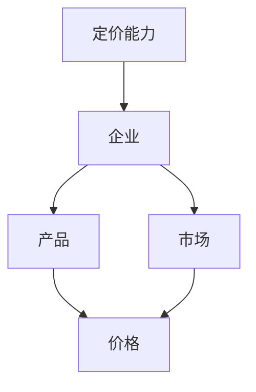
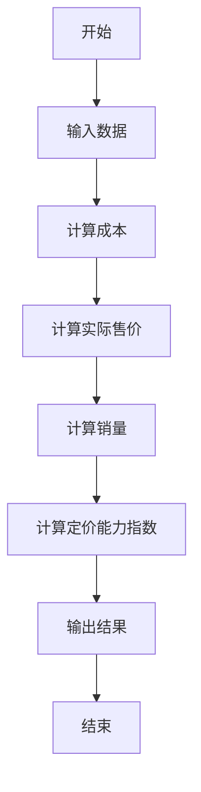
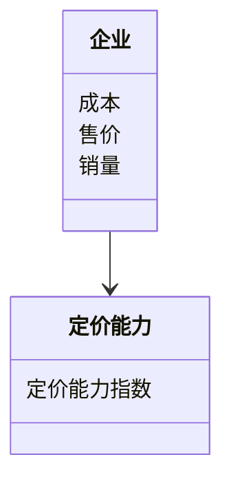
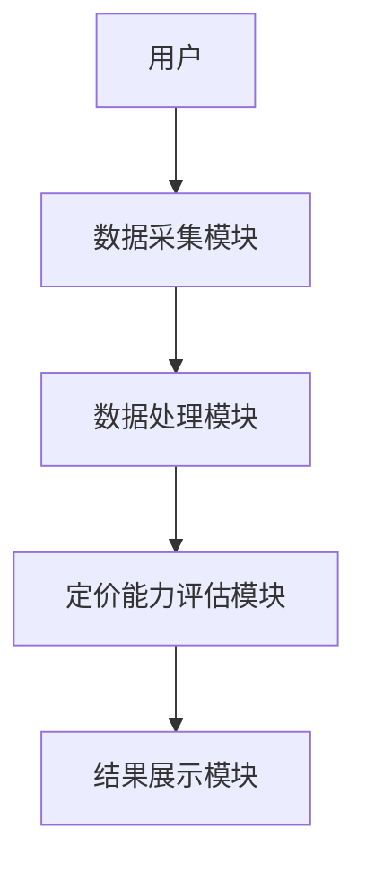
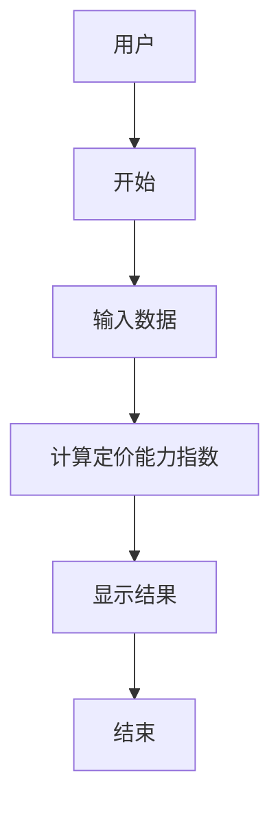

                 


# 彼得林奇对公司定价能力的评估

> 关键词：定价能力，彼得·林奇，投资评估，企业价值，定价策略

> 摘要：本文深入探讨了彼得·林奇在公司定价能力评估方面的独特见解。从定价能力的核心概念、算法原理、系统架构到实际案例分析，系统地阐述了如何通过定价能力评估来判断企业的价值和竞争优势。文章结合理论与实践，为投资者和企业管理者提供了实用的评估方法和工具。

---

## 第一部分：定价能力评估的背景与核心概念

### 第1章：定价能力评估的背景与重要性

#### 1.1 定价能力的定义与内涵

##### 1.1.1 定价能力的定义  
定价能力是指企业在市场中制定价格并实现利润最大化的能力。它不仅涉及价格的设定，还包括对成本、市场需求和竞争环境的综合考量。

##### 1.1.2 定价能力的核心要素  
定价能力的核心要素包括：  
1. **产品定位**：确定产品在市场中的位置和目标客户群体。  
2. **成本结构**：了解产品的生产成本和运营成本。  
3. **市场需求**：分析市场对产品的需求程度和价格敏感性。  

##### 1.1.3 定价能力的边界与外延  
定价能力的边界在于企业的成本结构和市场需求，而外延则涉及企业的竞争优势和市场定位。

#### 1.2 彼得·林奇与定价能力评估

##### 1.2.1 彼得·林奇的背景介绍  
彼得·林奇是美国著名投资家，以其在共同基金领域的卓越表现而闻名。他的投资理念强调对公司基本面的深入分析，尤其是定价能力。

##### 1.2.2 彼得·林奇的投资理念  
林奇认为，企业的定价能力是其竞争优势的核心。他通过分析企业的定价策略和成本结构，判断企业是否能够在市场中持续盈利。

##### 1.2.3 定价能力在投资中的重要性  
定价能力是企业盈利能力的关键因素。通过评估定价能力，投资者可以判断企业的市场地位和竞争优势。

#### 1.3 定价能力评估的必要性

##### 1.3.1 定价能力对企业价值的影响  
定价能力强的企业能够通过合理定价实现更高的利润率，从而提升企业价值。

##### 1.3.2 定价能力与企业竞争优势  
定价能力是企业竞争优势的重要来源。通过制定合理的价格策略，企业可以在市场中占据优势地位。

##### 1.3.3 定价能力与投资决策的关系  
定价能力是投资决策的重要依据。通过评估企业的定价能力，投资者可以判断企业的盈利能力和成长潜力。

#### 1.4 本章小结  
本章介绍了定价能力的核心概念和彼得·林奇的投资理念，强调了定价能力在投资决策中的重要性。

---

### 第2章：定价能力的核心概念与联系

#### 2.1 定价能力的核心要素

##### 2.1.1 产品定位与定价策略  
产品定位决定了企业的目标客户群体和市场位置，而定价策略则是实现产品定位的关键手段。

##### 2.1.2 成本结构与定价模型  
企业的成本结构直接影响定价模型的设计。合理的定价模型能够确保企业在盈利的同时保持竞争力。

##### 2.1.3 市场需求与定价能力  
市场需求是定价能力的核心影响因素。通过分析市场需求，企业可以制定更合理的定价策略。

#### 2.2 定价能力与企业价值的关系

##### 2.2.1 定价能力对企业利润的影响  
定价能力强的企业能够通过合理定价实现更高的利润率，从而提升企业利润。

##### 2.2.2 定价能力与企业市场份额的关系  
定价能力是企业市场份额的重要决定因素。通过制定合理的价格策略，企业可以扩大市场份额。

##### 2.2.3 定价能力与企业可持续发展的联系  
定价能力是企业可持续发展的重要保障。通过合理的定价策略，企业可以在竞争中保持优势地位。

#### 2.3 核心概念的属性特征对比

##### 2.3.1 定价能力与其他能力的对比分析  
通过对比分析定价能力与其他能力，我们可以更好地理解其独特性和重要性。

##### 2.3.2 定价能力的量化指标  
定价能力的量化指标包括利润率、市场份额增长率和定价灵活性等。

##### 2.3.3 定价能力的ER实体关系图  
以下是定价能力的ER实体关系图：


#### 2.4 本章小结  
本章详细分析了定价能力的核心要素及其与其他概念的关系，为后续的定价能力评估奠定了理论基础。

---

## 第三部分：定价能力评估的算法原理

### 第3章：定价能力评估的算法原理

#### 3.1 定价能力评估的数学模型

##### 3.1.1 定价能力指数的定义  
定价能力指数是衡量企业定价能力的量化指标，公式如下：
$$
\text{定价能力指数} = \frac{\text{实际售价}}{\text{成本}} \times \text{销量}
$$

##### 3.1.2 定价能力指数的计算公式  
通过上述公式，我们可以计算出企业的定价能力指数，从而评估其定价能力。

#### 3.2 算法原理的详细讲解

##### 3.2.1 定价能力评估的步骤  
1. 收集企业的成本和售价数据。  
2. 计算企业的定价能力指数。  
3. 分析指数结果，评估企业的定价能力。  

##### 3.2.2 算法流程图  
以下是定价能力评估的算法流程图：


#### 3.3 通

---

## 第四部分：定价能力评估的系统架构

### 第4章：定价能力评估的系统架构

#### 4.1 问题场景介绍  
本章将从系统架构的角度，分析定价能力评估的实现过程。

#### 4.2 项目介绍  
本项目旨在通过构建定价能力评估系统，帮助企业评估其定价能力。

#### 4.3 系统功能设计

##### 4.3.1 领域模型  
以下是定价能力评估的领域模型：


##### 4.3.2 系统架构设计  
以下是系统的架构设计：


#### 4.4 系统接口设计  
系统接口包括数据输入接口和结果输出接口。

#### 4.5 系统交互设计  
以下是系统的交互设计：


---

## 第五部分：定价能力评估的项目实战

### 第5章：项目实战

#### 5.1 环境安装  
需要安装Python和相关库。

#### 5.2 系统核心实现源代码  
以下是定价能力评估的Python代码：
```python
def calculate_pricing_ability(cost, price, quantity):
    return (price / cost) * quantity

# 示例数据
cost = 50
price = 100
quantity = 1000

# 计算定价能力指数
pricing_ability_index = calculate_pricing_ability(cost, price, quantity)
print("定价能力指数:", pricing_ability_index)
```

#### 5.3 代码应用解读与分析  
通过上述代码，我们可以计算企业的定价能力指数，从而评估其定价能力。

#### 5.4 实际案例分析  
以某公司为例，分析其定价能力指数，并评估其定价能力。

#### 5.5 本章小结  
本章通过项目实战，详细展示了定价能力评估的实现过程。

---

## 第六部分：总结与展望

### 第6章：总结与展望

#### 6.1 本章总结  
本文系统地探讨了彼得·林奇的定价能力评估方法，从理论到实践，全面分析了定价能力的核心要素、算法原理和系统架构。

#### 6.2 最佳实践 tips  
1. 在投资决策中，注重分析企业的定价能力。  
2. 通过系统化的评估方法，提升企业的定价能力。  

#### 6.3 注意事项  
1. 定价能力评估需要结合企业的实际情况。  
2. 定价能力评估结果仅供参考，需结合其他因素综合判断。  

#### 6.4 拓展阅读  
推荐阅读彼得·林奇的相关著作，深入理解定价能力评估的实践应用。

---

## 作者信息

作者：AI天才研究院/AI Genius Institute & 禅与计算机程序设计艺术 /Zen And The Art of Computer Programming

---

通过本文的系统分析，读者可以全面理解彼得·林奇的定价能力评估方法，并能够在实际中灵活应用这些知识。

