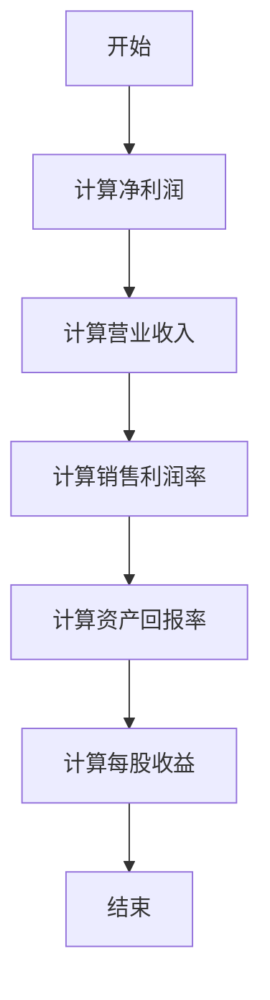
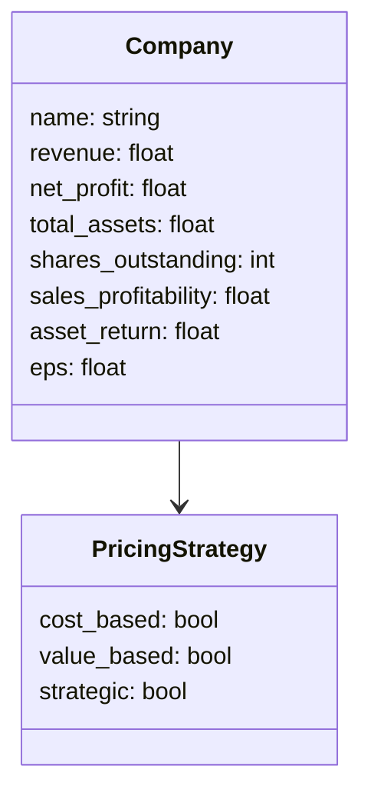
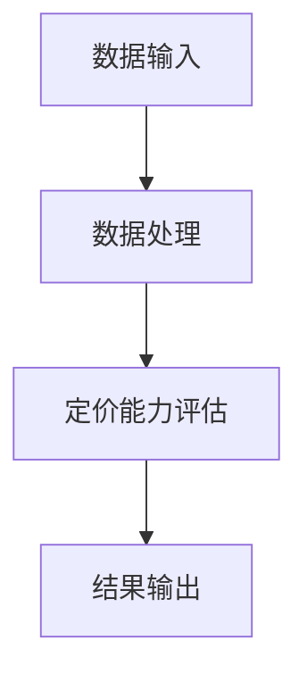
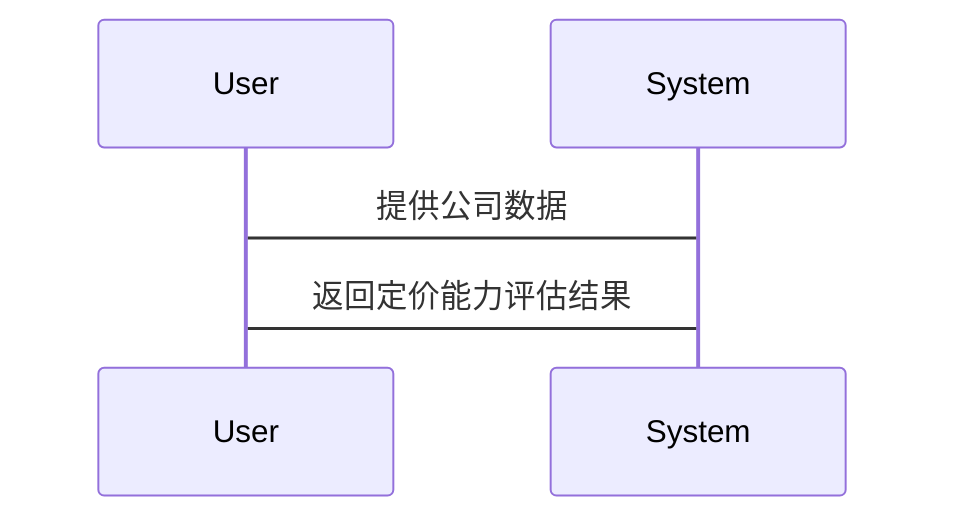

                 


# 彼得林奇对公司定价能力的评估标准

## 关键词：定价能力、彼得林奇、评估标准、定价策略、数学模型、系统架构、Python代码

## 摘要：
定价能力是企业盈利能力的关键因素，彼得·林奇作为投资界的传奇人物，提出了独特的定价能力评估标准。本文将深入探讨定价能力的核心概念、评估标准、定价策略、数学模型，并通过实际案例和系统架构设计，帮助读者理解和应用这些方法。

---

# 正文

## 第1章：定价能力的核心概念与背景

### 1.1 定价能力的定义与重要性

#### 1.1.1 定价能力的定义
定价能力是指企业在市场中制定价格以实现最大利润的能力。它不仅影响企业的收入，还影响其市场地位和竞争力。

#### 1.1.2 定价能力在企业中的重要性
- 定价能力直接影响企业的盈利能力。
- 良好的定价策略可以提高市场份额和客户忠诚度。
- 在竞争激烈的市场中，定价能力是企业生存和发展的关键。

#### 1.1.3 彼得林奇对定价能力的重视
彼得林奇在其投资策略中强调，定价能力是评估一家公司长期盈利能力的重要指标。他关注公司是否能够在不同市场条件下调整价格，以保持盈利能力。

---

### 1.2 定价能力的核心要素

#### 1.2.1 成本结构分析
- 成本结构是定价的基础，包括固定成本和变动成本。
- 通过分析成本结构，可以确定最低价格以覆盖成本。

#### 1.2.2 市场定位与定价策略
- 市场定位决定了目标客户群体和价格敏感性。
- 基于市场定位，企业可以选择成本加成定价、价值定价或渗透定价等策略。

#### 1.2.3 产品生命周期与定价关系
- 不同阶段的产品生命周期（引入期、成长期、成熟期、衰退期）需要不同的定价策略。

---

## 第2章：定价能力的评估标准

### 2.1 定价能力的定量评估指标

#### 2.1.1 销售利润率
销售利润率 = 净利润 / 营业收入 × 100%
- 高销售利润率表明企业定价能力强。

#### 2.1.2 每股收益
每股收益 = 净利润 / 流通股股数
- 反映企业每股的盈利能力。

#### 2.1.3 资产回报率
资产回报率 = 净利润 / 总资产 × 100%
- 衡量企业资产使用效率。

### 2.2 定价能力的定性评估指标

#### 2.2.1 产品差异化能力
- 产品差异化越高，定价能力越强。

#### 2.2.2 市场地位与品牌影响力
- 强大的品牌影响力可以支撑较高的价格。

#### 2.2.3 竞争对手分析
- 分析竞争对手的定价策略，找到差异化机会。

### 2.3 彼得林奇的定价能力评估模型

#### 2.3.1 模型的构建与逻辑
彼得林奇的模型结合了定量和定性因素，通过分析销售利润率、资产回报率和市场份额变化，评估定价能力。

#### 2.3.2 模型的核心公式与计算方法
- 销售利润率公式：净利润 / 营业收入 × 100%
- 资产回报率公式：净利润 / 总资产 × 100%
- 市场份额变化：通过比较当前市场份额与历史数据，评估定价策略的有效性。

#### 2.3.3 模型的实际应用案例
以某公司为例，计算其销售利润率和资产回报率，分析其定价能力。

---

## 第3章：定价策略与市场定位

### 3.1 成本加成定价法

#### 3.1.1 定价公式与计算
售价 = 成本 × (1 + 加成率)
- 加成率根据市场竞争情况确定。

#### 3.1.2 优缺点分析
- 优点：简单易行，确保覆盖成本。
- 缺点：可能忽视市场需求变化。

#### 3.1.3 实际案例分析
某公司使用成本加成定价法，分析其定价效果。

### 3.2 价值定价法

#### 3.2.1 定价逻辑与步骤
1. 确定产品价值。
2. 分析客户愿意支付的价格。
3. 制定价格以反映产品价值。

#### 3.2.2 优缺点分析
- 优点：提高客户满意度，增强品牌忠诚度。
- 缺点：需要准确评估产品价值。

#### 3.2.3 实际案例分析
某软件公司使用价值定价法，分析其市场表现。

### 3.3 战略定价法

#### 3.3.1 长期战略目标与定价
- 确定长期目标，制定相应定价策略。

#### 3.3.2 优缺点分析
- 优点：符合长期战略，增强市场地位。
- 缺点：可能忽视短期利润。

#### 3.3.3 实际案例分析
某科技公司通过战略定价法扩大市场份额。

---

## 第4章：定价能力的数学模型与算法

### 4.1 定价能力的数学公式

#### 4.1.1 销售利润率公式
$$\text{销售利润率} = \frac{\text{净利润}}{\text{营业收入}} \times 100\%$$

#### 4.1.2 资产回报率公式
$$\text{资产回报率} = \frac{\text{净利润}}{\text{总资产}} \times 100\%$$

#### 4.1.3 每股收益公式
$$\text{每股收益} = \frac{\text{净利润}}{\text{流通股股数}}$$

### 4.2 定价能力的算法流程



### 4.3 定价能力的Python实现

```python
def calculate_profitability(net_profit, revenue, total_assets, shares_outstanding):
    sales_profitability = (net_profit / revenue) * 100
    asset_return = (net_profit / total_assets) * 100
    eps = net_profit / shares_outstanding
    return sales_profitability, asset_return, eps

# 示例数据
net_profit = 1000000
revenue = 5000000
total_assets = 20000000
shares_outstanding = 100000

# 计算
sales_profitability, asset_return, eps = calculate_profitability(net_profit, revenue, total_assets, shares_outstanding)

print(f"销售利润率: {sales_profitability}%")
print(f"资产回报率: {asset_return}%")
print(f"每股收益: {eps}")
```

---

## 第5章：系统分析与架构设计方案

### 5.1 问题场景介绍
介绍如何利用彼得林奇的模型进行定价能力评估，包括数据收集、分析和结果应用。

### 5.2 系统功能设计



### 5.3 系统架构设计



### 5.4 系统接口设计
- 数据输入接口：接收公司财务数据。
- 结果输出接口：提供评估结果和建议。

### 5.5 系统交互设计



---

## 第6章：项目实战

### 6.1 环境安装
- 安装Python和相关库（如pandas、numpy）。

### 6.2 核心代码实现

```python
import pandas as pd
import numpy as np

def analyze_profitability(data):
    data['销售利润率'] = data['净利润'] / data['营业收入'] * 100
    data['资产回报率'] = data['净利润'] / data['总资产'] * 100
    data['每股收益'] = data['净利润'] / data['流通股股数']
    return data

# 示例数据
data = pd.DataFrame({
    '公司名称': ['A', 'B', 'C'],
    '净利润': [1000000, 1500000, 800000],
    '营业收入': [5000000, 6000000, 4000000],
    '总资产': [20000000, 25000000, 18000000],
    '流通股股数': [100000, 120000, 90000]
})

result = analyze_profitability(data)
print(result)
```

### 6.3 案例分析与详细解读
以具体公司为例，分析其定价能力，并提出改进建议。

### 6.4 项目小结
总结项目实施过程，强调定价能力评估的实际应用价值。

---

## 第7章：最佳实践与注意事项

### 7.1 定价能力评估中的最佳实践
- 定期更新定价模型，适应市场变化。
- 结合定量和定性分析，全面评估定价能力。

### 7.2 小结
彼得林奇的定价能力评估标准为企业提供了科学的定价策略，帮助企业提升盈利能力。

### 7.3 注意事项
- 数据准确性是关键，确保输入数据的可靠性。
- 定价策略应根据市场变化灵活调整。

### 7.4 拓展阅读
推荐相关书籍和资源，进一步深入学习定价能力评估。

---

# 结语

通过本文的详细分析，读者可以全面理解彼得林奇的定价能力评估标准，并在实际工作中应用这些方法，提升企业的定价能力和盈利能力。

---

**作者：AI天才研究院/AI Genius Institute & 禅与计算机程序设计艺术 /Zen And The Art of Computer Programming**

---

感谢您的阅读！如果需要进一步的技术支持或深度分析，请随时联系。

