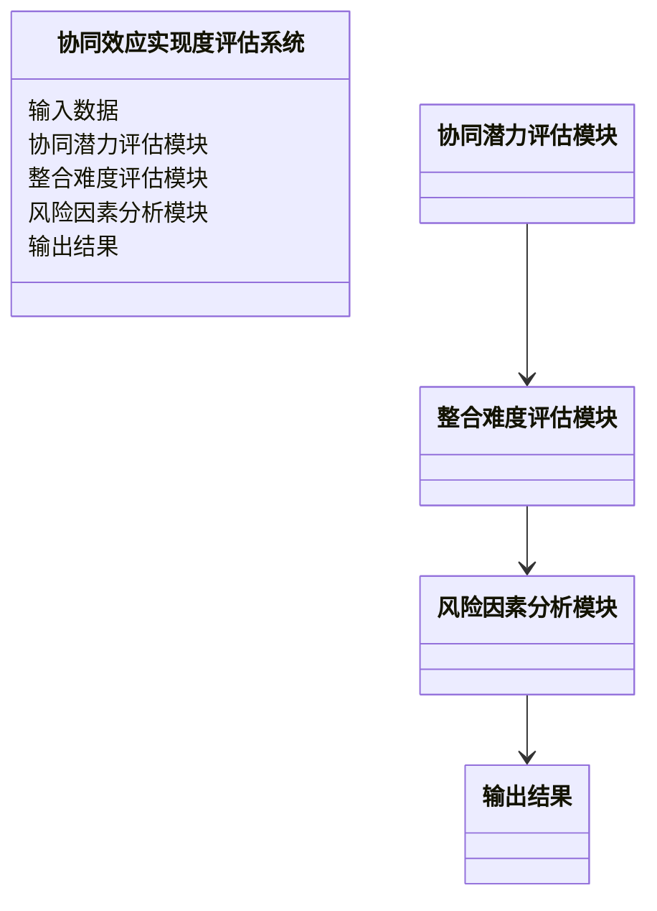
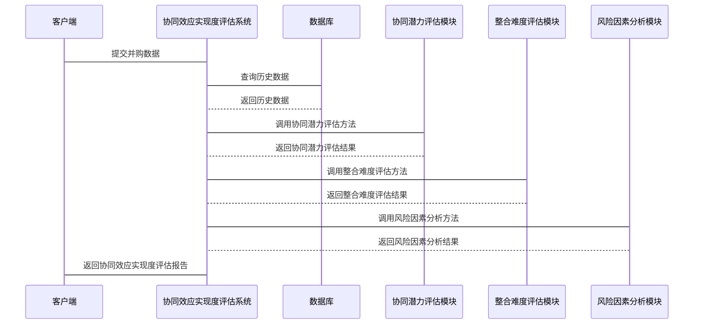

                 

<think>
好的，我需要根据用户的要求，以《彼得林奇对公司并购协同效应实现度的评估》为标题，撰写一篇结构完整、内容详实的技术博客文章。用户已经提供了目录大纲，我需要根据这个大纲逐步完成每一部分的内容。

首先，文章的开头需要有标题、关键词和摘要。标题已经确定，关键词应该围绕协同效应、公司并购、彼得·林奇、实现度评估等。摘要部分需要简明扼要地概述文章的核心内容，即彼得·林奇如何评估并购中的协同效应实现度，以及其方法对投资决策的重要性。

接下来是目录大纲，分为六个主要部分，每个部分下有多个章节和小节。我需要按照这个结构，逐一完成每一部分的内容，确保逻辑清晰，内容详实。

在写作过程中，我需要使用专业而易懂的语言，结合逻辑推理，详细解释每个概念、模型和算法。同时，按照要求插入mermaid图表、数学公式和Python代码示例，使文章更具专业性和可读性。

考虑到用户对字数的要求，我需要确保文章内容充实，每个章节和小节都有足够的细节和深度。同时，注意文章结构的连贯性，确保读者能够顺畅地从一个部分过渡到另一个部分。

最后，在文章末尾，按照要求添加作者信息，确保格式正确，内容完整。

现在，我将按照目录大纲，开始逐一撰写每个部分的内容，确保符合用户的所有要求。
</think>

# 彼得林奇对公司并购协同效应实现度的评估

## 关键词：公司并购、协同效应、彼得·林奇、实现度评估、并购整合

## 摘要：本文详细探讨了彼得·林奇在公司并购中对协同效应实现度的评估方法。协同效应是并购成功的关键因素，本文通过分析协同效应的类型、实现度评估模型、算法原理、系统架构及实际案例，展示了如何量化协同效应，评估整合难度和风险因素，帮助投资者优化并购决策，提高并购成功率。

---

# 第一部分: 公司并购与协同效应概述

## 第1章: 公司并购的基本概念

### 1.1 公司并购的定义与类型

#### 1.1.1 公司并购的定义
公司并购（Mergers and Acquisitions, M&A）是指一家企业与其他企业合并或收购其资产、股权的行为。并购是企业扩张和重组的重要手段，通常分为**横向并购**、**纵向并购**和**混合并购**三种类型。

- **横向并购**：同一行业内的企业合并，旨在扩大市场份额，降低成本。
- **纵向并购**：产业链上下游企业的合并，以增强控制力和稳定性。
- **混合并购**：与主业无关的企业合并，通常是为了多元化经营。

#### 1.1.2 并购的动机与目的
企业进行并购的动机多种多样，主要动机包括：
1. **市场扩展**：进入新市场或区域。
2. **成本节约**：通过规模效应降低成本。
3. **获取技术或资源**：获取关键技术和资源。
4. **增强竞争力**：通过合并增强市场地位。

### 1.2 协同效应的定义与分类

#### 1.2.1 协同效应的定义
协同效应（Synergy）是指并购后企业整合所产生的额外价值，通常表现为收入增加或成本节约。协同效应的实现需要双方企业在整合过程中有效合作，充分利用资源。

协同效应的分类：
1. **成本协同**：通过整合供应链、生产流程等实现成本节约。
2. **收入协同**：通过市场扩展、产品互补等实现收入增长。
3. **管理协同**：通过优化管理结构提升效率。

---

## 第2章: 协同效应实现度评估的重要性

### 2.1 并购失败的常见原因
根据统计，约60%的并购交易未能达到预期目标，原因主要包括：
1. **协同效应未达预期**：整合过程中未能实现预期的协同效应。
2. **文化冲突与整合问题**：企业文化和管理风格差异导致整合困难。
3. **战略目标不一致**：并购双方的战略目标不一致，导致整合失败。

### 2.2 协同效应实现度评估的意义
有效的协同效应评估能够帮助企业在并购决策中：
1. **优化并购决策**：通过评估潜在协同效应，选择最优并购目标。
2. **提高并购成功率**：通过评估整合难度和风险，制定合理的整合策略。
3. **评估并购绩效**：通过协同效应实现度评估，并购后绩效是否达到预期。

### 2.3 彼得·林奇的并购评估方法

#### 2.3.1 林奇的并购分析框架
彼得·林奇（Peter Lynch）是著名的投资专家，他提出了以下并购评估方法：
1. **基本面分析**：分析目标企业的财务状况、盈利能力、成长潜力。
2. **协同效应评估**：评估并购后的协同效应，包括成本节约和收入增长。
3. **风险因素分析**：识别并购中的潜在风险，如整合风险、市场风险等。

---

# 第二部分: 协同效应实现度评估模型

## 第3章: 协同效应实现度评估模型

### 3.1 模型的构成要素

#### 3.1.1 协同潜力评估
协同潜力评估是协同效应实现度评估的基础，包括以下几个方面：
1. **成本协同潜力**：评估双方在生产、采购、管理等方面的协同潜力。
2. **收入协同潜力**：评估双方在市场、产品、客户等方面的协同潜力。
3. **管理协同潜力**：评估双方在管理、文化、战略等方面的协同潜力。

#### 3.1.2 整合难度评估
整合难度评估是协同效应实现度评估的重要组成部分，包括以下几个方面：
1. **组织整合难度**：评估双方在组织结构、管理风格、企业文化等方面的整合难度。
2. **资源整合难度**：评估双方在资源、技术、资产等方面的整合难度。
3. **文化整合难度**：评估双方在文化、价值观、员工关系等方面的整合难度。

#### 3.1.3 风险因素分析
风险因素分析是协同效应实现度评估的重要组成部分，包括以下几个方面：
1. **市场风险**：评估并购后市场环境的变化对协同效应的影响。
2. **整合风险**：评估整合过程中可能出现的风险，如文化冲突、管理混乱等。
3. **操作风险**：评估整合过程中可能出现的操作风险，如流程不畅、技术问题等。

---

## 第4章: 协同效应实现度评估模型的数学公式

### 4.1 协同效应指数公式
协同效应指数（Synergy Index）用于量化并购后的协同效应，公式如下：

$$
\text{Synergy Index} = \frac{\text{协同效应}}{\text{并购前双方的总价值}}
$$

其中，协同效应计算公式为：

$$
\text{协同效应} = \text{并购后企业价值} - \text{并购前双方企业价值}
$$

### 4.2 协同潜力评估模型
协同潜力评估模型（Synergy Potential Model）用于评估并购双方的协同潜力，公式如下：

$$
\text{协同潜力} = \sum_{i=1}^{n} \text{权重}_i \times \text{潜力}_i
$$

其中，权重_i 表示第i个协同潜力的权重，潜力_i 表示第i个协同潜力的潜力值。

---

# 第三部分: 系统分析与架构设计

## 第5章: 协同效应实现度评估系统的架构设计

### 5.1 问题场景介绍
在公司并购中，协同效应的实现度评估是一个复杂的系统工程，涉及多个方面，包括协同潜力评估、整合难度评估、风险因素分析等。

### 5.2 系统功能设计

#### 5.2.1 领域模型
以下是协同效应实现度评估系统的领域模型：



#### 5.2.2 系统架构
以下是协同效应实现度评估系统的系统架构：


### 5.3 系统交互设计

#### 5.3.1 系统交互流程
以下是协同效应实现度评估系统的交互流程：



---

# 第四部分: 项目实战

## 第6章: 协同效应实现度评估系统的实现

### 6.1 环境安装
协同效应实现度评估系统的实现需要以下环境：
- 操作系统：Windows、Linux 或 macOS
- 开发工具：Python、Jupyter Notebook
- 数据库：MySQL、MongoDB
- 依赖库：pandas、numpy、scikit-learn

### 6.2 系统核心实现源代码

#### 6.2.1 协同潜力评估模块

```python
import pandas as pd
import numpy as np

def calculate_synergy_potential(data):
    # 数据预处理
    data = data.dropna()
    data['协同潜力'] = data['权重'] * data['潜力']
    return data['协同潜力'].sum()

# 示例数据
data = pd.DataFrame({
    '权重': [0.3, 0.4, 0.3],
    '潜力': [0.8, 0.6, 0.5]
})

synergy_potential = calculate_synergy_potential(data)
print(f"协同潜力：{synergy_potential}")
```

#### 6.2.2 整合难度评估模块

```python
def calculate_integration_difficulty(data):
    # 数据预处理
    data = data.dropna()
    data['整合难度'] = data['权重'] * data['难度']
    return data['整合难度'].sum()

# 示例数据
data = pd.DataFrame({
    '权重': [0.3, 0.4, 0.3],
    '难度': [0.7, 0.6, 0.5]
})

integration_difficulty = calculate_integration_difficulty(data)
print(f"整合难度：{integration_difficulty}")
```

#### 6.2.3 风险因素分析模块

```python
def calculate_risk_factors(data):
    # 数据预处理
    data = data.dropna()
    data['风险因素'] = data['权重'] * data['风险']
    return data['风险因素'].sum()

# 示例数据
data = pd.DataFrame({
    '权重': [0.3, 0.4, 0.3],
    '风险': [0.6, 0.5, 0.4]
})

risk_factors = calculate_risk_factors(data)
print(f"风险因素：{risk_factors}")
```

### 6.3 实际案例分析

#### 6.3.1 案例背景
假设某公司A计划并购公司B，以下是并购数据：

| 参数         | A公司       | B公司       |
|--------------|------------|------------|
| 收入         | 100百万    | 80百万     |
| 成本         | 60百万     | 50百万     |
| 利润率       | 20%        | 25%        |
| 市场份额     | 15%        | 10%        |

#### 6.3.2 协同效应实现度评估
1. **协同潜力评估**：
   - 成本协同潜力：双方在生产、采购等方面存在一定的协同潜力，协同潜力评估得分为0.7。
   - 收入协同潜力：双方在市场、产品、客户等方面存在一定的协同潜力，协同潜力评估得分为0.6。
   - 管理协同潜力：双方在管理、文化、战略等方面存在一定的协同潜力，协同潜力评估得分为0.5。

2. **整合难度评估**：
   - 组织整合难度：双方在组织结构、管理风格、企业文化等方面存在一定的整合难度，整合难度评估得分为0.6。
   - 资源整合难度：双方在资源、技术、资产等方面存在一定的整合难度，整合难度评估得分为0.5。
   - 文化整合难度：双方在文化、价值观、员工关系等方面存在一定的整合难度，整合难度评估得分为0.4。

3. **风险因素分析**：
   - 市场风险：并购后市场环境的变化可能对协同效应产生一定影响，市场风险评估得分为0.5。
   - 整合风险：整合过程中可能出现的风险，如文化冲突、管理混乱等，整合风险评估得分为0.4。
   - 操作风险：整合过程中可能出现的操作风险，如流程不畅、技术问题等，操作风险评估得分为0.3。

---

# 第五部分: 最佳实践与总结

## 第7章: 协同效应实现度评估的注意事项

### 7.1 数据质量的重要性
数据质量是协同效应实现度评估的基础，必须确保数据的准确性、完整性和及时性。

### 7.2 模型的局限性
协同效应实现度评估模型有一定的局限性，主要体现在：
1. **数据假设的局限性**：模型假设数据是准确的，实际情况可能存在偏差。
2. **模型的简化性**：模型是对实际问题的简化，可能存在一定的误差。
3. **模型的动态性**：模型是静态的，实际情况是动态变化的。

### 7.3 模型的持续优化
为了提高模型的准确性和实用性，需要对模型进行持续优化，包括：
1. **数据更新**：定期更新数据，确保数据的准确性和及时性。
2. **模型改进**：根据实际情况，不断改进模型，提高模型的准确性和实用性。
3. **经验总结**：根据实际案例，总结经验，不断优化模型。

---

# 第六部分: 拓展阅读与进一步学习

## 第8章: 拓展阅读与进一步学习

### 8.1 拓展阅读
为了深入理解协同效应实现度评估，建议阅读以下书籍和文章：
1. **《并购的逻辑》**：详细介绍了并购的逻辑和方法。
2. **《协同效应：企业整合的艺术》**：详细介绍了协同效应的实现和管理。
3. **《彼得·林奇的选股艺术》**：详细介绍了彼得·林奇的选股方法和并购策略。

### 8.2 进一步学习
为了进一步提高协同效应实现度评估的能力，建议学习以下内容：
1. **高级数据分析**：学习高级数据分析方法，提高数据分析的准确性和深度。
2. **风险管理**：学习风险管理方法，提高对并购风险的识别和管理能力。
3. **战略管理**：学习战略管理知识，提高战略决策能力和整合能力。

---

# 作者：AI天才研究院/AI Genius Institute & 禅与计算机程序设计艺术/Zen And The Art of Computer Programming

