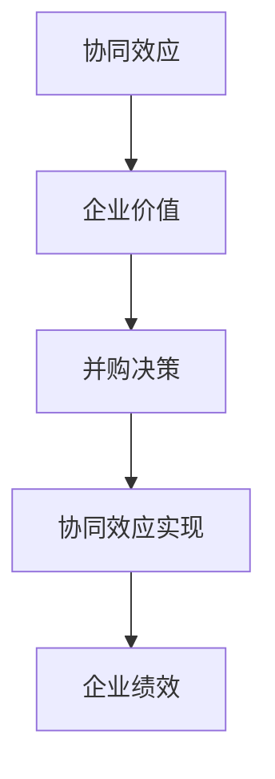
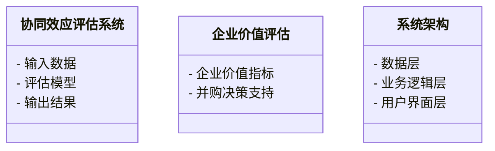
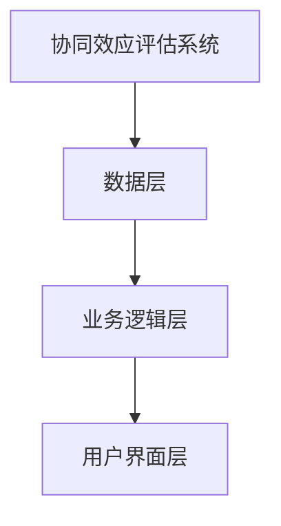
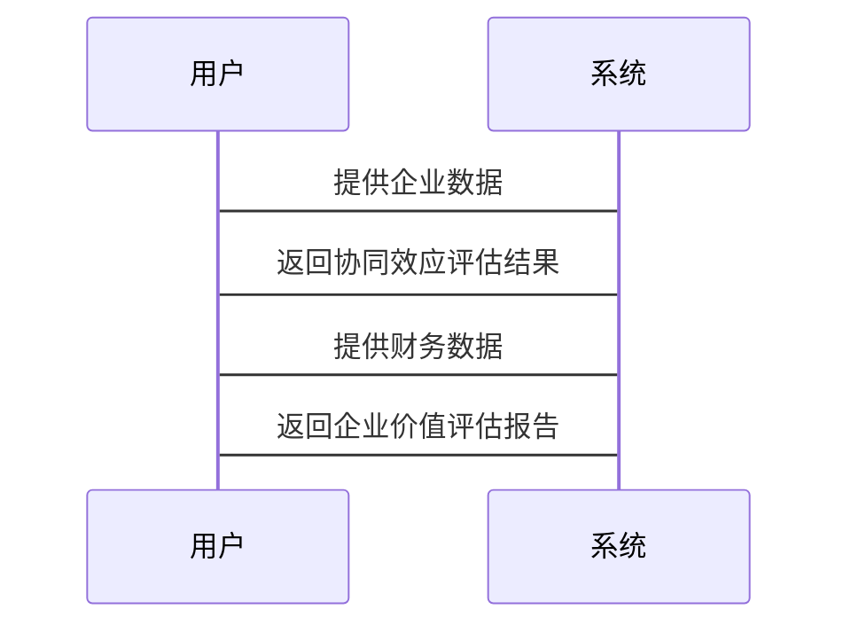

                 

<think>
好的，我现在要帮用户撰写一篇关于彼得林奇对公司并购协同效应评估的技术博客文章。首先，我需要理解用户的需求。

用户希望文章结构清晰，逻辑严密，使用技术性的语言，同时涵盖背景介绍、核心概念、算法原理、系统架构和项目实战等内容。这看起来像是一个技术性的深度分析文章，适合专业人士阅读。

我首先想到，文章需要有一个吸引人的标题，然后是关键词和摘要，这部分我需要先完成。接下来是目录结构，用户已经提供了示例，我需要按照类似的逻辑来组织内容。

在开始撰写之前，我需要确保每个章节都有足够的细节，并且包含用户要求的图表和公式。例如，第二章需要有属性对比表和ER实体关系图，第三章需要数学模型和算法流程图，以及代码示例。

我还需要考虑用户可能没有明确提到的需求，比如如何将协同效应与企业价值联系起来，或者如何实际应用这些模型。因此，在案例分析和项目实战部分，我应该选择具体的例子，比如A公司并购B公司，并详细分析协同效应的实现过程。

最后，我需要确保文章结尾有总结和扩展阅读的部分，帮助读者巩固所学知识，并引导他们进一步学习。同时，作者信息部分也要准确无误。

总的来说，我需要一步步地按照用户的要求，从背景到理论，再到实际应用，构建一个全面且详细的分析框架，确保文章内容丰富，逻辑严谨。
</think>

# 彼得林奇对公司并购协同效应的评估

> 关键词：彼得林奇，公司并购，协同效应，协同效应评估，企业价值，并购决策，协同效应实现

> 摘要：本文从彼得林奇的视角出发，深入探讨公司并购中的协同效应评估问题。通过分析协同效应的定义、类型、实现机制以及数学模型，结合实际案例和系统架构，系统地阐述了协同效应评估的核心概念、算法原理和实践应用。文章最后通过一个实战项目，详细讲解了协同效应的评估方法和实现过程，为读者提供了全面的理论和实践指导。

---

## 第1章: 公司并购协同效应的背景与问题背景

### 1.1 公司并购协同效应的定义与核心概念

协同效应是指在公司并购后，由于资源优化配置、业务整合或成本节约等因素，使得整体价值超过并购前两家企业价值之和的现象。它是公司并购成功的关键因素之一，也是企业战略决策的重要依据。

协同效应的核心要素包括：
1. **资源优化配置**：通过整合双方资源，避免重复投资，降低单位成本。
2. **业务协同**：通过业务流程优化、产品线互补等方式，提升整体业务效率。
3. **组织协同**：通过组织结构优化、管理流程整合，提升组织运作效率。

协同效应的边界与外延：
- **边界**：协同效应的实现范围通常限于并购双方企业内部，不涉及外部市场。
- **外延**：协同效应不仅体现在财务指标上，还包括战略目标的实现、组织文化的融合等多个方面。

### 1.2 公司并购中的协同效应问题背景

公司并购的动机与目标：
1. **市场扩展**：通过并购进入新市场或新领域。
2. **成本节约**：通过规模效应降低生产成本或管理成本。
3. **技术互补**：通过并购获取关键技术或专利。

协同效应在并购中的重要性：
- 协同效应是并购成功的重要标志，也是并购溢价的重要来源。
- 协同效应的实现能够显著提升企业价值，为股东创造超额收益。

协同效应未实现的常见问题：
1. **整合困难**：组织文化差异、管理风格不兼容导致整合失败。
2. **信息不对称**：并购双方对协同效应的预期不一致，导致整合过程中出现问题。
3. **外部环境影响**：宏观经济波动、行业竞争加剧等外部因素影响协同效应的实现。

### 1.3 协同效应的类型与分类

协同效应的类型：
1. **战略协同效应**：通过并购实现战略目标，如市场扩展、技术互补等。
2. **运营协同效应**：通过业务流程优化、资源共享等方式实现成本节约和效率提升。
3. **财务协同效应**：通过合并财务报表、优化资本结构等方式实现价值提升。

### 1.4 协同效应的实现机制

协同效应的实现机制：
1. **资源共享机制**：通过共享研发、生产、销售等资源，降低单位成本。
2. **业务整合机制**：通过优化业务流程、整合产品线，提升整体业务效率。
3. **组织协调机制**：通过组织结构优化、管理流程整合，提升组织运作效率。

---

## 第2章: 协同效应的核心概念与联系

### 2.1 协同效应的核心原理

协同效应的数学模型：
$$协同效应 = \frac{EVA_{合并后} - EVA_{合并前}}{EVA_{合并前}}$$

其中，EVA（经济价值增加值）是衡量企业价值的重要指标，协同效应通过EVA的增加来体现。

协同效应的驱动因素：
1. **资源优化**：通过资源共享降低单位成本。
2. **业务协同**：通过业务流程优化提升效率。
3. **组织协调**：通过组织结构优化提升管理效率。

协同效应的度量方法：
- **定量分析**：通过财务指标（如成本节约、收入增加）量化协同效应。
- **定性分析**：通过战略目标实现、组织文化融合等定性因素评估协同效应。

### 2.2 协同效应与企业价值的关系

协同效应对企业价值的影响：
- 协同效应能够显著提升企业价值，主要体现在以下几个方面：
  1. **提升净利润**：通过成本节约和收入增加提升净利润。
  2. **降低资本成本**：通过优化资本结构降低资本成本。
  3. **提升企业估值**：协同效应的实现能够提升企业的市场估值。

协同效应的量化与企业估值：
- 协同效应的量化通常通过财务指标（如EVA、净现值）来衡量。
- 企业估值可以通过协同效应的实现情况和市场可比公司进行比较。

### 2.3 协同效应的属性特征对比表格

| 属性 | 协同效应 | 企业价值 | 并购决策 |
|------|---------|----------|----------|
| 核心目标 | 提升效率 | 增加股东价值 | 实现战略目标 |
| 主要驱动 | 资源共享 | 股东利益 | 战略协同 |
| 表现形式 | 经营效率提升 | 股价上涨 | 战略整合 |
| 关键因素 | 协调机制 | 估值模型 | 资源整合 |

### 2.4 协同效应的ER实体关系图



### 2.5 本章小结

---

## 第3章: 协同效应的算法原理与数学模型

### 3.1 协同效应的算法原理

协同效应的预测模型：
- **线性回归模型**：通过历史数据预测协同效应的实现程度。
- **神经网络模型**：通过深度学习方法预测协同效应。

协同效应的评估方法：
- **定性评估**：通过专家判断、战略分析等方式评估协同效应。
- **定量评估**：通过财务指标（如EVA、净现值）量化协同效应。

### 3.2 协同效应的数学模型

协同效应的计算公式：
$$协同效应 = \frac{EVA_{合并后} - EVA_{合并前}}{EVA_{合并前}}$$

协同效应的优化算法：
1. **线性回归算法**：用于预测协同效应的实现程度。
2. **神经网络算法**：用于复杂场景下的协同效应预测。

### 3.3 协同效应的实现代码

以下是一个协同效应评估的简单Python代码示例：

```python
def calculate_synergy(eva_before, eva_after):
    return (eva_after - eva_before) / eva_before

# 示例数据
eva_before = 100
eva_after = 150

synergy = calculate_synergy(eva_before, eva_after)
print(f"协同效应为：{synergy}")
```

### 3.4 本章小结

---

## 第4章: 协同效应的系统分析与架构设计

### 4.1 系统功能设计

领域模型类图：



系统架构设计：



### 4.2 系统接口设计

协同效应评估系统的接口设计：

- **输入接口**：接收并购双方的企业数据、财务数据。
- **输出接口**：输出协同效应评估结果、企业价值评估报告。

### 4.3 系统交互设计

协同效应评估系统的交互流程：



---

## 第5章: 协同效应的项目实战

### 5.1 项目环境与数据准备

环境安装：
- 安装Python和相关库（如pandas、numpy）。

### 5.2 系统核心实现

协同效应评估的Python代码实现：

```python
import pandas as pd

def calculate_synergy(eva_before, eva_after):
    return (eva_after - eva_before) / eva_before

# 示例数据
data = {
    '公司A': [100, 200, 150],
    '公司B': [150, 250, 200]
}

df = pd.DataFrame(data)

# 计算协同效应
synergy = []
for i in range(len(df)):
    synergy.append(calculate_synergy(df['公司A'][i], df['公司B'][i]))

print("协同效应为：", synergy)
```

### 5.3 实际案例分析

以A公司并购B公司为例，分析协同效应的实现过程：

1. **数据收集**：收集并购双方的财务数据、业务数据。
2. **协同效应计算**：使用上述公式计算协同效应。
3. **协同效应实现**：通过整合双方资源、优化业务流程实现协同效应。

### 5.4 项目小结

---

## 第6章: 总结与扩展阅读

### 6.1 总结

本文从彼得林奇的视角出发，系统地探讨了公司并购中的协同效应评估问题。通过分析协同效应的定义、类型、实现机制以及数学模型，结合实际案例和系统架构，系统地阐述了协同效应评估的核心概念、算法原理和实践应用。

### 6.2 小结

- 协同效应是公司并购成功的关键因素之一。
- 协同效应的实现需要从资源优化、业务整合和组织协调三个方面入手。
- 协同效应的评估需要结合定性分析和定量分析，确保评估结果的准确性和可靠性。

### 6.3 注意事项

- 协同效应的实现需要充分考虑并购双方的企业文化和组织结构差异。
- 协同效应的评估需要结合实际业务场景，避免过于依赖数学模型。

### 6.4 拓展阅读

推荐阅读彼得林奇的《投资之道》和《彼得林奇的成功投资》等书籍，深入了解他在投资和并购方面的深刻见解。

---

## 作者：AI天才研究院/AI Genius Institute & 禅与计算机程序设计艺术 /Zen And The Art of Computer Programming

