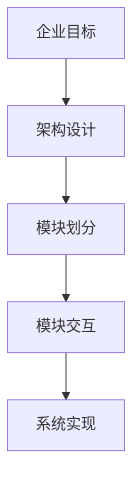

                 

# 彼得林奇对公司扩张策略的看法

## 关键词：彼得·林奇、公司扩张、投资策略、风险管理、企业架构

## 摘要：本文从彼得·林奇的投资理念出发，详细分析了公司扩张的动机、策略类型、实施框架及风险管理。通过数学建模和系统架构设计，深入探讨了扩张策略的可行性与潜在风险，并结合实际案例，为现代企业制定扩张策略提供了有价值的参考。

---

## 第1章: 彼得·林奇与投资策略概述

### 1.1 彼得·林奇的生平与投资理念

#### 1.1.1 彼得·林奇的生平简介
彼得·林奇是美国著名投资家，以其在富达投资管理公司（Fidelity）的卓越表现闻名。他主张长期投资和价值投资，强调深入分析企业的基本面。

#### 1.1.2 林奇的投资哲学与风格
林奇的投资策略注重企业成长性和管理能力，主张寻找具有持续竞争优势的企业。他强调分散投资和风险控制。

#### 1.1.3 林奇对市场的独特见解
林奇认为市场波动是投资机会的来源，而非企业扩张的主要驱动力。他更关注企业的内在价值和长期发展潜力。

### 1.2 公司扩张的背景与重要性

#### 1.2.1 公司扩张的定义与核心概念
公司扩张指企业通过内部增长或外部并购等方式，扩大业务规模、市场份额或地理覆盖范围。

#### 1.2.2 扩张策略在企业成长中的作用
扩张是企业实现增长的重要手段，有助于提高市场占有率和利润率。

#### 1.2.3 林奇视角下的扩张策略特点
林奇认为扩张应基于企业的核心竞争力，避免盲目扩张和过度杠杆。

---

## 第2章: 公司扩张的动机与风险

### 2.1 扩张的内在动机

#### 2.1.1 增长驱动因素分析
企业扩张的内在动机包括市场需求、技术进步和管理能力提升。

#### 2.1.2 林奇对增长的评价标准
林奇认为，企业扩张应基于真实的市场需求和可持续的竞争优势。

#### 2.1.3 不同行业扩张的动机差异
不同行业的扩张动机差异显著，例如科技行业更关注技术创新，而制造业更关注成本控制。

### 2.2 扩张的外部驱动因素

#### 2.2.1 市场需求与竞争压力
市场需求增长和竞争压力是推动企业扩张的主要外部因素。

#### 2.2.2 行业趋势与政策环境
行业趋势和技术进步推动企业扩张，政策环境则为企业提供外部支持。

#### 2.2.3 资源获取与合作伙伴关系
企业通过并购或战略联盟获取资源和合作伙伴，降低扩张风险。

### 2.3 扩张的风险与挑战

#### 2.3.1 市场风险与竞争风险
市场波动和竞争加剧可能导致企业扩张失败。

#### 2.3.2 财务风险与运营风险
过度杠杆和管理不善可能导致财务危机和运营问题。

#### 2.3.3 文化整合与管理挑战
跨国并购可能面临文化冲突和管理整合难题。

---

## 第3章: 林奇视角下的扩张策略类型

### 3.1 内部扩张策略

#### 3.1.1 产品线扩展与市场渗透
企业通过现有产品的市场扩展实现增长。

#### 3.1.2 并购与整合
并购是快速扩张的有效手段，但需要谨慎选择目标和整合策略。

#### 3.1.3 内部创新与研发驱动
企业通过技术创新和研发能力提升实现扩张。

### 3.2 外部扩张策略

#### 3.2.1 战略联盟与合作伙伴关系
通过战略联盟和合作伙伴关系，企业可以快速进入新市场。

#### 3.2.2 跨界扩张与多元化发展
企业通过多元化战略进入新领域，分散风险。

#### 3.2.3 国际化与全球化战略
国际化扩张是企业全球化的关键步骤，但需应对文化差异和政策风险。

### 3.3 综合扩张策略

#### 3.3.1 内部与外部扩张的结合
综合运用内部和外部扩张策略，实现可持续增长。

#### 3.3.2 多元化与专业化平衡
企业在多元化和专业化之间寻求平衡，避免资源分散。

#### 3.3.3 阶段性扩张策略的制定
根据企业生命周期制定阶段性扩张策略，确保稳健增长。

---

## 第4章: 林奇的扩张策略实施框架

### 4.1 扩张策略的实施步骤

#### 4.1.1 目标设定与战略规划
明确扩张目标，制定详细的战略规划。

#### 4.1.2 资源分配与组织结构调整
根据扩张需求调整组织结构和资源配置。

#### 4.1.3 风险管理与监控机制
建立风险管理机制，实时监控扩张过程中的风险。

### 4.2 林奇的扩张策略评价标准

#### 4.2.1 估值分析与投资回报
通过估值分析和投资回报率评估扩张项目的可行性。

#### 4.2.2 竞争优势与护城河
企业应具备独特竞争优势，形成护城河。

#### 4.2.3 管理团队与企业治理
管理团队能力和企业治理结构是扩张成功的关键因素。

---

## 第5章: 林奇的扩张策略与企业架构设计

### 5.1 企业架构的系统分析

#### 5.1.1 企业目标与架构的关系
企业架构需与扩张目标一致，支持业务增长。

#### 5.1.2 架构设计的模块划分
系统架构设计需明确各模块功能和交互关系。

#### 5.1.3 模块间的交互关系
模块之间的交互需清晰，确保系统整体协调运行。

### 5.2 架构设计的Mermaid图

### 5.3 系统接口与交互设计

#### 5.3.1 系统功能设计
系统功能需模块化设计，明确各模块功能和接口。

#### 5.3.2 系统架构设计
系统架构需具备扩展性和可维护性，支持企业扩张需求。

#### 5.3.3 系统交互设计
系统交互需简洁直观，提升用户体验。

---

## 第6章: 林奇的扩张策略与风险管理

### 6.1 风险管理的核心要素

#### 6.1.1 风险识别与评估
通过SWOT分析和风险矩阵识别和评估风险。

#### 6.1.2 风险应对策略
制定风险应对策略，包括规避、减轻、转移和接受。

#### 6.1.3 风险监控与报告
建立风险监控机制，定期报告风险状态。

### 6.2 风险管理的数学模型

#### 6.2.1 风险评估模型
$$风险值 = \sum (概率_i \times 影响_i)$$

#### 6.2.2 投资回报率模型
$$ROI = \frac{净收益}{投资成本} \times 100\%$$

### 6.3 风险管理的案例分析

#### 6.3.1 某公司扩张案例的风险管理
通过SWOT分析和风险矩阵评估风险，制定应对策略。

#### 6.3.2 风险管理的实施效果
定期评估风险管理效果，调整策略以应对变化。

---

## 结论

彼得·林奇的投资理念为企业扩张提供了重要的指导。本文从动机、策略类型、实施框架和风险管理四个方面，全面分析了林奇的扩张策略，并通过数学建模和系统架构设计，探讨了扩张策略的可行性与潜在风险。结合实际案例，本文为现代企业制定扩张策略提供了有价值的参考。

---

## 注意事项

1. **避免盲目扩张**：企业应基于自身核心竞争力制定扩张策略，避免盲目跟风。
2. **重视风险管理**：在扩张过程中，企业需识别潜在风险，并制定有效的应对策略。
3. **关注长期价值**：林奇强调长期投资和价值投资，企业应注重可持续发展。

## 参考文献

1. 彼得·林奇《彼得·林奇的投资哲学》
2. Michael Porter《竞争优势》
3. SWOT分析方法
4. 风险管理框架

---

## 作者

作者：AI天才研究院/AI Genius Institute & 禅与计算机程序设计艺术/Zen And The Art of Computer Programming

--- 

希望这篇文章能够为您提供有价值的信息和启发！

