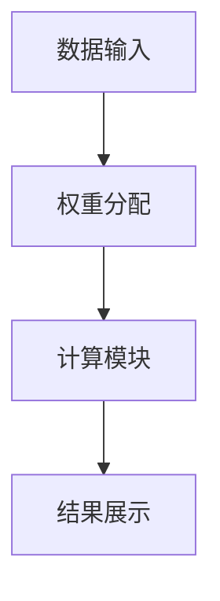

                 


# 彼得林奇对公司技术优势的评估方法

> 关键词：彼得·林奇，技术优势评估，投资方法，技术分析，企业评估

> 摘要：本文详细探讨了彼得·林奇在评估公司技术优势方面的方法和策略。通过分析其独特的评估框架、数学模型和系统架构，本文为读者提供了如何在实际投资中应用这些方法的深刻见解。文章从背景介绍、核心方法论、算法原理、系统设计到项目实战和最佳实践，全面解析了彼得·林奇的技术优势评估体系。

---

## 第1章: 技术优势评估的重要性与彼得·林奇的背景

### 1.1 技术优势的定义与重要性

技术优势是指公司在技术研发、产品创新和竞争优势方面所具备的独特能力。在现代商业环境中，技术优势是企业长期发展的核心驱动力。通过评估技术优势，投资者可以识别出那些具备持续创新能力的企业，从而做出更明智的投资决策。

#### 1.1.1 技术优势的定义
技术优势不仅包括企业的技术储备和研发能力，还包括其技术在市场中的应用价值和竞争优势。它是企业在市场中立于不败之地的关键因素。

#### 1.1.2 技术优势评估的重要性
- 技术优势评估能够帮助投资者识别出具备长期增长潜力的企业。
- 通过评估技术优势，投资者可以避免投资于技术落后或创新能力不足的企业。
- 技术优势是企业抵御竞争和市场变化的重要保障。

#### 1.1.3 技术优势在企业竞争中的作用
技术优势能够提升企业的市场地位，增强其产品竞争力，并为企业创造更高的利润率。在技术驱动的行业中，技术优势更是决定企业成败的关键因素。

### 1.2 彼得·林奇的背景与投资理念

#### 1.2.1 彼得·林奇的生平简介
彼得·林奇（Peter Lynch）是美国著名的投资家和基金经理，曾管理富达麦哲伦基金（Fidelity Magellan Fund），取得了令人瞩目的投资业绩。他的投资哲学强调长期持有优质股票，并通过深入研究和分析来选择投资标的。

#### 1.2.2 彼得·林奇的投资哲学
林奇的投资理念强调“深入研究、长期持有”。他认为，成功的投资需要对公司的基本面有深刻的理解，包括公司的财务状况、管理团队、市场地位和技术优势。

#### 1.2.3 技术优势在林奇投资策略中的地位
在林奇的投资策略中，技术优势是评估公司潜力的重要指标之一。他特别关注那些具备持续创新能力和技术领先优势的公司，认为这些公司在未来市场中更具竞争优势。

---

## 第2章: 技术优势评估的核心方法论

### 2.1 技术优势评估的基本框架

#### 2.1.1 评估维度的划分
技术优势评估可以从以下几个维度进行分析：
- 技术创新性：公司是否具备创新的技术或产品。
- 技术可行性：技术是否能够在实际应用中实现。
- 技术经济性：技术是否具备成本优势和经济效益。
- 技术可持续性：技术是否能够长期维持竞争优势。

#### 2.1.2 评估指标的选择
评估指标的选择需要结合行业特点和公司实际情况。常见的评估指标包括：
- 研发投入占比
- 技术专利数量
- 技术应用前景
- 技术团队能力

#### 2.1.3 评估模型的构建
评估模型的构建需要将各个评估维度和指标进行量化，并通过权重分配和综合评分来得出最终的技术优势评分。

### 2.2 彼得·林奇技术优势评估方法的独特性

#### 2.2.1 方法的核心思想
林奇的方法强调对公司的技术优势进行深入分析，并结合公司的财务状况、管理团队和市场地位等多方面因素，综合评估公司的投资价值。

#### 2.2.2 方法与传统评估方法的对比
与传统评估方法相比，林奇的方法更加注重技术优势的动态变化和公司的长期发展潜力。他强调对公司的技术优势进行持续跟踪和评估，而非仅仅依赖于静态的财务指标。

#### 2.2.3 方法的适用场景与局限性
林奇的方法适用于技术驱动型行业和具备持续创新能力的企业。然而，对于技术相对稳定的行业或企业，该方法可能需要结合其他评估因素进行调整。

---

## 第3章: 技术优势评估的维度与权重分配

### 3.1 评估维度的分类

#### 3.1.1 技术创新性
技术创新性是指公司在技术研发和产品创新方面的表现。具备创新能力的公司能够在市场上推出更具竞争力的产品，从而获得更大的市场份额。

#### 3.1.2 技术可行性
技术可行性是指公司技术的实际应用价值和实现难度。具备可行性的技术能够在实际生产中发挥效用，为公司创造实际收益。

#### 3.1.3 技术经济性
技术经济性是指技术的经济效益和成本优势。具备经济性的技术能够在降低成本的同时提高产品附加值，从而增强公司的盈利能力。

#### 3.1.4 技术可持续性
技术可持续性是指技术的长期竞争优势和适应能力。具备可持续性的技术能够帮助公司在未来市场中保持竞争优势。

### 3.2 各维度的权重分配方法

#### 3.2.1 权重分配的数学模型
权重分配可以通过加权平均的方法进行计算，公式如下：
$$ \text{技术优势评分} = \sum_{i=1}^{n} w_i \cdot x_i $$
其中，$w_i$ 是第 $i$ 个维度的权重，$x_i$ 是第 $i$ 个维度的评分。

#### 3.2.2 权重分配的步骤与流程
1. 确定评估维度和指标。
2. 根据各维度的重要性分配权重。
3. 对各维度进行评分。
4. 计算综合评分。

#### 3.2.3 权重分配的案例分析
假设某公司技术优势评估的权重分配如下：
- 技术创新性：40%
- 技术可行性：30%
- 技术经济性：20%
- 技术可持续性：10%

---

## 第4章: 彼得·林奇技术优势评估模型的数学原理

### 4.1 评估模型的构建

#### 4.1.1 模型的输入变量
- 技术创新性评分
- 技术可行性评分
- 技术经济性评分
- 技术可持续性评分

#### 4.1.2 模型的输出结果
- 技术优势综合评分
- 技术优势排名

#### 4.1.3 模型的数学表达式
$$ \text{技术优势评分} = w_1 \cdot x_1 + w_2 \cdot x_2 + w_3 \cdot x_3 + w_4 \cdot x_4 $$

### 4.2 模型的实现步骤

#### 4.2.1 数据收集与预处理
收集公司的技术优势相关数据，包括技术创新性、技术可行性、技术经济性和技术可持续性等方面的指标。

#### 4.2.2 权重分配与评分计算
根据权重分配公式，对各维度进行评分，并计算综合评分。

#### 4.2.3 结果分析与优化
对评估结果进行分析，识别出具备技术优势的公司，并根据实际情况进行结果优化。

---

## 第5章: 技术优势评估的系统架构与实现

### 5.1 评估系统的功能模块

#### 5.1.1 数据输入模块
用于输入公司的技术优势相关数据。

#### 5.1.2 权重分配模块
用于对各评估维度分配权重。

#### 5.1.3 计算模块
用于计算技术优势综合评分。

#### 5.1.4 结果展示模块
用于展示评估结果。

### 5.2 系统的架构设计

#### 5.2.1 系统整体架构图


---

## 第6章: 项目实战与案例分析

### 6.1 项目环境安装

#### 6.1.1 安装Python环境
使用Anaconda或PyCharm等工具安装Python环境。

#### 6.1.2 安装必要的库
安装numpy和pandas库：
```bash
pip install numpy pandas
```

### 6.2 系统核心实现源代码

#### 6.2.1 技术优势评估模型的实现
```python
import pandas as pd
import numpy as np

# 定义权重
weights = {'技术创新性': 0.4, '技术可行性': 0.3, '技术经济性': 0.2, '技术可持续性': 0.1}

# 定义评分函数
def calculate_technical_advantage(company_data, weights):
    return np.sum([weights[dim] * company_data[dim] for dim in weights.keys()])

# 示例数据
data = {
    '技术创新性': [0.8],
    '技术可行性': [0.7],
    '技术经济性': [0.6],
    '技术可持续性': [0.5]
}

df = pd.DataFrame(data)
result = calculate_technical_advantage(df.iloc[0], weights)
print(f"技术优势评分: {result}")
```

#### 6.2.2 代码应用解读与分析
上述代码通过定义权重和评分函数，计算公司的技术优势评分。评分结果可以帮助投资者判断公司的技术优势。

### 6.3 实际案例分析

#### 6.3.1 案例介绍
以某科技公司为例，评估其技术优势。

#### 6.3.2 评估结果分析
根据评分结果，判断该公司的技术优势及其在市场中的竞争力。

#### 6.3.3 项目小结
总结项目实施过程中的经验教训，提出改进建议。

---

## 第7章: 最佳实践与小结

### 7.1 技术优势评估的最佳实践

#### 7.1.1 小结
总结彼得·林奇技术优势评估方法的核心思想和实际应用。

#### 7.1.2 注意事项
在实际应用中，需要注意权重分配的合理性、数据的准确性和评估结果的动态调整。

#### 7.1.3 拓展阅读
推荐相关书籍和文献，供读者深入学习。

### 7.2 作者总结

彼得·林奇的技术优势评估方法为我们提供了一种全新的视角，帮助投资者更好地识别具备技术优势的企业。通过本文的分析和实践，我们能够更深入地理解该方法的精髓，并将其应用于实际投资中。

---

## 作者：AI天才研究院/AI Genius Institute & 禅与计算机程序设计艺术 /Zen And The Art of Computer Programming

