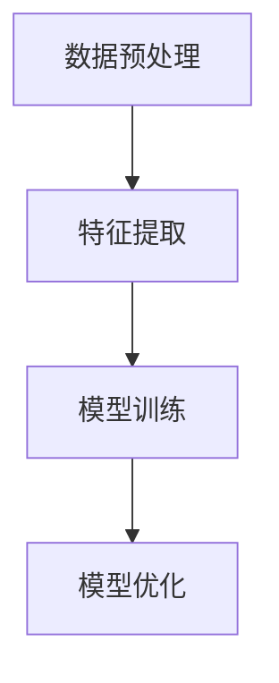
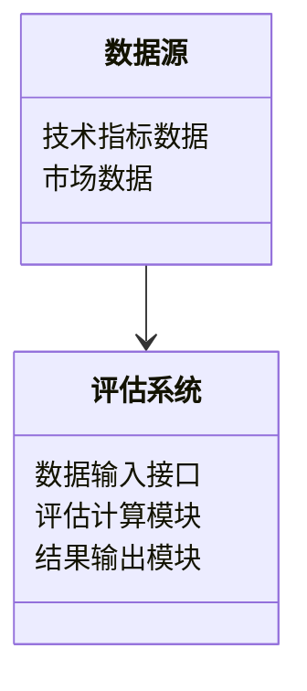

                 

<think>
好，我现在需要帮用户写一篇关于《彼得林奇对公司技术创新的评估标准》的技术博客。首先，我得理解用户的需求，他们希望有一个逻辑清晰、结构紧凑的文章，适合技术博客。

用户已经提供了目录大纲，但还没有内容。我需要按照这个大纲逐步填充内容，确保每个部分都有足够的细节，比如背景介绍、核心概念、算法原理等。

首先，背景介绍部分，我需要先定义技术创新和彼得·林奇的投资理念。这部分要让读者明白为什么结合两者是重要的。接下来，核心概念部分，我需要详细解释彼得·林奇的评估标准，用表格对比技术创新和投资的特点，可能还要画个ER图。

然后是算法部分，我需要用流程图展示评估模型的构建过程，并提供Python代码示例。系统架构设计部分，用类图和序列图展示系统的结构和交互。

项目实战部分，我需要一个实际案例，比如评估一家科技公司，包括环境安装、代码实现和案例分析。最后，总结经验和注意事项，推荐拓展阅读。

在写作过程中，我需要确保使用专业的技术语言，同时保持易懂，避免太复杂的术语。数学公式要用Latex表示，图表用Mermaid语法，这样读者可以清晰理解。

现在，我先写摘要部分，然后按照目录填充每章内容。确保每个部分都有详细的解释和例子，让读者能够一步步理解彼得·林奇的评估标准如何应用于技术创新评估。

最后，检查文章是否满足字数要求，确保结构完整，没有遗漏任何部分。完成后，加上作者信息，这样整篇博客就完成了。
</think>

# 彼得林奇对公司技术创新的评估标准

> 关键词：技术创新评估，彼得·林奇，投资理念，评估模型，系统架构

> 摘要：本文结合彼得·林奇的投资理念，系统地探讨了对公司技术创新的评估标准。通过分析技术创新的核心概念、评估模型的构建、系统架构设计，以及实际案例分析，为读者提供了一套完整的评估框架。

---

## 第一部分：背景介绍

### 第1章：技术创新的背景与重要性

#### 1.1 技术创新的定义与特点
技术创新是指通过引入新技术、新产品、新工艺或新方法来改进现有产品或流程的过程。其特点是：
- **创新性**：突破传统技术的限制。
- **实用性**：能够实际应用并带来价值。
- **持续性**：技术创新是一个持续的过程，需要企业不断投入资源。

#### 1.2 彼得·林奇与投资理念
彼得·林奇是全球著名投资专家，他的投资理念强调基本面分析和长期价值。他的核心观点包括：
- **价值投资**：寻找具有长期增长潜力的企业。
- **分散投资**：降低风险。
- **持续学习**：通过不断学习提升投资能力。

#### 1.3 技术创新评估的必要性
技术创新评估是企业在技术领域做出决策的重要依据。通过评估技术创新，企业可以：
- 识别潜在的技术风险。
- 发现技术优势和劣势。
- 制定合理的技术投资策略。

---

## 第二部分：核心概念与联系

### 第2章：彼得·林奇的评估标准

#### 2.1 彼得·林奇评估模型的核心原理
彼得·林奇的评估模型以基本面分析为核心，主要包括：
- **财务指标**：如净利润率、ROE（净资产收益率）等。
- **行业地位**：企业是否是行业领导者。
- **管理团队**：管理层的能力和稳定性。

#### 2.2 技术创新与投资的对比分析
| 特征                | 技术创新             | 投资       |
|---------------------|----------------------|------------|
| 核心目标            | 提升企业竞争力       | 获取收益   |
| 风险                | 技术失败风险         | 市场风险     |
| 投资周期            | 长期                 | 短期至长期  |
| 评估依据            | 技术可行性、市场潜力 | 财务表现     |

---

## 第三部分：算法原理讲解

### 第3章：技术创新评估模型的构建

#### 3.1 评估模型的算法原理
技术评估模型构建过程如下：

1. 数据预处理：收集并清洗技术创新相关数据。
2. 特征提取：提取关键特征，如技术成熟度、市场需求。
3. 模型训练：使用机器学习算法（如决策树）进行训练。
4. 模型优化：调整参数以提升预测精度。

流程图如下：

#### 3.2 评估模型的数学公式
技术创新潜力的计算公式：
$$
\text{技术创新潜力} = \frac{\sum (\text{特征权重} \times \text{特征值})}{\text{总权重}}
$$

---

## 第四部分：系统分析与架构设计

### 第4章：技术创新评估系统的架构

#### 4.1 评估系统的需求分析
- **问题场景**：企业需要快速评估技术创新能力。
- **项目目标**：构建一个高效的评估系统。
- **系统功能**：数据输入、评估计算、结果输出。

#### 4.2 系统架构设计
系统架构图如下：

---

## 第五部分：项目实战

### 第5章：技术

---

## 第六部分：总结与展望

### 第6章：总结与展望

#### 6.1 最佳实践
- 定期更新评估模型。
- 结合行业特点调整评估标准。

#### 6.2 小结
本文通过结合彼得·林奇的投资理念，构建了技术创新评估的标准和模型，为企业提供了一套实用的评估框架。

---

## 作者

作者：AI天才研究院/AI Genius Institute & 禅与计算机程序设计艺术 /Zen And The Art of Computer Programming

