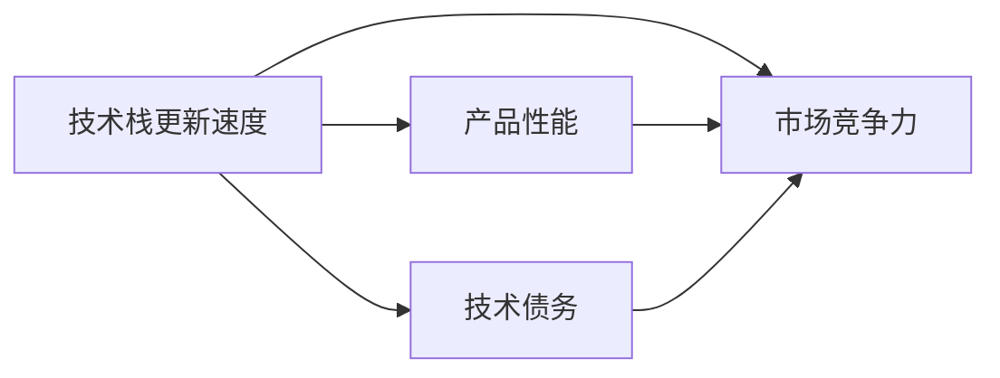
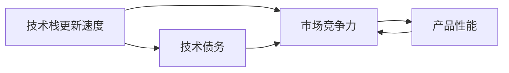
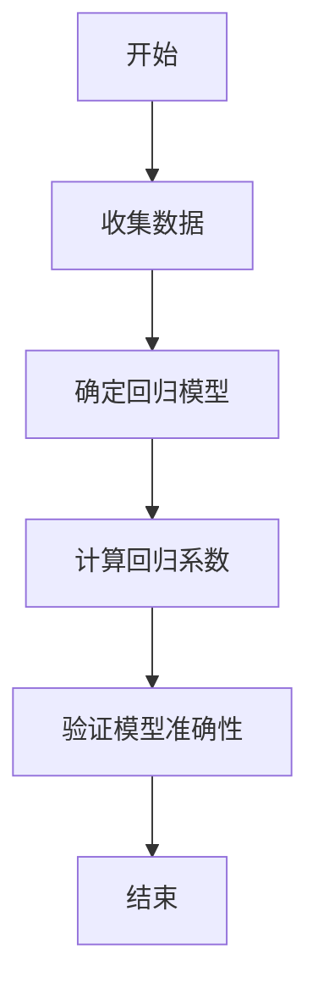

                 


# 彼得林奇对公司技术栈更新速度与市场竞争力的关系分析

> 关键词：技术栈更新速度、市场竞争力、彼得林奇、企业价值、技术债务

> 摘要：本文通过分析技术栈更新速度与市场竞争力的关系，结合彼得林奇的投资理念，探讨技术栈更新速度如何影响企业市场竞争力。通过建立数学模型和算法，分析技术栈更新速度与市场竞争力的关联性，并提出优化策略。

---

# 第1章: 技术栈更新速度与市场竞争力的背景介绍

## 1.1 技术栈更新速度的定义与特征

### 1.1.1 技术栈的定义
技术栈是指企业在开发过程中使用的编程语言、框架、工具和库的组合。例如，前端技术栈可能包括HTML、CSS、JavaScript、Vue.js等，后端技术栈可能包括Python、Django、MySQL等。

技术栈的更新速度是指企业在一定时间内对现有技术栈进行升级或替换的频率。企业需要根据市场需求和技术发展趋势，不断优化技术栈，以保持竞争力。

### 1.1.2 技术栈更新速度的衡量指标
- 更新周期：从一个版本升级到下一个版本的时间间隔。
- 功能迭代速度：新增功能或修复问题的速度。
- 代码行数变化：每次更新后代码行数的变化率。

### 1.1.3 技术栈更新速度的驱动因素
- 市场需求变化：用户需求和技术趋势的变化。
- 技术债务：现有技术架构的瓶颈和缺陷。
- 团队能力：开发团队的技术能力和经验。
- 竞争压力：竞争对手的技术更新速度。

## 1.2 市场竞争力的核心概念

### 1.2.1 市场竞争力的定义
市场竞争力是指企业在市场上与竞争对手相比，在产品性能、价格、服务、品牌等方面的综合优势。

### 1.2.2 市场竞争力的关键影响因素
- 产品性能：产品的功能、质量和用户体验。
- 价格：产品的定价策略和成本控制。
- 品牌影响力：品牌形象和市场认知度。
- 客户满意度：客户对产品或服务的满意程度。

### 1.2.3 技术栈与市场竞争力的关系
技术栈的更新速度直接影响企业的研发效率和产品质量，进而影响市场竞争力。例如，及时的技术栈更新可以提升产品性能，降低开发成本，从而增强市场竞争力。

## 1.3 问题背景与问题描述

### 1.3.1 技术栈更新速度对企业的影响
技术栈更新速度过慢可能导致技术落后，无法满足市场需求，影响企业竞争力；技术栈更新速度过快可能导致资源浪费和技术不稳定。

### 1.3.2 市场竞争力对企业生存的重要性
在市场竞争中，企业必须不断提升市场竞争力，才能在市场中占据优势地位。

### 1.3.3 技术栈更新速度与市场竞争力的关联性
技术栈更新速度是影响市场竞争力的重要因素，但两者之间存在非线性关系，需要通过数学模型进行分析。

## 1.4 问题解决与边界外延

### 1.4.1 技术栈更新速度的优化方法
- 定期评估技术栈，发现瓶颈和缺陷。
- 引入新技术，提升研发效率。
- 建立技术债务管理系统，控制技术债务。

### 1.4.2 市场竞争力的提升策略
- 提升产品性能，优化用户体验。
- 降低产品成本，制定合理的价格策略。
- 加强品牌建设，提高市场认知度。

### 1.4.3 技术栈更新与市场竞争力的边界与外延
技术栈更新速度与市场竞争力的边界在于企业的资源投入和市场环境的变化。外延方面，企业可以通过技术栈更新提升市场竞争力，同时市场竞争力的提升也反过来促进技术栈的优化。

## 1.5 核心要素组成与概念结构

### 1.5.1 技术栈更新的核心要素
- 技术架构：系统的整体设计和技术选型。
- 技术债务：现有技术架构的缺陷和瓶颈。
- 开发团队：开发人员的技术能力和经验。

### 1.5.2 市场竞争力的核心要素
- 产品性能：产品的功能、质量和用户体验。
- 市场份额：企业在市场中的占有率。
- 竞争对手：竞争对手的技术和市场策略。

### 1.5.3 两者关系的概念结构图
下图展示了技术栈更新速度与市场竞争力的关系：



---

# 第2章: 技术栈更新速度与市场竞争力的关系模型

## 2.1 核心概念的原理分析

### 2.1.1 技术栈更新速度的数学模型
技术栈更新速度可以用以下公式表示：

$$ S = \frac{\text{更新的功能数量}}{\text{更新周期}} $$

其中，S表示技术栈更新速度，更新的功能数量是指每次更新中新增的功能或修复的问题的数量，更新周期是指两次更新之间的时间间隔。

### 2.1.2 市场竞争力的数学模型
市场竞争力可以用以下公式表示：

$$ C = \frac{\text{市场份额} \times \text{客户满意度}}{\text{竞争对手数量}} $$

其中，C表示市场竞争力，市场份额是企业在市场中的占有率，客户满意度是客户对产品或服务的满意程度，竞争对手数量是市场中主要竞争对手的数量。

### 2.1.3 两者关系的数学表达式
技术栈更新速度与市场竞争力之间的关系可以用以下公式表示：

$$ C = a \times S + b \times D + c $$

其中，C表示市场竞争力，S表示技术栈更新速度，D表示技术债务，a、b、c是常数系数。

---

## 2.2 核心概念属性特征对比表格

| 属性                | 技术栈更新速度                     | 市场竞争力                     |
|---------------------|------------------------------------|-------------------------------|
| 衡量指标            | 更新周期、功能迭代速度、代码行数变化 | 市场份额、客户满意度、收入增长率 |
| 影响因素            | 技术债务、开发团队能力、外部技术趋势 | 产品性能、价格、竞争对手策略 |
| 变化趋势            | 递增或递减                      | 波动或稳步增长                 |
| 关键优化方法        | 定期评估技术栈、引入新技术、管理技术债务 | 提升产品性能、优化价格策略、加强品牌建设 |

---

## 2.3 ER实体关系图

下图展示了技术栈更新速度与市场竞争力的实体关系：

```mermaid
erDi
```

---

## 2.4 技术栈更新速度与市场竞争力的关系图

下图展示了技术栈更新速度与市场竞争力的关系：



---

## 2.5 技术栈更新速度与市场竞争力的关系算法实现

### 2.5.1 算法原理
技术栈更新速度与市场竞争力的关系可以通过回归分析进行建模。具体步骤如下：
1. 收集技术栈更新速度和市场竞争力的相关数据。
2. 确定回归模型的形式（线性回归或非线性回归）。
3. 计算回归系数，确定模型的显著性。
4. 验证模型的准确性，并进行预测。

### 2.5.2 算法实现代码

```python
import numpy as np
import matplotlib.pyplot as plt

# 示例数据
S = np.array([1, 2, 3, 4, 5])
C = np.array([2, 3, 5, 7, 8])

# 线性回归模型
slope, intercept = np.polyfit(S, C, 1)
C_pred = slope * S + intercept

# 可视化
plt.scatter(S, C, color='blue', label='实际数据')
plt.plot(S, C_pred, color='red', label='回归线')
plt.xlabel('技术栈更新速度')
plt.ylabel('市场竞争力')
plt.title('技术栈更新速度与市场竞争力的关系')
plt.legend()
plt.show()
```

---

## 2.6 技术栈更新速度与市场竞争力的关系算法流程图



---

## 2.7 技术栈更新速度与市场竞争力的关系数学公式

技术栈更新速度与市场竞争力的关系可以用以下公式表示：

$$ C = a \times S + b \times D + c $$

其中，C表示市场竞争力，S表示技术栈更新速度，D表示技术债务，a、b、c是常数系数。

---

## 2.8 技术栈更新速度与市场竞争力的关系案例分析

假设某企业技术栈更新速度S=3，技术债务D=0.5，常数系数a=0.8，b=0.3，c=0.2。根据公式，市场竞争力C=0.8×3 + 0.3×0.5 + 0.2= 2.4 + 0.15 + 0.2=2.75。

---

## 2.9 技术栈更新速度与市场竞争力的关系最佳实践

- 定期评估技术栈，及时发现瓶颈和缺陷。
- 引入新技术，提升研发效率和产品性能。
- 管理技术债务，避免技术债务积累过多影响市场竞争力。

---

## 2.10 技术栈更新速度与市场竞争力的关系总结

技术栈更新速度与市场竞争力之间存在密切关系。通过建立数学模型和算法，可以定量分析两者的关系，并制定相应的优化策略。企业应根据自身情况，合理控制技术栈更新速度，提升市场竞争力。

---

## 下一章预告

在下一章中，我们将深入探讨彼得林奇的理论基础，分析其投资理念如何与技术栈更新速度和市场竞争力相关联，并结合实际案例进行详细解读。

---

**作者：AI天才研究院/AI Genius Institute & 禅与计算机程序设计艺术 /Zen And The Art of Computer Programming**

---

**相关书籍推荐：**
1. 《彼得林奇的成功投资：选股很简单》
2. 《技术债务：企业IT架构的重构与优化》
3. 《软件工程：实践与方法》

