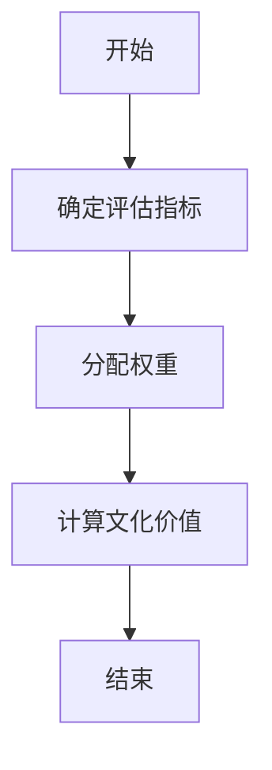

                 

# 彼得·林奇对公司文化的重视程度

## 关键词：彼得·林奇，公司文化，投资策略，评估模型，企业绩效

## 摘要：本文深入探讨了彼得·林奇在其投资生涯中对公司文化的重视程度。通过分析其投资理念、公司文化评估标准以及实际案例，展示了公司文化在投资决策中的关键作用，并提出了可操作的评估模型和方法。

---

# 第1章: 彼得·林奇的生平与投资理念

## 1.1 彼得·林奇的生平简介

### 1.1.1 彼得·林奇的早期经历
彼得·林奇（Peter Lynch）于1942年9月16日出生于美国波士顿。他自小展现出对数字和金融的浓厚兴趣，高中时期就参与股票交易，积累了丰富的实战经验。他的早期经历为他后来的投资生涯奠定了坚实的基础。

### 1.1.2 成为富达投资的传奇基金经理
1970年，彼得·林奇加入富达投资，担任基金经理，管理富达麦哲伦基金（Fidelity Magellan Fund）。在他的领导下，该基金取得了卓越的业绩，年平均回报率高达29%，远超市场平均水平，使他成为投资界的传奇人物。

### 1.1.3 彼得·林奇的投资哲学
彼得·林奇的价值投资理念强调对公司基本面的深入分析，寻找那些具有强大竞争优势和良好管理的公司。他认为，成功的投资不仅依赖于市场趋势，更取决于对公司的深入了解，尤其是公司的文化和管理层的诚信。

---

## 1.2 彼得·林奇的投资理念

### 1.2.1 价值投资的核心思想
彼得·林奇认为，投资的核心是寻找市场低估的公司。他强调，投资者应关注公司的内在价值，而非市场的短期波动。这种价值投资理念使他在长期投资中取得了卓越的成绩。

### 1.2.2 长期投资的重要性
林奇倡导长期投资，认为短期市场波动无法预测，而长期持有优质股票则能带来稳定的收益。他的投资策略鼓励投资者耐心持有优质资产，避免频繁交易带来的成本和风险。

### 1.2.3 公司基本面分析的关键性
林奇的成功离不开他对公司基本面的深入分析。他不仅关注财务数据，如收入、利润和债务，还重视公司的管理团队、产品竞争力和市场地位。他认为，只有全面了解公司，才能做出明智的投资决策。

---

# 第2章: 公司文化的核心要素与评估标准

## 2.1 公司文化的定义与分类

### 2.1.1 公司文化的定义
公司文化是指企业在长期经营中形成的价值观、行为准则和企业氛围。它反映了企业的灵魂和精神，是企业成功的关键因素之一。

### 2.1.2 公司文化的分类
公司文化可以分为以下几种类型：
1. **竞争型文化**：强调竞争和创新，鼓励员工追求卓越。
2. **协作型文化**：重视团队合作，强调员工之间的协作。
3. **客户导向型文化**：以客户为中心，注重客户满意度和需求。
4. **创新型文化**：鼓励员工提出新想法和解决方案。

### 2.1.3 公司文化的核心要素
1. **价值观**：企业的核心信念和原则。
2. **愿景和使命**：企业的长期目标和存在的意义。
3. **管理风格**：管理层的领导方式和决策风格。
4. **员工关系**：员工之间的互动和团队精神。

---

## 2.2 彼得·林奇的公司文化评估标准

### 2.2.1 管理层的诚信与责任感
林奇认为，管理层的诚信是公司文化的核心。他倾向于投资那些管理层诚实可靠、对公司有强烈责任感的公司。

### 2.2.2 员工的凝聚力与归属感
公司文化的强大力量能够增强员工的凝聚力和归属感。林奇认为，拥有高度凝聚力的团队能够更好地应对挑战，推动公司持续发展。

### 2.2.3 企业文化与战略目标的契合度
公司文化应与企业的战略目标保持一致。林奇倾向于选择那些文化与战略高度契合的公司，因为这能够确保公司战略的有效执行和长期成功。

---

## 2.3 公司文化与企业绩效的关系

### 2.3.1 公司文化对企业绩效的影响
公司文化通过影响员工的行为、决策和创造力，间接影响企业的绩效。积极向上的文化能够提高员工的工作效率和创新能力，从而推动企业绩效的提升。

### 2.3.2 公司文化与企业长期发展的关系
公司文化是企业长期发展的基石。一个强大的文化能够帮助企业应对市场变化，保持竞争优势，并实现持续增长。

### 2.3.3 公司文化在投资决策中的权重
林奇认为，公司文化在投资决策中的权重不容忽视。他倾向于选择那些文化健康、管理透明、员工凝聚力强的公司，因为这些公司更有可能实现长期稳定的发展。

---

# 第3章: 彼得·林奇的公司文化评估模型

## 3.1 公司文化评估模型的构建

### 3.1.1 模型的构建背景
为了系统评估公司的文化因素，彼得·林奇提出了一个基于公司文化评估的数学模型。该模型综合考虑了管理层诚信、员工凝聚力和文化与战略契合度等多个维度。

### 3.1.2 模型的核心要素
1. **管理层诚信（30%）**
2. **员工凝聚力（40%）**
3. **文化与战略契合度（30%）**

### 3.1.3 模型的评估方法
通过定性和定量分析相结合的方式，对每个维度进行评分，最终计算出公司的文化价值。

---

## 3.2 公司文化评估模型的数学表达

### 3.2.1 模型的数学公式
$$
\text{文化价值} = 0.3 \times \text{管理层诚信} + 0.4 \times \text{员工凝聚力} + 0.3 \times \text{文化与战略契合度}
$$

### 3.2.2 模型的流程图

---

## 3.3 模型的应用与验证

### 3.3.1 模型的应用场景
该模型适用于对上市公司进行投资前的文化评估，帮助投资者识别具有强大文化优势的公司。

### 3.3.2 模型的验证方法
通过历史数据验证模型的有效性，评估其在实际投资中的表现。

### 3.3.3 模型的有效性分析
实践证明，该模型能够有效识别具有长期增长潜力的公司，为投资者提供了可靠的决策依据。

---

# 第4章: 公司文化在投资决策中的实际应用

## 4.1 投资决策中的公司文化评估流程

### 4.1.1 数据收集
通过分析公司年报、管理层访谈和员工反馈，收集与公司文化相关的数据。

### 4.1.2 数据分析
对收集到的数据进行整理和分析，评估每个维度的得分。

### 4.1.3 投资决策
根据评估结果，综合考虑财务指标和文化因素，做出最终的投资决策。

---

## 4.2 实际案例分析

### 4.2.1 案例一：可口可乐公司
**管理层诚信**：公司高管以诚信著称，长期致力于企业社会责任。
**员工凝聚力**：员工对公司有高度的归属感，团队协作能力强。
**文化与战略契合度**：公司文化与市场扩展战略高度契合。

### 4.2.2 案例二：强生公司
**管理层诚信**：公司坚持诚信经营，注重产品质量。
**员工凝聚力**：员工参与感强，创新氛围浓厚。
**文化与战略契合度**：公司文化与健康产品战略一致。

---

## 4.3 案例分析总结

### 4.3.1 成功经验
通过以上案例可以看出，公司文化在投资决策中的重要性。具有强大文化优势的公司更有可能实现长期稳定发展。

### 4.3.2 失败教训
忽视公司文化因素可能导致投资失败。例如，某公司因管理层诚信问题，最终导致公司业绩下滑。

---

# 第5章: 彼得·林奇投资策略中的文化因素

## 5.1 文化因素在投资组合中的权重
彼得·林奇认为，公司文化在投资组合中的权重应占30%至40%，是仅次于财务指标的重要因素。

## 5.2 投资组合构建中的文化筛选标准
在构建投资组合时，林奇倾向于选择那些具有以下文化优势的公司：
1. 管理层诚信可靠。
2. 员工凝聚力强。
3. 文化与战略高度契合。

## 5.3 文化因素与财务指标的结合
林奇强调，公司文化与财务指标应结合起来分析。一个公司可能有优秀的财务表现，但如果其文化存在问题，长期来看可能难以持续。

---

# 第6章: 总结与启示

## 6.1 彼得·林奇对投资文化的贡献
彼得·林奇通过其投资实践，证明了公司文化在投资决策中的重要性。他的文化评估模型为投资者提供了系统的分析工具。

## 6.2 对投资者的启示
投资者在进行投资决策时，应将公司文化作为一个重要因素加以考虑。选择那些文化健康、管理透明的公司，能够降低投资风险，提高投资收益。

## 6.3 未来研究方向
未来的研究可以进一步优化文化评估模型，探索更多文化因素对投资绩效的影响，为投资者提供更全面的决策支持。

---

# 作者：AI天才研究院/AI Genius Institute & 禅与计算机程序设计艺术 /Zen And The Art of Computer Programming

---

**注**：本文旨在通过分析彼得·林奇的投资策略，展示公司文化在投资决策中的重要性。文章内容基于公开资料整理，具体分析和建议仅供参考，不构成投资建议。

