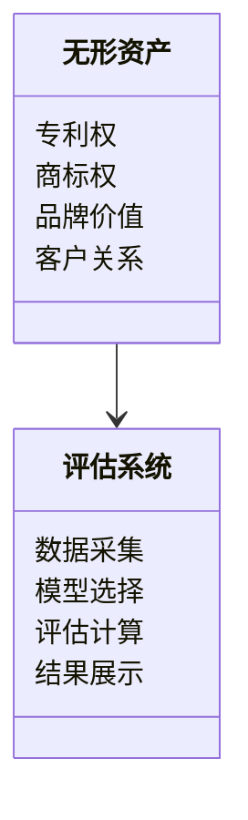
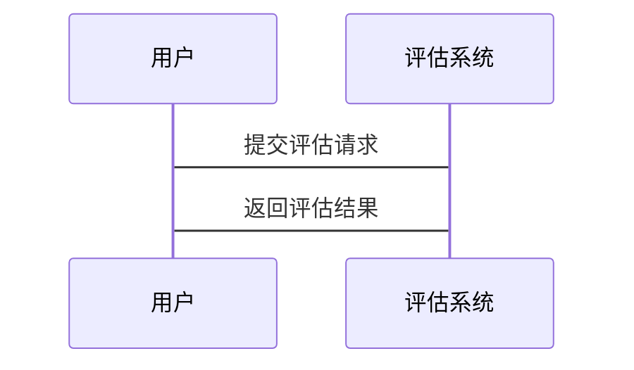

                 


# 彼得·林奇对公司无形资产价值的量化分析方法

> 关键词：彼得·林奇，无形资产，价值量化，投资分析，数学模型

> 摘要：本文深入探讨了彼得·林奇在公司无形资产价值量化分析中的独特方法，结合技术与投资分析的视角，详细解析了无形资产的定义、分类、评估模型及其实现步骤。通过系统化的分析与实战案例，展示了如何将无形资产的价值量化应用于实际投资决策中。

---

## 第1章: 无形资产价值量化分析的背景与问题

### 1.1 无形资产的定义与重要性

#### 1.1.1 无形资产的定义
无形资产是指企业拥有或控制的，没有实物形态的长期资产，主要包括专利权、商标权、品牌价值、客户关系、技术诀窍等。

#### 1.1.2 无形资产在企业中的重要性
- 无形资产是企业核心竞争力的来源。
- 无形资产的价值波动直接影响企业整体估值。
- 无形资产在企业并购中占据重要地位。

#### 1.1.3 无形资产对企业价值的影响
- 无形资产的强大会显著提升企业市场地位。
- 无形资产的贬值可能导致企业价值大幅下降。
- 无形资产的合理评估是企业融资和投资决策的基础。

### 1.2 无形资产价值量化分析的必要性

#### 1.2.1 传统财务评估的局限性
- 传统财务报表难以准确反映无形资产的真实价值。
- 无形资产的评估缺乏统一标准和方法。

#### 1.2.2 无形资产对企业竞争力的影响
- 无形资产是企业差异化竞争的关键因素。
- 无形资产的评估结果直接影响企业战略决策。

#### 1.2.3 量化分析在投资决策中的作用
- 量化分析能够帮助投资者准确评估企业的潜在价值。
- 量化分析能够揭示无形资产对企业未来收益的贡献。

### 1.3 彼得·林奇投资方法的启示

#### 1.3.1 彼得·林奇投资理念概述
彼得·林奇是美国著名投资经理，以其独特的投资策略和对无形资产的高度重视而闻名。

#### 1.3.2 无形资产在林奇投资策略中的地位
- 林奇认为，无形资产是企业长期竞争优势的核心。
- 林奇的投资策略注重对企业无形资产的深度分析。

#### 1.3.3 林奇方法对现代企业价值评估的启示
- 强调对无形资产的动态评估。
- 注重企业核心竞争力的分析。

---

## 第2章: 无形资产价值量化分析的核心概念

### 2.1 无形资产的分类与特征

#### 2.1.1 无形资产的主要分类
- 专利权与技术诀窍。
- 商标权与品牌价值。
- 客户关系与渠道优势。

#### 2.1.2 不同类型无形资产的特征对比

| 资产类型 | 生命周期 | 价值波动 | 评估难度 |
|----------|-----------|-----------|-----------|
| 专利权   | 中等       | 较大       | 较高       |
| 商标权   | 长         | 较小       | 较低       |
| 客户关系 | 长         | 较大       | 较高       |

#### 2.1.3 无形资产的生命周期与价值波动
- 无形资产的价值通常在其生命周期中呈现非线性波动。
- 市场环境的变化会影响无形资产的评估结果。

### 2.2 无形资产价值评估的理论基础

#### 2.2.1 资产评估的基本原理
- 资产评估基于市场、收益和成本三重角度。
- 无形资产的评估需要结合企业的实际经营状况。

#### 2.2.2 无形资产评估的特殊性
- 无形资产缺乏统一的市场定价标准。
- 无形资产的评估需要考虑其对企业未来收益的影响。

#### 2.2.3 财务报表中无形资产的确认与计量
- 无形资产的确认需要符合会计准则。
- 无形资产的计量需要考虑其可变现净值。

### 2.3 无形资产价值评估的关键指标

#### 2.3.1 收益法在无形资产评估中的应用
- 收益法的核心是将资产的未来收益折现。

#### 2.3.2 市场法与成本法的比较
- 市场法基于可比交易数据。
- 成本法基于重置成本。

#### 2.3.3 林奇投资法中的关键指标分析
- 林奇特别关注企业的品牌价值和客户忠诚度。

---

## 第3章: 无形资产价值量化分析的算法与数学模型

### 3.1 无形资产评估的算法原理

#### 3.1.1 收益法评估算法
- 收益法的基本公式：
  $$ V = \sum_{t=1}^{n} \frac{CF_t}{(1 + r)^t} $$
  其中，\( CF_t \) 是未来现金流，\( r \) 是折现率。

#### 3.1.2 市场法评估算法
- 市场法的核心是找到可比交易案例，并进行调整。

#### 3.1.3 成本法评估算法
- 成本法基于重置成本进行评估。

### 3.2 彼得·林奇投资法的数学模型

#### 3.2.1 林奇投资法的核心公式
- 林奇的加权平均法：
  $$ V = \sum w_i v_i $$
  其中，\( w_i \) 是各项指标的权重，\( v_i \) 是各项指标的评估值。

#### 3.2.2 无形资产价值的加权计算
- 加权计算需要根据企业实际情况调整权重。

#### 3.2.3 企业价值的综合评估模型
- 综合评估模型将有形资产与无形资产的价值加总。

---

## 第4章: 系统分析与架构设计

### 4.1 问题场景介绍
- 企业需要对其无形资产进行准确评估。

### 4.2 系统功能设计

#### 4.2.1 领域模型类图


#### 4.2.2 系统架构图


### 4.3 系统接口设计
- 数据接口：与企业财务系统对接。

### 4.4 系统交互序列图


---

## 第5章: 项目实战与案例分析

### 5.1 环境安装
- 安装Python和相关库。

### 5.2 核心代码实现

#### 5.2.1 收益法实现
```python
def calculate_value(revenue, discount_rate):
    return revenue / (1 + discount_rate)
```

#### 5.2.2 市场法实现
```python
def market_approach(revenue, multiplier):
    return revenue * multiplier
```

### 5.3 案例分析
- 某科技公司品牌价值评估。

### 5.4 项目小结
- 项目实现的关键步骤。

---

## 第6章: 最佳实践与注意事项

### 6.1 小结
- 无形资产价值量化的重要性。

### 6.2 注意事项
- 数据的准确性和完整性。

### 6.3 拓展阅读
- 推荐相关书籍和论文。

---

作者：AI天才研究院 & 禅与计算机程序设计艺术

