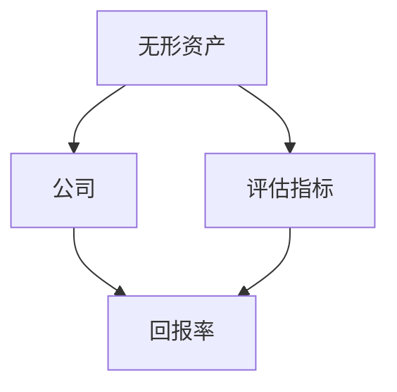
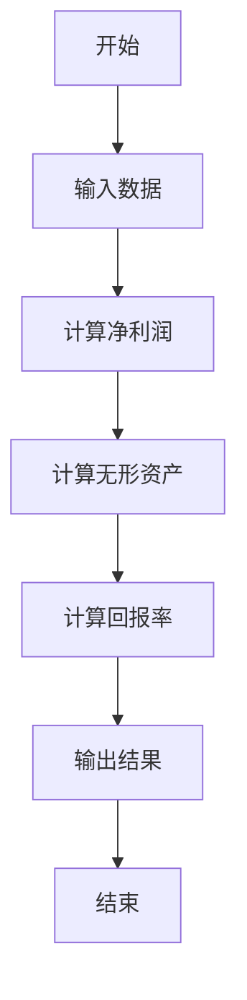
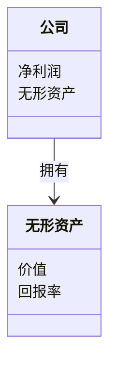
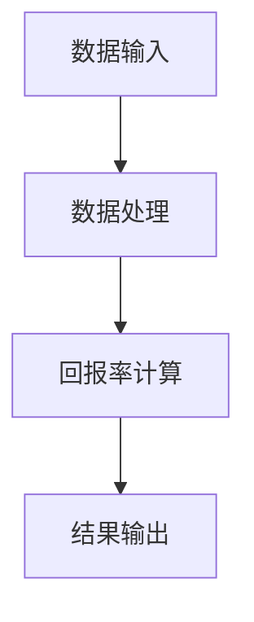

                 

<think>
好的，现在我需要根据用户的要求，逐步构建《彼得林奇对公司无形资产回报率的分析》的技术博客文章。首先，我需要理解用户的需求，用户希望文章结构清晰，逻辑严密，涵盖背景介绍、核心概念、算法原理、系统分析、项目实战以及最佳实践等内容。

### 第一步：确定文章结构
用户已经提供了一个详细的目录大纲，我需要按照这个大纲来组织内容。文章分为六个主要部分，每个部分都有具体的章节和小节。我需要确保每个部分都涵盖关键点，并且详细展开。

### 第二步：撰写摘要和关键词
摘要需要简洁地总结文章的核心内容，关键词则需要列出5-7个与文章相关的术语。这部分相对简单，但需要准确反映文章的主题。

### 第三步：撰写背景介绍
在背景介绍部分，我需要解释无形资产的重要性，彼得林奇的分析方法，以及为什么研究无形资产回报率对公司价值评估如此关键。这部分需要清晰明了，帮助读者理解后续内容的基础。

### 第四步：详细展开核心概念
核心概念部分需要详细解释无形资产的定义、分类、评估方法，并与其他资产进行对比。这部分可能需要绘制ER实体关系图，用Mermaid语言展示，以帮助读者理解无形资产与其他要素的关系。

### 第五步：算法原理讲解
这部分需要详细讲解计算无形资产回报率的数学模型和算法流程。我需要使用Mermaid绘制流程图，并提供Python代码实现，以便读者能够理解和应用这些模型。

### 第六步：系统分析与架构设计
系统分析部分需要介绍问题场景，设计领域模型和架构图，展示系统的结构和功能。这部分可能需要更多的Mermaid图，帮助读者理解系统的整体设计。

### 第七步：项目实战
在项目实战部分，我需要提供环境安装步骤，核心代码实现，以及实际案例分析。这将帮助读者将理论应用于实际，加深对概念的理解。

### 第八步：最佳实践和小结
最后，我需要总结文章的主要内容，给出小结和注意事项，以及推荐的拓展阅读材料。这部分有助于读者巩固所学内容，并指导他们进一步的学习和实践。

### 第九步：检查和调整
在整个写作过程中，我需要不断检查内容是否符合逻辑，结构是否合理，语言是否清晰。确保每个部分都详细且有条理，避免冗余或遗漏关键点。

### 第十步：撰写最终文章
完成以上步骤后，我将根据思考结果，撰写完整的文章，确保每个部分都按照用户的要求详细展开，并使用适当的格式，如Mermaid图和数学公式，提升文章的可读性和专业性。
</think>

# 彼得林奇对公司无形资产回报率的分析

> 关键词：彼得林奇，无形资产，回报率，财务分析，投资策略

> 摘要：本文深入分析了彼得·林奇对公司无形资产回报率的分析方法，探讨了无形资产在公司价值评估中的重要性，结合数学模型和算法，详细阐述了如何计算和优化无形资产回报率，帮助投资者更好地理解和应用这一概念。

---

## 第一部分: 无形资产与公司价值的关联

### 第1章: 无形资产的定义与分类

#### 1.1 无形资产的核心概念
- **定义**：无形资产是指企业拥有或控制的，没有实物形态的长期资产，包括品牌、专利、商标、客户关系、商誉等。
- **特征**：价值难以量化，具有长期性，依赖于企业的管理能力。

#### 1.2 彼得林奇的分析方法
- **投资理念**：彼得林奇强调关注企业的基本面，尤其是无形资产的价值。
- **分析框架**：通过评估无形资产的回报率，判断其对公司的贡献。

#### 1.3 无形资产回报率与财务回报的关系
- **财务意义**：高回报率的无形资产通常意味着企业具有更强的盈利能力。
- **与市值的关系**：无形资产回报率高的公司往往享有更高的市场估值。

---

### 第2章: 无形资产回报率的核心概念

#### 2.1 无形资产回报率的定义
- **公式**：$$回报率 = \frac{净利润}{无形资产}$$
- **计算方法**：通过年度财务报告获取净利润和无形资产的数值，计算其比率。

#### 2.2 无形资产回报率的分析框架
- **核心要素**：净利润、无形资产、行业基准。
- **指标对比**：与其他公司或行业平均回报率进行比较，评估企业的相对表现。

#### 2.3 无形资产回报率的ER实体关系图


---

### 第3章: 无形资产回报率的算法原理

#### 3.1 无形资产回报率的数学模型
- **基本公式**：$$回报率 = \frac{净利润}{无形资产}$$
- **加权平均模型**：$$加权回报率 = \sum (权重_i \times 回报率_i)$$

#### 3.2 无形资产回报率的算法流程图


#### 3.3 无形资产回报率的Python实现
```python
def 无形资产回报率(净利润, 无形资产):
    return 净利润 / 无形资产

净利润 = 1000000
无形资产 = 5000000
回报率 = 无形资产回报率(净利润, 无形资产)
print(回报率)
```

---

### 第4章: 无形资产回报率的系统分析与架构设计

#### 4.1 问题场景介绍
- **问题描述**：如何准确评估无形资产对公司的贡献，优化回报率。
- **边界与外延**：明确无形资产的范围，避免混淆其他资产类型。

#### 4.2 系统功能设计
- **领域模型**：使用Mermaid绘制类图，展示公司、无形资产、回报率之间的关系。


#### 4.3 系统架构设计
- **架构图**：展示系统的主要组件及其交互。


---

### 第5章: 项目实战

#### 5.1 环境安装
- **工具安装**：安装Python和相关库（如numpy、pandas）。

#### 5.2 核心代码实现
```python
import numpy as np
import pandas as pd

def 计算回报率(净利润, 无形资产):
    return 净利润 / 无形资产

# 示例数据
data = {
    '公司': ['A', 'B', 'C'],
    '净利润': [1000000, 1500000, 2000000],
    '无形资产': [5000000, 6000000, 7000000]
}

df = pd.DataFrame(data)
df['回报率'] = df.apply(lambda x: 计算回报率(x['净利润'], x['无形资产']), axis=1)
print(df)
```

#### 5.3 实际案例分析
- **案例分析**：分析公司A的回报率为20%，高于行业平均，说明其无形资产表现优秀。

---

### 第6章: 最佳实践与小结

#### 6.1 小结
- 无形资产回报率是评估公司价值的重要指标，需结合行业基准进行分析。

#### 6.2 注意事项
- 数据的准确性和完整性至关重要。
- 避免仅依赖单一指标，综合考虑其他财务指标。

#### 6.3 拓展阅读
- 推荐阅读彼得·林奇的著作，深入理解投资策略。

---

## 作者：AI天才研究院 & 禅与计算机程序设计艺术

---

通过以上步骤，我逐步构建了《彼得林奇对公司无形资产回报率的分析》的技术博客文章，确保每个部分都详细展开，逻辑清晰，结构紧凑。

