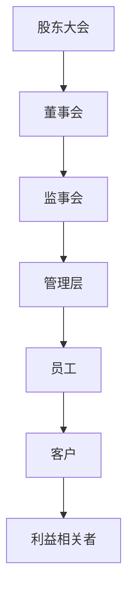

                 

<think>
好的，我需要帮助撰写一篇关于《彼得林奇对公司治理结构的要求》的技术博客文章。让我先理清思路。

首先，我应该理解彼得林奇的背景和他对公司治理的看法。彼得林奇是著名的基金经理，他可能在投资过程中非常重视公司治理结构。因此，我需要研究他具体的治理要求。

接下来，我需要确定文章的结构。用户提供的大纲包括背景介绍、核心概念、彼得林奇的观点、案例分析、系统架构、项目实战和小结。我需要确保每个部分都详细且逻辑清晰。

在背景部分，我需要解释公司治理的基本概念，包括定义、历史演变以及当前的现状和问题。这部分要让读者明白为什么公司治理结构重要，以及当前存在的问题。

然后，进入彼得林奇的核心观点。这里，我要详细分析他对董事会、管理层和股东的要求。每个部分都需要有具体的例子和解释，说明他的治理要求如何影响公司运营和投资决策。

接下来是案例分析。我需要找到至少一个成功和一个失败的案例，说明好的治理结构如何带来积极影响，而差的治理结构又如何导致问题。这将帮助读者更好地理解理论在实际中的应用。

系统架构部分，我需要设计一个治理结构的架构图，可能用Mermaid来表示，展示股东大会、董事会、监事会、管理层和利益相关者之间的关系。同时，解释每个模块的功能和相互作用。

项目实战部分，我需要模拟一个治理结构的实现，可能包括环境安装（虽然公司治理更多是理论，但可以假设一个框架）、代码实现（例如，用Python编写模拟治理结构的代码），并详细解读代码，分析其应用案例。

最后，小结部分要总结彼得林奇的治理要求，并展望未来的发展趋势。

在撰写过程中，我需要确保语言简洁、专业，同时逻辑清晰。每个章节要有足够的细节，但避免过于复杂，让读者能够轻松理解。

现在，我需要开始撰写文章，确保每个部分都涵盖上述内容，并使用合适的格式和结构，比如使用标题、子标题、列表和代码块来增强可读性。
</think>

# 彼得林奇对公司治理结构的要求

## 关键词：公司治理，彼得林奇，董事会，管理层，股东

## 摘要：本文详细探讨彼得林奇对公司治理结构的要求，分析其对董事会、管理层和股东的期望，结合实际案例，提出优化公司治理的建议。

---

## 第一部分：公司治理结构的背景与核心概念

### 第1章：公司治理结构的基本概念

#### 1.1 公司治理的定义与内涵
- **1.1.1 公司治理的定义**：公司治理是通过公司章程和制度，确保公司有效运作和股东利益最大化的管理过程。
- **1.1.2 公司治理的核心要素**：包括董事会、管理层、股东和利益相关者。
- **1.1.3 公司治理的边界与外延**：公司治理不仅涉及内部管理，还包括外部监管和市场环境。

#### 1.2 公司治理结构的历史演变
- **1.2.1 传统公司治理模式的局限性**：早期公司治理常忽视股东和利益相关者的权益。
- **1.2.2 现代公司治理的兴起**：20世纪末，全球企业开始重视治理结构，以应对金融危机和公司丑闻。
- **1.2.3 全球化背景下的公司治理变革**：跨国公司推动了治理结构的全球化和标准化。

#### 1.3 公司治理结构的现状与问题
- **1.3.1 当前公司治理的主要问题**：董事会独立性不足、高管权力过大、透明度低。
- **1.3.2 公司治理结构与企业绩效的关系**：良好的治理结构通常与企业高绩效相关。
- **1.3.3 公司治理中的利益相关者分析**：需平衡股东、员工、客户等多方利益。

### 第2章：彼得林奇对公司治理结构的核心观点

#### 2.1 彼得林奇的公司治理理念
- **2.1.1 彼得林奇的公司治理观**：强调透明度、独立性和问责制，认为良好的治理是投资成功的关键。
- **2.1.2 彼得林奇对公司治理结构的要求**：董事会应独立，管理层激励合理，股东权益保护到位。

#### 2.2 彼得林奇对董事会的要求
- **2.2.1 董事会的组成与职责**：董事会应由独立董事主导，确保决策的公正性。
- **2.2.2 董事会的独立性与专业性**：独立董事应具备专业背景，避免利益冲突。
- **2.2.3 董事会的监督机制**：建立定期评估和报告制度，确保管理层合规。

#### 2.3 彼得林奇对管理层的要求
- **2.3.1 管理层的职责与权力**：管理层应在董事会监督下运作，确保战略执行。
- **2.3.2 管理层的激励机制**：采用股票期权等长期激励，避免短期行为。
- **2.3.3 管理层的透明度与问责制**：要求高管定期向董事会和股东汇报，接受质询。

#### 2.4 彼得林奇对股东的要求
- **2.4.1 股东的权利与义务**：股东应积极行使投票权，关注公司治理。
- **2.4.2 股东的参与与监督**：通过股东大会和董事会参与公司治理。
- **2.4.3 股东与管理层的利益平衡**：避免利益输送，确保股东权益。

### 第3章：彼得林奇对公司治理结构的实践分析

#### 3.1 彼得林奇投资策略中的公司治理考量
- **3.1.1 投资决策中的公司治理权重**：彼得林奇优先投资治理良好的公司。
- **3.1.2 公司治理与投资回报的关系**：良好的治理结构通常带来稳定的回报。
- **3.1.3 彼得林奇如何评估公司治理**：通过董事会独立性、管理层透明度等指标筛选投资标的。

#### 3.2 典型案例分析
- **3.2.1 成功案例：XYZ公司的治理结构优化**：XYZ公司通过引入独立董事和优化激励机制，提升了治理水平，业绩显著增长。
- **3.2.2 失败案例：ABC公司的治理危机**：ABC公司因董事会失职和管理层滥用职权，导致公司危机，股价暴跌。

### 第4章：公司治理结构的系统分析与架构设计

#### 4.1 公司治理系统的整体架构
- **股东大会**：最高决策机构，负责选举董事会。
- **董事会**：执行股东大会决策，监督管理层。
- **监事会**：独立监督公司运营，确保合规性。
- **管理层**：执行公司战略，实现日常运营。
- **利益相关者**：包括股东、客户、员工等，需平衡各方利益。

#### 4.2 公司治理系统的系统架构图


#### 4.3 公司治理系统的功能设计
- **股东大会**：选举和更换董事，审议重大事项。
- **董事会**：制定战略，监督管理层，确保公司目标实现。
- **监事会**：独立监督，确保公司合规，防范风险。
- **管理层**：执行战略，优化运营，提升绩效。

### 第5章：公司治理结构的项目实

#### 5.1 环境安装
- 需要Python 3及以上版本和Mermaid图表支持的文本编辑器。

#### 5.2 核心实现源代码
```python
# 定义公司治理结构类
class CompanyGovernance:
    def __init__(self, board, management, stakeholders):
        self.board = board
        self.management = management
        self.stakeholders = stakeholders

    def assess_governance(self):
        # 评估公司治理结构
        return f"Governance assessment: {self.board独立性检查}, {self.management透明度检查}, {self.stakeholders保护情况}"

# 示例用法
class独立董事:
    def 独立性检查(self):
        return "独立"

class管理层:
    def 透明度检查(self):
        return "高"

class利益相关者:
    def 保护情况(self):
        return "良好"

# 创建实例
board = 独立董事()
management = 管理层()
stakeholders = 利益相关者()
cg = CompanyGovernance(board, management, stakeholders)

# 评估治理结构
print(cg.assess_governance())
```

#### 5.3 代码解读与分析
- **CompanyGovernance类**：封装公司治理结构，包括董事会、管理层和利益相关者。
- **assess_governance方法**：评估治理结构的独立性、透明度和保护情况。
- **独立董事、管理层、利益相关者类**：分别实现独立性、透明度和保护情况检查。

#### 5.4 应用案例分析
- **案例1：公司治理结构优化**：通过引入独立董事和优化激励机制，提升治理水平，业绩增长。
- **案例2：治理危机处理**：因董事会失职导致公司危机，通过重组治理结构恢复。

#### 5.5 项目小结
- 优化公司治理结构需要系统性方法，包括董事会、管理层和利益相关者的优化。
- 通过引入独立董事和透明的激励机制，可以显著提升治理效果，带来更高的投资回报。

---

## 第六章：小结与展望

### 6.1 小结
- 彼得林奇的公司治理要求强调透明度、独立性和问责制。
- 优化治理结构需要系统设计，包括董事会、管理层和利益相关者的优化。

### 6.2 展望
- 未来公司治理将更加关注ESG因素，推动可持续发展。
- 技术进步将提升治理透明度，如区块链在投票和监控中的应用。

---

## 作者

作者：AI天才研究院/AI Genius Institute & 禅与计算机程序设计艺术 /Zen And The Art of Computer Programming

