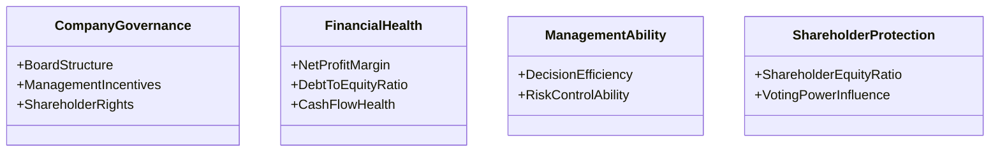

                 


# 彼得·林奇对公司治理结构的评估标准

## 关键词：公司治理，彼得·林奇，投资评估，财务健康，管理层激励，股东权益

## 摘要：本文深入探讨了彼得·林奇在评估公司治理结构时所采用的标准和方法。通过分析公司治理的核心要素，包括董事会结构、管理层激励和股权结构，结合数学模型和系统架构，详细解读了彼得·林奇的投资理念及其对公司治理的影响。文章还通过实际案例分析，展示了如何将这些评估标准应用于现实中的公司治理结构，为投资者和管理层提供了实用的指导。

---

# 第1章 公司治理结构的基本概念

## 1.1 公司治理的定义与重要性

### 1.1.1 公司治理的基本概念
公司治理是指对公司决策、管理和监控的制度安排，旨在确保公司利益相关者的权益得到合理保护，并实现公司价值的最大化。有效的公司治理能够提高企业的透明度和责任感，降低代理成本，增强投资者信心。

### 1.1.2 公司治理的核心要素
公司治理的核心要素包括：
1. **董事会结构**：董事会是公司治理的核心，负责制定战略、监督管理层并确保公司遵守法律法规。
2. **管理层激励**：管理层的行为直接影响公司绩效，激励机制需合理设计，以激发管理层的积极性。
3. **股权结构**：股权结构决定了股东的权利和影响力，合理的股权结构有助于防止权力滥用。

### 1.1.3 公司治理与企业绩效的关系
良好的公司治理能够提高企业绩效，表现为更高的利润率、更强的市场竞争力和更高的股价表现。反之，治理不善可能导致企业绩效下降，甚至引发财务危机。

## 1.2 彼得·林奇与投资分析

### 1.2.1 彼得·林奇的背景介绍
彼得·林奇是美国著名的投资专家，曾管理富达麦哲伦基金，创造了卓越的投资业绩。他的投资理念强调基本面分析和对公司管理层的信任，认为管理层的能力和决策对公司价值至关重要。

### 1.2.2 彼得·林奇的投资理念
彼得·林奇的投资理念包括：
1. **价值投资**：寻找具有持续增长潜力的公司。
2. **管理层信任**：相信管理层的能力，关注管理层的激励机制。
3. **长期视角**：注重公司的长期发展，而非短期波动。

### 1.2.3 彼得·林奇对公司治理的关注点
彼得·林奇关注公司治理结构，认为良好的治理是公司长期成功的关键。他特别关注董事会的独立性、管理层的激励机制和股权结构的合理性。

---

# 第2章 彼得·林奇的评估标准

## 2.1 公司治理结构的核心要素

### 2.1.1 董事会结构与职责
董事会是公司治理的核心，其结构和职责直接影响公司治理的效率。彼得·林奇强调董事会的独立性和专业性，认为独立董事的比例和背景对公司治理至关重要。

### 2.1.2 管理层激励机制
管理层的激励机制是公司治理的重要组成部分。彼得·林奇认为，合理的激励机制能够将管理层的利益与公司利益紧密绑定，激励管理层积极实现公司目标。

### 2.1.3 股权结构与股东权利
股权结构决定了股东的权利和影响力。彼得·林奇关注大股东的控股比例和小股东的权益保护，认为合理的股权结构能够防止权力滥用，保护小股东利益。

## 2.2 彼得·林奇的评估维度

### 2.2.1 财务健康状况评估
彼得·林奇注重公司的财务健康状况，认为财务数据能够反映公司的经营状况和风险。他关注的关键财务指标包括净利润率、资产负债率和现金流健康度。

### 2.2.2 管理层能力评估
彼得·林奇认为，管理层的能力是公司成功的关键。他通过分析管理层的过往业绩、决策能力和风险控制能力来评估管理层的能力。

### 2.2.3 股东权益保护评估
彼得·林奇关注股东权益的保护，认为合理的股权结构和股东权利安排能够保护股东利益，防止管理层滥用权力。

---

# 第3章 公司治理结构的优缺点分析

## 3.1 传统公司治理的优缺点

### 3.1.1 优点
1. **明确的权责划分**：传统公司治理结构明确了董事会、管理层和股东的权责，有利于公司高效运作。
2. **稳定性**：传统治理结构较为稳定，有助于公司长期发展。

### 3.1.2 缺点
1. **代理成本高**：管理层与股东的利益可能存在冲突，代理成本较高。
2. **灵活性不足**：传统治理结构在应对快速变化的市场环境时，灵活性不足。

## 3.2 现代公司治理的创新与挑战

### 3.2.1 股权激励机制的创新
现代公司治理中，股权激励机制逐渐普及，通过将管理层的收益与公司绩效绑定，激励管理层积极实现公司目标。

### 3.2.2 跨国公司的治理挑战
跨国公司面临不同国家的法律法规和文化差异，治理结构的设计和实施更具挑战性。

### 3.2.3 数字化时代对公司治理的影响
数字化时代，数据隐私和网络安全成为公司治理的重要议题，公司需要在数据管理和隐私保护之间找到平衡。

---

# 第4章 彼得·林奇评估标准的数学模型与公式

## 4.1 财务健康状况的评估公式

### 4.1.1 净利润率计算公式
$$ \text{净利润率} = \frac{\text{净利润}}{\text{营业收入}} \times 100\% $$

### 4.1.2 资产负债率计算公式
$$ \text{资产负债率} = \frac{\text{总负债}}{\text{总资产}} \times 100\% $$

### 4.1.3 现金流健康度评估公式
$$ \text{现金流健康度} = \frac{\text{经营活动现金流净额}}{\text{营业收入}} \times 100\% $$

## 4.2 管理层能力的评估模型

### 4.2.1 管理层决策效率模型
$$ \text{决策效率} = \frac{\text{平均决策时间}}{\text{行业平均决策时间}} \times 100\% $$

### 4.2.2 管理层风险控制能力模型
$$ \text{风险控制能力} = \frac{\text{风险事件数量}}{\text{行业平均风险事件数量}} \times 100\% $$

## 4.3 股东权益保护的评估公式

### 4.3.1 股东权益比率计算公式
$$ \text{股东权益比率} = \frac{\text{股东权益}}{\text{总资产}} \times 100\% $$

### 4.3.2 股东投票权与影响力评估公式
$$ \text{投票权影响力} = \frac{\text{股东持股比例}}{\text{总股本}} \times 100\% $$

---

# 第5章 系统分析与架构设计方案

## 5.1 问题场景介绍

### 5.1.1 公司治理结构评估的需求背景
随着企业规模的扩大和市场竞争的加剧，公司治理结构的优化成为企业发展的关键。彼得·林奇的评估标准为投资者和管理层提供了重要的参考。

### 5.1.2 彼得·林奇评估标准的应用场景
彼得·林奇的评估标准适用于各类公司，特别是上市公司和跨国公司。通过这些标准，投资者可以更好地评估公司的治理结构，做出明智的投资决策。

## 5.2 系统功能设计

### 5.2.1 领域模型设计（Mermaid类图）


---

# 第6章 项目实战

## 6.1 环境安装

### 6.1.1 数据收集工具
使用Excel或数据库工具收集公司的财务数据、董事会结构和管理层激励信息。

### 6.1.2 数据分析工具
使用Python的Pandas库进行数据分析，使用Matplotlib进行数据可视化。

## 6.2 核心实现

### 6.2.1 财务健康状况评估
编写Python代码，计算公司的净利润率、资产负债率和现金流健康度。

```python
import pandas as pd

# 假设df是包含财务数据的DataFrame
net_profit_margin = (df['净利润'] / df['营业收入']) * 100
debt_to_equity_ratio = (df['总负债'] / df['总资产']) * 100
cash_flow_health = (df['经营活动现金流净额'] / df['营业收入']) * 100
```

### 6.2.2 管理层能力评估
编写代码，评估管理层的决策效率和风险控制能力。

```python
decision_efficiency = (df['平均决策时间'] / df['行业平均决策时间']) * 100
risk_control_ability = (df['风险事件数量'] / df['行业平均风险事件数量']) * 100
```

### 6.2.3 股东权益保护评估
计算股东权益比率和投票权影响力。

```python
shareholder_equity_ratio = (df['股东权益'] / df['总资产']) * 100
voting_power_influence = (df['股东持股比例'] / df['总股本']) * 100
```

## 6.3 案例分析

### 6.3.1 苹果公司治理结构分析
分析苹果公司的董事会结构、管理层激励和股权结构，应用彼得·林奇的评估标准进行评估。

### 6.3.2 谷歌公司治理结构分析
分析谷歌公司的治理结构，评估其董事会独立性、管理层激励和股东权益保护。

---

# 第7章 最佳实践

## 7.1 小结
彼得·林奇的评估标准为投资者和管理层提供了重要的参考，通过合理的公司治理结构优化，能够提升企业绩效和投资者信心。

## 7.2 注意事项
1. **数据准确性**：确保数据来源可靠，避免因数据错误导致评估结果偏差。
2. **动态调整**：公司治理结构需要根据市场环境和公司发展动态调整。
3. **利益相关者参与**：鼓励股东和利益相关者积极参与公司治理，共同推动公司发展。

## 7.3 拓展阅读
建议进一步阅读彼得·林奇的著作《彼得·林奇的投资哲学》和相关公司治理研究文献，深入了解公司治理的最新动态和实践。

---

# 作者：AI天才研究院/AI Genius Institute & 禅与计算机程序设计艺术 /Zen And The Art of Computer Programming

